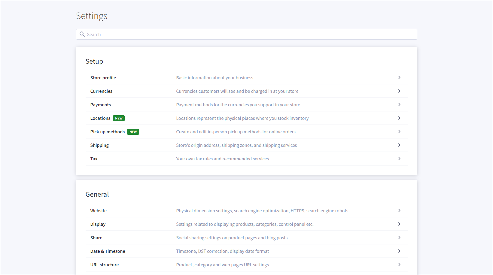

# Manage BigCommerce settings

Make sure that you do not allow using multiple shipping addresses.

## Manage multiple shipping addresses

Although *BigCommerce* allows multiple shipping addresses, *Actindo* supports the import of one shipping address only. Any orders that use multiple shipping addresses cannot be imported and will fail during the import.  
To avoid failures during the import, you must check a specific setting in *BigCommerce*. 

#### Prerequisites

- A *BigCommerce* connection has been created.
- You have a valid user account in *BigCommerce*.

#### Procedure

*BigCommerce store > Settings*

1. Display the *Advanced* section and click the *Checkout* entry.   
    The *Advanced* section is displayed.

   

2. Display the *Optimized one-page checkout settings* section.
    The *Optimized one-page checkout settings* section is displayed.

   

3. Ensure that the *Allow customers to select multiple shipping addresses for an order* setting in the *Shipping* section is not selected.
