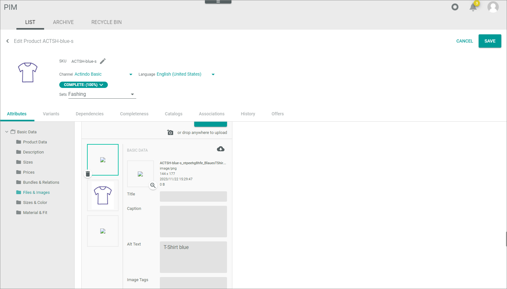
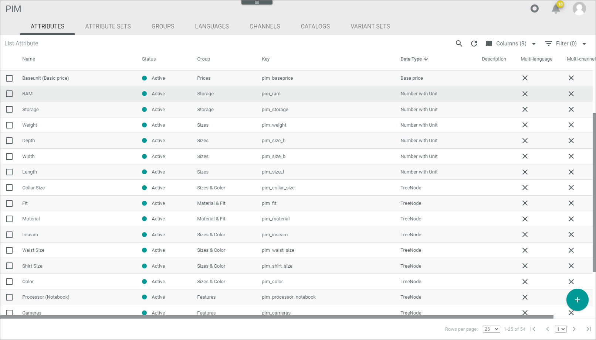

# Manage product and offer data

Before you start exchanging data with *BigCommerce*, you must check your product and offer data.
You must check the images assigned to a product in *PIM* as well as the changeable attributes assigned to your variant sets in *Omni-Channel*.

## Check product images

Verify that the desired product data image is in the correct position and that the correct text field is maintained.   
It is recommended for a good presentation of the offers in your store that the desired images are displayed for each variant. *BigCommerce* supports the import of one thumbnail per variant only. The first image in the corresponding attribute is marked as thumbnail image for the offer. Additionally, the alt-text of that image will be added as description.   
The following procedure describes how to check the images in the *PIM* module. If you only have the *Omni-Channel* module in use, you can check the image accordingly via *Offers > Select variant set > Edit offer*.

#### Prerequisites

You have assigned more than one image per product variant.

#### Procedure

*PIM > Products > Tab LIST*

1. Click the product variant you want to check and click the  (Edit) button.   
  The *Edit product* view is displayed. The *Attributes* tab is preselected.

    

2. Click the *Files and Images* entry of the *Basic Data* attribute group or the customer-specific attribute group in which you have defined the images.   
   The *Files and images* section is displayed. 

   

3. Verify that the image at the first position is suitable for your *BigCommerce* store. If not, drag and drop the desired image to the first position.

4. Verify that the *Alt text* field is filled for the image on first position. If you must change the existing entry, you have the following options: 
    - You can change the entry. This might have impact on other connections you have in use.
    - If and want to keep the product data in this scope unchanged, copy your products to a specific *BigCommerce* scope. <!---Stimmt das, sollte man das so tun?-->

5. If applicable, click the [SAVE] button to save your changes.

## Check variant sets

This procedure is only relevant if you have the *PIM* module in use and want to exchange your product data with *BigCommerce*. If you do not have the *PIM* module in use and you initially import the *BigCommerce* products to *Omni-Channel*, the variant sets from *BigCommerce* will be imported to the *Omni-Channel* module. <!---Stimmt das?--> 
For detailed information on *BigCommerce* product variants, see the following *BigCommerce* documentation: [https://developer.bigcommerce.com/docs/rest-catalog/product-variants#create-a-product-variant](https://developer.bigcommerce.com/docs/rest-catalog/product-variants#create-a-product-variant).

Check your existing *PIM* variant sets if they are suitable for the *BigCommerce* connection or create new ones. *BigCommerce* allows only certain attributes to be changeable per variant. The following attributes are declared as changeable in *BigCommerce*:
- Cost price   
- Price   
- Sale price   
- Retail price  
- Weight   
- Width   
- Height   
- Depth   
- Is free shipping   
- Fixed cost shipping price   
- UPC   
- Inventory level   
- Inventory warning level   
- BIN   
- GTIN   
- MPN   
- Image URL (only one thumbnail per variant)   
- SKU   

#### Prerequisites

No prerequisites to fulfill.

#### Procedure

Check your existing variant sets or create new ones. For detailed information, see [Manage a variant](../../PIM/Operation/02_ManageVariants.md) in the *Omni-Channel* documentation. 

## Configure color&dash;swatch variant option

Configure the color-swatch variant option for the *BigCommerce* products for which the options provided in the connection settings are not suitable. 
A color-swatch option in *BigCommerce* is an option with which the store customers can select a color combination in the *BigCommerce* storefront. For example, you want to offer T-shirts that are available with the color combinations black/white, white/green, and black/green. *BigCommerce* supports up to three colors per color swatch value.   

Configure the color-swatch option for the *BigCommerce* products for which the options provided in the driver settings are not suitable for a certain attribute. For detailed information on the standard selection options, see [Configure BigCommerce connection](../Integration/01_ManageBigCommerceConnection.md#configure-bigcommerce-connection).

#### Prerequisites

- To add a variant option as a color-swatch, the defining attribute in the variant set needs to be of the *Tree node* data type.
- If you have the *PIM* module not in use, you can check or create the attribute in the *DataHub* module.

#### Procedure

*PIM > Settings > Tab Attributes*

 

1. Click the  (Add) button in the bottom right corner.   
    The *Create attribute* view is displayed.

    

2. Enter a name for the attribute in the *Name* field and, if desired, add an attribute description in the *Description* field.

3. Select the *Tree node* data type in the *Data type* drop-down list.  
   The  (Add) button in the *Assigned sets* field is unlocked. The *CONFIGURATION* section is displayed.    

4. Ensure, that the *Multi-language* and *Multi-channel* toggles are disabled.

    > [Info] Be aware that only attributes which are neither multi-language nor multi-channel can be used as defining attributes for variants. For detailed information, see [Create a variant set](../../PIM/Integration/07_ManageVariantSets.md#create-a-variant-set).

5. Click the  (Add) button in the *Assigned sets* field. The button is locked if you have not yet selected a data type.   
    A drop-down list with all active attribute sets is displayed.

6. Enable the *Flat* toggle in the *CONFIGURATION* section. Since *BigCommerce* only supports string values, the tree must be flat to be output as a string. For this reason, you cannot use a multi-select tree node.

7. Click the  button in the bottom right corner and then the plus sign displayed in the left column of the *Edit tree* section.   
  The *Add element* window is displayed.

   

8. Enter the name of the option value to be shown to the *BigCommerce* customer in the *Name* field.

9. Enter the key of the actual value of that option in the *Key* field. This value needs to be a hash key (#) followed by a color hex code, for example #FF00AA. Each additional color added is separated by a comma. The color codes need to be valid hex codes. Enter a maximum of three colors.   
  For example, a feasible option value could look like this:   
  Name: Red, Green & Blue   
  Key: #FF0000,#00FF00,#0000FF

10. Click the [SAVE] button in the bottom right corner of the *Add element* window.

11. If desired, add further elements and click the [SAVE] button of the *Edit tree* section.  
  The tree is saved.

12. Click the [SAVE] button in the bottom right corner of the *Create attribute* view.   
  The attribute is saved.
