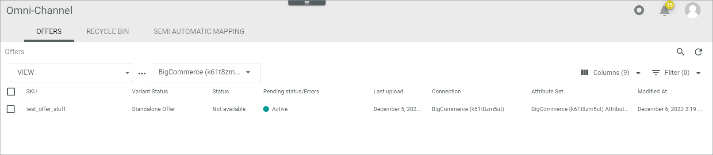

# Export of offer failed

Initial situation: An offer upload failed. The offer has been moved to the list of export errors.  

#### Error Description

Error message: Upload of the product partially failed. Product is uploaded to the shop, some entries might be missing. HTTP Status: 207, Title: The product was saved with some issues, Errors: The URL is a duplicate.

Cause: It is possible to enter a product URL to an *Omni-Channel* offer. If the product URL is not unique, the driver will stop the upload of this offer to a *BigCommerce* product.  

Follow the instructions below to check your offer URLs for duplicates.

#### Prerequisites

- No prerequisites to fulfill

#### Procedure

*Omni-Channel > Offers* 

1. Click the offer that caused the error.   
   The *Edit offer "offer name"* window is displayed. The *Attributes* tab is displayed by default. 

   

2. Click the *Search engine optimization* entry in the attribute group tree on the left.   
  The assigned attributes are displayed.

   

3. Check the entry in the *Custom URL* field. Change it if it is not correct. IF the URL is correct, check similar offers to see if the duplicate is recorded there.

4. Click the [SAVE] button.  
    The *Edit offer* view is automatically closed when the changes have been saved. The *Offers* view is displayed again.

5. Click the checkbox at the offer you have changed.   
   The editing toolbar is displayed.

6. Click the [RETRY UPLOAD] button.   
    *Omni-Channel* starts the export for the offer. 
      The *Export triggered* pop-up window is displayed. The error message is no longer displayed.  

     

   
   

