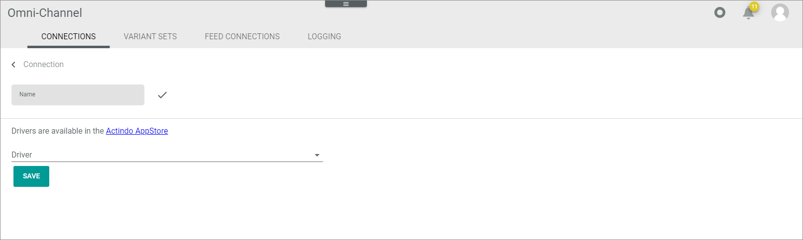
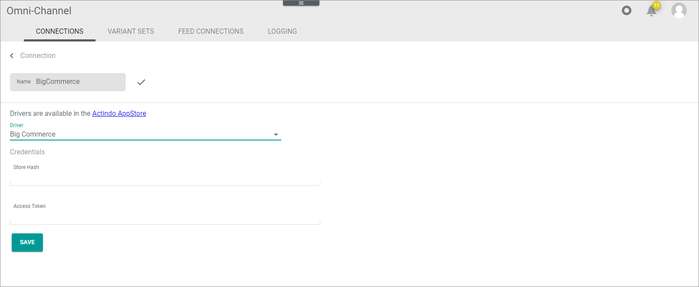
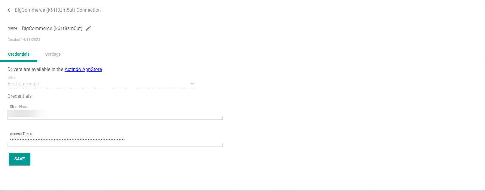

[!! Manage BigCommerce connection](../Integration/01_ManageBigCommerceConnection.md)

# CONNECTIONS (BigCommerce)

The CONNECTIONS tab offers an overview of all connections created for *Omni-Channel*. It also allows configuring these connections. 

*Omni-Channel > Settings > Tab CONNECTIONS*

**Connections**

The *CONNECTIONS* tab contains a list view of all available connections.
The following functions are available in the list header of the *CONNECTIONS* tab:

-  (Refresh)   
    Click this button to update the list of connections.

- *VIEW*   
    Click the drop-down list to select the view. All created views are displayed in the drop-down list. For a detailed description of how to create and edit a list view, see [Work with lists](../../Core1Platform/UsingCore1/04_WorkWithLists.md).  <!---Preliminary link-->

-  Columns (x)   
    Click this button to display the columns bar and customize the displayed columns and the order of columns in the list. The *x* indicates the number of columns that are currently displayed in the list.

- [x]     
    Select the checkbox to display the editing toolbar. If you click the checkbox in the header, all connections in the list are selected.

- [DELETE]  
    Click this button to delete the selected connection. This button is only displayed if a single checkbox in the list of connections is selected.
    
    > [Info] Deleting a connection is a very complex process and can therefore take a long time. 

- [SYNCHRONIZE]  
    Click this button to synchronize the selected connection. This button is only displayed if a single checkbox in the list of connections is selected. The *Sync triggered* pop-up window is displayed.

    

- [DISABLE]  
    Click this button to disable the selected connection(s). This button is only displayed if the checkbox of at least one active connection is selected.

- [ENABLE]  
    Click this button to enable the selected connection(s). This button is only displayed if the checkbox of at least one inactive connection is selected. 

-  (Edit)  
    Click this button to edit the selected *BigCommerce* connection. This button is only displayed if a single checkbox in the list of connections is selected. Alternatively, you can click directly a row in the list to edit a connection. The *Edit connection* view is displayed, see [Edit BigCommerce connection](#edit-bigcommerce-connection).

The list displays all available connections. Depending on the settings, the displayed columns may vary. All fields are read-only.

- *Name*  
    Connection name.

- *Status*  
    Connection status. The following statuses are available:
    -  **Active**   
        The connection is enabled and data is being synchronized via the connection.
    -  **Inactive**   
        The connection is disabled and no data is being synchronized via the connection.   

- *Order/Return have errors*  
    Indication whether errors have occurred in orders or returns. The following options are available:  
    - **Yes**   
        Errors have occurred.   
    - **No**   
        No errors have occurred.

- *Driver*  
    Driver name.

- *ID*  
    Connection identification number. The ID number is automatically assigned by the system.

-  (Add)  
    Click this button to add a *BigCommerce* connection. The *Create connection* view is displayed, see below.

## Create BigCommerce connection

*Omni-Channel > Settings > Tab CONNECTIONS > Button Add*

-  (Back)   
    Click this button to close the *Create connection* view and return to the connection list. All changes are rejected.

- *Name*   
    Enter a connection name.

-  (Apply)  
    Click this button to apply the entered connection name. This button is only displayed if the connection name has not yet been confirmed. 

-   (Edit)  
    Click this button to edit the connection name. This button is only displayed if the connection name has been confirmed. 

- *Driver*  
    Click the drop-down list and select the *BigCommerce* driver. All installed drivers are displayed. The *Credentials* section is displayed below the drop-down list.   
    > [Info] Drivers are licensed and must be acquired via the app store or the corresponding e-commerce partner platform. The applicable driver credentials to establish the connection are obtained when acquiring the corresponding license.

**Credentials** 

The *Credentials* section contains the access data needed for the selected *BigCommerce* connection. The section is only displayed if a valid driver has been selected. For detailed information, see [Create BigCommerce connection manually](../Integration/01_ManageBigCommerceConnection.md#create-bigcommerce-connection-manually).

- *Store hash*   
    Hash key of the *BigCommerce* store. This field is automatically filled after having created the *BigCommerce* connection automatically.

- *Access token*   
    Access token for the *BigCommerce* connection. This field is automatically filled after having created the *BigCommerce* connection automatically.

- [SAVE]  
    Click this button to save the connection. 

## Edit BigCommerce connection

*Omni-Channel > Settings > Tab CONNECTIONS > Select BigCommerce connection*

-  (Back)   
    Click this button to close the *Edit connection* view and return to the connection list. All changes are rejected.

- *Name*   
    Connection name. 

-  (Edit)  
    Click this button to edit the connection name.

-  (Apply)  
    Click this button to apply the changes to the connection name.  This button is only displayed if you are editing the connection name.

- *Created DD/MM/YYYY*  
    Creation date of the connection. This field is read-only.  

## Edit BigCommerce connection &ndash; Credentials

*Omni-Channel > Settings > Tab CONNECTIONS > Select BigCommerce connection > Tab Credentials*

- *Driver*  
    Driver name. For *BigCommerce*, the *BigCommerce* driver is displayed. This drop-down list is read-only.

**Credentials** 

- *Store hash*   
    Click the field to edit the hash key of the *BigCommerce* store.

- *Access token*   
    Click the field to edit the access token for the *BigCommerce* connection.

- [SAVE]  
    Click this button to save any changes made.

## Edit BigCommerce connection &ndash; Settings

*Omni-Channel > Settings > Tab CONNECTIONS > Select BigCommerce connection > Tab Settings*

The *Settings* tab is composed of the following setting entries:
- [Variant option type](#variant-option-type)
- [Order filters](#order-filters)
- [Offers](#offers)

### Variant option type

*Omni-Channel > Settings > Tab CONNECTIONS > Select BigCommerce connection > Tab Settings > Menu entry Variant option type*

- [SAVE]   
   Click this button to save any changes made.

- *Variant option type used for variants*   
   Use this drop-down list to select the desired variant option type. For detailed information, see [Configure BigCommerce connection](../Integration/01_ManageBigCommerceConnection.md#configure-bigcommerce-connection).

### Order filters

*Omni-Channel > Settings > Tab CONNECTIONS > Select BigCommerce connection > Tab Settings > Menu entry Order filters*

- *Filter orders to import by*   
   Enable the toggles at the order status to define the orders to be imported to *Actindo*.  
   For detailed information on the *BigCommerce* order statuses, see the *BigCommerce* documentation under [https://developer.bigcommerce.com/docs/rest-management/orders/order-status#get-all-order-statuses](https://developer.bigcommerce.com/docs/rest-management/orders/order-status#get-all-order-statuses).
   
- *Import only orders with an ID greater than*   
   This option is only relevant if you have orders in *BigCommerce* that should not be imported to *Actindo* in general.   
   <!----Wenn es bei altem Text bleibt: Enter the ID of the last order you want to keep in *BigCommerce* and you do not want to import to the *Omni-Channel* module.-->
    Enter the ID of the first order you want to import to the *Omni-Channel* module.
- *Import only orders created after*   
   This option is only relevant if you have orders in *BigCommerce* that should not be imported to *Actindo* in general.    
   <!---Wenn es bei altem Text bleibt:Enter the date of the previous day from which you want to start importing orders to the Omni-Channel module.-->  
   Enter the date from which you want to import orders into the *Omni-Channel* module.

-  *Import archived orders*    
   Enable this toggle if you want to import orders that have been already archived. By default, this toggle is disabled. 

### Offers

*Omni-Channel > Settings > Tab CONNECTIONS > Select BigCommerce connection > Tab Settings > Menu entry Order filters*

- [SAVE]   
   Click this button to save any changes made.

-  *Only push mapped attributes*   
  Enable this toggle, if you want to import only those attributes that are mapped to the offer by the ETL data mapping. By default, this toggle is disabled.   
  