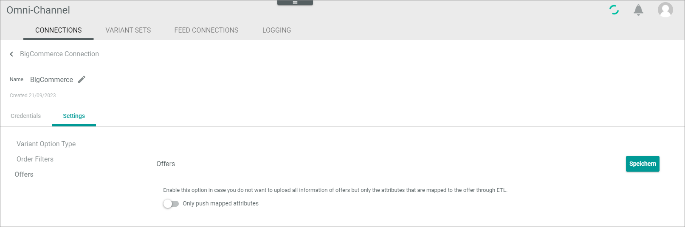

[!! Manage BigCommerce connection](../Integration/01_ManageBigCommerceConnection.md)

# CONNECTIONS (BigCommerce)

The CONNECTIONS tab provides an overview of all connections created for *Omni-Channel*. It also allows you to configure these connections.   
For detailed information on general UI functions of the *CONNECTIONS* tab, see [Connections](../../Channels/UserInterface/07a_Connections.md) in the *Omni-Channel* documentation.

## Edit BigCommerce connection &ndash; Credentials

*Omni-Channel > Settings > Tab CONNECTIONS > Select BigCommerce connection > Tab Credentials*

- *Driver*  
    Driver name. For *BigCommerce*, the *BigCommerce* driver is displayed. This drop-down list is read-only.

**Credentials** 

- *Store hash*   
    Click the field to edit the hash key of the *BigCommerce* store.

- *Access token*   
    Click the field to edit the access token for the *BigCommerce* connection.

- [SAVE]  
    Click this button to save any changes made.

## Edit BigCommerce connection &ndash; Settings

*Omni-Channel > Settings > Tab CONNECTIONS > Select BigCommerce connection > Tab Settings*

The *Settings* tab is composed of the following setting entries:
- [Variant option type](#variant-option-type)
- [Order filters](#order-filters)
- [Offers](#offers)

### Variant option type

*Omni-Channel > Settings > Tab CONNECTIONS > Select BigCommerce connection > Tab Settings > Menu entry Variant option type*

- [SAVE]   
   Click this button to save any changes made.

- *Variant option type used for variants*   
   Use this drop-down list to select the desired variant option type. For detailed information, see [Configure BigCommerce connection](../Integration/01_ManageBigCommerceConnection.md#configure-bigcommerce-connection).

### Order filters

*Omni-Channel > Settings > Tab CONNECTIONS > Select BigCommerce connection > Tab Settings > Menu entry Order filters*

- *Filter orders to import by*   
   Enable the toggles at the order status to define the orders to be imported to *Actindo*.  
   For detailed information on the *BigCommerce* order statuses, see the *BigCommerce* documentation under [https://developer.bigcommerce.com/docs/rest-management/orders/order-status#get-all-order-statuses](https://developer.bigcommerce.com/docs/rest-management/orders/order-status#get-all-order-statuses).
   
- *Import only orders with an ID as of*   
   This option is only relevant if you have orders in *BigCommerce* that should not be imported to *Actindo* in general.   
   Enter the ID of the first order you want to import to the *Omni-Channel* module.
- *Import only orders created as of*   
   This option is only relevant if you have orders in *BigCommerce* that should not be imported to *Actindo* in general.    
   Enter the date from which you want to import orders into the *Omni-Channel* module.

-  *Import archived orders*    
   Enable this toggle if you want to import orders that have been already archived. By default, this toggle is disabled. 

### Offers

*Omni-Channel > Settings > Tab CONNECTIONS > Select BigCommerce connection > Tab Settings > Menu entry Order filters*

- [SAVE]   
   Click this button to save any changes made.

-  *Only push mapped attributes*   
  Enable this toggle, if you want to import only those attributes that are mapped to the offer by the ETL data mapping. By default, this toggle is disabled.   
  