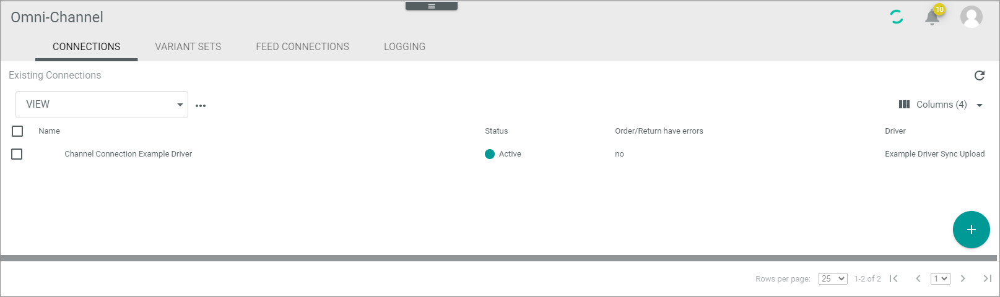
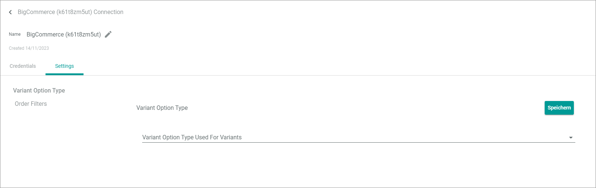

# CONNECTIONS (BigCommerce)

The CONNECTIONS tab offers an overview of all connections created for *Omni-Channel*. It also allows configuring the connections. 

*Omni-Channel > Settings > Tab CONNECTIONS*

**Connections**

The *CONNECTIONS* tab contains a list view of all available connections.
The following functions are available in the list header of the *CONNECTIONS*:

-  (Refresh)   
    Click this button to update the list of connections.

- *VIEW*   
    Click the drop-down list to select the view. All created views are displayed in the drop-down list. For a detailed description of how to create and edit a list view, see [Work with lists](../../Core1Platform/UsingCore1/04_WorkWithLists.md).  

- [x]     
    Select the checkbox to display the editing toolbar. If you click the checkbox in the header, all connections in the list are selected.

- [DELETE]  
    Click this button to delete the selected connection. This button is only displayed if a single checkbox in the list of connections is selected.
    
    > [Info] Deleting a connection is a very complex process and can therefore take a long time. 

- [SYNCHRONIZE]  
    Click this button to synchronize the selected connection. This button is only displayed if a single checkbox in the list of connections is selected. The *Sync triggered* pop-up window is displayed.

    

- [DISABLE]  
    Click this button to disable the selected connection(s). This button is only displayed if the checkbox of at least one active connection is selected.

- [ENABLE]  
    Click this button to enable the selected connection(s). This button is only displayed if the checkbox of at least one inactive connection is selected. 

-  (Edit)  
    Click this button to edit the selected *BigCommerce* connection. This button is only displayed if a single checkbox in the list of connections is selected. Alternatively, you can click directly a row in the list to edit a connection. The *Edit connection* view is displayed, see [Edit BigCommerce connection](#edit-bigcommerce-connection).

The list displays all available connections. Depending on the settings, the displayed columns may vary. All fields are read-only.

- *Name*  
    Connection name.

- *Status*  
    Connection status. The following statuses are available:
    -  **Active**   
        The connection is enabled and data is being synchronized via the connection.
    -  **Inactive**   
        The connection is disabled and no data is being synchronized via the connection.   

- *Order/Return have errors*  
    Indication whether errors have occurred in orders or returns. The following options are available:  
    - **Yes**   
        Errors have occurred.   
    - **No**   
        No errors have occurred.

- *Driver*  
    Driver name.

- *ID*  
    Connection identification number. The ID number is automatically assigned by the system.

-  (Add)  
    Click this button to add a *BigCommerce* connection. The *Create connection* view is displayed, see [Create BigCommerce connection manually](#create-bigcommerce-connection-manually).

## Create BigCommerce connection manually

*Omni-Channel > Settings > Tab CONNECTIONS > Button Add*

-  (Back)   
    Click this button to close the *Create connection* view and return to the connection list. All changes are rejected.

- *Name*   
    Enter a connection name.

-  (Apply)  
    Click this button to apply the entered connection name. This button is only displayed if the connection name has not yet been confirmed. 

-  (Edit)  
    Click this button to edit the connection name. This button is only displayed if the connection name has been confirmed. 

- *Driver*  
    Click the drop-down list and select the *BigCommerce* driver. All installed drivers are displayed. The *Credentials* section is displayed below the drop-down list.

**Credentials**

- *Store hash*   
    Hash key of the *BigCommerce* store. This field is automatically filled after having created the *BigCommerce* connection, see [Create BigCommerce connection manually](../Integration/01_ManageBigCommerceConnection.md#create-bigcommerce-connection-manually).

- *Access token*   
    Access token for the *BigCommerce* connection. This field is automatically filled after having created the *BigCommerce* connection, see [Create BigCommerce connection automatically](../Integration/01_ManageBigCommerceConnection.md#create-bigcommerce-connection-automatically).

- [SAVE]  
    Click this button to save the connection. 

## Edit BigCommerce connection

*Omni-Channel > Settings > Tab CONNECTIONS > Select BigCommerce connection*

-  (Back)   
    Click this button to close the *Edit connection* view and return to the connection list. All changes are rejected.

- *Name*   
    Connection name. Click the button  (Edit) to the right of the name to edit it.

-  (Edit)  
    Click this button to edit the connection name.

-  (Apply)  
    Click this button to apply the changes to the connection name.  This button is only displayed if you are editing the connection name.

- *Created DD/MM/YYYY*  
    Creation date of the connection. This field is read-only.  

## Edit BigCommerce connection &ndash; Credentials

*Omni-Channel > Settings > Tab CONNECTIONS > Select BigCommerce connection > Tab Credentials*

- *Driver*  
    Driver name. For *BigCommerce*, the *BigCommerce* driver is displayed. This drop-down list is read-only.

**Credentials** 

- *Store hash*   
    Click the field to edit the hash key of the *BigCommerce* store.

- *Access token*   
    Click the field to edit the access token for the *BigCommerce* connection.

- [SAVE]  
    Click this button to save any changes made.

## Edit BigCommerce connection &ndash; Settings

*Omni-Channel > Settings > Tab CONNECTIONS > Select BigCommerce connection > Tab Settings*

The *Settings* tab is composed of the following setting entries:
- [Variant option type](#variant-option-type)
- [Order filters](#order-filters)

### Variant option type

*Omni-Channel > Settings > Tab CONNECTIONS > Select Shopware 6 connection > Tab Settings > Menu entry Variant option type*

- *Variant option type used for variants*   
   Use this dropdown list to select the type to select variants. For detailed information, see [Configure BigCommerce connection](../Integration/01_ManageBigCommerceConnection.md#configure-bigcommerce-connection).

### Order filters

*Omni-Channel > Settings > Tab CONNECTIONS > Select Shopware 6 connection > Tab Settings > Menu entry Order filters*

- *Filter orders to import by*   
   Select the order status to define the orders to be imported to *Actindo*.

- *Import only orders with an ID greater than*   

- *Import only orders created after*   

- *Import archived orders*    
   By default, this toggle is disabled.
   Enable this toggle if you want to import orders that have been already archived.