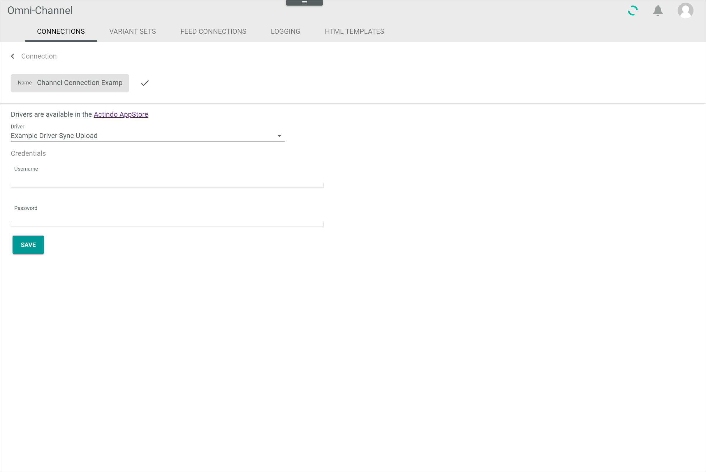
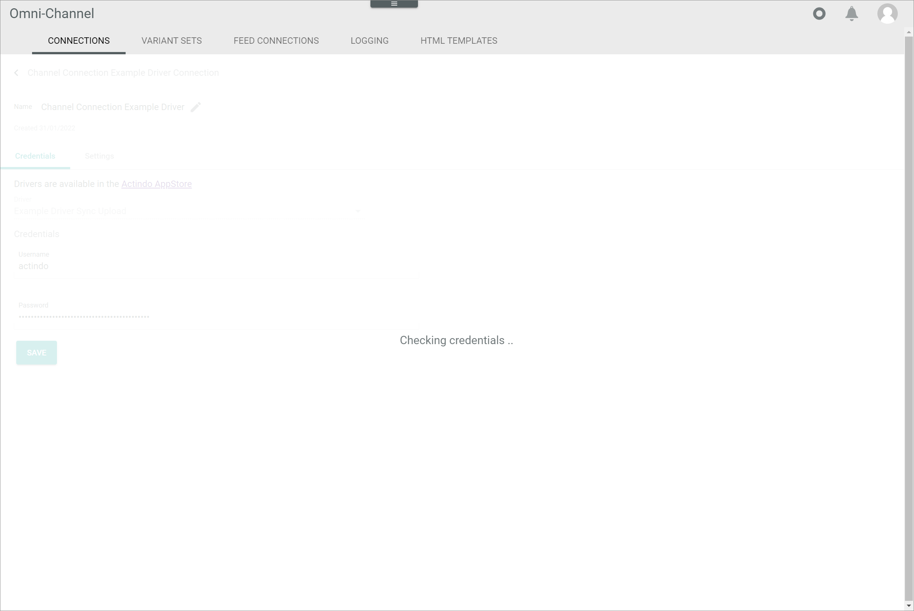
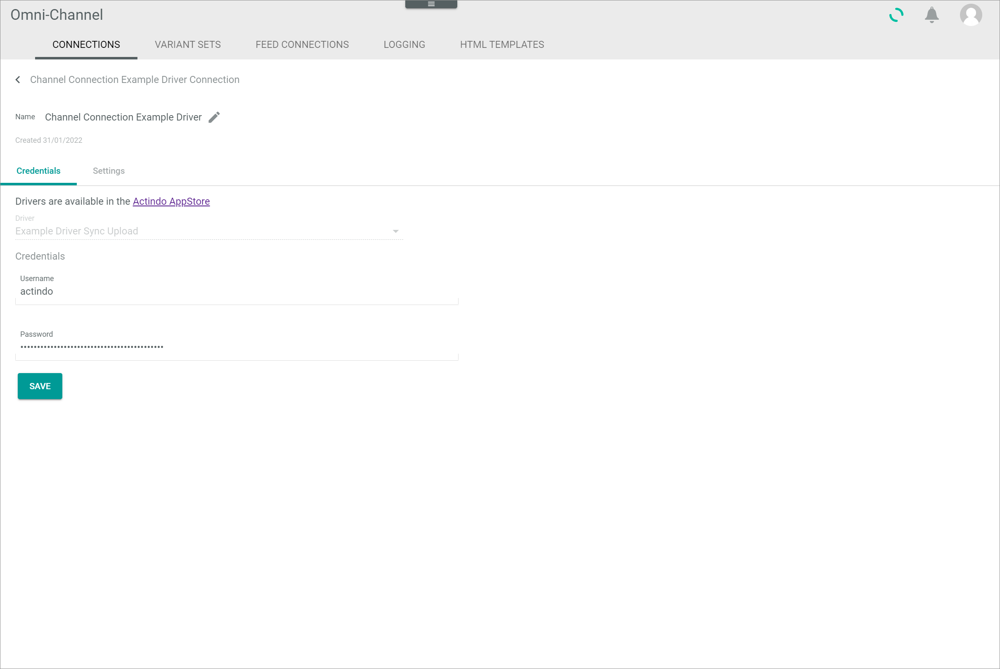

[!!User interface Connections](../UserInterface/07a_Connections.md)

# Manage the connections

Establish connections via drivers to connect your marketplaces with the *Actindo Core1 Platform*. A driver bridges the gap between the *Omni-Channel* module and any marketplace, store system or point of sale. You can establish an unlimited number of connections per driver.

In the following, the general settings to create, edit, synchronize or disable connections are described. Except for the *Actindo POS* driver, you have to set up a special configuration for the specific drivers. The setup of the connections below is described separately in detail:
- [Shopware 6 connection](../../Shopware6/Overview/01_General.md)
- [Shopify connection](../../Shopify/Overview/01_General.md)
- [Salesforce Commerce Cloud connection](../../CommerceCloud/Overview/01_General.md)
- [Amazon connection](../../Amazon/Overview/01_General.md)
- [Magento 2 connection](../../Magento2/Overview/01_General.md)
- [Tradebyte connection](../../Tradebyte/Overview/01_General.md)

## Create a connection

Create a connection to a certain marketplace. As soon as a connection has been established, an initial synchronization will be triggered, which will transfer the entire data model of the connected marketplace mirrored to Actindo. This means that all attributes and attribute sets from the marketplace are also transferred to Actindo and can be accessed in the *DataHub* module. Depending on the marketplace to be connected, special configurations are necessary.

#### Prerequisites

At least one driver has been installed.

#### Procedure

*Omni-Channel > Settings > Tab CONNECTIONS*

1. Click the  (Add) button in the bottom right corner.    
    The *Create connection* view is displayed.

    

2. Enter a name for the connection in the *Name* field.

3. Click the *Driver* drop-down list and select the desired driver. All available drivers are displayed in the list.   

    > [Info] Drivers must be purchased from the main account and then be installed separately in each sandbox or account where you want to use it.    

    Depending on the selected driver, a *Credentials* section is displayed below the drop-down list.

    

    > [Info] Depending on the selected driver, the fields in the *Credentials* section differ.

4. If available, enter the required data in the fields in the *Credentials* section.

5. Click the [SAVE] button.    
    The connection will be established. The *Checking credentials...* notice is displayed.

    

    The *Create connection* view is automatically closed when the connection has been established. The initial sync has been automatically triggered. The *Sync triggered* pop-up window is displayed.

    

## Edit a connection

Edit a connection to adjust any changed credentials, the connection name or further settings. The driver selection is read-only and cannot be edited.

#### Prerequisites

At least one connection has been established, see [Create a connection](#create-a-connection).

#### Procedure

*Omni-Channel > Settings > Tab CONNECTIONS*

1. Click the connection you want to edit in the list of connections.   
    The *Edit connection* view is displayed.

    > [Info] Depending on the driver of the connection, the *Credentials* and the *Settings* tab are displayed in the *Edit connection* view.

    

2. Edit the desired data of the connection in the corresponding fields in the *Credentials* tab.

3. If available, click the *Settings* tab and edit the desired settings of the connection in the corresponding fields.

4. Click the [SAVE] button.   
    The *Checking credentials...* notice is displayed.

    

    The *Edit connection* view is automatically closed when the changes have been saved. The sync has been automatically triggered. The *Sync triggered* pop-up window is displayed.

    

## Synchronize a connection

If any changes have been made in the marketplace, it is necessary to synchronize the connection to apply these changes to the *Actindo Core1 Platform*.

#### Prerequisites

At least one connection has been established, see [Create a connection](#create-a-connection).

#### Procedure

*Omni-Channel > Settings > Tab CONNECTIONS*

1. Select the checkbox of the connection you want to synchronize in the list of connections.   
    The editing toolbar is displayed above the list of connections.

2. Click the [SYNCHRONIZE] button in the toolbar.   
    The sync has been started. The *Sync triggered* pop-up window is displayed.

    

    > [Info] It may take several minutes until the sync has been completed. Click the  (Processes) button in the header to check for currently running jobs.

## Disable a connection

A connection can be disabled to prevent any further data from being synchronized via the connection without deleting the connection. It is possible to disable several active connections at a time.

#### Prerequisites

- At least one connection has been established, see [Create a connection](#create-a-connection).
- At least one connection is active, see [Enable a connection](#enable-a-connection).

#### Procedure

*Omni-Channel > Settings > Tab CONNECTIONS*

1. Select the checkbox of the connection you want to disable in the list of connections.   
    The editing toolbar is displayed above the list of connections.

2. Click the [DISABLE] button in the editing toolbar.   
    The connection has been deactivated.

3. Click the  (Refresh) button in the top right corner to update the list of connections.   
    The status of the disabled connection in the *Status* column has switched to **Inactive**.

## Enable a connection

A connection can only be used if it is active. Otherwise, no data is being synchronized via the connection. By default, all connection that have been established are active. If a connection has been disabled, you can enable this connection again. It is possible to enable several connections at a time.

#### Prerequisites

- At least one connection has been established, see [Create a connection](#create-a-connection).
- At least one connection is inactive, see [Disable a connection](#disable-a-connection).

#### Procedure

*Omni-Channel > Settings > Tab CONNECTIONS*

1. Select the checkbox of the connection you want to enable in the list of connections.   
    The editing toolbar is displayed above the list of connections.

2. Click the [ENABLE] button in the editing toolbar.   
    The connection has been activated.

3. Click the  (Refresh) button in the top right corner to update the list of connections.   
    The status of the enabled connection in the *Status* column has switched to **Active**.

## Delete a connection

A connection can only be used if it is active. Otherwise, no data is being synchronized via the connection. By default, all connections that have been established are active. If a connection has been disabled, you can enable this connection again.

#### Prerequisites

At least one connection is inactive, see [Disable a connection](#disable-a-connection).

#### Procedure

*Omni-Channel > Settings > Tab CONNECTIONS*

1. Select the checkbox of the connection you want to delete in the list of connections.   
    The editing toolbar is displayed above the list of connections.

2. Click the [DELETE] button in the editing toolbar.   
    The connection has been deleted.

    > [Info] Deleting a connection is a very complex process and can therefore take a long time. 

3. Click the  (Refresh) button in the top right corner to update the list of connections.   
    The deleted connection is removed from the list of connections.