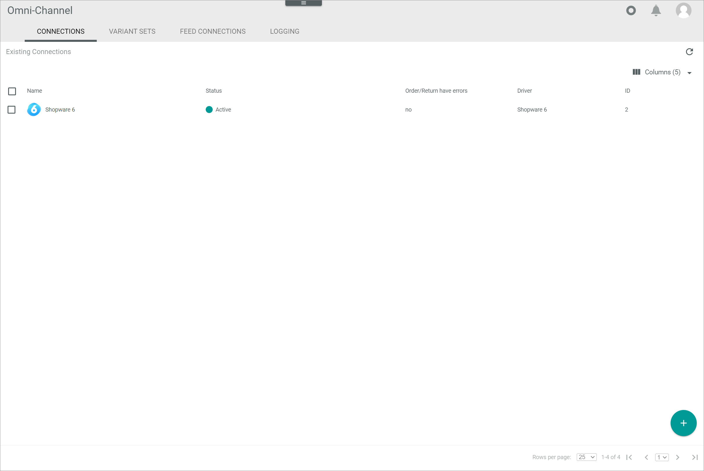

# Manage the Shopware 6 connection

To establish a connection to a Shopware 6 shop, there are several particularities to consider. Therefore, the creation and the configuration of the Shopware 6 connection are described in detail below.

## Create a Shopware 6 connection

Create the connection to a Shopware 6 shop using the Shopware 6 driver. Further settings can only be configured after the connection has been established.

Be aware that, before a Shopware 6 connection can be established in the *Actindo Core1 Platform*, the corresponding integration must be created in Shopware 6. Besides, all languages configured in Shopware 6 must be available in the *DataHub* module. Otherwise, an error is displayed when trying to create the connection in the *Actindo Core1 Platform*. The connection creation is then cancelled.

#### Prerequisites

- A Shopware 6 account has been created.
- The *Shopware 6* plugin has been installed.  
- All languages configured in Shopware 6 have been created in *DataHub*, see [Manage the languages](../../../DataHub/Integration/05_ManageLanguages.md). 

> [Info] For the *Omni-Channel* module version 4.1.0 or higher, the *Shopware 6* plugin is required in at least version 4.0.0.

[comment]: <> (Stimmt Version? 4.0.0 ist die neueste. Stimmen prerequisites? Oder besser Zwei subprocedures: 1 create integration in Shopware 6 + create connection in Core1? -> Verweis auf Manage connections?)

#### Procedure

*Omni-Channel > Settings > Tab CONNECTIONS*

1. Click the [Add](../../Assets/Icons/Plus01.png "[Add]") (Add) button in the bottom right corner.    
  The *Create connection* view is displayed.

    

2. Enter a name for the connection in the *Name* field.

3. Click the *Driver* drop-down list and select *Shopware 6* driver.  
  The *Credentials* section is displayed below the drop-down list.

4. Enter the shop URL in the *URL* field.  

5. In a new browser, go to your Shopware 6 shop and log in to your Shopware 6 account. 

6. In the Shopware 6 backend, go to *Settings/System/Integrations* and click the *Create integration* button in the top right corner.  
  The *Create integraton* window is displayed.

  

7. Enter a name for the integration in the *Name* field and enable the *Administrator* toggle.

8. Copy the code provided in the *Access ID* field to the clipboard.

9. Switch to the *Actindo Core1 Platform* and paste the copied access ID from your clipboard in the *Access key ID* field in the *Credentials* section.  
  Repeat steps **8** and **9** for the *Safety key* field.

10. Switch back to Shopware 6 and click the *Create integration* button.  
  The *Success* window with the notice *Integration successfully created* is displayed.

  

11. Switch to the *Actindo Core1 Platform* and click the [SAVE] button.  
  The connection has been created.
  
  The *CONNECTIONS* tab in the *Settings* menu entry of the *Omni-Channel* module is displayed when the connection has been established. The *Shopware 6* connection is displayed in the list of connections.

  

12. If necessary, continue to [Configure the Shopware 6 connection](#configure-the-shopify-connection).

[comment]: <> (Was genau passiert nach SAVE in Core1? Einige Minuten Zeit/Sync/Platform initialized? Satz aus Shopify genommen.)

## Configure the Shopware 6 connection   

After the connection to a Shopware 6 shop has been established, further settings can be configured for the connection.

#### Prerequisites

- A Shopware 6 connection has been established.

#### Procedure

*Omni-Channel > Settings > Tab CONNECTIONS*

1. Click the Shopware 6 connection in the list of connections.   
  The *Edit connection* view is displayed. By default, the *Credentials* tab is displayed.

  

2. Click the *Settings* tab.   
  The *Settings* tab is displayed. By default, the *Default language* setting is displayed. Shopware 6 default language is displayed in the right side bar.

    > [Info] In Shopware 6 there is a standard language, which is configured during the installation and cannot be subsequently edited. The standard language cannot be detected via API and must be therefore manually configured in the *Actindo Core1 Platform* after the connection has been established. When uploading products, Shopware 6 requires some fields to be filled for the standard language.

  

3. Click the *Order* menu entry in the left side bar.  
    The order import settings are displayed in the right side bar.  

4. Configure the following settings to filter the orders to be imported:
    - If desired, enter the applicable order number in the *Import only orders with a higher number that this* field.  

    - Enable the applicable toggle(s) to determine the order status. All statuses available in Shopware 6 are displayed.
        
    - If desired, click the *Order state to set in shop after successful import* drop-down list and select the appropriate state. All states available in Shopware 6 are displayed.

    - If desired, click the *Order state to set in shop after the order is fully shipped* drop-down list and select the appropriate state. All states available in Shopware 6 are displayed.

    - If desired, enable the applicable toogle(s) for every available payment method. For every payment method you can select payment states an oder has to have for it to be imported. If you select no payment states for a certain payment method, all orders with this payment method will be imported. The following payment methods are available:   
      - *Paypal*  
      - *Cash on delivery*  
      - *Prepayment*  
      - *Pay upon invoice*  
      - *Ratepay Prepayment*
      - *Ratepay Direct Debit*
      - *Ratepay Open invoice*
      - *Ratepay Payment by Installment*
      - *Ratepay 0% Financing*
      - *PAYONE Apple Pay*
      - *Credit card (Visa/Mastercard)*
      - *Payment SEPA Direct Debit*
      - *PAYONE PayPal*
      - *Mastercard*
      - *PAYONE Paysafe Pay Later Installment*
      - *PAYONE Paysafe Pay Later Invoice*
      - *Sofortüberweisung*
      - *PAYONE Paysafe Pay Later Debit*
      - *PAYONE iDeal*
      - *PAYONE EPS*
      - *PAYONE Secure Invoice*
      - *PAYONE Invoice*
      - *PAYONE Paydirekt*
      - *PAYONE Bancontact*
      - *PAYONE Prepayment*
      - *PAYONE Trustly*
      - *Direct debit*
      - *Paydirekt*

5. Click the *Tax classes* menu entry in the left side bar.  
    The tax classes available in Shopware 6 are displayed in the right side bar.  

6. Click the *Select Core1 tax class for Shopware 6 "tax class"* drop-down list and select the applicable Core1 tax class. All available tax classes are displayed in the list. Repeat this step for all the applicable tax classes.

7. If available, click the *Ratepay* menu entry in the left side bar.  
  The Ratepay settings are display in the right side bar.

  > [Info] The Ratepay menu entry is only displayed when the Ratepay Integration for Shopware 6 has been installed, which in turn requires that the Ratepay integration has been activated in the Shopware 6 account. The Shopware 6 extension provides additional information to the orders, which can be imported, if necessary, for further processing.  
 
  [comment]: <> (nicht standard / Extension für Treiber - beschreiben oder wegglassen?)

8. Click the *Price rules* menu entry in the left side bar.  
  The price rules available in Shopware 6 are displayed in the right side bar.

9. Enable the applicable toggle(s) to create price attributes for the corresponding price rule in the *Actindo Core1 Platform*.  

  > [Info] Once the attributes have been created, they cannot be deleted from *DataHub* anymore. If another toggle is enabled subsequently, and therefore the corresponding attribute is created in *DataHub*, the changes must be saved and the connection must be synchronized.

10. Click the [Save] button.  
  All changes have been saved. The *Saving successful* pop-up window is displayed.

    

