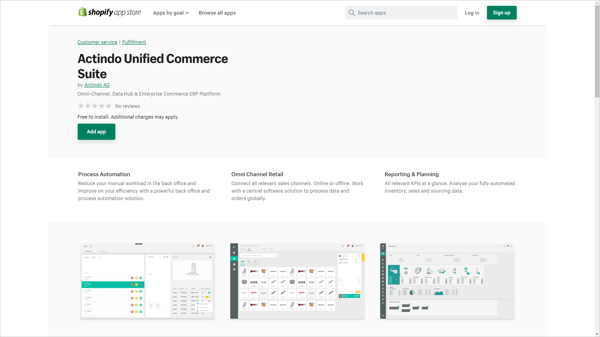
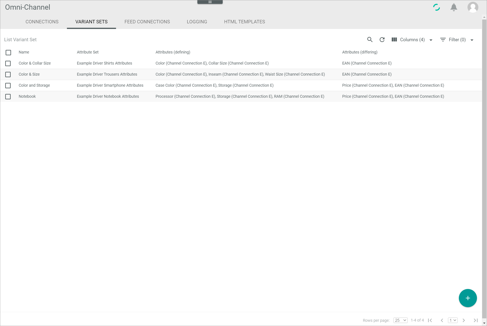
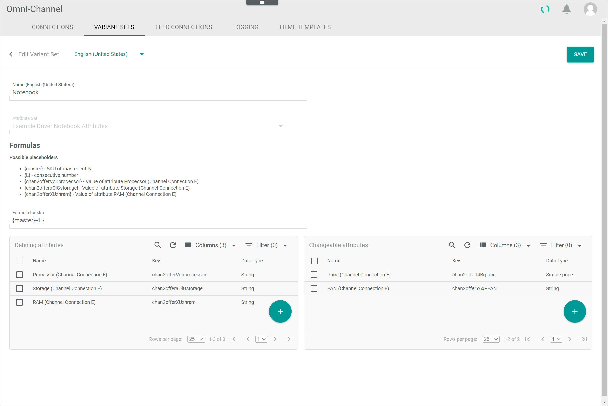

[!!Manage the connections](./01_ManageConnections.md)
[!!Create an attribute](../../PIM/Integration/01_ManageAttributes.md#create-an-attribute)
[!!Manage the ETL mappings](../../DataHub/Operation/01_ManageETLMappings.md)

# Manage the Shopify connection

To establish a connection to a Shopify shop, there are several particularities to consider. Therefore, the creation and the configuration of the Shopify connection are described in detail below.

## Create a Shopify connection

Create the connection to a Shopify shop using the Shopify driver. Further settings can only be configured after the connection has been established.

#### Prerequisites

- A Shopify account has been created.
- The *Shopify Integration* plugin has been installed.

> [Info] For the *Omni-Channel* module version 4.1.0 or higher, the *Shopify Integration* plugin is required in at least version 4.0.0.

#### Procedure

*Omni-Channel > Settings > Tab CONNECTIONS*

1. In a new browser window, go to the [*Shopify app store*](https://apps.Shopify.com/) and log in to your Shopify account using the [Log in] button in the upper right corner.

  

2. Access the [*Actindo Unified Commerce Suite*](https://apps.Shopify.com/core1connection?search_id=dab95422-519a-4bf5-964c-fcad278fa4cc&surface_detail=Actindo&surface_inter_position=1&surface_intra_position=3&surface_type=search) app.

  

3. Click the [Add app] button.   
  You are redirected to the *Install* window within your Shopify shop. All settings to the *Actindo Unified Commerce Suite* app are displayed.

  

4. Click the [Install app] button.   
  You are redirected to the *Shopify Installation* window.

  

5. Switch to your Actindo account and copy the workspace URL of your Actindo account from the address bar to the clipboard.

  > [Info] The workspace URL is the part of the URL between *https://* and *.actindo.com*.

6. Switch back to the *Shopify Installation* window and paste the workspace URL from your clipboard in the red highlighted part of the *Workspace URL* field.

  > [Info] Make sure you are logged in to your Actindo account and have the *Shopify Integration* installed during setup, as this is required.

7. Click the [START SETUP] button in the bottom right corner.   
  You are redirected to your Actindo account. The connection will be established and all necessary data will be synchronized. The *Core1 Platform* is being initialized.

  > [Info] It may take several minutes until the connection has been established and the sync has been completed.

  

  The *CONNECTIONS* tab in the *Settings* menu entry of the *Omni-Channel* module is displayed when the connection has been established. The *Shopify* connection is displayed in the list of connections.

  

8. If necessary, continue to [configure the Shopify connection](#configure-the-Shopify-connection).

## Configure the Shopify connection   

After the connection to a Shopify shop has been established, further settings can be configured for the connection.

#### Prerequisites

A Shopify connection has been established, see [Create a Shopify connection](#create-a-Shopify-connection).

#### Procedure

*Omni-Channel > Settings > Tab CONNECTIONS*

1. Click the Shopify connection in the list of connections.   
  The *Edit connection* view is displayed. By default, the *Credentials* tab is selected.

  

2. Click the *Settings* tab.   
  The *Settings* tab is displayed. By default, the *ID in Shop* setting is selected.

  

3. If necessary, enable the *Enable OrderName as ID in Shop* toggle. If activated, all new imported orders will use the order number including prefix and suffix as *ID in Shop*. The *ID in Shop* is visible in the top right corner on the order detail page in *Omni-Channels*The prefix and suffix are defined in your Shopify shop.

  

4. Click the *Default Tax Class for Order import* menu entry in the left side bar.   
  The *Default Tax Class for Order import* view is displayed on the right side.

  

5. If necessary, click the *Select default Tax Class* drop-down list and select a tax class that will be set as default tax class for the order import if no tax class could be found for the order, neither within Shopify nor within *Omni-Channel*. All available tax classes are displayed in the list. This setting shouldn't be empty.

6. Click the *Configuration for Offer import* menu entry in the left side bar.   
  The *Configuration for Offer import* view is displayed on the right side.

  

[comment]: <> (maybe you can use this, where the comma separation is depicted, needs some work on the image though)

  

7. If necessary, configure the following settings:
  + Click the *Select default Tax Class* drop-down list and select a tax class that will be set as default tax class for the offer import if no tax class could be found for the offer within Shopify. All available tax classes are displayed in the list.
  + Enter the Shopify collection names you want to assign a certain tax class to in the field of the corresponding tax class within the *Save the title of the collections for each Tax Class here* section. If you want to assign two or more collections separate them by comma and do not add spaces between them. For each available tax class, a single field is displayed.

  > [Info] When importing the offers, the respective tax class is assigned to all products within collections specified in the corresponding tax class field. If a collection is not specified in any of the tax class fields, the default tax class specified in the *Select default Tax Class* drop-down list is applied to all products of this collection. Please make sure that all entered names for collections are unique in your Shopify shop.

8. Click the [Save] button.   
  All changes have been saved. The *Saving successful* pop-up window is displayed.

  

## Configure the Shopify ETL mapping

In Shopify, there are especially three attributes that are important for the correct upload of products in the Shopify shop, namely *Allow oversales*, *Taxes*, and *Dispatch required*.
When the connection to a Shopify shop is established, the corresponding attribute set to the Shopify shop is automatically created. Further, the attribute set mapping from the *PIM basic set* to the Shopify shop is automatically created if the *PIM* module as well as the *PIM-Channels connection* plugin have been installed at the time of connection. In this case, also the three attributes specified above are automatically mapped with a predefined constant value.
Otherwise, the affected attributes (*Allow oversales*, *Taxes*, and *Dispatch required*) must be created manually in the *PIM* module, and the attribute set mapping must also be created manually. This also has to be done if you don't want to use the predefined constant values.
Anyway, it is recommended to check the attribute mappings described below to enable the correct upload of products.
Important: If you use other attribute sets in your *PIM* no mapping from this set to the shopify attribute set will be created automatically. This mapping has to be created manually.

[comment]: <> (is there a guid for creating mapping? insert a link here if possible)

### Configure the oversells permission

The *Permit oversells* attribute is an important attribute regarding the Shopify connection. This attribute ensures that products whose stock reaches zero are displayed as sold out in the Shopify shop. 
By default, the corresponding attribute mapping is already configured as described below, if the *PIM* module as well as the *PIM-Channels connection* plugin have been installed at the time of connection. Nevertheless, you should check the correct mapping to prevent any problems during the upload process.

#### Prerequisites

- A Shopify connection has been established, see [Create a Shopify connection](#create-a-Shopify-connection).
- An attribute set mapping from the *PIM basic set* to the Shopify attribute set has been created. 

#### Procedure

*DataHub > Settings > Tab ETL*
 

1. Click the attribute set mapping from the *PIM basic set* to the Shopify attribute set in the list of attribute set mappings.   
  The *Mapping from PIM basic set to "Shopify attribute set name"* view is displayed.

  

[comment]: <> (added the MappingShopify.png, again needs some work to remove unneeded parts of the image)

[comment]: <> (Ist das mapping immer vom PIM basisset auf das shopifyset? oder ist das variabel, welches Attributset das source attribute set ist?)

[comment]: <> (Das automatische mapping geht nur mit dem PIM basisset. Falls eine Kunde nicht nur das Basisset verwendet muss er das mapping für dies sets selber anlegen.)

2. Click the row of the *Permit oversells* destination attribute on the left side.   
  The *Settings* section for the *Permit oversells* attribute mapping is displayed on the right side.

  

3. Select the **Constant value** option in the *Extension* drop-down list in the *Settings* section.
  The *Configuration* section is displayed below the *Settings* section.

4. Click the *Permit oversells* drop-down list in the *Configuration* section and select the **No** option.

  

5. Click the [SAVE] button in the upper right corner.   
  The changes have been saved. The *Settings* section is hidden. The assigned mapping is displayed in the list of attribute mappings on the left side.

  > [Info] Be aware that you have to rerun the mapping to apply the changes made to the attribute, see [Rerun an ETL mapping](../../DataHub/Operation/01_ManageETLMappings.md#rerun-an-etl-mapping).

### Configure the taxes

The *Taxes* attribute is an important attributes regarding the Shopify connection. This attribute ensures that taxes are applied to the products.    
By default, the corresponding attribute mapping is already configured as described below, if the *PIM* module as well as the *PIM-Channels connection* plugin have been installed at the time of connection. Nevertheless, you should check the correct mapping to prevent any problems during the upload process.

#### Prerequisites

- A Shopify connection has been established, see [Create a Shopify connection](#create-a-Shopify-connection).
- An attribute set mapping from the *PIM basic set* to the Shopify attribute set has been created. 

#### Procedure

*DataHub > Settings > Tab ETL*

1. Click the attribute set mapping from the *PIM basic set* to the Shopify attribute set in the list of attribute set mappings.   
  The *Mapping from PIM basic set to "Shopify attribute set name"* view is displayed.

  

2. Click the row of the *Taxes* destination attribute on the left side.   
  The *Settings* section for the *Taxes* attribute mapping is displayed on the right side.

  

3. Select the **Constant value** option in the *Extension* drop-down list in the *Settings* section.
  The *Configuration* section is displayed below the *Settings* section.

4. Enable the *Taxes* toggle in the *Configuration* section.

  

5. Click the [SAVE] button in the upper right corner.   
  The changes have been saved. The *Settings* section is hidden. The assigned mapping is displayed in the list of attribute mappings on the left side.

  > [Info] Be aware that you have to rerun the mapping to apply the changes made to the attribute, see [Rerun an ETL mapping](../../DataHub/Operation/01_ManageETLMappings.md#rerun-an-etl-mapping).

### Configure the requirement for dispatch

The *Dispatch required* attribute is an important attribute regarding the Shopify connection. This attribute ensures that the product requires shipment.
By default, the corresponding attribute mapping is already configured as described below, if the *PIM* module as well as the *PIM-Channels connection* plugin have been installed at the time of connection. Nevertheless, you should check the correct mapping to prevent any problems during the upload process.

#### Prerequisites

- A Shopify connection has been established, see [Create a Shopify connection](#create-a-Shopify-connection).
- An attribute set mapping from the *PIM basic set* to the Shopify attribute set has been created. 

#### Procedure

*DataHub > Settings > Tab ETL*

1. Click the attribute set mapping from the *PIM basic set* to the Shopify attribute set in the list of attribute set mappings.   
  The *Mapping from PIM basic set to "Shopify attribute set name"* view is displayed.

  

2. Click the row of the *Dispatch required* destination attribute on the left side.   
  The *Settings* section for the *Dispatch required* attribute mapping is displayed on the right side.

  

3. Select the **Constant value** option in the *Extension* drop-down list in the *Settings* section.
  The *Configuration* section is displayed below the *Settings* section.

4. Enable the *Dispatch required* toggle in the *Configuration* section.

  

5. Click the [SAVE] button in the upper right corner.   
  The changes have been saved. The *Settings* section iss hidden. The assigned mapping is displayed in the list of attribute mappings on the left side.

  > [Info] Be aware that you have to rerun the mapping to apply the changes made to the attribute, see [Rerun an ETL mapping](../../DataHub/Operation/01_ManageETLMappings.md#rerun-an-etl-mapping).

## Configure the variants

When creating variants to a master product, you must at least add one defining attribute. By default, attributes with the *TreeNode* data type are used as defining attributes. The elements of a *TreeNode* attribute are identified in a different way by Actindo and Shopify. In Actindo, the elements of an *TreeNode* attribute are identified by their key whereas in Shopify, the elements are identified by their name. Therefore, it is important to check that in Actindo, all elements of a *TreeNode* attribute which may be used as a defining attribute for variants, have a different name to prevent any problems when uploading the variants. If necessary, adjust the elements name to ensure the correct upload.

#### Prerequisites

- A Shopify connection has been established, see [Create a Shopify connection](#create-a-Shopify-connection).
- At least one variant set has been created, see [Create a variant set](./02_ManageVariantSets.md#create-a-variant-set).

#### Procedure

*Omni-Channel > Settings > Tab VARIANT SETS*

1. Click the Shopify variant set.   
  The *Edit variant set* view is displayed.

  

2. Check the *Defining attributes* box and copy the attribute name of the attribute you want to check to your clipboard.

3. Switch to the *ATTRIBUTES* tab in the *DataHub* module: *DataHub > Settings > Tab ATTRIBUTES*.   
  The *Attributes list* view with the list of all attributes is displayed.
  
  

4. Click the (Search) button in the header, paste the attribute name from your clipboard to the displayed search field and press the **ENTER** key to start the search.    
  Only the searched attribute is displayed in the list of attributes.

5. Click the attribute in the list.   
  The *Edit attribute* view is displayed.
  
  

6. Scroll down to the *Edit tree* box and check if all elements in the box have a different name.

  

7. If necessary, rename the elements with the identical name by doing the following:
  + Hover over the element to be renamed in the *Edit tree* box and click the (Edit) button.
  + Click the *Name* field and edit the name.
  + Click the [SAVE] button.   
  The changes to the elements name have been applied.

  > [Info] Repeat the step **7** for all elements with identical names.

8. Click the [SAVE] button in the upper right corner.   
  The changes have been saved. The *Edit attribute* view is closed. 