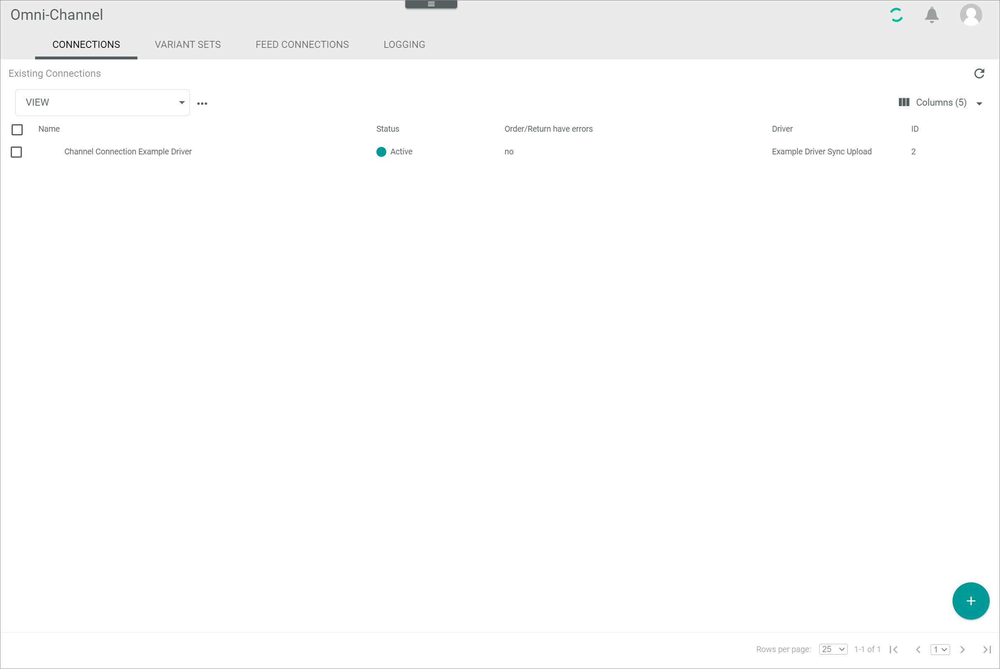

# Manage the Shopify connection

To establish a connection to a Shopify shop, there are several particularities to consider. Therefore, the creation and the configuration of the Shopify connection are described in detail below.

## Create a Shopify connection

Create the connection to a Shopify shop using the Shopify driver. Further settings can only be configured after the connection has been established.

#### Prerequisites

- A Shopify account has been created.
- The *Shopify Integration* plugin has been installed.

> [Info] For the *Omni-Channel* module version 4.1.0 or higher, the *Shopify Integration* plugin is required in at least version 4.0.0.

#### Procedure

*Omni-Channel > Settings > Tab CONNECTIONS*

1. In a new browser window, go to the [*shopify app store*](https://apps.shopify.com/) and log in to your shopify account using the [Log in] button in the upper right corner.

  

2. Access the [*Actindo Unified Commerce Suite*](https://apps.shopify.com/core1connection?search_id=dab95422-519a-4bf5-964c-fcad278fa4cc&surface_detail=Actindo&surface_inter_position=1&surface_intra_position=3&surface_type=search) app.

  

3. Click the [Add app] button.   
  You are redirected to the *Install* window within your shopify shop. All settings to the *Actindo Unified Commerce Suite* app are displayed.

  

4. Click the [Install app] button.   
  You are redirected to the *Shopify Installation* window.

  

5. Switch to your Actindo account and copy the workspace URL of your Actindo account from the address bar to the clipboard.

  > [Info] The workspace URL is the part of the URL between *https://* and *.actindo.com*.

6. Switch back to the *Shopify Installation* window and paste the workspace URL from your clipboard in the red highlighted part of the *Workspace URL* field.

  > [Info] Make sure you are logged in to your Actindo account during setup, as this is required for installation.

7. Click the [START SETUP] button in the bottom right corner.   
  You are redirected to your Actindo account. The connection will be established and all necessary data will be synchronized. The *Core1 Platform* is being initialized.

    > [Info] It may take several minutes until the connection has been established and the sync has been completed.

  

  The *CONNECTIONS* tab in the *Settings* menu entry of the *Omni-Channel* module is displayed when the connection has been established. The *Shopify* connection is displayed in the list of connections.

  

8. If necessary, continue to [configure the Shopify connection](#configure-the-shopify-connection).

## Configure the Shopify connection   

After the connection to a shopify shop has been established, further settings can be configured for the connection.

#### Prerequisites

A Shopify connection has been established, see [Create a Shopify connection](#create-a-shopify-connection).

#### Procedure

*Omni-Channel > Settings > Tab CONNECTIONS*

1. Click the Shopify connection in the list of connections.   
  The *Edit connection* view is displayed. By default, the *Credentials* tab is displayed.

  

2. Click the *Settings* tab.   
  The *Settings* tab is displayed. By default, the *Id in Shop* setting is displayed.

  

3. If necessary, enable the *Enable OrderName as Id in Shop* toggle to use the order name instead of the order ID as ID in the Shopify shop.

4. Click the *Default Tax Class for Order import* menu entry in the left side bar.   
  The *Default Tax Class for Order import* view is displayed on the right side.

  

5. If necessary, click the *Select default Tax Class* drop-down list and select a tax class that will be set as default tax class for the order import if no tax class could be found for the order, neither within Shopify nor within *Omni-Channel*. All available tax classes are displayed in the list.  

6. Click the *Configuration for Offer import* menu entry in the left side bar.   
  The *Configuration for Offer import* view is displayed on the right side.

  

7. If necessary, configure the following settings:
  + Click the *Select default Tax Class* drop-down list and select a tax class that will be set as default tax class for the offer import if no tax class could be found for the offer, neither within Shopify nor within *Omni-Channel*. All available tax classes are displayed in the list.  
  + Enter the shopify collection names you want to assign a certain tax class to in the field of the corresponding tax class within the *Save the title of the collections for each Tax Class here* section. For each available tax class, a single field is displayed.   
  When importing the offers, the respective tax class is assigned to all products within collections specified in the corresponding tax class field. If a collection is not specified in any of the tax class fields, the default tax class specified in the *Select default Tax Class* drop-down list is applied to all products of this collection.

8. Click the [Save] button.   
  All changes have been saved. The *Saving successful* pop-up window is displayed.

  

## Configure the Shopify ETL mapping

Überverkauf (Lagerbestand = 0 -> Shopify sagt ausverkauft oder nicht -> wenn zum Zeitpunkt der Treiberinstallation PIM + PIM Channels Connection installiert war, wird das Feld per default auf NEIN gesetzt.  

Steuern (Produkt auf das Steuern kommen -> wenn zum Zeitpunkt der Treiberinstallation PIM + PIM Channels Connection installiert war, wird das Feld per default auf aktiv gesetzt.)

Benötigt Versand (wenn zum Zeitpunkt der Treiberinstallation PIM + PIM Channels Connection installiert war, wird das Feld per default auf aktiv gesetzt.)

müssen gemappt werden (um Upload zu ermöglichen)

im PIM Felder erstellen/Felder übernehmen

Variantenartikel -> defining attributes bei Shopify über Name, bei Actindo über ID -> Problem: in actindo gleiche namen möglich, da andere ID; shopify läd nicht hoch, da gleicher Name und das nicht möglich.
