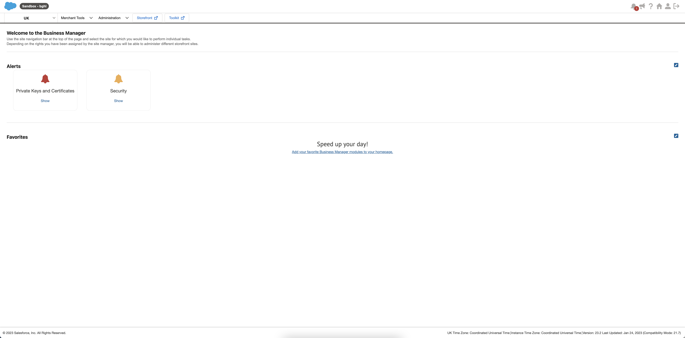
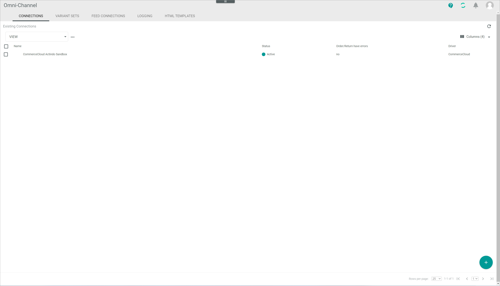
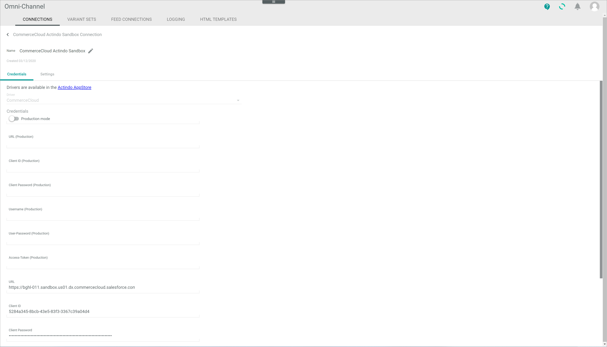
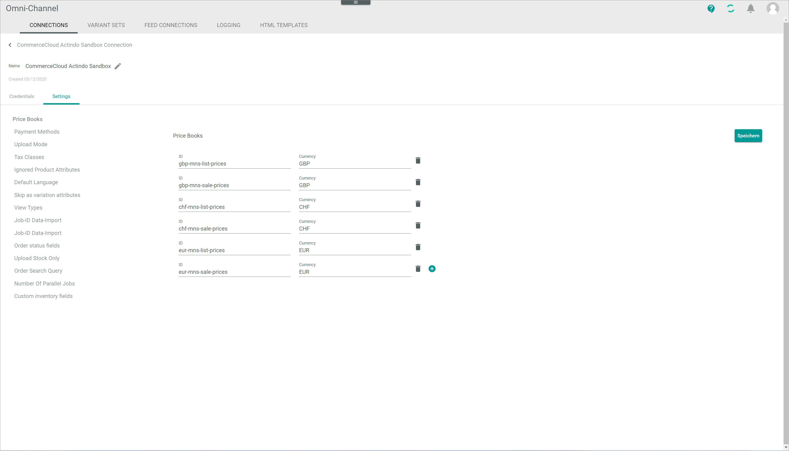

# Manage the Salesforce Commerce Cloud connection

To establish a connection to a Salesforce Commerce Cloud shop, there are several particularities to consider. Therefore, the creation and the configuration of the Salesforce Commerce Cloud connection are described in detail below.

## Configuration of Salesforce Commerce Cloud

Before a connection between Salesforce Commerce Cloud and *Actindo Core1 Platform* can be established, there are two configuration processes that must be previously performed in Salesforce Commerce Cloud. 

### Create jobs

In Salesforce Commerce Cloud, data are uploaded via XML files, which are then imported with a job into the shop. There are two jobs, one for data import and one for inventory import. 

Please note that these two jobs must be configured in the Salesforce Commerce Cloud shop in the exact order and using the specified values as described below.

#### Prerequisites

- A Salesforce Commerce Cloud account has been created.
- You have the appropriate user rights.

#### Procedure

1. In a new browser window, go to the *Salesforce Commerce Cloud* platform and log in to your account.

2. Click the *Select a Site* drop-down list and select the applicable shop.  
    The site business manager page is displayed.

    

3. Using the site navigation bar at the top of the page, go to *Administration > Operations > Jobs*.  
    The Jobs page is displayed.

    

4. Click the [New Job] button in the upper right corner to create the inventory import job.  
    The *New Job* window is displayed in the right side of the workspace.

    

5. Enter the job name "MSN-InventoryImport" in the *ID* field and, if desired, a job description in the *Description* field, and click the [Create] button.  
    The new job is created and the job page is displayed.

6. In the navigation bar at the top of the page, click the *Job Steps* tab and select *Configure a step* to create a new step. 
    The *Select and Configure Step* side bar is displayed to the right of the workspace.

7. In the *Select and Configure Step* side bar, the following values must be configured: 

    | Field                    | Value     |
    |--------------------------|-------------------------|
    | Context                  | Organization            |
    | ID                       | ImportInventory lists   |
    | Description              | -                       |
    | WorkingFolder            | import/inventory        |   
    | FileNamePattern          | ac_.*_inventory\\.xml   | 
    | NofilesFoundHandling*    | NO_FILES_FOUND          |
    | ImportMode*              | Merge                   |  
    | ImportFailedHandling*    | WARN                    |  
    | AfterImportFileHandling* | Archive                 |
    | ArchiveFolder            | archive/inventory       |  

[comment]: <> (Scope: Organization - Wo einzustellen? Relevant hier? Job FLow -> Was ist? Muss man ein Job flow erstellen, bevor man ein Step erstellt?)

8. Click on [Assign].  
    The job step has been configured.

9. Click again the [New Job] button in the upper right corner to create the data import job.  
    The *New Job* window is displayed in the right side of the workspace.

10. Enter the job name "MSN-SiteDataImport" in the *ID* field and, if desired, a job description in the *Description* field, and click the [Create] button.  
    The new job is created and the job page is displayed.

    The MSN-SiteDataImport imports different types of data and is therefore a multi-step job. Repeat steps **6** to **8** to create and configure the following
    job steps.

- StandardProductsImport (Scope: Organization)  

    | Field                    | Value     |
    |--------------------------|-------------------------|
    | Context                  | Organization            |
    | ID                       | StandardProductsImport  |
    | Description              | -                       |
    | WorkingFolder            | import/catalogs         |   
    | FileNamePattern          | ac_.\*_catalog\_.*\\.xml| 
    | NofilesFoundHandling*    | NO_FILES_FOUND          |
    | ImportMode*              | Merge                   |  
    | ImportFailedHandling*    | WARN                    |  
    | AfterImportFileHandling* | Archive                 |
    | ArchiveFolder            | archive/catalogs        |  

    > [Info] Import/catalogs folder must be previously created in WebDAV. Otherwise, the data cannot be imported. For detailed information, see [Using WebDAV](https://documentation.b2c.commercecloud.salesforce.com/DOC1/index.jsp?topic=%2Fcom.demandware.dochelp%2Fcontent%2Fb2c_commerce%2Ftopics%2Fimport_export%2Fb2c_using_web_dav.html).

- BundleProductsImport (Scope: Organization)  

    | Field                    | Value     |
    |--------------------------|-------------------------|
    | Context                  | Organization            |
    | ID                       | BundleProductsImport    |
    | Description              | -                       |
    | WorkingFolder            | import/catalogs         |   
    | FileNamePattern          | ac_.\*_bundles\_.*\\.xml| 
    | NofilesFoundHandling*    | NO_FILES_FOUND          |
    | ImportMode*              | Merge                   |  
    | ImportFailedHandling*    | WARN                    |  
    | AfterImportFileHandling* | Archive                 |
    | ArchiveFolder            | archive/catalogs        | 

- CategoryAssignmentImport (Scope: Organization)  

    | Field                    | Value     |
    |--------------------------|-------------------------|
    | Context                  | Organization            |
    | ID                       | CategoryAssignmentsImport|
    | Description              | -                       |
    | WorkingFolder            | import/catalogs         |   
    | FileNamePattern          | ac_.\*_assignments\_.*\\.xml| 
    | NofilesFoundHandling*    | NO_FILES_FOUND          |
    | ImportMode*              | Merge                   |  
    | ImportFailedHandling*    | WARN                    |  
    | AfterImportFileHandling* | Archive                 |
    | ArchiveFolder            | archive/catalogs        |  

- PricebookImport/ImportPriceBook (Scope: Organization)

    | Field                    | Value     |
    |--------------------------|-------------------------|
    | Context                  | Organization            |
    | ID                       | PricebookImport|
    | Description              | -                       |
    | WorkingFolder            | import/pricebooks       |   
    | FileNamePattern          | ac_.\*\_price_book\\.xml| 
    | NofilesFoundHandling*    | NO_FILES_FOUND          |
    | ImportMode*              | Merge                   |  
    | ImportFailedHandling*    | WARN                    |  
    | AfterImportFileHandling* | Archive                 |
    | ArchiveFolder            | archive/pricebooks      |  

> [Info] Import/pricebooks folder must be previously created in WebDAV. Otherwise, the data cannot be imported. For detailed information, see [Using WebDAV](https://documentation.b2c.commercecloud.salesforce.com/DOC1/index.jsp?topic=%2Fcom.demandware.dochelp%2Fcontent%2Fb2c_commerce%2Ftopics%2Fimport_export%2Fb2c_using_web_dav.html).

- SearchReindex (Scope: client site, therefore step configuration is not relevant for the Core1)

### Configure the Open Commerce API Settings

Once the necessary jobs have been created, the API settings must be configured in the Salesforce Commerce Cloud shop.

There are two APIs in Salesforce Commerce Cloud: 
- The shop API, which is for the order data in the *Actindo Core1 Platform*
- The data API, which is used for product data in the *Actindo Core1 Platform*

A Client ID must be generated in Salesforce Commerce Cloud and entered in the *client_id* field.

[comment]: <> (Wo/wie? Relevant zu erklären? Mehr Info benötigt! API Codes von Julian? Gehört das Code in der Doku oder kann der Kunde aus irgendwo rauskopieren?)

#### Prerequisites

- The necessary jobs have been created in Salesforce Commerce Cloud.
- The Client ID has been generated.

[comment]: <> (Stimmt das so? Wie/wo ist client ID erzeugt?)

#### Procedure

*Administration > Site Development > Open Commerce API Settings*

[comment]: <> (Screenshot von Open Commerce API Settings? Vgl. Procedure oben.)

1. Click the *Select type* drop-down list and select the appropriate option. The following options are available:
    - **Shop**  
        Select this option to configure the shop API.
    - **Data**  
        Select this option to configure te data API.

2. If desired, click the *Select Context* drop-down list and select the appropriate option. The following options are available:  
    - **Global (organization-wide)**  
        Select this option for the configuration to affect all sites in the organization.
    - Site-specific  
        Select the name of a site for the configuration to affect only that site. 

3. In the text field, edit the JSON document as necessary.

4. Click [Save].

[comment]: <> (Client permissions? To use OCAPI, you must first configure client permissions. These permissions control read and write access to specified resources. By default, no permission is granted... S. Salesfore Docu OCAPI Settings?)

## Create a Salesforce Commerce Cloud connection

Create the connection to a Salesforce Commerce Cloud shop using the Salesforce Commerce Cloud driver. Further settings can only be configured after the connection has been established.

#### Prerequisites

- The Salesforce Commerce Cloud shop has been configured, see [Configuration of Salesforce Commerce Cloud shop](#configuration-of-salesforce-commerce-cloud-shop). 
- The *Salesforce Commerce Cloud* plugin has been installed.  

## Configure the Salesforce Commerce Cloud connection   

After the connection to a Salesforce Commerce Cloud shop has been established, further settings can be configured for the connection.

#### Prerequisites

A Salesforce Commerce Cloud connection has been established.

#### Procedure

*Omni-Channel > Settings > Tab CONNECTIONS*

1. Click the SFCC connection in the list of connections.   
  The *Edit connection* view is displayed. By default, the *Credentials* tab is displayed.

    

2. Click the *Settings* tab.   
  The *Settings* tab is displayed. By default, the *Price books* setting is displayed. 

    

