# Manage the Salesforce Commerce Cloud connection

To establish a connection to a Salesforce Commerce Cloud shop, there are several particularities to consider. Therefore, the creation and the configuration of the Salesforce Commerce Cloud connection are described in detail below.

## Configuration of Salesforce Commerce Cloud

Before a connection between Salesforce Commerce Cloud and *Actindo Core1 Platform* can be established, there are two configuration processes that must be previously performed in Salesforce Commerce Cloud. 

### Create jobs

In Salesforce Commerce Cloud, data are uploaded via XML files, which are then imported with a job into the shop. There are two jobs, one for data import and one for inventory import. 

Please note that these two jobs must be configured in the Salesforce Commerce Cloud shop in the exact order and using the specified values as described below.

#### Prerequisites

- A Salesforce Commerce Cloud account has been created.
- You have the appropriate user rights.

#### Procedure

1. In a browser window, go to the *Salesforce Commerce Cloud* platform and log in to your account.

2. Click the *Select a Site* drop-down list and select the applicable shop.  
    The site business manager page is displayed.

    

3. Using the site navigation bar at the top of the page, go to *Administration > Operations > Jobs*.  
    The *Jobs* page is displayed.

    

4. Click the [New Job] button in the upper right corner to create the inventory import job.  
    The *New Job* window is displayed on the right of the workspace.

    

5. Enter the job name "MSN-InventoryImport" in the *ID* field and, if desired, a job description in the *Description* field, and click the [Create] button.  
    The new job has been created. The job page is displayed.

6. In the navigation bar at the top of the page, click the *Job Steps* tab and select *Configure a step* to create a new step. 
    The *Select and Configure Step* side bar is displayed on the right of the workspace.

7. In the *Select and Configure Step* side bar, the following values must be configured: 

    | Field                    | Value     |
    |--------------------------|-------------------------|
    | Context                  | Organization            |
    | ID                       | ImportInventory lists   |
    | Description              | -                       |
    | WorkingFolder            | import/inventory        |   
    | FileNamePattern          | ac_.*_inventory\\.xml   | 
    | NofilesFoundHandling*    | NO_FILES_FOUND          |
    | ImportMode*              | Merge                   |  
    | ImportFailedHandling*    | WARN                    |  
    | AfterImportFileHandling* | Archive                 |
    | ArchiveFolder            | archive/inventory       |  

[comment]: <> (Scope: Organization - Wo einzustellen? Relevant hier? Job FLow -> Was ist? Muss man ein Job flow erstellen, bevor man ein Step erstellt?)

8. Click on [Assign].  
    The job step has been configured.

9. Click again the [New Job] button in the upper right corner to create the data import job.  
    The *New Job* window is displayed on the right side of the workspace.

10. Enter the job name "MSN-SiteDataImport" in the *ID* field and, if desired, a job description in the *Description* field, and click the [Create] button.  
    The new job has been created. The job page is displayed.

    The MSN-SiteDataImport imports different types of data and is therefore a multi-step job. Repeat steps **6** to **8** to create and configure the following
    job steps:

    - StandardProductsImport (Scope: Organization)  

        | Field                    | Value     |
        |--------------------------|-------------------------|
        | Context                  | Organization            |
        | ID                       | StandardProductsImport  |
        | Description              | -                       |
        | WorkingFolder            | import/catalogs         |   
        | FileNamePattern          | ac_.\*_catalog\_.*\\.xml| 
        | NofilesFoundHandling*    | NO_FILES_FOUND          |
        | ImportMode*              | Merge                   |  
        | ImportFailedHandling*    | WARN                    |  
        | AfterImportFileHandling* | Archive                 |
        | ArchiveFolder            | archive/catalogs        |  

        > [Info] The Import/catalogs working folder must be previously created in WebDAV. Otherwise, the data cannot be imported. For detailed information, see [Using WebDAV](https://documentation.b2c.commercecloud.salesforce.com/DOC1/index.jsp?topic=%2Fcom.demandware.dochelp%2Fcontent%2Fb2c_commerce%2Ftopics%2Fimport_export%2Fb2c_using_web_dav.html).

    - BundleProductsImport (Scope: Organization)  

        | Field                    | Value     |
        |--------------------------|-------------------------|
        | Context                  | Organization            |
        | ID                       | BundleProductsImport    |
        | Description              | -                       |
        | WorkingFolder            | import/catalogs         |   
        | FileNamePattern          | ac_.\*_bundles\_.*\\.xml| 
        | NofilesFoundHandling*    | NO_FILES_FOUND          |
        | ImportMode*              | Merge                   |  
        | ImportFailedHandling*    | WARN                    |  
        | AfterImportFileHandling* | Archive                 |
        | ArchiveFolder            | archive/catalogs        | 

    - CategoryAssignmentImport (Scope: Organization)  

        | Field                    | Value     |
        |--------------------------|-------------------------|
        | Context                  | Organization            |
        | ID                       | CategoryAssignmentsImport|
        | Description              | -                       |
        | WorkingFolder            | import/catalogs         |   
        | FileNamePattern          | ac_.\*_assignments\_.*\\.xml| 
        | NofilesFoundHandling*    | NO_FILES_FOUND          |
        | ImportMode*              | Merge                   |  
        | ImportFailedHandling*    | WARN                    |  
        | AfterImportFileHandling* | Archive                 |
        | ArchiveFolder            | archive/catalogs        |  

    - PricebookImport/ImportPriceBook (Scope: Organization)

        | Field                    | Value     |
        |--------------------------|-------------------------|
        | Context                  | Organization            |
        | ID                       | PricebookImport|
        | Description              | -                       |
        | WorkingFolder            | import/pricebooks       |   
        | FileNamePattern          | ac_.\*\_price_book\\.xml| 
        | NofilesFoundHandling*    | NO_FILES_FOUND          |
        | ImportMode*              | Merge                   |  
        | ImportFailedHandling*    | WARN                    |  
        | AfterImportFileHandling* | Archive                 |
        | ArchiveFolder            | archive/pricebooks      |  

    > [Info] The Import/pricebooks working folder must be previously created in WebDAV. Otherwise, the data cannot be imported. For detailed information, see [Using WebDAV](https://documentation.b2c.commercecloud.salesforce.com/DOC1/index.jsp?topic=%2Fcom.demandware.dochelp%2Fcontent%2Fb2c_commerce%2Ftopics%2Fimport_export%2Fb2c_using_web_dav.html).

    - SearchReindex (Scope: client site, therefore the step configuration is not relevant for the *Actindo Core1 Platform*)

[comment]: <> (Evtl. dieser Step rauslassen? Oder etwas dazu erklären?)

### Configure the Open Commerce API Settings

Once the necessary jobs have been created, the API settings must be configured in the Salesforce Commerce Cloud shop.

There are two APIs in Salesforce Commerce Cloud: 
- The shop API, which is used for the order data in the *Actindo Core1 Platform*
- The data API, which is used for product data in the *Actindo Core1 Platform*

A Client ID must be generated in Salesforce Commerce Cloud and entered in the *client_id* field.

[comment]: <> (Wo/wie? Relevant zu erklären? Mehr Info benötigt! API Codes von Julian? Gehört das Code in der Doku oder kann der Kunde aus irgendwo rauskopieren?)

#### Prerequisites

- The necessary jobs have been created in Salesforce Commerce Cloud.
- The Client ID has been generated.

[comment]: <> (Stimmt das so? Wie/wo ist client ID erzeugt?)

#### Procedure

*Salesforce Commerce Cloud > Administration > Site Development > Open Commerce API Settings*

[comment]: <> (Screenshot von Open Commerce API Settings? Vgl. Procedure oben.)

1. Click the *Select type* drop-down list and select the appropriate option. The following options are available:
    - **Shop**  
        Select this option to configure the shop API.
    - **Data**  
        Select this option to configure the data API.

2. If desired, click the *Select Context* drop-down list and select the appropriate option. The following options are available:  
    - **Global (organization-wide)**  
        Select this option for the configuration to affect all sites in the organization.
    - Site-specific  
        Select the name of a site for the configuration to affect only that site. 

3. In the text field, edit the JSON document as necessary.

4. Click [Save].

[comment]: <> (Client permissions? To use OCAPI, you must first configure client permissions. These permissions control read and write access to specified resources. By default, no permission is granted... S. Salesfore Docu OCAPI Settings?)

## Create a Salesforce Commerce Cloud connection

Create the connection to a Salesforce Commerce Cloud shop using the Salesforce Commerce Cloud driver. Further settings can only be configured after the connection has been established.

#### Prerequisites

- Salesforce Commerce Cloud has been configured, see [Configuration of Salesforce Commerce Cloud](#configuration-of-salesforce-commerce-cloud). 
- The *Salesforce Commerce Cloud* plugin has been installed.  

> [Info] For the *Omni-Channel* module version 4.1.0 or higher, the *Salesforce Commerce Cloud* plugin is required in at least version 1.2.0.

[comment]: <> (check!)

#### Procedure

*Omni-Channel > Settings > Tab CONNECTIONS*

1. Click the  (Add) button in the bottom right corner.    
  The *Create connection* view is displayed.

    

2. Enter a name for the connection in the *Name* field.

3. Click the *Driver* drop-down list and select the *Salesforce Commerce Cloud* driver.  
  The *Credentials* section is displayed below the drop-down list.

  > [Info] Salesforce Commerce Cloud offers the possibility to work with two separate environments, a staging one for customizing and testing purposes and a live one for production. Product data are uploaded to the staging environment and, if applicable, replicated in the live environment after acceptance. This structure is supported by the *Actindo Core1 Platform*. 

4. For a staging environment, the following credentials must be filled:
    - Enter the shop URL in the *URL* field.  
    - Enter the client ID in the *Client ID* field and the client password in the *Client password* field for the Salesforce Commerce Cloud shop API.
    - Enter the user's business manager login details, that is, the username (email), user password and  the user API access token in the *Username*, *User password* and *Access token* fields. 

5. If you want to work on a live environment as well, enable the *Production mode* toggle. In this case, the following credentials must be additionally filled:  
    - *URL (Production)*
    - *Client ID (Production)*
    - *Client password (Production)*
    - *Username (Production)*
    - *User password (Production)*
    - *Access token (Production)*

    > [Info] As soon as a the production mode is enabled, the order and the inventory data are uploaded in production, whereas the product data are uploaded in staging.

6. Click the [SAVE] button.  
    The connection has been created.
  
  The *CONNECTIONS* tab in the *Settings* menu entry of the *Omni-Channel* module is displayed when the connection has been established. The *Salesforce Commerce Cloud* connection is displayed in the list of connections.

  

12. If necessary, continue to [Configure the Salesforce Commerce Cloud connection](#configure-the-salesforce-commerce-cloud-connection).

[comment]: <> (Was genau passiert nach SAVE in Core1? Einige Minuten Zeit/Sync/Platform initialized? Satz aus Shopify genommen.)

## Configure the Salesforce Commerce Cloud connection   

After the connection to a Salesforce Commerce Cloud shop has been established, further settings can be configured for the connection.

#### Prerequisites

A Salesforce Commerce Cloud connection has been established.

#### Procedure

*Omni-Channel > Settings > Tab CONNECTIONS*

1. Click the Salesforce Commerce Cloud connection in the list of connections.   
  The *Edit connection* view is displayed. By default, the *Credentials* tab is displayed.

    

2. Click the *Settings* tab.   
  The *Settings* tab is displayed. By default, the *Price books* setting is displayed. 

    

3. Enter the price book ID in the *ID* field and the applicable currency ISO 4217 (three letter) code in the *Currency* field. Further price books can be added if necessary using the  (Add) button.  

    > [Info] The price books must be set up manually, as they cannot be retrieved via API from Salesforce Commerce Cloud.

4.  Click the *Payment methods* menu entry in the left side bar.  
    The payment methods setting is displayed in the right side bar.  

     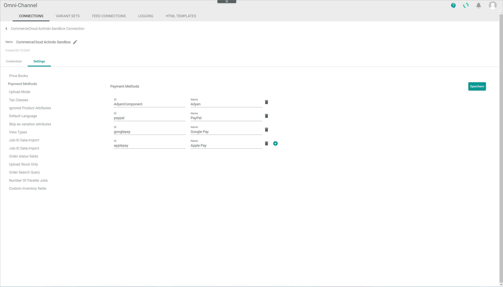

5. Enter the payment method ID in the *ID* field and a  description in the *Name* field. Further payment methods can be added if necessary using the  (Add) button.  

6. Click the *Upload mode* menu entry in the left side bar.  
    The upload setting is displayed in the right side bar.

    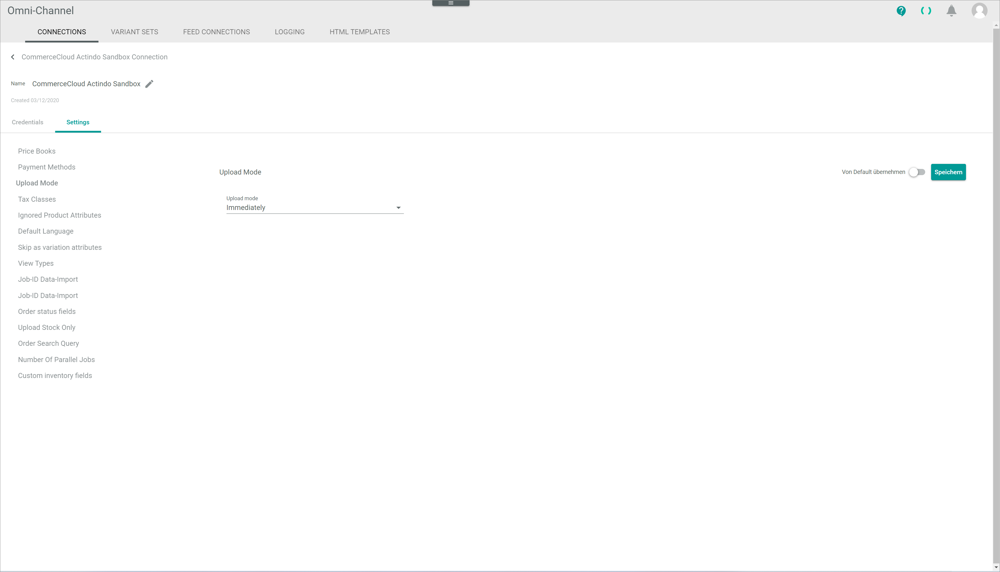

7. Click the *Upload mode* drop-down list and select the appropriate option to define the system upload behavior when changes on product data have been made. The following options are available:  
    - *Immediately*  
        Select this option to upload any changes as soon as they are made.
    - *Delayed*  
        Select this option to upload any changes after a specified period of time. When selected, the *Delay in minutes* field is displayed. By default, a 10 minute delay is predefined. This value can be changed if desired. 
    - *Cron*  
        Select this option to schedule the upload and perform it periodically at a fixed time, date or interval. When selected, the *Cron line* field is displayed to define the cron job. 
    
      Alternatively, you can enable the *Apply from default* toggle to apply the predefined values.

8. Click the *Tax classes* menu entry in the left side bar.  
    The tax classes setting is displayed in the right side bar.

    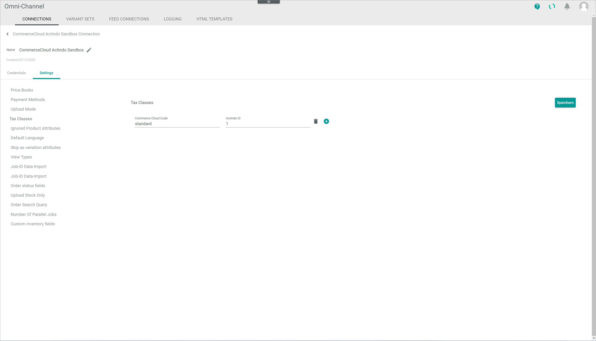

9. Enter the applicable Salesforce Commerce Cloud tax code in the *Commerce Cloud Code* field and the corresponding tax code in the *Actindo Core1 Platform* in the *Actindo ID* field. The Actindo tax codes can be found in the *Taxes* module. Further tax codes can be added if necessary using the  (Add) button.  

10. Click the *Ignored Product Attributes* menu entry in the left side bar.  
    The ignored product attributes setting is displayed in the right side bar.

    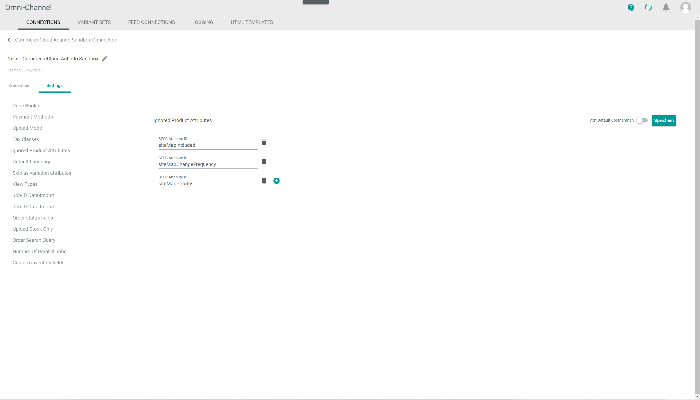

11. Enter the ID of any fields that should not be imported in the *SFCC Attribute ID* field. The field IDs can be found in the catalog.xsd schema, see [catalog.xsd](https://documentation.b2c.commercecloud.salesforce.com/DOC3/index.jsp?topic=%2Fcom.demandware.dochelp%2FDWAPI%2Fxsd%2FSchemas.html). Further fields can be added if necessary using the  (Add) button.  

    > [Info] If there are custom fields that should not be imported, this must be specified here as well. Bear in mind that custom fields in *Salesforce Commerce Cloud* contain the prefix *c_", that is, *c_FieldName*.

12. Click the *Default language* menu entry in the left side bar.  
    The default language setting is displayed in the right side bar.

    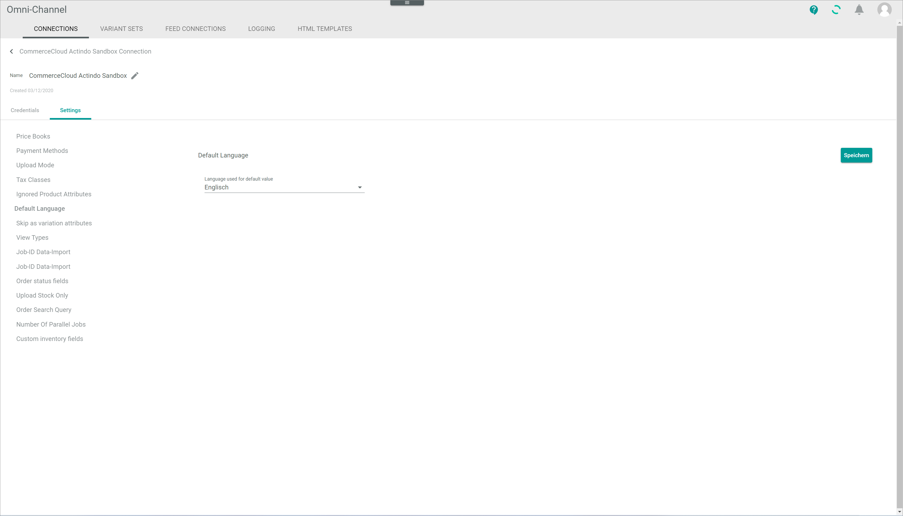

13. Click the *Language used for default value* drop-down list and select the appropriate option. All available languages are displayed in the list.

    > [Info] In contrast to Salesforce Commerce Cloud, the *Actindo Core1 Platform* does not have a default language field. For this reason, a language must be specified to be used as default value.   

14. Click the *Skip as variation attribute* menu entry in the left side bar.  
    The skip as variation attribute setting is displayed in the right side bar.

    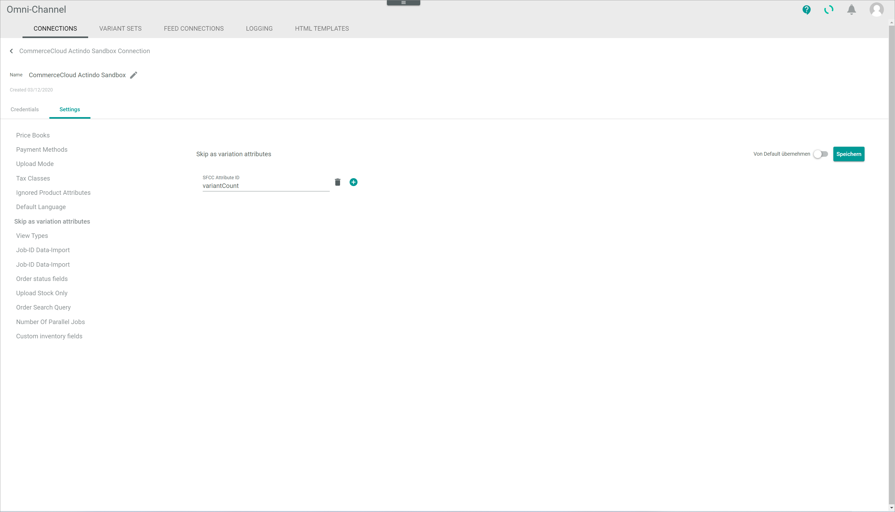

15. Enter the ID of any variant fields that should not be imported in the *SFCC Attribute ID* field. Further fields can be added if necessary using the  (Add) button.  

    > [Info] In contrast to the *Actindo Core1 Platform*, variant attributes are not necessarily unique. To avoid import problems, it is recommended not to import these fields. 

16. In the current version, the image upload is not supported, and therefore the *View types* menu entry is not relevant for the settings. 

17. Click the *Job ID data import* menu entry in the left side bar.  
    The Job ID data import setting is displayed in the right side bar.   

    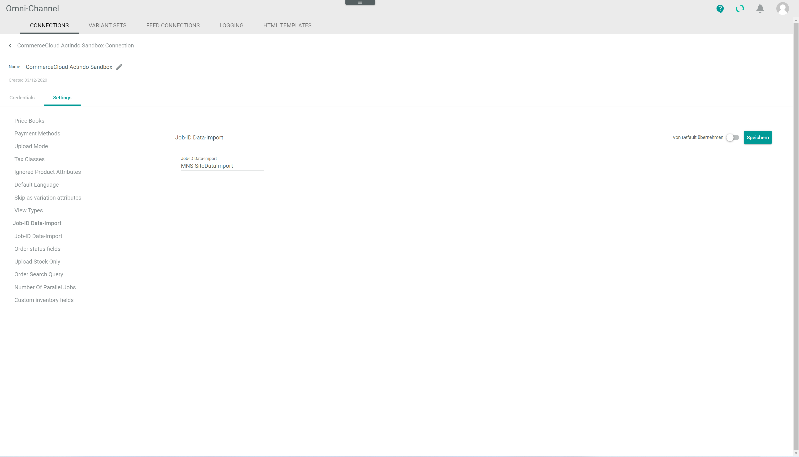

18. Enter the applicable Salesforce Commerce Cloud job ID in the *Job ID data import* field. 

19. Click the *Job ID inventory import* menu entry in the left side bar.  
    The Job ID inventory import setting is displayed in the right side bar.   

    

20. Enter the applicable Salesforce Commerce Cloud job ID in the *Job ID inventory import* field.

21. Click the *Order status fields* menu entry in the left side bar.  
    The order status fields setting is displayed in the right side bar.

    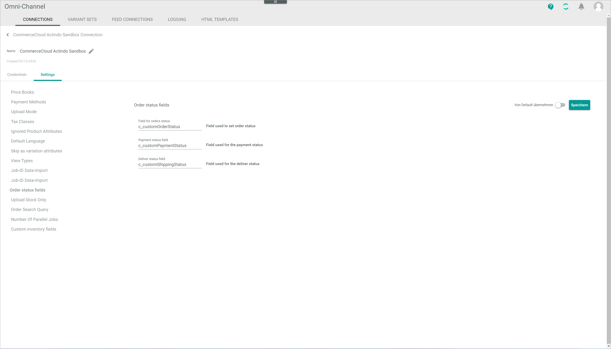

22. Enter the IDs of the fields to be used for order status, payment status and deliver status in the corresponding fields. Alternatively, you can enable the *Apply from default* toggle to apply the predefined values.

23. Click the *Upload stock only* menu entry in the left side bar.  
    The upload stock only setting is displayed in the right side bar.

    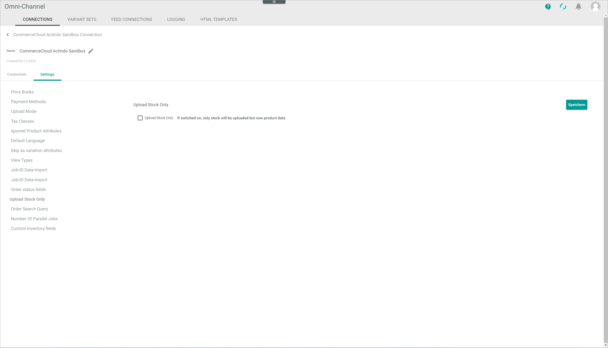

24. Select the *Upload stock only* checkbox if you want to upload only stock but no product data. 

25. Click the *Order search query* menu entry in the left side bar.  
    The order search query setting is displayed in the right side bar.

    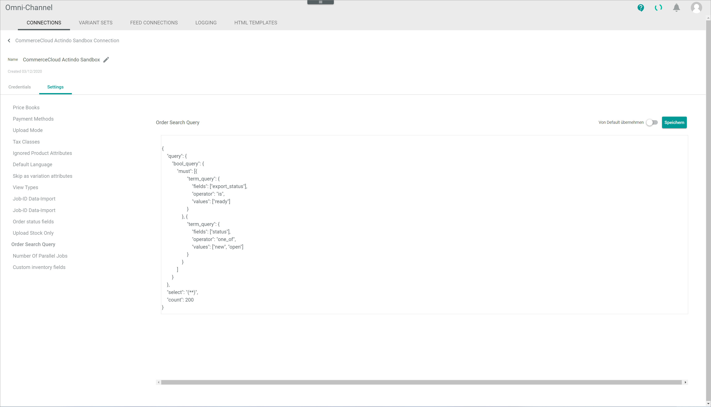

26. If desired, enter a query to find out which orders have already been imported into the *Actindo Core1 Platform*. Alternatively, you can enable the *Apply from default* toggle to apply the predefined values.

    > [Info] As soon as an order has been imported, the order *Export status* is set to **Exported** in the Salesforce Commerce Cloud. The order *Export status* can be check in *Merchant Tools > Ordering > Orders > Search for an order > Select an order*. 

27. Click the *Number of parallel jobs* menu entry in the left side bar.  
    The number of parallel jobs setting is displayed in the right side bar.

    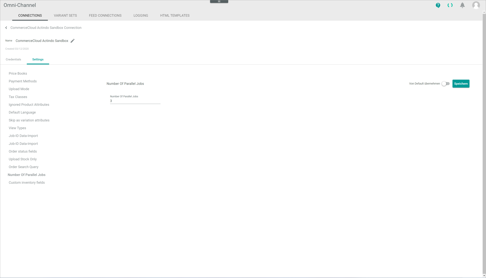

28. Enter a higher number of jobs in the *Number of parallel jobs* if the import volume capacity needs to be increased. The number of parallel jobs is directly related to the number of available VCores.  Alternatively, you can enable the *Apply from default* toggle to apply the predefined values.

29. Click the *Custom inventory fields* menu entry in the left side bar.  
    The custom inventory fields setting is displayed in the right side bar.

    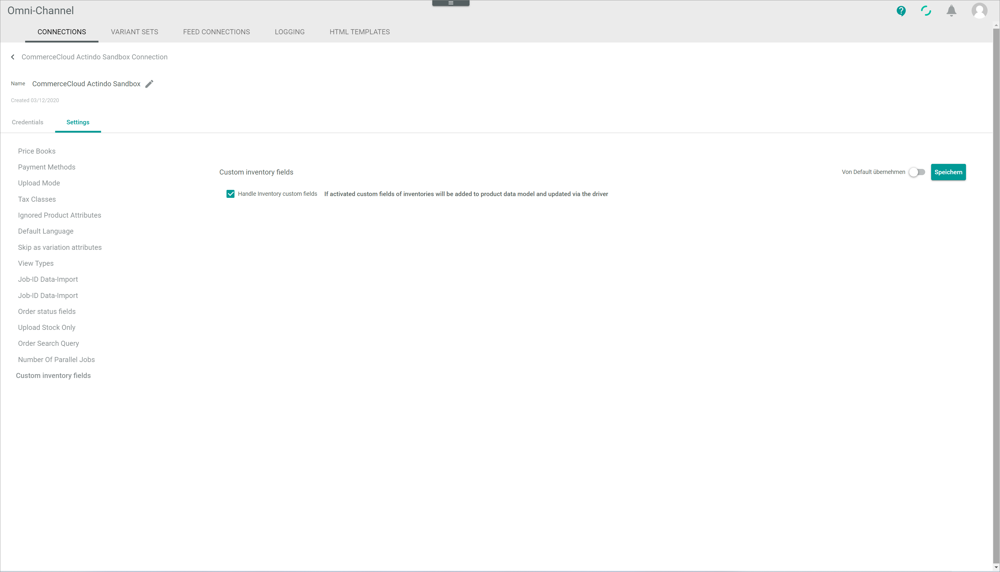

30. If desired, select the *Handle inventory custom fields* checkbox if inventory custom fields are imported and must be maintained in the system.

31. Click the [Save] button.  
    All changes have been saved. The *Saving successful* pop-up window is displayed.

    

## Configure the Shopify ETL mapping

There are a few particularities regarding the Salesforce Commerce Cloud connection that must be taking into account:  

1. Every product must be assigned to a catalog, which is similar to a product category in a shop. A master catalog determines which fields from Salesforce Commerce Cloud are available. 

2. All Salesforce fields, e.g. multilingual and site-specific fields, can be replicated in the *Actindo Core1 Platform* except for the Boolean site-specific fields, represented by checkboxes in the user interface, that cannot be replicated due to different numbers of values.

3. Fields cannot be dynamically created in the *Actindo Core1 Platform*.

4. Regarding specifically the ETL mapping configuration, the following values must be set:

    a. Product variants > Variants to Variants > Variants (CommerceCloud Actindo)

    In the *Configuration* section, on the right side of the workspace, the following toggles must be enabled:
        
    - Automatically generate all child entities when main entity is created  
    - Automatically map variant sets  
    - Automatically create variant set if no suiting variant can be found  

    The following toggles, on the other hand, must be disabled:

    - Automatically add not mapped defining attributes to destination set when creating variant set
    - Do not transfer the status of the master offer to the child offer

    [comment]: <> (Screenshot hinzufügen aus ETL mapping)

    b. (empty) > Constant value > Master catalog (CommerceCloud Actind)  
    
    In the *Configuration* section, on the right side of the workspace, click the *Master catalog (Commerce Cloud Actind* drop-down list and select the appropriate option. The master catalog must necessarily be set. Otherwise, the upload will fail.

    [comment]: <> (Screenshot hinzufügen aus ETL mapping)

    c. Geo-Code > Tree-To-String defining values (CommerceCloud) > Product Language (CommerceCloud Actind) 
    
    In Salesforce variants can be translated, whereas in the *Actindo Core1 Platform* variant attributes cannot be multilingual. A special mapping must be used to import the variants fields from Salesforce.  
    
    [comment]: <> (Screenshot hinzufügen aus ETL mapping)

    Using this mapping, the system uploads the translations created in the *PIM* module.

    It is important to note that any changes made to the translations in the *PIM* module will not be uploaded automatically, even if rerunning the mapping. A workaround is to set momentarily the product to inactive and set it to active again. 

    [comment]: <> (momentan blindspot, aufgrund von Prozess: er schreibt nicht die Übersetzung sondern die ID, daher bei Rerun passiert nichts, da ID gleich bleibt. -> Irgendwie erklären??? Workaround: Produkt auf inaktiv setzen und wieder auf aktiv, dann lädt er hoch) 

5. The *Actindo Core1 Platform* uploads only the changes made in the system but does not modify any new fields or categories created in the shop.

6. When creating an offer, a new site-specific attribute, if applicable, will be additionally created for every relevant site. When a new site is created, the connection must be then synchronize again for these site-specific attributes to be created in the newly created site too.

[comment]: <> (s. Angebote, Attribute, Search Placement)

7. The inventory is initially uploaded via XML file. Additional changes to inventory subsequently made will be uploaded via API, and therefore no inventory import jobs will be displayed.  

8. There are two API end points that may be useful for the user. API endpoints can be used to make an API request for different purposes:

    a. Debug (Actindo.Extensions.Actindo.CommerceCloud.OrderDebug.orderDebug?connectionId=x&orderNumber=x&siteId=x)

    In the API URL above, *x* stands for the specific parameter information that must be added:

    - Connection ID (*Connections* > *ID* column)
    - Order number (*Orders and returns* > *Remote ID* column)
    - ID of the site where the order has been placed 

    b. Inventory upload (Actindo.Extensions.Actindo.CommerceCloud.ReuploadStock.trigger?connectionId=x)

    In the API URL above, *x* stands for the specific parameter information that must be added:

    - Connection ID (*Connections* > *ID* column)

[comment]: <> (Relevant für User? Evtl./besser bei Troubleshooting?)

9. Product options, for instance, adding a warranty to a product, are generally not supported in the Core1. Nevertheless, it is possible to replicate and assign shared product options but they cannot be maintained in the system.

[comment]: <> (Können Sie gepflegt werden oder nicht? Unsicher)

10) There are three different offer status in the *Actindo Core1 Platform*:  

    - **Active**: online and available in shop   
    - **Inactive**: online but not available in shop   
    - **Not available**: offline

It is possible to override the active status of an offer, that means, set an offer can to inactive in individual sites if necessary, see *Offer > Select an offer > Attributes > Basic data > Override online (only active products) status for "Site ID"*. Bear in mind that the offer status in *Actindo Core1 Platform* must always be *Active*. 

> [Info] If an offer is set to inactive in the *Actindo Core1 Platform*, it will be inactive in all sites in Salesforce Commerce Cloud. 

[comment]: <> (Wie/wo kann man dann auf Inaktiv in den einzelnen Seiten setzen? In PIM?)    

