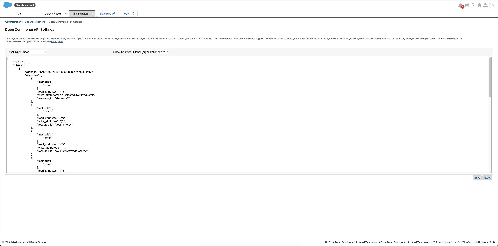

[!!Manage the connections](./01_ManageConnections.md)
[!!Manage the ETL mappings](../../DataHub/Operation/01_ManageETLMappings.md)

# Manage the Salesforce Commerce Cloud connection

To establish a connection to a Salesforce shop, there are several particularities to consider. Therefore, the creation and the configuration of the Salesforce Commerce Cloud (Salesforce) connection are described in detail below.

## Configure the Salesforce Commerce Cloud Business Manager

Before a Salesforce connection can be established, the following two configuration processes must be performed in the Salesforce Commerce Cloud Business Manager.  

In Salesforce, data are uploaded via XML files, which are then imported with a job into the shop. There are two jobs, one for inventory import and one for data import.   
Please note that these two jobs must be configured in your Salesforce account in the exact order and using the specified values as described below.


### Create an inventory import job

Create a job to import inventory-related data.

[comment]: <> (Was wird genau importiert in diesem Job?)

#### Prerequisites

- A Salesforce account has been created.
- The user has the required rights.

#### Procedure 

*Salesforce Commerce Cloud Business Manager*


[comment]: <> (Screenshot oben ist nicht wirklich das allererste: auf Drop-down Lists sollte "Select a Site" stehen. Neues Screenshot oder Step 1 anpassen?)

1. Click the *Select a Site* drop-down list in the navigation bar at the top of the page and select the applicable shop. All available shops are displayed in the list.  
  The *Welcome to the Business Manager* page for the corresponding shop is displayed.

  

2. Click the *Administration* tab in the navigation bar at the top of the page. 
  The *Administration* page is displayed.

  

  

 [comment]: <> (Vorübergehendes Screenshot oben. Entscheiden ob erstes oder zweites, s. Wissenstransfer Offene Fragen Min. 11:40, und Schritt 3 dementsprechend anpassen)
   
3. Click first the *Operations* and then the *Jobs* module.  
  The *Jobs* page is displayed.

[comment]: <> (Alternativ, je nach dem Screenshot oben: Click the downwards arrow in the *Administration* tab to display the context menu and select the option *Jobs* under the *Operation* section.)

  

[comment]: <> (s. Wissenstransfer Offenen Fragen ab Min. 11:46. Vorübergehendes Screenshot oben!)

4. Click the [New Job] button in the upper right corner to create the inventory import job.  
  The *New Job* page is displayed.

  

[comment]: <> (Screenshot fehlt)

5. Enter a name for the inventory import job, for example **InventoryImport**, in the *ID* field and, if desired, a job description in the *Description* field, and click the [Create] button.  
  The new job has been created. The *"JobID"* page is displayed.

    > [Info] Note this ID, as it must be specified in the *Omni-Channel* module when establishing the connection to Salesforce.


6. Click the *Job Steps* tab in the header of the *"JobID"* page and click the  (Add) button.
  A new flow has been added to the job. 

[comment]: <> (Screenshot fehlt?)

7. Select the **Organization** option as a scope for the flow.

8. Click the [Configure a step] button in the flow box and select the *ImportInventoryLists* step.  
  The *Select and Configure Step* side bar is displayed on the right side of the page.

  

[comment]: <> (Screenshot editiert / Felder gelöscht. Stimmt das so wenn leer?) 
 
9. Configure the following values in the corresponding fields of the *Select and Configure Step* side bar for the *ImportInventoryLists* step:  

    | Field                   | Value     |
    |-------------------------|-------------------------|
    | WorkingFolder           | import/inventory        |   
    | FileNamePattern         | ac_.*_inventory\\.xml   | 
    | NoFilesFoundHandling    | NO_FILES_FOUND          |
    | ImportMode              | Merge                   |  
    | ImportFailedHandling    | WARN                    |  
 
    > [Info] The values in the *AfterImportFileHandling* and the *ArchiveFolder* fields can be arbitrarily selected.

  

  [comment]: <> (Screenshot UND Tabelle oder eins wählen?)

10. Click the [Assign] button in the bottom right corner.    
  The step has been configured.


### Create a data import job

Create a job to import product-related data.

#### Prerequisites

- A Salesforce account has been created.
- The user has the required rights.

#### Procedure 

*Salesforce Commerce Cloud Business Manager*


[comment]: <> (Screenshot oben ist nicht wirklich das allererste: auf Drop-down Lists sollte "Select a Site" stehen. Neues Screenshot oder Step 1 anpassen?)


1. Click the *Select a Site* drop-down list in the navigation bar at the top of the page and select the applicable shop. All available shops are displayed in the list.  
  The *Welcome to the Business Manager* page for the corresponding shop is displayed.

  

2. Click the *Administration* tab in the navigation bar at the top of the page. 
  The *Administration* page is displayed.

  

  

[comment]: <> (Vorübergehendes Screenshot oben. Entscheiden ob erstes oder zweites, s. Wissenstransfer Offene Fragen Min. 11:40, und Schritt 3 dementsprechend anpassen)
   
3. Click first the *Operations* and then the *Jobs* module.  
  The *Jobs* page is displayed.

[comment]: <> (Alternativ, je nach dem Screenshot oben: Click the downwards arrow in the *Administration* tab to display the context menu and select the option *Jobs* under the *Operation* section.)

  

[comment]: <> (s. Wissenstransfer Offenen Fragen ab Min. 11:46. Vorübergehendes Screenshot oben!)

4. Click the [New Job] button in the upper right corner to create the data import job.  
  The *New Job* page is displayed.

[comment]: <> (Screenshot fehlt)

5. Enter a name for the data import job, for example **SiteDataImport**, in the *ID* field and, if desired, a job description in the *Description* field, and click the [Create] button.  
  The new job has been created. The *"JobID"* page is displayed.
  
    > [Info] Note this ID, as it must be specified in the *Omni-Channel* module when establishing the connection to Salesforce.

  

  
6. Click the *Job Steps* tab in the header of the *"JobID"* page and click the  (Add) button.  
  A new flow has been added to the job. 
   
   > [Info] The data import job must import different types of data and therefore contains sequential flows. 

[comment]: <> (Screenshot hinzufügen?)
   
7. Select the **Organization** option as a scope for the flow.

8. Click the [Configure a step] button in the flow box and select the *StandardProductsImport* step.  
  The *Select and Configure Step* side bar is displayed on the right side of the page.
   
    > [Info] Make sure that all folders specified within a step have been previously created in WebDAV. Otherwise, the data cannot be imported. For detailed information about WebDAV, see the Salesforce documentation, [Using WebDAV](https://documentation.b2c.commercecloud.salesforce.com/DOC1/topic/com.demandware.dochelp/content/b2c_commerce/topics/import_export/b2c_using_web_dav.html).
   
9. Configure the following values in the corresponding fields of the *Select and Configure Step* side bar for the *StandardProductsImport* step: 

    | Field                   | Value     |
    |-------------------------|-------------------------|
    | WorkingFolder           | import/catalogs         |   
    | FileNamePattern         | ac_.\*_catalog\_.*\\.xml| 
    | NoFilesFoundHandling    | NO_FILES_FOUND          |
    | ImportMode              | Merge                   |  
    | ImportFailedHandling    | WARN                    |  
    
    > [Info] The values in the *AfterImportFileHandling* and the *ArchiveFolder* fields can be arbitrarily selected.

  

10. Click the [Assign] button in the bottom right corner.    
  The step has been configured.

11. Click the  (Add) button below the first flow.
  A new flow has been added below the first flow. 

12. Select the **Organization** option as a scope for the flow.

13. Click the [Configure a step] button in the flow box and select the *BundleProductsImport* step.
  The *Select and Configure Step* side bar is displayed on the right side of the page.
   
    > [Info] Make sure that all folders specified within a step have been previously created in WebDAV. Otherwise, the data cannot be imported. For detailed information about WebDAV, see the Salesforce documentation, [Using WebDAV](https://documentation.b2c.commercecloud.salesforce.com/DOC1/topic/com.demandware.dochelp/content/b2c_commerce/topics/import_export/b2c_using_web_dav.html).
   
14. Configure the following values in the corresponding fields of the *Select and Configure Step* side bar for the *BundleProductsImport* step: 

    | Field                   | Value     |
    |-------------------------|-------------------------|
    | WorkingFolder           | import/catalogs         |   
    | FileNamePattern         | ac_.\*_bundles\_.*\\.xml| 
    | NoFilesFoundHandling    | NO_FILES_FOUND          |
    | ImportMode              | Merge                   |  
    | ImportFailedHandling    | WARN                    | 

    > [Info] The values in the *AfterImportFileHandling* and the *ArchiveFolder* fields can be arbitrarily selected.

  

15. Click the [Assign] button in the bottom right corner.    
  The step has been configured.

16. Click the  (Add) button below the second flow.
  A new flow has been added below the second flow. 
   
17. Select the **Organization** option as a scope for the flow.

18. Click the [Configure a step] button in the flow box and select the *CategoryAssignmentImport* step.
  The *Select and Configure Step* side bar is displayed on the right side of the page.
  
    > [Info] Make sure that all folders specified within a step have been previously created in WebDAV. Otherwise, the data cannot be imported. For detailed information about WebDAV, see the Salesforce documentation, [Using WebDAV](https://documentation.b2c.commercecloud.salesforce.com/DOC1/topic/com.demandware.dochelp/content/b2c_commerce/topics/import_export/b2c_using_web_dav.html).
  
19. Configure the following values in the corresponding fields of the *Select and Configure Step* side bar for the *CategoryAssignmentImport* step: 

    | Field                   | Value     |
    |-------------------------|-------------------------|
    | WorkingFolder           | import/catalogs         |   
    | FileNamePattern         | ac_.\*_assignments\_.*\\.xml| 
    | NoFilesFoundHandling    | NO_FILES_FOUND          |
    | ImportMode              | Merge                   |  
    | ImportFailedHandling    | WARN                    |  

    > [Info] The values in the *AfterImportFileHandling* and the *ArchiveFolder* fields can be arbitrarily selected.

  

20. Click the [Assign] button in the bottom right corner.    
  The step has been configured.

18. Click the  (Add) button below the third flow.
  A new flow has been added below the third flow. 

21. Select the **Organization** option as a scope for the flow.

22. Click the [Configure a step] button in the flow box and select the *PricebookImport* step.
  The *Select and Configure Step* side bar is displayed on the right side of the page.
   
    > [Info] Make sure that all folders specified within a step have been previously created in WebDAV. Otherwise, the data cannot be imported. For detailed information about WebDAV, see the Salesforce documentation, [Using WebDAV](https://documentation.b2c.commercecloud.salesforce.com/DOC1/topic/com.demandware.dochelp/content/b2c_commerce/topics/import_export/b2c_using_web_dav.html).
   
23. Configure the following values in the corresponding fields of the *Select and Configure Step* side bar for the *PricebookImport* step:

    | Field                   | Value     |
    |-------------------------|-------------------------|
    | WorkingFolder           | import/pricebooks       |   
    | FileNamePattern         | ac_.\*\_price_book\\.xml| 
    | NoFilesFoundHandling    | NO_FILES_FOUND          |
    | ImportMode              | Merge                   |  
    | ImportFailedHandling    | WARN                    |  

    > [Info] The values in the *AfterImportFileHandling* and the *ArchiveFolder* fields can be arbitrarily selected.

  

24. Click the [Assign] button in the bottom right corner.    
  The step has been configured.


### Configure the Open Commerce API Settings

In Salesforce, there are two Open Commerce APIs: 
- The shop API, which is used for the order data  
- The data API, which is used for the product data  
The corresponding API settings must be configured in Salesforce as described below.

#### Prerequisites

- A Salesforce account has been created.
- The user has the required rights.
- The client ID has been generated in Salesforce, see the Salesforce documentation, [Generate an API Client ID](https://documentation.b2c.commercecloud.salesforce.com/DOC1/index.jsp?topic=%2Fcom.demandware.dochelp%2Fcontent%2Fb2c_commerce%2Ftopics%2Fanalytics%2Fb2c_generate_api_client_id.html).


#### Procedure

*Salesforce Commerce Cloud Business Manager > Administration > Site Development > Open Commerce API Settings*



[comment]: <> (Anderes "allgemeines" Screenshot verfügbar?)

1. Click the *Select type* drop-down list and select the **Shop** option.
  The current shop API is displayed in the text area.  


   
2. Click the *Select Context* drop-down list and select the **Global (organization-wide)** option. 

3. In the text area, check the JSON document for the following code entry and, if not available, include the code entry:

  ```json
  {
  "client_id": "CLIENTID",
  "resources": [
      {
          "resource_id": "/order_search",
          "methods": [
              "post"
          ],
          "read_attributes": "(**)",
          "write_attributes": "(**)"
      },
      {
          "resource_id": "/orders/*",
          "methods": [
              "get",
              "patch"
          ],
          "read_attributes": "(**)",
          "write_attributes": "(**)"
      }
  ]
  }
  ```

4. Replace the **CLIENTID** description for the *client_id* property with your corresponding client ID.

5. Click the [Save] button.  
  All changes to the shop API have been saved.

6. Click the *Select type* drop-down list and select the **Data** option.  
  The current data API is displayed in the text area.  

    

7. Click the *Select Context* drop-down list and select the **Global (organization-wide)** option. 

8. In the text area, check the JSON document for the following code entry and, if not available, include the code entry:

  ```json
  {
  "client_id": "CLIENTID",
  "resources": [
      {
          "resource_id": "/jobs/*/executions",
          "methods": [
              "post"
          ],
          "read_attributes": "(**)",
          "write_attributes": "(**)"
      },
      {
          "resource_id": "/jobs/*/executions/*",
          "methods": [
              "get"
          ],
          "read_attributes": "(**)",
          "write_attributes": "(**)"
      },
      {
          "resource_id": "/job_execution_search",
          "methods": [
              "post"
          ],
          "read_attributes": "(**)",
          "write_attributes": "(**)"
      },
      {
          "resource_id": "/locale_info/locales",
          "methods": [
              "get"
          ],
          "read_attributes": "(**)",
          "write_attributes": "(**)"
      },
      {
          "resource_id": "/system_object_definitions/Product/attribute_definitions/*",
          "methods": [
              "get"
          ],
          "read_attributes": "(**)",
          "write_attributes": "(**)"
      },
      {
          "resource_id": "/system_object_definitions/Product/attribute_groups/*",
          "methods": [
              "get"
          ],
          "read_attributes": "(**)",
          "write_attributes": "(**)"
      },
      {
          "resource_id": "/system_object_definitions/ProductInventoryRecord/attribute_definitions/*",
          "methods": [
              "get"
          ],
          "read_attributes": "(**)",
          "write_attributes": "(**)"
      },
      {
          "resource_id": "/system_object_definitions/ProductInventoryRecord/attribute_groups/*",
          "methods": [
              "get"
          ],
          "read_attributes": "(**)",
          "write_attributes": "(**)"
      },
      {
          "resource_id": "/system_object_definitions/ProductInventoryRecord/attribute_definitions",
          "methods": [
              "get"
          ],
          "read_attributes": "(**)",
          "write_attributes": "(**)"
      },
      {
          "resource_id": "/catalogs",
          "methods": [
              "get"
          ],
          "read_attributes": "(**)",
          "write_attributes": "(**)"
      },
      {
          "resource_id": "/catalogs/*/categories",
          "methods": [
              "get"
          ],
          "read_attributes": "(**)",
          "write_attributes": "(**)"
      },
      {
          "resource_id": "/inventory_lists",
          "methods": [
              "get"
          ],
          "read_attributes": "(**)",
          "write_attributes": "(**)"
      },
      {
          "resource_id": "/system_object_definitions/Product/attribute_groups",
          "methods": [
              "get"
          ],
          "read_attributes": "(**)",
          "write_attributes": "(**)"
      },
      {
          "resource_id": "/system_object_definitions/Product/attribute_definitions",
          "methods": [
              "get"
          ],
          "read_attributes": "(**)",
          "write_attributes": "(**)"
      },
      {
          "resource_id": "/sites",
          "methods": [
              "get"
          ],
          "read_attributes": "(**)",
          "write_attributes": "(**)"
      },
      {
          "resource_id": "/inventory_lists/*/product_inventory_records/*",
          "methods": [
              "put", "delete"
          ],
          "read_attributes": "(**)",
          "write_attributes": "(**)"
      },
      {
          "resource_id": "/sites/*/orders/*/export_status",
          "methods": [
              "put"
          ],
          "read_attributes": "(**)",
          "write_attributes": "(**)"
      }
  ]
  }
  ```

9. Replace the **CLIENTID** description for the *client_id* property with your corresponding client ID.

10. Click the [Save] button.  
  All changes to the data API have been saved.

    > [Info] For detailed information, see the Salesforce documentation, [OCAPI Settings](https://documentation.b2c.commercecloud.salesforce.com/DOC1/topic/com.demandware.dochelp/OCAPI/current/usage/OCAPISettings.html).


### Generate an access key

An access key must be generated to be specified as an access token in the *Omni-Channel* module when establishing the connection to Salesforce. The access key is site-specific, that means, an access key must be generated for each shop.

[comment]: <> (Stimmt das so?)

#### Prerequisites

- A Salesforce account has been created.
- The user has the required rights.

#### Procedure

*Salesforce Commerce Cloud Business Manager*

1. Go to your user profile via the *Administration* tab or the *Administration feature lookup*.  
 The *My profile* page is displayed.

 

[comment]: <> (Alternativen Pfad? Evtl. Screenshot weiter verabeiten)

2. Click the [Manage Access Keys] button.  
  The *Manage Access Keys* page is displayed.

3. Click the [Generate Access Key] button.  
  The *Generate Access Key* window is displayed.

  

4. Click the drop-down list to and select the *Agent User Login and OCAPI* option as authentication scope.

5. Click the [Generate] button.  
  The access key is generated. The *Generate Access Key* window displays an access key with the following notice: *After you close this window, you can't view or download teh access key again. We recommend copying it or clicking **Download** to download a CSV file with your access key*.

    [Info] The access key is subsequently needed to establish the connection with the Salesforce Commerce Cloud in the *Omni-Channel* module. Once the *Generate Access Key* window is closed, the access key cannot be read anymore and therefore must be noted at this point and kept safe for future reference.

  

6. Copy the key to your clipboard or click the [Download] button and click the [Close] button.
  The generated access key is saved in the system and listed in the *Scope* section of the *Manage Access Keys* page. 

  


## Create a Salesforce connection

Create the connection to a Salesforce shop using the Salesforce Commerce Cloud driver. Further settings can only be configured after the connection has been established.

#### Prerequisites

- The Salesforce Commerce Cloud platform has been configured, see [Configure the Salesforce Commerce Cloud platform](#configure-the-salesforce-commerce-cloud-platform). 
- The *Salesforce Commerce Cloud* plugin has been installed.  

> [Info] For the *Omni-Channel* module version 4.1.0 or higher, the *Salesforce Commerce Cloud* plugin is required in at least version 1.2.0.

[comment]: <> (check!)

#### Procedure

*Omni-Channel > Settings > Tab CONNECTIONS*


1. Click the  (Add) button in the bottom right corner.    
  The *Create connection* view is displayed.

    

2. Enter a name for the connection in the *Name* field.

3. Click the *Driver* drop-down list and select the *Salesforce Commerce Cloud* driver.  
  The *Credentials* section is displayed below the drop-down list.

   > [Info] Salesforce offers the possibility to work with two separate environments, a staging environment for customizing and testing purposes and a live environment for production. The connection to the environments must be specified separately. 

  

4. For the staging environment, enter the following credentials:
    + Enter the shop URL of the staging environment in the *URL* field.  
    + Enter the client ID in the *Client ID* field and the client password in the *Client password* field.
    + Enter the username (email address) in the *Username* field, the user password in the *User password* field and the user API access token in the *Access token* field. These so-called *business manager login data* are needed to work with orders. 

5. For the live environment, enter the following credentials and enable the *Production mode* toggle:  
    + Enter the shop URL of the production environment in the *URL (Production)* field.  
    + Enter the corresponding client ID in the *Client ID (Production)* field and the client password in the *Client password (Production)* field.
    + Enter the username (email address) in the *Username (Production)* field, the user password in the *User password (Production)* field and the user API access token in the *Access token (Production)* field. These so-called *business manager login data* are needed to work with orders.

      > [Info] As soon as the production mode is enabled, the order import and the stock upload are synchronized with the production environment, whereas the product data are still synchronized with the staging environment.

6. Click the [SAVE] button.  
  The connection has been created. The *CONNECTIONS* tab in the *Settings* menu entry of the *Omni-Channel* module is displayed when the connection has been established. The *Salesforce Commerce Cloud* connection is displayed in the list of connections.

    

7. If necessary, continue to configure the Salesforce connection, see [Configure the Salesforce connection](#configure-the-salesforce-connection).


## Configure the Salesforce connection   

After the connection to a Salesforce shop has been established, further settings can be configured for the connection.

#### Prerequisites

The Salesforce connection has been established, see [Create a Salesforce connection](#create-a-salesforce-connection).

#### Procedure

*Omni-Channel > Settings > Tab CONNECTIONS*


1. Click the Salesforce connection in the list of connections.   
  The *Edit connection* view is displayed. By default, the *Credentials* tab is selected.

  

2. Click the *Settings* tab.   
  The *Settings* tab is displayed. By default, the *Price books* settings are selected. 

  

3. Enter the price book ID in the *ID* field and the applicable three letter currency code according to ISO 4217 in the *Currency* field for each price book in Salesforce. To add another price book, click the  (Add) button.  

    > [Info] The price books must be set up manually, as they cannot be retrieved via API from Salesforce.

4. Click the *Payment methods* menu entry in the left side bar.  
  The payment methods settings are displayed on the right side.   

  

5. Enter the payment method ID in the *ID* field and a description in the *Name* field for each payment method in Salesforce. To add another payment method, click the  (Add) button.   

6. Click the *Upload mode* menu entry in the left side bar.  
  The upload mode settings are displayed on the right side.

  

7. Click the *Upload mode* drop-down list and select the appropriate mode for the product data upload. The following options are available:  
    - **Immediately**    
      Select this option to upload any changes as soon as they are made.
    - **Delayed**    
      Select this option to upload any changes after a specified period of time. When selected, the *Delay in minutes* field is displayed. Enter the desired delay in minutes in the field. By default, a 10 minutes delay is predefined. 
    - **Cron**    
      Select this option to schedule the upload and perform it periodically at a fixed time, date or interval. When selected, the *Cron line* field is displayed. Enter a valid cron expression to specify the time interval in which product data should be uploaded in the field. For detailed information, see https://crontab.guru/.
    
    Alternatively, you can enable the *Apply from default* toggle to apply the default value, displayed in the field as read-only.

8. Click the *Tax classes* menu entry in the left side bar.  
  The tax classes settings are displayed on the right side.

  

9. Enter the Salesforce ID for the tax class in the *Commerce Cloud Code* field and the corresponding Actindo tax class ID in the *Actindo ID* field. The Actindo tax class IDs can be found in the *Taxes* module.  

    > [Info] Repeat the step **9** for each tax class in Salesforce. Further tax class fields can be added by clicking the  (Add) button.   

[comment]: <> (Problem: ich finde die Actindo Tax Class IDs nicht im Taxes Modul. Nachfragen, wo die angezeigt werden und genauer spezifizieren!)

10. Click the *Ignored Product Attributes* menu entry in the left side bar.  
  The ignored product attributes settings are displayed on the right side.

  

11. Enter the ID of the attribute that should not be imported to Salesforce in the *SFCC Attribute ID* field. The corresponding attribute IDs are described in the *catalog.xsd* schema, see [catalog.xsd](https://documentation.b2c.commercecloud.salesforce.com/DOC3/index.jsp?topic=%2Fcom.demandware.dochelp%2FDWAPI%2Fxsd%2FSchemas.html).  

    > [Info] Repeat the step **11** for each attribute to be ignored. Further attribute fields can be added by clicking the  (Add) button. If there are custom attributes that should not be imported to Salesforce, Note to add the prefix **c_**, that is, **c_AttributeName**.

12. Click the *Default language* menu entry in the left side bar.  
  The default language settings are displayed on the right side.

  

13. Click the *Language used for default value* drop-down list and select the language that should be used if the default language is selected in Salesforce. All available languages are displayed in the list.  

    > [Info] In contrast to Salesforce,  no default language is defined in the *Actindo Core1 Platform*. For this reason, a language must be specified to be used as default value.    

14. Click the *Skip as variation attribute* menu entry in the left side bar.  
  The skip as variation attribute settings are displayed on the right side.

  

15. Enter the Salesforce ID of the variant that should not be imported to Salesforce in the *SFCC Attribute ID* field.   

  > [Info] Repeat the step **15** for each variant to be ignored. Further variant fields can be added by clicking the  (Add) button. 

16. Click the *Job ID data import* menu entry in the left side bar.  
  The Job ID data import settings are displayed on the right side.   

  

17. Enter the applicable Salesforce job ID in the *Job ID data import* field. 

[comment]: <> (The ID has been chosen in the Salesforce Commerce Cloud platform, see Configure... - Link auf oben. Satz und Verweis auch in Job ID inventory import)

18. Click the *Job ID inventory import* menu entry in the left side bar.  
  The Job ID inventory import settings are displayed on the right side.   

  

19. Enter the applicable Salesforce job ID in the *Job ID inventory import* field.

20. Click the *Order status fields* menu entry in the left side bar.  
  The order status fields settings are displayed on the right side.

  

[comment]: <> (Steps 16-20: Überlegen, ob wir das hier beschreiben wollen -mit Verweis auf Create jobs- oder im Create jobs Abschnitt selbst und hier nur den Hinweis hinterlassen, dass es bereits konfiguriert wurde.)

21. Enter the custom IDs of the corresponding status fields in the *Order status*, *Payment status* and *Deliver status* fields.   
Alternatively, enable the *Apply from default* toggle to apply the Salesforce default values.  

    > [Info] Note to add the prefix **c_** for any custom field names, that is, **c_StatusID**.

22. Click the *Upload stock only* menu entry in the left side bar.  
  The upload stock only settings are displayed on the right side.

  

23. Select the *Upload stock only* checkbox if you want to upload only stock but no product data. Leave the checkbox unchecked to upload both stock and product data. By default, the checkbox is unchecked.  

24. Click the *Order search query* menu entry in the left side bar.  
  The order search query settings are displayed on the right side.

  

25. Enter a custom query to search for all new imported orders.    
  Alternatively, enable the *Apply from default* toggle to apply the default search query.  
  
    > [Info] As soon as an order has been imported, the order *Export status* is set to **Exported** in Salesforce. The order *Export status* can be checked in *Merchant Tools > Ordering > Orders > Search for an order > Select an order*.  

26. Click the *Number of parallel jobs* menu entry in the left side bar.  
  The number of parallel jobs settings are displayed on the right side.

  

27. Enter the number of jobs that may be processed in parallel in the *Number of parallel jobs* field.     
Alternatively, enable the *Apply from default* toggle to apply the default value for the number of parallel jobs.  

    > [Info] Increase the number of parallel jobs to handle a higher order volume. Be aware that a higher number of parallel jobs also requires a higher number of vCores. 

28. Click the *Custom inventory fields* menu entry in the left side bar.  
  The custom inventory fields settings are displayed on the right side.

  

29. Select the *Handle inventory custom fields* checkbox to import the custom inventory fields from Salesforce and also maintain them in Actindo.    
Alternatively, enable the *Apply from default* toggle or leave the checkbox unchecked to ignore any custom inventory fields from Salesforce.

30. Click the [Save] button.  
  All changes have been saved. The *Saving successful* pop-up window is displayed.

  


## Configure the Salesforce ETL mapping

The ETL mapping is important for the correct functionality of the Salesforce connection to adapt to the particularities of this connection.

### Configure the master catalog

The Salesforce master catalog must be mapped in Actindo to determine the available fields in Actindo.   
It is mandatory that the master catalog is set in all ETL mappings to the Salesforce attribute set.  

[comment]: <> (noch etwas verwirrend: ist der master catalog in Salesforce oder in Actindo?)

#### Prerequisites

- A Salesforce connection has been established, see [Create a Salesforce connection](#create-a-salesforce-commerce-cloud-connection).
- At least one attribute set mapping from a PIM attribute set to the Salesforce attribute set has been created. 

[comment]: <> (muss das immer ein Attributset aus PIM sein, oder ist das variabel?)

#### Procedure

*DataHub > Settings > Tab ETL*


1. Click the attribute set mapping from a PIM attribute set to the Salesforce attribute set in the list of attribute set mappings.   
  The *Mapping from "PIM attribute set name" to "Salesforce attribute set name"* view is displayed.

    

2. Click the row of the *Master catalog (CommerceCloud Actindo)* destination attribute on the left side.   
  The *Settings* section for the *Master catalog (CommerceCloud Actindo)* attribute mapping is displayed on the right side.

    

3. Click the *Extension* drop-down list in the *Settings* section and select the **Constant value** option. All extensions that are matching the data type of the destination attribute are displayed in the list.      
  The *Configuration* section is displayed below the *Settings* section.

4. Click the *Master catalog (CommerceCloud Actindo)* drop-down list in the *Configuration* section and select the applicable master catalog from Salesforce. All available Salesforce catalogs are displayed in the list.

    

5. Click the [SAVE] button in the upper right corner.   
  The changes have been saved. The *Settings* section is hidden. The assigned mapping is displayed in the list of attribute mappings on the left side.

    > [Info] Be aware that you have to rerun the mapping to apply the changes made to the attribute, see [Rerun an ETL mapping](../../DataHub/Operation/01_ManageETLMappings.md#rerun-an-etl-mapping).


### Configure the variants

When mapping the product variants from Actindo to Salesforce, it is important to set the correct settings to avoid any upload problems.

#### Prerequisites

- A Salesforce connection has been established, see [Create a Salesforce connection](#create-a-salesforce-commerce-cloud-connection).
- At least one attribute set mapping from a PIM attribute set to the Salesforce attribute set has been created. 

#### Procedure

*DataHub > Settings > Tab ETL*


1. Click the attribute set mapping from a PIM attribute set to the Salesforce attribute set in the list of attribute set mappings.   
  The *Mapping from "PIM attribute set name" to "Salesforce attribute set name"* view is displayed.

  

2. Click the row of the *Variants (CommerceCloud Actindo)* destination attribute on the left side.   
  The *Settings* section for the *Variants (CommerceCloud Actindo)* attribute mapping is displayed on the right side.

  

3. Click the *Extension* drop-down list in the *Settings* section and select the **Variant-to-variant** option. All extensions that are matching the data type of the destination attribute are displayed in the list.      
  The *Source attribute* drop-down list is displayed left to the *Extension* drop-down list and the *Configuration* section is displayed below the *Settings* section.

4. Click the *Source attribute* drop-down list and select the **Product variants** option. All attributes with a data type that matches the selected ETL extension are displayed in the list.    

5. Enable the following toggles in the *Configuration* section:
    - *Automatically generate all child entities when main entity is created*
    - *Automatically map variant sets* 
    - *Automatically create variant set if no suiting variant can be found*
    
6. Make sure that the following toggles are disabled:
   - *Automatically add not mapped defining attributes to destination set when creating variant set*
      > [Info] In no case may the *Automatically add not mapped defining attributes to destination set when creating variant set* toggle be activated, as the upload from Actindo to Salesforce will cause problems, see [Fields and attributes](#salesforce-product-data-particularities).
    - *Do not transfer the status of the master offer to the child offer*

  

7. Click the [SAVE] button in the upper right corner.   
  The changes have been saved. The *Settings* section is hidden. The assigned mapping is displayed in the list of attribute mappings on the left side.

    > [Info] Be aware that you have to rerun the mapping to apply the changes made to the attribute, see [Rerun an ETL mapping](../../DataHub/Operation/01_ManageETLMappings.md#rerun-an-etl-mapping).


### Configure the translatable variants

In Salesforce, it is possible to create translations to variables. In Actindo, variants are generally not translatable. Nevertheless, it is possible to apply the translations from Salesforce by a special mapping to an Actindo tree node attribute. 

#### Prerequisites

- A Salesforce connection has been established, see [Create a Salesforce connection](#create-a-salesforce-commerce-cloud-connection).
- At least one attribute set mapping from a PIM attribute set to the Salesforce attribute set has been created. 
- The *Geo code* tree node attribute has been created in the *PIM* module containing the variant specific translations. 

[comment]: <> (ist das immer das geo code attribut? und was genau enthält er? wirklich die translations oder nur ländercodes? genauere Erklärung oder beispiel zeigen!)

#### Procedure

*DataHub > Settings > Tab ETL*


1. Click the attribute set mapping from a PIM attribute set to the Salesforce attribute set in the list of attribute set mappings.   
  The *Mapping from "PIM attribute set name" to "Salesforce attribute set name"* view is displayed.

  

2. Click the row of the *Product Language (CommerceCloud Actindo)* destination attribute on the left side.   
  The *Settings* section for the *Product Language (CommerceCloud Actindo)* attribute mapping is displayed on the right side.

  

3. Click the *Extension* drop-down list in the *Settings* section and select the **Tree-To-String defining values (CommerceCloud)** option. All extensions that are matching the data type of the destination attribute are displayed in the drop-down list.      
  The *Source attribute* drop-down list is displayed left to the *Extension* drop-down list and the *Configuration* section is displayed below the *Settings* section.

4. Click the *Source attribute* drop-down list and select the **Geo code** attribute. All attributes with a data type that matches the selected ETL extension are displayed in the list.

5. Enter a comma **,** in the *Separator* field in the *Configuration* section.

6. Click the *Relevant locale (applies for single language attributes)* drop-down list and select the **English** option. All available languages are displayed in the list. 

  

7. Click the [SAVE] button in the upper right corner.   
  The changes have been saved. The *Settings* section is hidden. The assigned mapping is displayed in the list of attribute mappings on the left side.

    > [Info] Be aware that you have to rerun the mapping to apply the changes made to the attribute, see [Rerun an ETL mapping](../../DataHub/Operation/01_ManageETLMappings.md#rerun-an-etl-mapping).   
    Note that any changes made to the translations in the tree node attribute will not be uploaded automatically, even if rerunning the mapping. You must set the corresponding offer to inactive and set it to active again to synchronize the changes. 

[comment]: <> (Stimmt das mit der Configuration? oder ist das individuell bzw. vom shop abhängig?)


## Salesforce product data particularities

There are a few particularities regarding the Salesforce product data that must be taking into account:  

**Master catalog**

Every product in Salesforce must be assigned to a catalog which is similar to a product category in a shop. There must be a master catalog in Salesforce that determines which fields are available.   
The Salesforce master catalog must be mapped in Actindo to determine the available fields in Actindo.   
It is mandatory that the master catalog is set in all ETL mappings to the Salesforce attribute set, see [Configure the master catalog](#configure-the-master-catalog).

In Actindo, all fields from Salesforce are available, as there exists only one single attribute set for Salesforce.    

[comment]: <> (s.o.: ist der master catalog in Salesforce oder in Actindo?)

**Sites**

Salesforce offers the possibility to create different sites for the order import. In Actindo, these sites are created as sub-shops. That means that every single shop is a sub-account, available in the stock withdrawal matrix in the *Warehouse* module.

**Fields and attributes**

[comment]: <> (fields vs. attributes - Unterschied? oder ist hier dasselbe gemeint?)

Actindo supports both multi-language fields and site-specific fields from Salesforce. However, Actindo does not support site-specific boolean fields from Salesforce because they have a different number of states in Actindo and Salesforce, which causes problems. 

All fields must be created in Salesforce and cannot be created in Actindo and dynamically be added to Salesforce.

Site-specific attributes are additionally created for each site. That means, when creating an offer, the site-specific attribute is created once as a non-site-specific attribute containing a default value for all sites without another value. Additionally, the attribute is created as a site-specific attribute for every available site. When a new site is subsequently created, the corresponding site-specific attribute is automatically created after the connection has been synchronized.

**Site-specific status**

An offer in Actindo can have one of the following three statuses:      
- **Active**   
  The offer is active. It is displayed in the marketplace, where it can be sold.   
- **Inactive**   
  The offer is inactive.  It is not longer displayed in the marketplace and thus cannot be sold anymore.   
- **Not available**   
  The offer is deleted from the marketplace.

By default, the status of an offer applies to the offer in all sites. As there exists the *Override online (only active products) status for Site "site ID"* site-specific attribute, it is possible to override the *active* status of an offer for the specific site. That means, an active offer can be switched to inactive for the individual sites.   
Note that the site-specific status change is only possible in one direction: If the status of an offer is set to **inactive**, it will be inactive on all sites and cannot be changed to **active** for single sites. 

**Product categories**

You can create new product categories in Salesforce as well as in Actindo. When uploading a product category from Actindo to Salesforce, the existing product categories are not overwritten, but merely added to the existing categories in Salesforce. Further, only categories that are created and added by Actindo can also be deleted by Actindo. All categories, that are created or edited by Salesforce, are not touched by Actindo at all. Only the changes made in Actindo that do not affect the Salesforce categories are uploaded.

**Inventory**

For the initial product upload, the inventory is imported via a XML file, which is processed by an inventory import job. All changes in inventory of already uploaded products will be processed via the Open Commerce Cloud API. Since the inventory update via API runs without generating an inventory import job, no inventory import jobs are displayed even if the inventory is updated.  

**Product options**

Product options, for instance, adding a warranty to a product, are generally not supported by Actindo. However, it is possible to assign so-called *shared options* to all products, but these cannot be maintained by Actindo.

**Image handling**

The image handling is currently not supported by Actindo.

**Order endpoint**

The following endpoint is used to retrieve all details of a certain order in Salesforce:

*/Actindo.Extensions.Actindo.CommerceCloud.OrderDebug.orderDebug?connectionId=x&orderNumber=x&siteId=x*

The *x* in the endpoint above must be replaced by the corresponding parameter information:
- Connection ID of the applicable connection. The connection ID is displayed in the *ID* column of the connections list, see [User interface Connections](../UserInterface/07a_Connections.md). Otherwise, you have to know the order number by heart.
- Order number of the applicable order. The order number is displayed in the *Remote ID* column of the orders list, see [User interface Orders](../UserInterface/05a_Orders.md).
- Site ID of the site where the order has been placed. You have to know the site ID by heart.

[comment]: <> (order number -> nur einsehbar, wenn Bestellung schon importiert. Wann wendet man den Endpoint am ehesten an? Vor oder nach dem Import?)

**Inventory endpoint**

The following endpoint is used to re-trigger the complete inventory upload in Salesforce:

*/Actindo.Extensions.Actindo.CommerceCloud.ReuploadStock.trigger?connectionId=x*

The *x* in the endpoint above must be replaced by the connection ID of the applicable connection. The connection ID is displayed in the *ID* column of the connections list, see [User interface Connections](../UserInterface/07a_Connections.md). Otherwise, you have to know the order number by heart.
 

