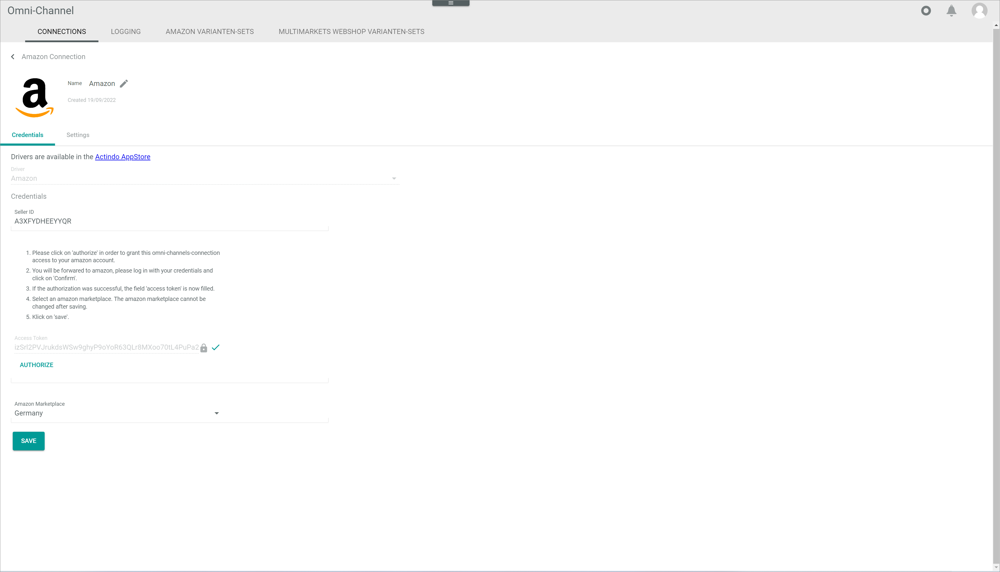
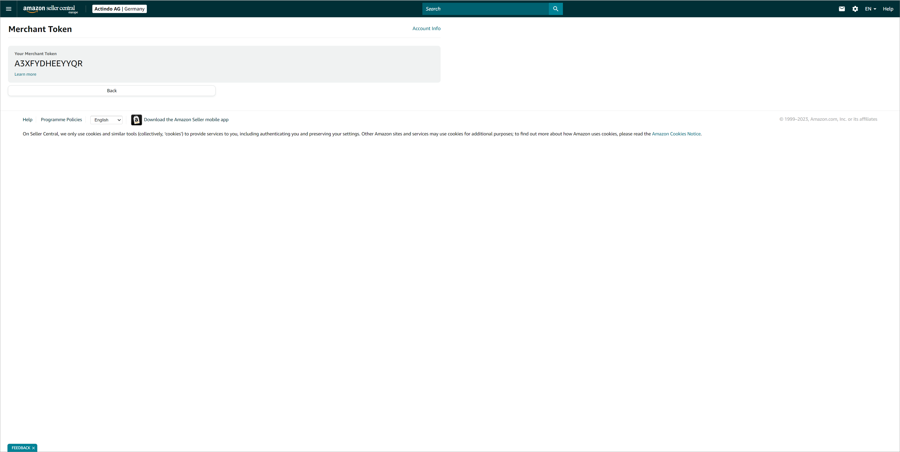
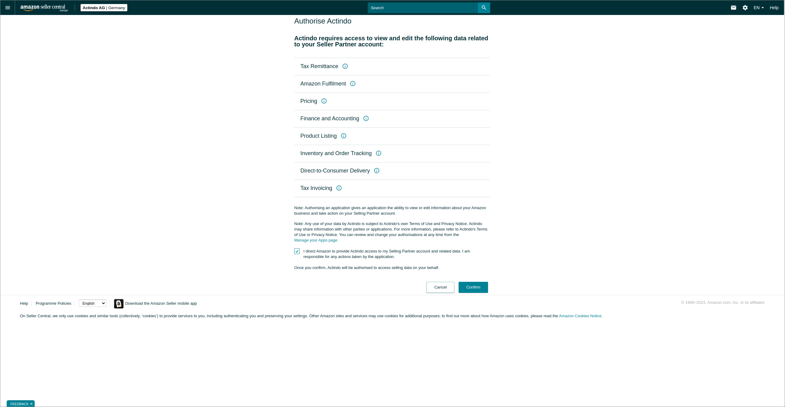
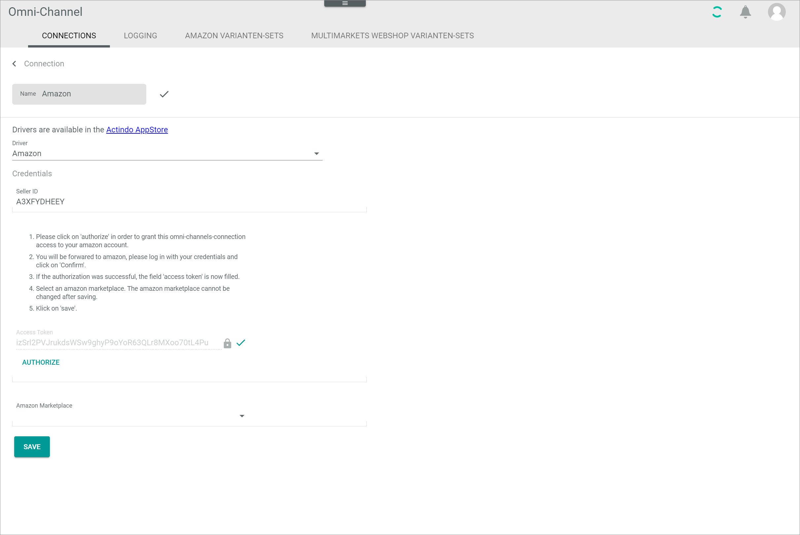
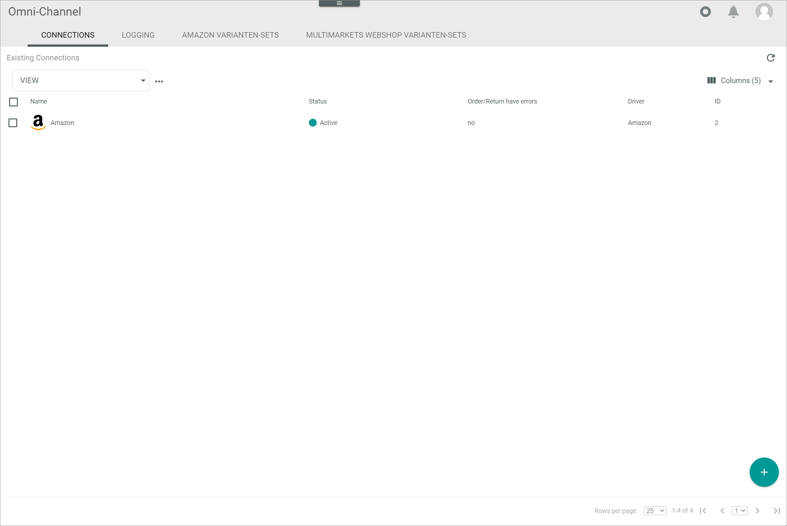

# Manage the Amazon connection

To establish a connection to an Amazon shop, there are several particularities to consider. Therefore, the creation and the configuration of the Amazon connection are described in detail below.

## Create a Amazon connection

Create the connection to an Amazon shop using the Amazon driver. Further settings can only be configured after the connection has been established.

#### Prerequisites

- An Amazon seller account has been created.
- The *Omni-Channel Amazon Integration* plugin has been installed. 
- The OAuth authorization URI has been constructed, see [Construct an OAuth authorization URI](https://developer-docs.amazon.com/sp-api/docs/authorizing-selling-partner-api-applications).

> [Info] For the *Omni-Channel* module version 4.1.0 or higher, the *Omni-Channel Amazon Integration* plugin is required in at least version 1.5.0. 

[comment]: <> (Omni-Channel Amazon Integration - aktuell nur mit Omni-Channel Version 2.6.13? In der Zukunft auch mit 4. Version möglich? Check versions!) 

[comment]: <> (The OAuth authorization URI redirects a browser to an Amazon consent page, where you or a selling partner can give your application consent to make calls to the Selling Partner API.)

#### Procedure

*Omni-Channel > Settings > Tab CONNECTIONS*

1. Click the [Add](../../Assets/Icons/Plus01.png "[Add]") (Add) button in the bottom right corner.    
  The *Create connection* view is displayed.

    

2. Enter a name for the connection in the *Name* field.

3. Click the *Driver* drop-down list and select *Omni-Channel Amazon Integration* driver.  
  The *Credentials* section is displayed below the drop-down list.  

    

4. To find your Seller ID, log in to your seller account in the Amazon Seller Central.

    

5. Click *Settings* on the upper right corner and select the *Account Info* menu entry.  
    The *Seller Account Information* window is displayed.

    

6. Click *Your Merchan Token* in the *Business Information* section.  
    The *Merchant Token* window is displayed.

    

7. Copy the *Merchant Token* to your clipboard, then switch back to the *Core1 Actindo Platform* and paste it in the *Seller ID* field in the *Credentials* section.

8. Click [AUTHORIZE].  
    You are automatically redirected to the *Authorize Actindo* window in the Amazon Seller Central.

    

9. Select the checkbox with the notice *I request Amazon to grant Actindo access to my seller account and the corresponding data. I am responsible for all measures that may be taken by this application* and click [Confirm].  

    A new window with the notice *We authorize Actindo to access your seller details* is displayed. You are redirected back to the *Actindo Core1 Platform*. The *Access Token* field has been automatically filled in.

    

[comment]: <> (Selber übersetzt. Nicht sicher, was eigentlich steht. Fraglich, ob man alle Screenshots bekommen kann. Prüfen und ggf. rauslassen)

10. Click the *Amazon Marketplace* drop-down list and select the applicable marketplace.
    > [Info] Once it has been saved, the selected marketplace cannot be edited anymore.

11. Click [SAVE].  
    A new window with the notice *Checking credentials* is displayed. The credentials are checked, the connection established and the synchrozation is triggered. The *Synchronization triggered* is displayed. 

    

    The *CONNECTIONS* tab in the *Settings* menu entry of the *Omni-Channel* module is displayed when the connection has been established. The *Amazon* connection is displayed in the list of connections.

    

[comment]: <> (Letzter Satz von Shopify genommen. Evtl. mit Result oben -11- integrieren. Alle Dateien vereinheitlichen, wenn möglich.)

12. If necessary, continue to [Configure the Amazon connection](#configure-the-amazon-connection).

## Configure the Amazon connection   

After the connection to an Amazon shop has been established, further settings can be configured for the connection.

#### Prerequisites

An Amazon connection has been established.

#### Procedure

*Omni-Channel > Settings > Tab CONNECTIONS*

1. Click the Amazon connection in the list of connections.   
  The *Edit connection* view is displayed. By default, the *Credentials* tab is displayed.

  

2. Click the *Settings* tab.   
  The *Settings* tab is displayed. By default, the *Default language* setting is displayed. Shopware 6 default language is displayed in the right side bar.

- Angebote
Von Default übernehmen toggle nicht ändern, denn für FBA Angebote 