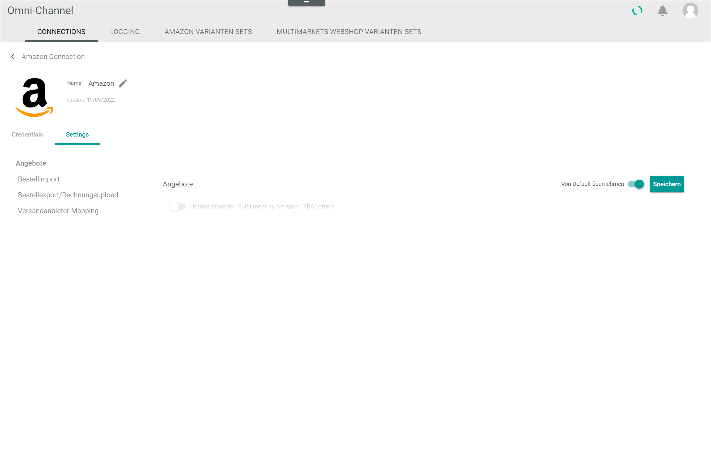
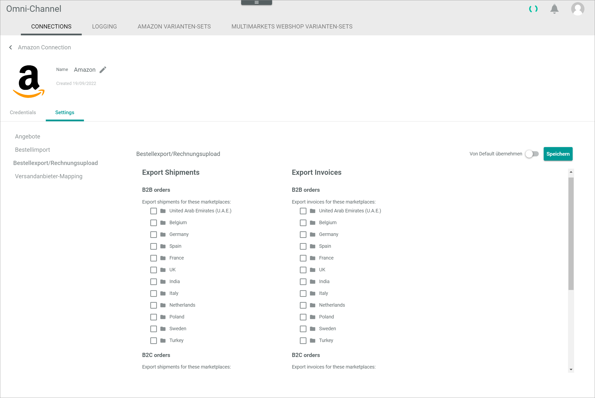

# Manage the Amazon connection

To establish a connection to an Amazon shop, there are several particularities to consider. Therefore, the creation and the configuration of the Amazon connection are described in detail below.

## Configuration of the Amazon Seller Account

Before a connection between Amazon and the *Actindo Core1 Platform* can be established, the following adjustments must be made in the Amazon Seller Central for the connection to work correctly:

- All columns of the order reports must be activated  
- A standard ship-from address must be set

Follow the instructions below to configure your Amazon Seller Account.

[commment]: <> (Andere pre-settings? RS Johannes. S. https://actindo.atlassian.net/wiki/spaces/DEVELOPMEN/pages/21561363/Amazon)

#### Prerequisites  

An Amazon Seller Account has been created.

#### Procedure

1. In a browser window, go to the *Amazon Seller Central* platform and log in to your account.

2. In your Seller profile, go to *Orders > Order reports > Add or remove order report columns*.

  

3. Add all columns to the order reports. Otherwise, the shipping costs may not be imported.

4. Click the [Save changes] button.

5. Now go to *Settings > Shipping Settings > General Shipping Settings*.

  

6. Click the [Edit] icon next to the *Ship from location*.

7. Enter the default ship-from address.

8. Click the [Save] button.

[comment]: <> (RS Johannes - Procedure und Screenshots? S. auch https://internal-jira.actindo.com/browse/ACDP-150)

## Create an Amazon connection

Create the connection to an Amazon shop using the Amazon driver. Further settings can only be configured after the connection has been established.

#### Prerequisites

- The Amazon seller account has been configured, see [Configuration of the Amazon Seller Account](#configuration-of-the-amazon-seller-account).
- The *Omni-Channel Amazon Integration* plugin has been installed. 
- The OAuth authorization URI has been constructed, see [Construct an OAuth authorization URI](https://developer-docs.amazon.com/sp-api/docs/authorizing-selling-partner-api-applications).

> [Info] For the *Omni-Channel* module version 4.1.0 or higher, the *Omni-Channel Amazon Integration* plugin is required in at least version 1.4.22. 

[comment]: <> (Omni-Channel Amazon Integration - aktuell nur mit Omni-Channel Version 2.6.13? In der Zukunft auch mit 4. Version möglich? Check versions!) 

[comment]: <> (The OAuth authorization URI redirects a browser to an Amazon consent page, where you or a selling partner can give your application consent to make calls to the Selling Partner API.)

[comment]: <> (Prerequisites? -> Versandanbieter erstellen & mappen, Rechnungsupload aktivieren, Amazon Payments Verbindung einrichten, Konto in der Zahlungsabwicklung einrichten,  Für den Angebotsupload muss in den Omni-Channel Angeboten das Feld "Herkunftsland" gesetzt sein. Leider wird diese Information beim Import von Angeboten nicht übermittelt. -> Quelle: https://internal-jira.actindo.com/browse/ACDP-150)

#### Procedure

*Omni-Channel > Settings > Tab CONNECTIONS*

1. Click the  (Add) button in the bottom right corner.    
  The *Create connection* view is displayed.

    

2. Enter a name for the connection in the *Name* field.

3. Click the *Driver* drop-down list and select the *Amazon* driver.  
  The *Credentials* section is displayed below the drop-down list.  

    

4. To find your Seller ID, log in to your seller account in the Amazon Seller Central.

    

5. Click *Settings* on the upper right corner and select the *Account Info* menu entry.  
    The *Seller Account Information* window is displayed.

    

6. Click *Your Merchant Token* in the *Business Information* section.  
    The *Merchant Token* window is displayed.

    

7. Copy the *Merchant Token* to your clipboard, then switch back to the *Actindo Core1 Platform* and paste it in the *Seller ID* field in the *Credentials* section.

8. Click [AUTHORIZE].  
    You are automatically redirected to the *Authorize Actindo* window in the Amazon Seller Central.

    

9. Select the checkbox with the notice *I request Amazon to grant Actindo access to my seller account and the corresponding data. I am responsible for all measures that may be taken by this application.*, and click  the [Confirm] button.  

    A new window with the notice *We authorize Actindo to access your seller details.* is displayed. You are redirected back to the *Actindo Core1 Platform*. The *Access token* field has been automatically filled in.

    

[comment]: <> (Selber übersetzt. Nicht sicher, was eigentlich steht. Nach Screenshots fragen, wenn möglich.)

10. Click the *Amazon marketplace* drop-down list and select the applicable marketplace.
    > [Info] Once it has been saved, the selected marketplace cannot be edited anymore.

11. Click the [SAVE] button.  
    The *Checking credentials* notice is displayed. The connection is established and the synchronization is triggered. The *Sync triggered* pop-up window is displayed. 

    

    The *CONNECTIONS* tab in the *Settings* menu entry of the *Omni-Channel* module is displayed when the connection has been established. The *Amazon* connection is displayed in the list of connections.

    

[comment]: <> (Letzter Satz von Shopify genommen. Evtl. mit Result oben -11- integrieren?)

12. If necessary, continue to [Configure the Amazon connection](#configure-the-amazon-connection).

## Configure the Amazon connection   

After the connection to an Amazon shop has been established, further settings can be configured for the connection.

#### Prerequisites

An Amazon connection has been established, see [Create an Amazon connection](#create-an-amazon-connection).

#### Procedure

*Omni-Channel > Settings > Tab CONNECTIONS*

1. Click the Amazon connection in the list of connections.   
  The *Edit connection* view is displayed. By default, the *Credentials* tab is displayed.

    

2. Click the *Settings* tab.   
  The *Settings* tab is displayed. By default, the *Offers* setting is displayed. In the right side bar, the *Apply from default* toggle is preselected and the *Update stock for 'Fulfillment by Amazon (FBA)' offers* is locked.  

    > [Info] It is recommended to leave this settings unchanged, since Amazon manages stock for FBA offers.

    

3. Click the *Order import* menu entry in the left side bar.    
  The *Order import* setting is displayed in the right side bar.    

    

4. Configure the following settings to filter the orders to be imported:

  - In the *'Merchant Fulfilled Network' (MFN) orders* section: 
    - Enable or disable the *Import 'Merchant Fulfilled Network' (MFN) orders* and *Import 'Prime by Merchant' orders* toggles to determine the MFN orders to be imported.  

    - If desired, enter a date in the *Import MFN orders from* field to import orders from the entered date onwards. The valid date format is DD.MM.YYYY. 

  - In the *'Fulfillment by Amazon' (AFN) orders* section:  
    - Enable or disable the *Import 'Fulfillment by Amazon' (AFN) orders* toggle to import the AFN, also called FBA, orders. 
  
    - Enable or disable the *Mark 'Fulfillment by Amazon' orders as shipped during import and disable warehousing* to determine the further processing of AFN orders.  
  
    - Enable or disabled as necessary the *Is the VAT calculation services (VCS) enabled?* toggle. This feature is needed to determine whether the prices in the FBA reports are gross (VCS disabled) or net (VCS enabled).  

    > [Info] When importing AFN orders, it is highly recommended to enable the VCS to makes sure that the gross/net prices are imported correctly from Amazon reports.

    - If desired, enter a date in the *Import AFN/FBA orders from* field to import orders from the entered date onwards. The valid date format is DD.MM.YYYY. 

  - In the *Addresses* section:
    - Click the *Packstation address split* drop-down list and select the appropriate option. The following options are available:  
      - **Customer number in address line**
      - **Customer number in company** 

5. Click the *Order export/invoice upload* menu entry in the left side bar.    
  The *Order export/invoice upload* setting is displayed in the right side bar.    

    

6. If necessary, disable the *Apply from default* toggle to unlock the checkboxes.

7. Once unlocked, select the checkboxes corresponding to the relevant marketplaces.

8. Click the *Shipping provider mapping* menu entry in the left side bar.    
  The *Shipping provider mapping* setting is displayed in the right side bar. All shipping methods offered by Amazon are displayed in the AmazonShipOption section. Each available shipping method must be assigned to a shipping provider in the *Assigned shipping provider* section.  

    

9.  If necessary, click the corresponding drop-down list in the *Assigned shipping provider* section and select the applicable shipping provider. If no shipping provider is selected, the default shipping provider applies.

  > [Info] The shipping provider can be set up in the *Order management* module.

[comment]: <> (Wo, wie? Link oder Pfad dahin?)

[comment]: <> (Hinzufügen? -> The shipping-provider mapping needs the connection to be synced afterwards! -> Sync passiert automatisch nach dem Speichern oder muss man extra über editing toolbar > Sync button gehen? Auch: The status of the VAT calculation service can be checked/changed -> in Seller Central. Ist das hier überhaupt relevant? Vielleicht in Fakturierung? Quelle: https://actindo.atlassian.net/wiki/spaces/DEVELOPMEN/pages/21561363/Amazon)

10. Click the [SAVE] button.  
    All changes have been saved. The *Saving successful* pop-up window is displayed.

    

    > [Info] After saving, it is necessary to synchronize the connection to update the corresponding ETL mapping.

[comment]: <> (Saving successful aus Shopify Datei. Check, ob Saving successful pop-up auch bei Amazon vorkommt)

11. Synchronize the connection to update the ETL mapping, see [Synchronize a connection](../Integration/01_ManageConnections.md#synchronize-a-connection)    
  The *Sync triggered* pop-up window is displayed.

    

[comment]: <> (Wie macht man Sync? Nicht deutlich in Wissenstranfer. Connection checkbox auswählen und SYNCHRONIZE button in editing tool? Verweis darauf oder Schritte hier?)

