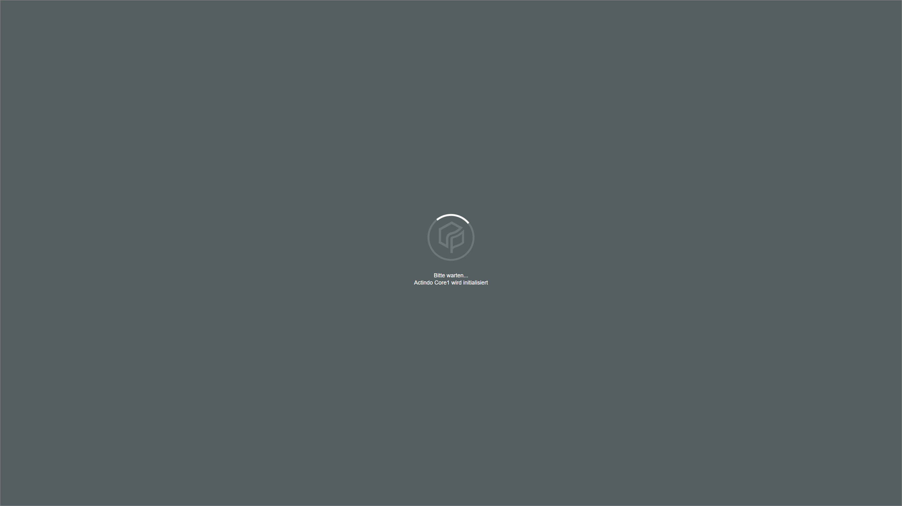

# Manage the Magento2 connection

To establish a connection to a Magento2 shop, there are several particularities to consider. Therefore, the creation and the configuration of the Magento2 connection are described in detail below.

## Create a Magento2 connection

Create the connection to a Magento2 shop using the Magento2 driver. Further settings can only be configured after the connection has been established.

#### Prerequisites

- A Magento2 account has been created.
- The *Magento2 Integration* plugin has been installed.

> [Info] For the *Omni-Channel* module version 4.1.0 or higher, the *Magento2 Integration* plugin is required in at least version X.0.0.

#### Procedure

*Omni-Channel > Settings > Tab CONNECTIONS*

1. Add button -> Create a connection... (S. 01_ManageConnections.md)

2. Click ActindoAppStore? -> Verweis auf Manage the drivers + Check weitere/andere Schritte

3. Click the *Driver* drop-down list and select the Magento2 driver.
    The *Credentials* section is displayed below the drop-down list.

4. Enter the required data in the *Credentials* sections. The following data must be entered:
    - *URL*
    - *Username*
    - *Password*

5. SAVE
    The connection will be established. The *Checking credentials...* notice is displayed.

     

The connection will be established and all necessary data will be synchronized. The *Core1 Platform* is being initialized.

> [Info] It may take several minutes until the connection has been established and the sync has been completed.

  

  The *CONNECTIONS* tab in the *Settings* menu entry of the *Omni-Channel* module is displayed when the connection has been established. The *Magento2* connection is displayed in the list of connections.

  

6. If necessary, continue to [Configure the Magento2 connection](#configure-the-magento2-connection).

## Configure the Magento2 connection   

After the connection to a Magento2 shop has been established, further settings can be configured for the connection.

#### Prerequisites

A Magento2 connection has been established, see [Create a Magento2 connection](#create-a-magento2-connection).

#### Procedure

*Omni-Channel > Settings > Tab CONNECTIONS*

1. Click the Magento2 connection in the list of connections.   
  The *Edit connection* view is displayed. By default, the *Credentials* tab is displayed.

  

2. Click the *Settings* tab.   
  The *Settings* tab is displayed. By default, the *Store view languages* setting is displayed. All store views configured in the webshop are displayed in the right side bar.

  

3. Click the desired *Store view* drop-down list and select the appropriate language. The available languages are displayed in the drop-down list.  

    > [Info] The selected language defines the language of the products to be uploaded in the corresponding store view. If further languages are needed, they must be added first in the *DataHub* module, see [Manage the languages] (DataHub/Integration/05_ManageLanguages.md).

[comment]: <> (Stimmt das so?)

4. Click the *Order states* menu entry in the left side bar.  
    The order states and status are displayed in the right side bar.  

    > [Info] Order states are used internally by Magento2 to identify the current phase of the order. These states are not customizable nor visible in the frontend. Order statuses, on the other hand, are used by the store administrator to set up a flow for the order, from the beginning of the purchase to the moment the order is invoiced and the products are delivered. These statuses are customizable by the store administrator in the Magento admin panel. 

5. Define the applicable settings to filter the orders to be imported in the *Filter orders to import* box. The following settings are available:   

    - Enable the applicable toggle to determine an order state. The following states are available:
        - *new*
        - *pending*
        - *pending_payment*
        - *payment_review*
        - *processing*
        - *holded*
        - *completed*
        - *closed*
        - *canceled*  

    - Enter the desired order number in the *Import only orders with a higher number that this*.  

    - Enter the applicable status to filter the orders to be imported in the *Status to filter for (leave empty if not required)*. If it is not required, this field can be left empty. By default, there are 13 statuses available:
        - *Suspect Fraud*
        - *Processing*
        - *Pending Payment*
        - *Payment Review*
        - *Pending*
        - *On Hold*
        - *Complete*
        - *Closed*
        - *Canceled*
        - *PayPal Canceled Reversal*
        - *Pending PayPal*
        - *PayPal Reversed*
        - *Refunded*

6. Define the desired order statuses or states to be set after a certain event has occurred in the *Update order state and status on certain events* box. The following settings are available:

    - Click the *Order state to set in shop after successful import* drop-down list and select the desired state. The following states are available:  
        - **new**
        - **pending**
        - **pending_payment**
        - **payment_review**
        - **processing**
        - **holded**
        - **completed**
        - **closed**
        - **canceled**  

    - Enter the desired order status to be set in the *Order status to set in shop after successful import* field.
    
    - Enter the desired order status to be set when an order has been partially shipped in the *Oder status to set in shop after partially shipped*.

    - Click the *Order state to set in shop after fully shipped* drop-down list and select the dsired state. The following states are available:  
        - **new**
        - **pending**
        - **pending_payment**
        - **payment_review**
        - **processing**
        - **holded**
        - **completed**
        - **closed**
        - **canceled**  

    - Enter the desired order status to be set when an order has been fully shipped in the *Order status to set in shop fully shipped*.

    - Enter the desired order status to be set when an order has been partially paid in the *Order status to set in shop after partially paid*.

    - Enter the desired order status to be set when an order has been fully paid in the *Order status to set in shop after fully paid*.

    - Enter the desired order status to be set when an tracking number has been set for the order in the*Order status to set in shop after Tracking Number set*.

7.  If necessary, define the applicable settings in the *Magento invoice handling* box. The following settings are available:
    - Enable the *Create an invoice in Magento for orders that are fully paid* toggle if desired. 
    
        > [Info] If enabled, invoice creation is triggered in Magento2 as soon as an order is fully paid. This function is particularly relevant for the correct processing of vouchers.  
    
        The *Notify customer about the invoice* toggle is unlocked.

    - Enable the *Notify customer about the invoice* toggle to notify customers when an invoiced is generated.
    

7.  Click the *Tax classes* menu entry in the left side bar.  
    The tax classes available in the *Actindo Core1 Platform* are displayed in the right side bar.

8. If necessary, configure the following settings:
    - Click the *Select Magento2 tax class for Core1 tax class* drop-down list and select the the applicable Magento tax class. All available tax classes are displayed in the list.
    - 

[comment]: <> (Gibt es Default tax classes bei Magento, z.B. die auf dem Video angezeigt oder abhängig von weiteren Einstellungen in Magento? Neue tax classes können bei Magento auch erstellt werden, also: All available tax classes are displayed in the list oder By default, the following options are available?)

8. *Image Handling*

9. *Image name*

## Configure the Magento2 ETL mapping

Basic ETL???
