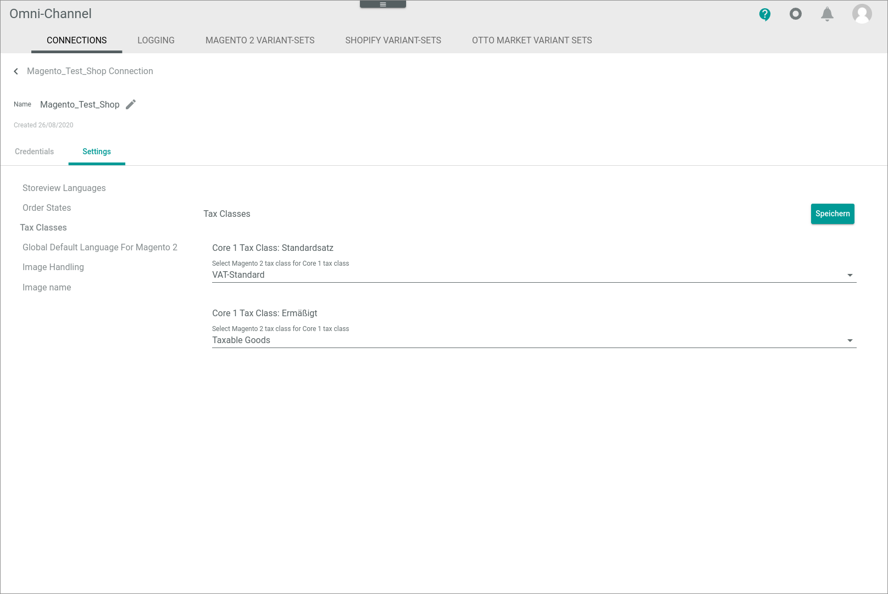

[!!Manage the connections](./01_ManageConnections.md)

# Manage the Magento 2 connection

To establish a connection to a Magento 2 shop, there are several particularities to consider. Therefore, the creation and the configuration of the Magento 2 connection are described in detail below.

## Create a Magento 2 connection

Create the connection to a Magento 2 shop using the Magento 2 driver. Further settings can only be configured after the connection has been established.

#### Prerequisites

- A Magento 2 account has been created.
- The integration to Actindo has been created and activated in Magento 2, go to *System > Integrations > Add New Integration*. 
- The *Magento 2* plugin has been installed in the *Actindo Core1 Platform*. 

> [Info] For the *Omni-Channel* module version 4.1.0 or higher, the *Magento 2* plugin is required in at least version 4.0.0.

[comment]: <> (Oli: Create integration in Magento 2 -> Stimmt das so? Klickpfad ausreichend?)

#### Procedure

*Omni-Channel > Settings > Tab CONNECTIONS*

1. Click the  (Add) button in the bottom right corner.    
    The *Create connection* view is displayed.

    

2. Enter a name for the connection in the *Name* field.

3. Click the *Driver* drop-down list and select the *Magento 2* driver.  
    The *Credentials* section is displayed below the drop-down list.

    

4. Enter the Magento 2 shop URL in the *URL* field.

5. Enter the username in the *Username* field.

6. Enter the password in the *Password* field.

    > [Info] The connection username and password equal the login details for the Magento 2 admin backend. The *Access token* field must be left blank. 

[comment]: <> (Mit jetziger Magento 2 Treiber Version muss man sich über Username und Password authentifizieren; access token Feld leer lassen; mit neuem Release, noch kein festes Datum: Access token eingeben, Username und Password leer lassen.)

7. Click the [SAVE] button.  
    The *Checking credentials* notice is displayed. The connection will be established and the synchronization is triggered. The *Sync triggered* pop-up window is displayed.  

    

    The *CONNECTIONS* tab in the *Settings* menu entry of the *Omni-Channel* module is displayed when the connection has been established. The *Magento 2* connection is displayed in the list of connections.

    	

8. If necessary, continue to configure the Magento 2 connection, see [Configure the Magento 2 connection](#configure-the-Magento-2-connection).

## Configure the Magento 2 connection   

After the connection to a Magento 2 shop has been established, further settings can be configured for the connection.

#### Prerequisites

A Magento 2 connection has been established.

#### Procedure

*Omni-Channel > Settings > Tab CONNECTIONS*

	

1. Click the Magento 2 connection in the list of connections.   
    The *Edit connection* view is displayed. By default, the *Credentials* tab is selected.

    

2. Click the *Settings* tab.   
    The *Settings* tab is displayed. By default, the *Store view languages* setting is selected.

    

3. Click the *Store view* drop-down list and select the language in which the products will be uploaded to the store. All available languages are displayed in the list.    
   
4. Click the *Order states* menu entry in the left side bar.  
    The order states settings are displayed on the right side.  

    

5. Configure the following settings to filter the orders to be imported in the *Filter orders to import* section:   
    
    + Enable the toggles of all states for which the orders are to be imported. All states configured in Magento 2 are available.

        > [Info] States are predefined in the system, while statuses can be defined by the user in the Magento 2 admin backend. To add or edit a status, go to *Stores > Order Status > Create New Status*. All states and statuses available in Magento 2 are retrieved via synchronization and displayed in the *Actindo Core1 Platform*.
   
    + If desired, enter an order number in the *Import only orders with a higher number than this* field. Only orders with a higher order number than the specified number will be imported.  
    
    + If desired, enter the status for which the orders are to be imported in the *Status to filter for (leave empty if not required)* field. All statuses configured in Magento 2 are available.

6. Configure the following settings to define the order states and/or statuses to be set after a certain event has occurred in the *Update order state and status on certain events* section:  

    + Click the *Order state to be set in shop after successful import* drop-down list and select the state to be set when an order has been successfully imported. All states configured in Magento 2 are available.

    + Enter the order status to be set when an order has been successfully imported in the *Order status to be set in shop after successful import* field.
    
    + Enter the order status to be set when an order has been partially shipped in the *Order status to be set in shop after partially shipped* field.

    + Click the *Order state to be set in shop after fully shipped* drop-down list and select the state to be set when an order has been fully shipped. All states configured in Magento 2 are available.  

    + Enter the order status to be set when an order has been fully shipped in the *Order status to be set in shop after fully shipped* field.

    + Enter the order status to be set when an order has been partially paid in the *Order status to be set in shop after partially paid* field.

    + Enter the order status to be set when an order has been fully paid in the *Order status to be set in shop after fully paid* field.

    + Enter the order status to be set when a tracking number has been set for the order in the *Order status to be set in shop after tracking number set* field.

7.  If necessary, configure the following settings in the *Magento invoice handling* section:

    + Enable the *Create an invoice in Magento for orders that are fully paid* toggle to create invoices in Magento 2 for fully paid orders and ensure the correct processing of vouchers.  
        
    + Enable the *Notify customer about the invoice* toggle to notify customers when an invoiced is generated. This toggle is only unlocked if the *Create an invoice in Magento for orders that are fully paid* toggle is enabled.
    
8. Click the *Tax classes* menu entry in the left side bar.  
    All tax classes available in the *Actindo Core1 Platform* are displayed on the right side.
  
    

9. Click the *Select Magento 2 tax class for Core1 tax class* drop-down list and select the applicable Magento tax class. All tax classes available in Magento 2 are displayed in the list. Repeat this step for all displayed tax classes.

10. Click the *Global default language for Magento 2* menu entry in the left side bar.  
    The *Select global default language for Magento backend* section is displayed on the right side.

    

11. Click the *Select Core1 language to be set as default* drop-down list and select the appropriate language. All languages available in the *Actindo Core1 Platform* are displayed. If necessary, a language can be added in the *DataHub* module, see [Create a language](../../DataHub/Integration/05_ManageLanguages.md#create-a-language). 

    > [Info] The global default language in Magento 2 is defined at root level and is used to import and globally maintain data that are untranslatable, for example a product name, and therefore not store view specific. In practice, the global default language is usually the website operator's standard language. The global default language can be changed in Magento 2.

12. Click the *Image handling* menu entry in the left side bar.  
    All available image attributes available in the Magento 2 gallery are displayed on the right side.

    

13. Enable all toggles of the image attributes whose images you want to be hidden in the Magento 2 gallery. 

14. Click the *Image name* menu entry in the left side bar.  
    The *Image name* settings are displayed are displayed on the right side.

    

15. Disable the *Apply from default* toggle to configure how the image names should be customized before uploading to the Magento 2 shop and to improve the SEO of your images. Otherwise, the default setting is applied, that is, a randomly generated image name will be uploaded to the Magento 2 shop.   
    The *Use ECM image name* toggle and the *Regular expression* field are unlocked.

    

[comment]: <> (Oli: Random Name oder wird der ECM Name herangezogen?)

16. If desired, disable the *Use ECM image name* toggle. By default, the toggle is enabled.  
    If disabled, the image names are generated randomly by upload. If enabled, the image names configured in the *ECM* module are uploaded.
  
    > [Info] The image names can be defined by the user when uploading image files in the *ECM* module. When defining image file names in the *ECM* module, note that file names that are longer than 89 characters cannot be uploaded to the Magento 2 shop.

17. If desired, define a regular expression to shorten and customize the image names configured in the *ECM* module.  
    Any sequence of characters entered that matches a regular expression will be removed from the image name when the image files are uploaded to the Magento 2 shop.  
    For detailed information about regular expressions, see https://regex101.com/. 

18. Click the [SAVE] button.  
    All changes have been saved. The *Saving successful* pop-up window is displayed.

    

