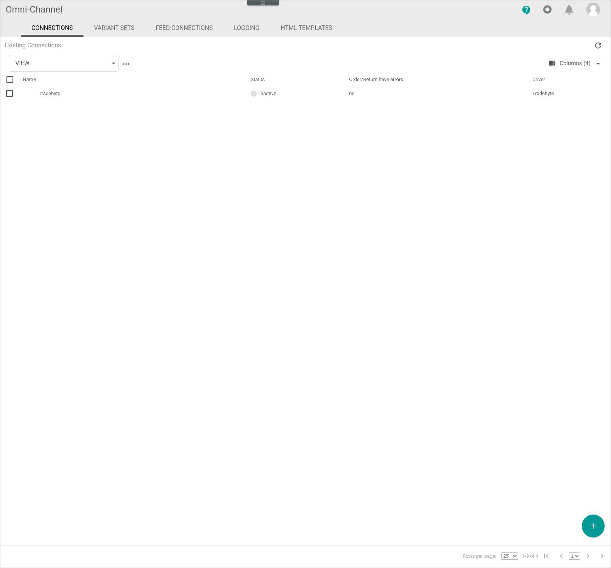

# Manage the Tradebyte connection

To establish a connection to a Tradebyte shop, there are several particularities to consider. Therefore, the configuration of the Tradebyte connection is described in detail below.

## Configure the Tradebyte connection   

After the connection to a Tradebyte shop has been established, further settings can be configured for the connection.

#### Prerequisites

- A Tradebyte account has been created.
- The *Tradebyte Integration* plugin has been installed.
- A Tradebyte connection has been established.

> [Info] For the *Omni-Channel* module version 4.1.0 or higher, the *Tradebyte Integration* plugin is required in at least version 1.0.0.

[comment]: <> (Stimmt das so? In Platform Manager Tradebyte 1.0.0 bis 1.2.0 verfügbar.)

#### Procedure

*Omni-Channel > Settings > Tab CONNECTIONS*

1. Click the Tradebyte connection in the list of connections.   
  The *Edit connection* view is displayed. By default, the *Credentials* tab is displayed.

  

2. Click the *Settings* tab.   
  The *Settings* tab is displayed. By default, the *Selected sales channels* setting is displayed. All sales channels available in Tradebyte are displayed in the right side bar. 

  

3. Select the checkbox of the sales channels you want to use.  

4. Click the *Enable languages* menu entry in the left side bar.  
    All languages available in Tradebyte are displayed in the right side bar. 

5. Enable the toggles of the languages you want to use.

    > [Info] The default language is automatically set and cannot be edited.

6. Click the [Save] button.  
    All changes have been saved. The *Saving successful* pop-up window is displayed

    

[comment]: <> (Evtl. noch Header Configure the Magento2 ETL mapping hinzufügen mit der Erklärung Tradebyte driver uses the standard ETL mapping. Therefore, there are no further specific settings/aspects to be considered... oder sowas. Gleiches gilt für Magento.)