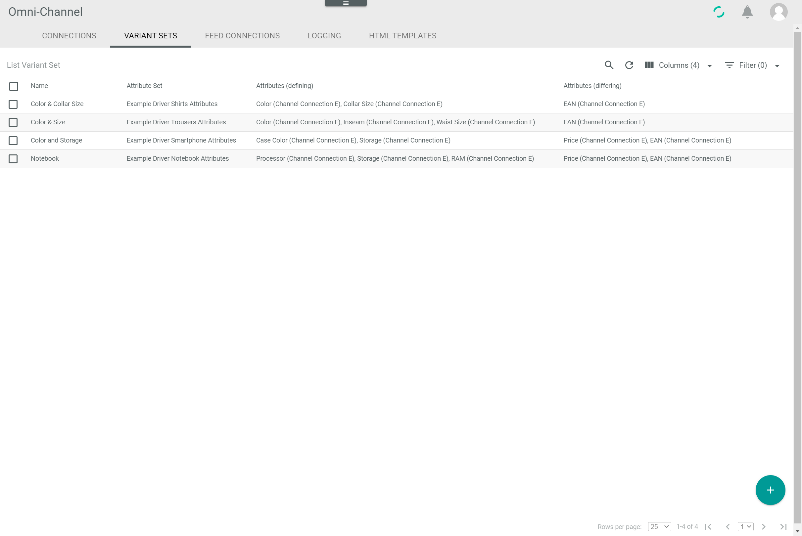
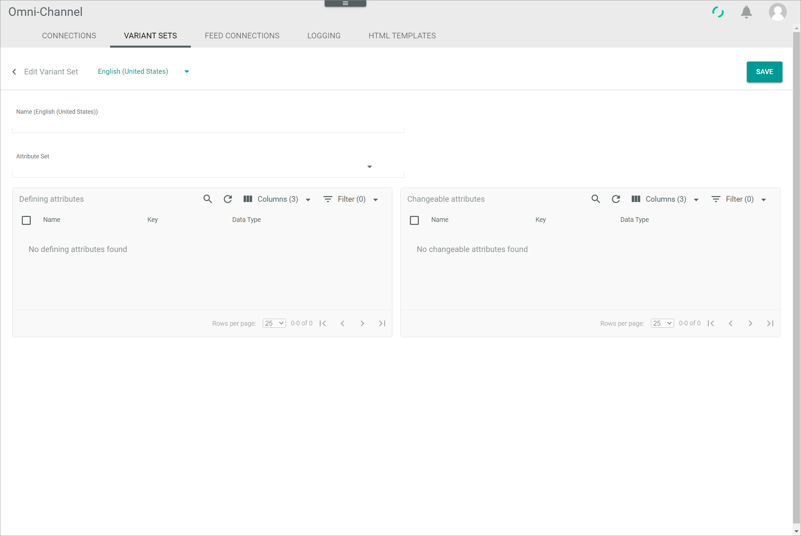
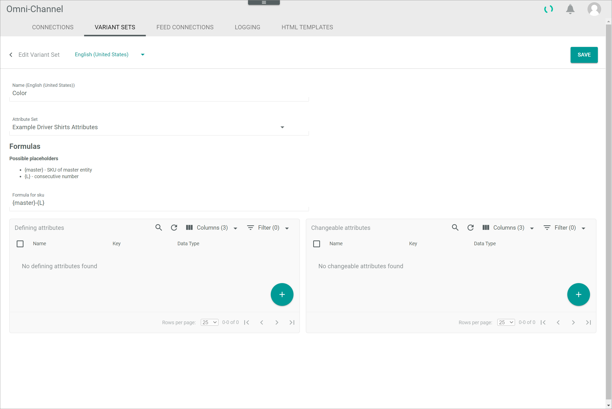
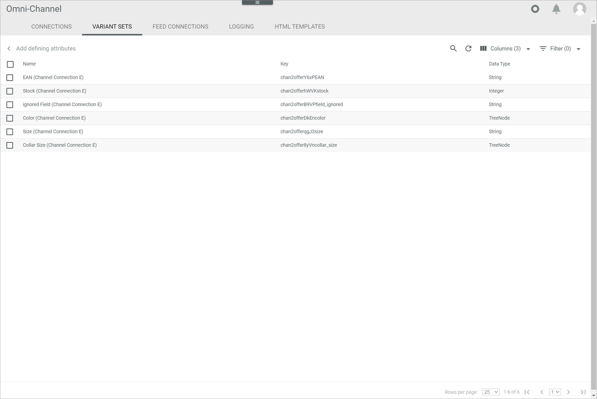
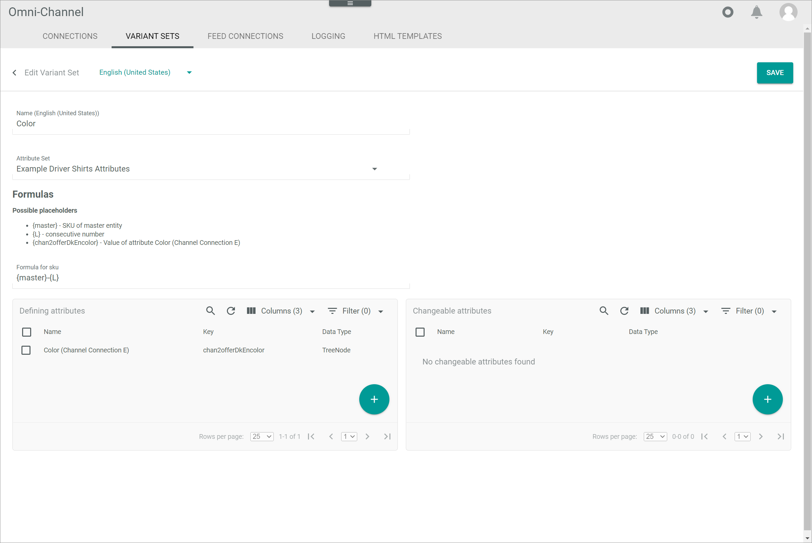
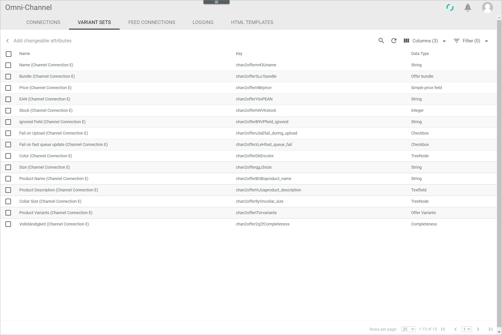
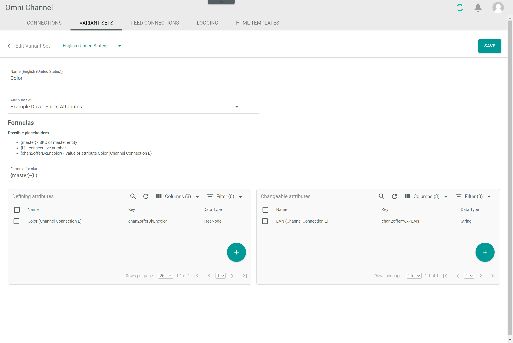

[!!User interface Variant sets](../UserInterface/to_be_completed)
[!!Manage the variant sets in PIM](../../PIM/Integration/07_ManageVariantSets.md)

# Manage a variant set

The variant sets in *Omni-Channel* are based on the same data model as in the Actindo *PIM* module. However, since the *Omni-Channel* and the Actindo *PIM* module are independent modules and *Omni-Channel* can also be used without the Actindo *PIM* module, the variant sets for products can also be managed within the *Omni-Channel* module.    
If both the *Omni-Channel* and the Actindo *PIM* modules are used, there is a predefined mapping that automatically applies the variant sets from *PIM* to *Omni-Channel*. In this case, you do not have to manage the variant sets in *Omni-Channel*, but in the Actindo *PIM* module, see [Manage the variant sets in PIM](../../PIM/Integration/07_ManageVariantSets.md).

## Create a variant set

Create a variant set to be able to create variants to products. A variant set is always assigned to a certain attribute set. When a variant set is created to an attribute set, you can create variants to all products with this attribute set. You must assign at least one defining attribute to a variant set. Moreover, you can assign further defining and changeable attributes.   

### Define the variant set basic data

Define the basic inputs, such as name and attribute set, for the variant set.

#### Prerequisites

An attribute set has been created in DataHub, see [Create an attribute set](../../DataHub/Integration/02_ManageAttributeSets.md#create-an-attribute-set).

#### Procedure

*Omni-Channel > Settings > Tab VARIANT SETS*

1. Click the  (Add) button in the bottom right corner.   
  The *Create variant set* view is displayed.

  

2. Enter a name for the variant set in the *Name* field.

3. Select an attribute set in the *Attribute Set* drop-down list. All active attribute sets are displayed in the list.    
  The *Formulas* section with the *Formula for SKU* field is displayed.

  > [Info] You need to specify defining and changeable attributes for the variant set at a later step. Be aware that only those attributes assigned to the selected attribute set will be available.

  

4. Enter a formula for the variants SKU in the *Formula for SKU* field using the displayed placeholders. By default, you can enter the formula **{master}-{L}**.   

  > [Info] The value of the defining attributes can be included into the SKU formula. When you have added a defining attribute, the corresponding placeholder for this attribute is displayed in the *Formulas* section.

5. For the next steps to create a variant set, follow the procedures below:   
  - [Add defining attributes](#add-defining-attributes)
  - [Add changeable attributes](#add-changeable-attributes)

  > [Info] At least one defining attribute is required to create a variant set. Changeable attributes can be selected optionally.

### Add defining attributes

You have to select at least one defining attribute to create a variant set. You can only select attributes as defining attributes, that are neither multi-language nor multi-channel and assigned to the selected attribute set.

#### Prerequisites

- An attribute set has been created in DataHub, see [Create an attribute set](../../DataHub/Integration/02_ManageAttributeSets.md#create-an-attribute-set).
- The basic data of the variant set has been completed, see [Define the variant set basic data](#Define-the-variant-set-basic-data).

#### Procedure

*Omni-Channel > Settings > Tab VARIANT SETS > Button Add*

1. In the *Defining attributes* box click the  button. This button is only displayed when an attribute set is selected.       
  The *Add defining attributes* view is displayed.

  

2. Select the checkboxes of the attributes you want to be a defining attribute for the selected variant.   
  The editing toolbar is displayed above the attribute list.

  > [Info] The defining attributes are those attributes that characterize the variant, so those attributes that are defining the variants of the master product.

3. Click the [ADD AND GO BACK] button.     
    The *Add defining attributes* view is closed. The selected attributes are displayed in the *Defining attributes* box. A placeholder for the added attribute is displayed in the *Formulas* section.   

    

    > [Info] You can edit the formula in the *Formula for SKU* field and include the defining attribute placeholder.

4. If desired, add changeable attributes to the variant set, see [Add changeable attributes](#add-changeable-attributes). Otherwise, click the [SAVE] button in the upper right corner.   
  The *Create variant set* view is closed. The new variant set has been saved and is displayed in the list of variant sets.

### Add changeable attributes

You can select changeable attributes for a variant set. If you want to define an attribute for the variants which value may differ from its master product value, you have to define this attribute as a changeable attribute.

#### Prerequisites

- An attribute set has been created in DataHub, see [Create an attribute set](../../DataHub/Integration/02_ManageAttributeSets.md#create-an-attribute-set).
- The basic data of the variant set has been completed, see [Define the variant set basic data](#Define-the-variant-set-basic-data).

#### Procedure

*Omni-Channel > Settings > Tab VARIANT SETS > Button Add*

1. In the *Changeable Attributes* box click the  button. This button is only displayed when an attribute set is selected.         
  The *Add changeable attributes* view is displayed.

  

2. Select the checkboxes of the attributes you want to be a changeable attribute for the selected variant.   
  The editing toolbar is displayed above the attribute list.

  > [Info] Generally, a variant inherits all attribute values from its master product. These attribute values are locked in the variant and can only be edited in the master product. Attribute values that differ from the master product and must be maintained individually in the variant itself must be added to the list of changeable attributes.

3. Click the [ADD AND GO BACK] button.   
  The *Add changeable attributes* view is closed. The selected attributes are displayed in the *Changeable Attributes* box.

  

4. Click the [SAVE] button in the upper right corner.   
  The *Create variant set* view is closed. The new variant set has been saved and is displayed in the list of variant sets.

## Edit a variant set

After you have created a variant set, you can edit it. However, only some fields are editable. The assigned attribute set cannot be subsequently modified.

#### Prerequisites

At least one variant set has been created, see [Create a variant set](#create-a-variant-set).

#### Procedure

*Omni-Channel > Settings > Tab VARIANT SETS*

1. Click the variant set you want to edit in the list of variant sets.   
  The *Edit variant set* view is displayed.

  

2. Edit the desired data of the variant set in the corresponding fields.

3. Click the [SAVE] button in the upper right corner.   
  The changes have been saved. The *Edit variant set* view is closed.

[comment]: <> (I have to refresh the list to apply the changes - is that a bug?)

## Remove an attribute from the variant set

You can remove defining and changeable attributes from the variant set. Note, that at least one defining attribute is assigned. If one or more changeable attributes has been assigned to the variant set, also at least one changeable attribute must be assigned.

[comment]: <> (is that a bug?)

#### Prerequisites

A variant set has been created, see [Create a variant set](#create-a-variant-set).

#### Procedure

*Omni-Channel > Settings > Tab VARIANT SETS*

1. Click the variant set you want to edit in the list of variant sets.   
  The *Edit variant set* view is displayed.

  

2. In the *Defining attributes* box or *Changeable attributes* box, select the checkboxes of the attributes you want to remove.     
  The [DELETE] button is displayed in the editing toolbar above the attribute list.

3. Click the [DELETE] button in the editing toolbar.   
  The attribute is removed from the list.

4. Click the [SAVE] button in the upper right corner.   
  The changes have been saved. The *Edit variant set* view is closed.

  [comment]: <> (I have to refresh the list to apply the changes - is that a bug?)
