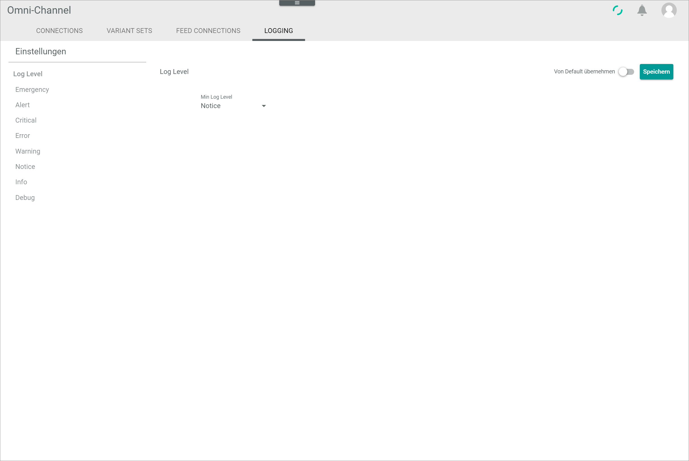
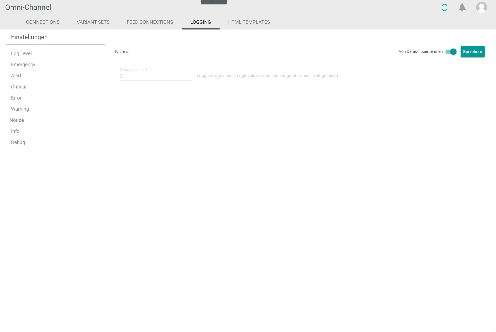
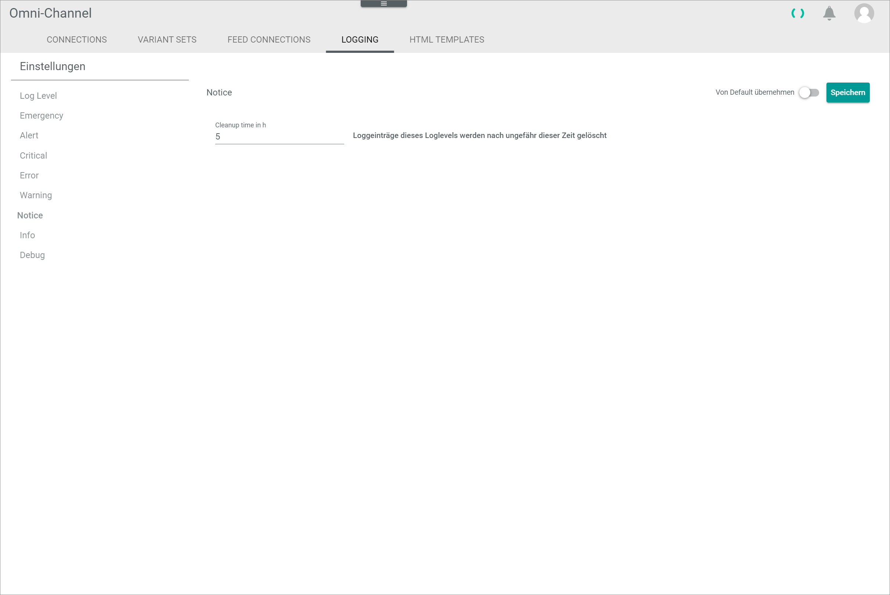

[!!User interface Logging](../UserInterface/07c_Logging.md)

# Configure the logging settings

Configure in the logging settings the log levels for the messages to be stored and their retention time.

## Define the minimum log level

Define the minimum log level for the messages to be stored.
Messages with the log levels *Emergency*, *Alert*, *Critical*, *Error* and *Warning* are always stored.

#### Prerequisites

No prerequisites to fulfill.

#### Procedure

*Omni-Channel > Settings > Tab LOGGING*

> [Info] By default, the *Log level* menu entry in the left *Settings* side menu is preselected if you click the *LOGGING* tab for the first time in your current session.

1. If necessary, click the *Log level* menu entry in the left *Settings* side menu.   
    The *Log level* view is displayed on the right side.

2. Disable the *Apply from default* toggle in the upper right corner.   
    The *Min log level* drop-down list is unlocked.

3. Click the *Min log level* drop-down list and select the desired option. The following log levels are available (in descending order):
    - **Warning**
    - **Notice**
    - **Info**
    - **Debug**

    > [Info] All messages with the selected or a higher log level will be stored. The retention time for the individual log levels has to be defined separately, see [Define the retention time](#define-the-retention-time).

    

4. Click the [Save] button in the upper right corner.   
    The changes are saved. The *Saving successful* pop-up window is displayed.

    

## Define the retention time

By default, all logs are automatically deleted after one day. You can edit the log lifetime and define a custom retention time.

#### Prerequisites

No prerequisites to fulfill.

#### Procedure

*Omni-Channel > Settings > Tab LOGGING*

1. Click the log level of the message whose retention time you want to edit in the left *Settings* side menu. The following logs levels are available:
    - *Emergency*
    - *Alert*
    - *Critical*
    - *Error*
    - *Warning*
    - *Notice*
    - *Info*
    - *Debug*

    The retention time of the selected log level is displayed on the right side.

    

    > [Info] The procedure to change the log retention time is identical for all log levels.

2. Disable the *Apply from default* toggle in the upper right corner.   
    The field to define the log retention time until cleanup is unlocked.

    

3. Enter the desired retention time in the *Cleanup time in h* field.

4. Click the [Save] button in the upper right corner.   
    The changes are saved. The *Saving successful* pop-up window is displayed.

    
