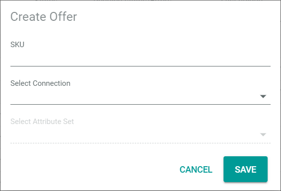

[!!User Interface Offers](../UserInterface/to_be_completed)   
[!!Manage the products](../../PIM/Operation/01_ManageProducts.md)

# Manage the offers

## Create an offer

If the Actindo *PIM* module is used, offers can be created directly from the *PIM* products.

### Create an offer from a PIM product

#### Prerequisites

- The Actindo *PIM* module is installed.
- At least one *PIM* product has been created, see [Create a product](../../PIM/Operation/01_ManageProducts.md#create-a-product).

#### Procedure

*Omni-Channel > Offers > Tab OFFERS*

1. Click the  (Add) button in the bottom right corner.   
  The [Manual offer  ] button and the [Create from PIM product  ] button are displayed.

  

2. Click the [Create from PIM product  ] button.   
  The *Select marketplace* wizard window is displayed.

   

3. Configure the following settings:

  + Select the appropriate the radio buttons:   
     *All products*:  Offers for all existing PIM products are created.   
     *Select products*: Select manually the products you want to create an offer for.     

  + Click the *Connection* drop-down list and select the connection for which you want to create the offer. All available connections are displayed in the list.   
  The [CONTINUE] button is unlocked.

  + Enable the *Do not create duplicates* toggle to automatically exclude existing offers from the creation process.  

    > [Info] Be aware that, if you deactivate the *Do not create duplicates* toggle, existing offers are created again, an automatically generated SKU is assigned to them and they exist in addition to the original offers.

4. Click the button [CONTINUE] in the bottom right corner.    
  If you have selected the *All products* radio button, continue with step **8** .   
  If you have selected the *Select products* radio button, the *Select products* wizard window is displayed.

   

5. Select the checkboxes of all products to which you want to create an offer for.   
  A toolbar is displayed above the product list.

6. Click the [ADD TO SELECTION >] button in the toolbar.   
  The selected products are added to the right side bar of the wizard window. The [CONTINUE] button is unlocked.

7. Click the [CONTINUE] button in the upper right corner.   
  The *Review and finalize* wizard window is displayed.

   

8. Configure the following settings:

+ Select the appropriate option for change tracking in the *ETL mode* section:   
  *manual*: Changes in a PIM product must be triggered manually to be applied to the offer. The initial offer is automatically applied.   
  *semi-automatic*: Changes in a PIM product are automatically applied to the offer after confirmation in the *Omni-Channel* module. The initial offer is automatically applied without confirmation.   
  *semi-automatic, changes must be confirmed by another user*: Changes in a PIM product are automatically applied to the offer after confirmation in the *Omni-Channel* module by another user. The initial offer is only applied after confirmation by another user.    
  *automatic*: Changes in a PIM product are automatically applied to the offer. The initial offer is also automatically applied.

+ Select the appropriate initial status for the offer in the *Initial offer status* section:   
   *Active*: The offer is active. It is uploaded to the marketplace and activated directly. Thus, it is also displayed on the marketplace, where it can be sold immediately.   
   *Inactive*: The offer is inactive. It is uploaded to the marketplace, but still remains inactive. Thus, it is not displayed on the marketplace and cannot yet be sold.   
   *Offline*: The offer is created in *Omni-Channel*, but not yet uploaded to the marketplace. Thus, it is unknown to the marketplace and cannot be sold there.

9. Click the [CREATE OFFERS] button.   
   The offer creation has been triggered. The *Product import from PIM scheduled* pop-up window is displayed. As the creation process starts asynchronously, it may take some time until the offer creation starts.

   

   > [Info] It may take some time until all offers have been created. Click the  (Refresh) button in the upper right corner to update the list of offers.   
   Switch to *Offer Import > Tab PIM->CHANNELS* to check the queue for all scheduled offer imports from *PIM*.

### Create a manual offer

#### Prerequisites

At least one connection has been created, see [Create a connection](../Integration/01_ManageConnections#create-a-connection).

#### Procedure

*Omni-Channel > Offers > Tab OFFERS*

1. Click the  (Add) button in the bottom right corner.   
  The [Manual offer  ] button and the [Create from PIM product  ] button are displayed.

  

2. Click the [Manual offer  ] button.   
   The *Create offer* window is displayed.

   

3. Enter the desired SKU in the *SKU* field.

  > [Info] The SKU (Stock Keeping Unit) is an identification number for the offer. Therefore, it has to be uniquely assigned to a single offer and should not be changed once assigned.

4. Click the *Select connection* drop-down list and select the connection for which you want to create the offer. All available connections are displayed in the list.   
  The *Select attribute set* drop-down list is unlocked.

5. Click the *Select attribute set* drop-down list and select the appropriate attribute set for the offer. All available attribute sets for the selected connection are displayed.

6. Click the [SAVE] button.   
  The *Create offer* view is displayed. The *Attributes* tab is preselected.

   

   > [Info] The fields displayed in the *Attributes* tab differ depending on the selected connection.

7. Enter the product data in the fields of the *Attributes* tab. You must at least enter a product name, an EAN code, a price, a tax class and a tax rate.

8. Click the [SAVE] button in the upper right corner.   
  The offer has been created. The *Create offer* view is closed. The list of offers is displayed again.

  > [Info] By default, the initial offer status of the new offer is **Not available**. You have to activate the offer to sell it on a marketplace, see [Change the offer status](#change-the-offer-status).

## Edit an offer

## Change the offer status

## Delete an offer

### Move an offer to the recycle bin

### Finally delete an offer

## Restore an offer
