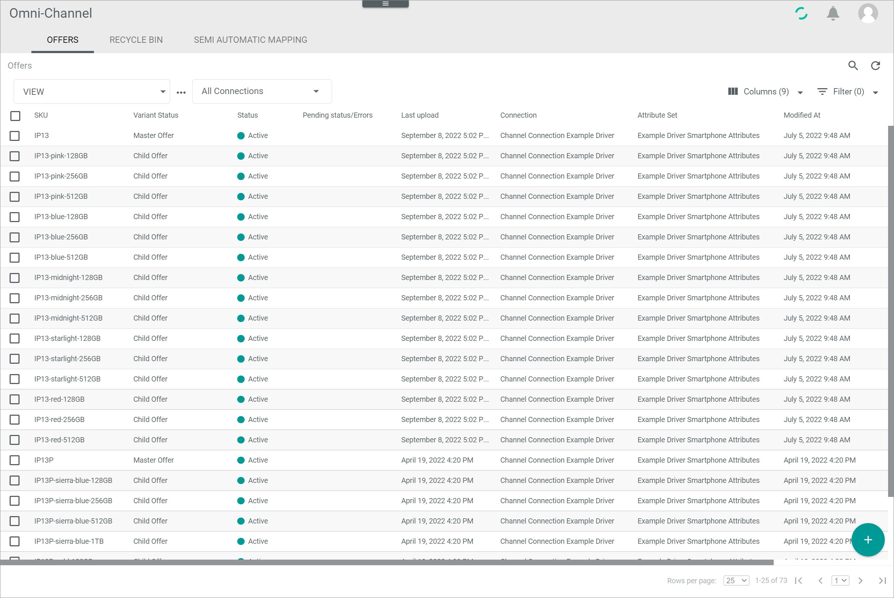

[!!User interface Offers](../UserInterface/02_Offers.md)
[!!User interface Semi automatic mapping](../UserInterface/02c_SemiAutomaticMapping.md)
[!!Check the offer upload](./03_CheckOfferUpload.md)

# Manage the offers

An offer represents a specific product on a marketplace. The structure of the offers is similar to the product structure: There are offers to master products, variants and single products.   
In contrast to the PIM products, the connected driver determines all attributes that are displayed within an offer. This means that regardless of which attributes are assigned to a product in the *PIM* module, the offer for the corresponding product in the *Omni-Channel* module displays those attributes that are assigned to the product by the marketplace. Consequently, the offer must not contain all PIM attributes, but can also contain additional attributes that are not included in the *PIM* module.

You can create manual offer or offers from PIM products, edit offers, change their status and delete offers that are no longer used.

## Create an offer

To offer a product on a marketplace, you have to create an offer to the product. You can either create an offer from an existing PIM product or an offer for a new product.

### Create an offer from a PIM product

If the Actindo *PIM* module is used, offers can be created directly from the PIM products.

#### Prerequisites

- The Actindo *PIM* module is installed.
- At least one PIM product has been created, see [Create a product](../../PIM/Operation/01_ManageProducts.md#create-a-product).

#### Procedure

*Omni-Channel > Offers > Tab OFFERS*

1. Click the  (Add) button in the bottom right corner.   
  The [Manual offer  ] button and the [Create from PIM product  ] button are displayed.

  

2. Click the [Create from PIM product  ] button.   
  The *Select marketplace* wizard window is displayed.

   

3. Configure the following settings:

  + Select the appropriate the radio buttons:   
    -  *All products*   
      Offers for all existing PIM products are created.   
    -  *Select products*   
      Select manually the products you want to create an offer for.     

  + Click the *Connection* drop-down list and select the connection for which you want to create the offer. All available connections are displayed in the list.   
  The [CONTINUE] button is unlocked.

  + Enable the *Do not create duplicates* toggle to automatically exclude existing offers from the creation process.  

    > [Info] Note that if you disable the *Do not create duplicates* toggle, existing offers will be recreated, they will be assigned an automatically generated SKU and they will exist in addition to the original offers.

4. Click the button [CONTINUE] in the bottom right corner.    
  If you have selected the *All products* radio button, continue with step **8** .   
  If you have selected the *Select products* radio button, the *Select products* wizard window is displayed.

   

5. Select the checkboxes of all products for which you want to create an offer.   
  The editing toolbar is displayed above the product list.

6. Click the [ADD TO SELECTION >] button in the editing toolbar.   
  The selected products are added to the right side bar of the wizard window. The [CONTINUE] button is unlocked.

7. Click the [CONTINUE] button in the upper right corner.   
  The *Review and finalize* wizard window is displayed.

   

8. Configure the following settings:

  + Select the appropriate option for change tracking in the *ETL mode* section:   
   -  *manual*   
      Changes in a PIM product must be triggered manually to be applied to the offer. The initial offer is automatically applied.   
   -  *semi-automatic*   
      Changes in a PIM product are automatically applied to the offer after confirmation. The initial offer is automatically applied without confirmation.   
   -  *semi-automatic, changes must be confirmed by another user*   
     Changes in a PIM product are automatically applied to the offer after confirmation by another user. The initial offer is only applied after confirmation by another user.    
   -  *automatic*   
     Changes in a PIM product are automatically applied to the offer. The initial offer is also automatically applied.

  + Select the appropriate initial status for the offer in the *Initial offer status* section:   
    -  *Active*   
      The offer is active. It is uploaded to the marketplace and activated directly. Thus, it is also displayed in the marketplace, where it can be sold immediately.   
    -  *Inactive*   
      The offer is inactive. It is uploaded to the marketplace, but still remains inactive. Thus, it is not displayed in the marketplace and cannot yet be sold.   
    -  *Offline*   
      The offer is created in *Omni-Channel*, but not yet uploaded to the marketplace. Thus, it is unknown to the marketplace and cannot be sold there.

9. Click the [CREATE OFFERS] button.   
   The offer creation has been triggered. The *Product import from PIM scheduled* pop-up window is displayed.

   

   > [Info]  As the creation process starts asynchronously, it may take some time until the offer creation has been started and all offers have been created. Click the  (Refresh) button in the upper right corner to update the list of offers.   
   Switch to *Offer Import > Tab PIM->CHANNELS* to check the queue for all scheduled offer imports from *PIM*, see [Check the scheduled offer imports](#check-the-scheduled-offer-uploads).

### Create a manual offer

Create an offer manually if either the Actindo *PIM* module is not installed or you want to independently create an offer.

#### Prerequisites

At least one connection has been created, see [Create a connection](../Integration/01_ManageConnections#create-a-connection).

#### Procedure

*Omni-Channel > Offers > Tab OFFERS*

1. Click the  (Add) button in the bottom right corner.   
  The [Manual offer  ] button and the [Create from PIM product  ] button are displayed.

  

2. Click the [Manual offer  ] button.   
   The *Create offer* window is displayed.

   

3. Enter the desired SKU in the *SKU* field.

  > [Info] The SKU (Stock Keeping Unit) is an identification number for the offer. Therefore, it has to be uniquely assigned to a single offer and should not be changed once assigned.

4. Click the *Select connection* drop-down list and select the connection for which you want to create the offer. All available connections are displayed in the list.   
  The *Select attribute set* drop-down list is unlocked.

5. Click the *Select attribute set* drop-down list and select the appropriate attribute set for the offer. All available attribute sets for the selected connection are displayed.

6. Click the [SAVE] button.   
  The *Create offer* view is displayed. The *Attributes* tab is preselected.

   

   > [Info] The fields displayed in the *Attributes* tab differ depending on the selected connection.

7. Enter the product data in the fields of the *Attributes* tab. You must at least enter a product name, an EAN code, a price, a tax class and a tax rate.

8. Click the [SAVE] button in the upper right corner.   
  The offer has been created. The *Create offer* view is closed.

  > [Info] By default, the initial offer status of the new offer is **Not available**. You have to activate the offer to sell it on a marketplace, see [Change the offer status](#change-the-offer-status).

## Edit an offer

After you have created an offer, you can edit it. However, only some fields are editable, for instance, all attributes that are imported from the *PIM* module cannot be edited.   
Note that any changes to an offer will trigger an automatic upload, so that any changes are applied to the products in the marketplace.

[comment]: <> (welche felder sind editierbar? prüfen!)

#### Prerequisites

At least one offer has been created, see [Create an offer](#create-an-offer).

#### Procedure

*Omni-Channel > Offers > Tab OFFERS*

1. Click the offer you want to edit in the list of offers.   
  The *Edit offer* view is displayed. The *Attributes* tab is preselected.

  > [Info] The tabs in the *Edit offer* view as well as the fields displayed in the *Attributes* tab differ depending on the selected connection.

  

2. Edit the desired data of the product in the corresponding fields and tabs.

3. Click the [SAVE] button in the upper right corner.   
  The changes have been saved. The *Edit offer* view is closed. The automatic upload has been triggered.

  > [Info] Switch to *Offer Upload > Tab SCHEDULED UPLOADS* to check the queue for all scheduled offer uploads, see [Check the offer upload](./03_CheckOfferUpload).

[comment]: <> (wo bearbeite ich ein Angebot? in Omni-channel? oder eher in PIM, wenn installiert?)

## Change the offer status

The offer status specifies the behavior of the offer in the marketplace. By changing the offer status, you can provide an offer on a marketplace, hide an offer on a marketplace or remove an offer from a marketplace.
It is recommended to change the offer status instead of deleting an offer to prevent any problems because of existing dependencies.   

#### Prerequisites

At least one offer has been created, see [Create an offer](#create-an-offer).

#### Procedure

*Omni-Channel > Offers > Tab OFFERS*

1. Click the checkbox of the offer whose status you want to change in the list of offers.   
  The editing toolbar is displayed.

2. Click the *Change status to* drop-down list in the editing toolbar and select the desired status. The following statuses are displayed:
  - **Active**   
    The offer is active. It is displayed in the marketplace, where it can be sold.   
  - **Inactive**   
    The offer is inactive. It is not longer displayed in the marketplace and thus cannot be sold anymore.   
  - **Not available**   
    The offer is deleted from the marketplace.      
    The *Change offer status* confirmation window is displayed. If the variant status of the selected offer equals **Master offer**, an additional toggle is displayed within the confirmation window.   

    

3. If desired, enable the *Apply parent status to all child offers?* toggle to apply the selected status to the master offer and all corresponding child offers. By default, the toggle is disabled. The toggle is only displayed if a master offer has been selected.

4. Click the [SAVE] button in the *Change offer status* confirmation window.   
  The status change has been triggered. The selected status is displayed in the *Pending status/Error* column of the corresponding offer. When the status has been changed, it is displayed in the *Status* column.

  > [Info] It may take some time until the status has been changed. Click the  (Refresh) button in the upper right corner to update the list of offers.   

## Check the scheduled offer imports

You can check if any offer imports from *PIM* to *Omni-Channel* are still pending, for example after having created a new offer to a PIM product, by checking the queue of scheduled imports.

[comment]: <> (Wo wird der offer import angezeigt? in PIM->Channels oder in Offer upload? grundsätzlich import = übertrag aus PIm zu channels und upload übertrag aus channels zu marktplatz?)

#### Prerequisites

At least one offer import from *PIM* to *Omni-Channel* has been triggered, see [Create an offer from a PIM product](#create-an-offer-from-a-pim-product).

#### Procedure

*Omni-Channel > Offer Import > Tab PIM->CHANNELS*

1. Click the  (Refresh) button in the upper right corner to update the list of offers to be created from PIM products.   
  All pending offers to be created are displayed in the list.

2. Check the list for the respective offer import(s).   

  > [Info] The offer imports are only displayed in the list as long as they have not yet been imported to *Omni-Channel*. Click the  (Refresh) button again to update the list.   

## Delete an offer

You can delete an offer if it is no longer needed. Only offers with the *Not available* status can be deleted. As there are usually dependencies on an offer, it is strongly recommended not to delete an offer. Instead, you can change the offer status and thus prevent its use, see [Change the offer status](#change-the-offer-status).
To delete an offer, you have to move it to the recycle bin in a first step and then delete it permanently.

### Move an offer to the recycle bin

Move an offer to the *RECYCLE BIN* tab if you want to remove it from the list of offers and/or if you plan to permanently delete the offer.
Only offers with the *Not available* status can be moved to the recycle bin. Offers that has been moved to the recycle bin can either be recovered or permanently deleted, see [Recover an offer](#recover-an-offer) and [Permanently delete an offer](#permanently-delete-an-offer).

#### Prerequisites

- At least one offer has been created, see [Create an offer](#create-an-offer).
- The status of the offer to be deleted has been changed to **Not available**, see [Change the offer status](#change-the-offer-status).

#### Procedure

*Omni-Channel > Offers > Tab OFFERS*

1. Select the checkbox of the offer you want to delete in the list of offers.   
  The editing toolbar is displayed above the list.

  > [Info] You can also select multiple checkboxes to move multiple offers at once to the recycle bin. Note that all offers must have the *Not available* status to be deleted. Otherwise, the *Delete offers?* confirmation window is displayed, indicating the number of the selected offers that are not deletable.

2. Click the  (Delete) button in the editing toolbar.    
  The offer is removed from the list of offers. The *Product moved to recycle bin* pop-up window is displayed.

  > [Info] The  (Delete) button is only displayed if the status of at least one selected offer is **Not available**.

  

  > [Warning] Problems may occur if you delete an offer with existing dependencies.  

> [Info] The offer is moved to the *RECYCLE BIN* tab, but it can still be recoverd. To permanently delete the offer, see [Permanently delete an offer](#permanently-delete-an-offer).

### Permanently delete an offer

You can permanently delete an offer if it is no longer needed. The offer has to be moved to the *RECYCLE BIN* tab before it can be permanently deleted, see [Move an offer to the recycle bin](#move-an-offer-to-the-recycle-bin).  
As there are usually dependencies on an offer, it is strongly recommended not to delete an offer permanently. Permanently deleted offers cannot be recovered.
Instead, you can change the offer status and thus prevent its use, see [Change the offer status](#change-the-offer-status).

#### Prerequisites

At least one attribute has been moved to the *RECYCLE BIN* tab, see [Move an offer to the recycle bin](#move-an-offer-to-the-recycle-bin).

#### Procedure

*Omni-Channel > Offers > Tab RECYCLE BIN*

1. Select the checkbox of the offer you want to permanently delete in the list of recycled offers.    
  The editing toolbar is displayed above the list.

  > [Info] If the offer moved to the *RECYCLE BIN* tab is not yet displayed in the list, click the  (Refresh) button in the upper right corner to update the list.

2. Click the  (Delete) button in the editing toolbar.  
  The offer has been permanently deleted. The deletion cannot be undone. The *Product has been deleted* pop-up window is displayed.

  > [Warning] Problems may occur if you delete an offer with existing dependencies.  

  

## Recover an offer

If you have moved an offer to the *RECYCLE BIN* tab, it is not permanently deleted. You can still recover the offer and make the deletion undone.

#### Prerequisites

At least one attribute has been moved to the *RECYCLE BIN* tab, see [Move an offer to the recycle bin](#move-an-offer-to-the-recycle-bin).

#### Procedure

*Omni-Channel > Offers > Tab RECYCLE BIN*

1. Select the checkbox of the offer you want to recover in the list of recycled offers.    
  The editing toolbar is displayed above the list.

  > [Info] If the offer moved to the *RECYCLE BIN* tab is not yet displayed in the list, click the  (Refresh) button in the upper right corner to update the list.

2. Click the  (Recover) button in the editing toolbar.  
  The selected offer has been recovered and is removed from the list of recycled offers. The *Product recovered* pop-up window is displayed.

  
