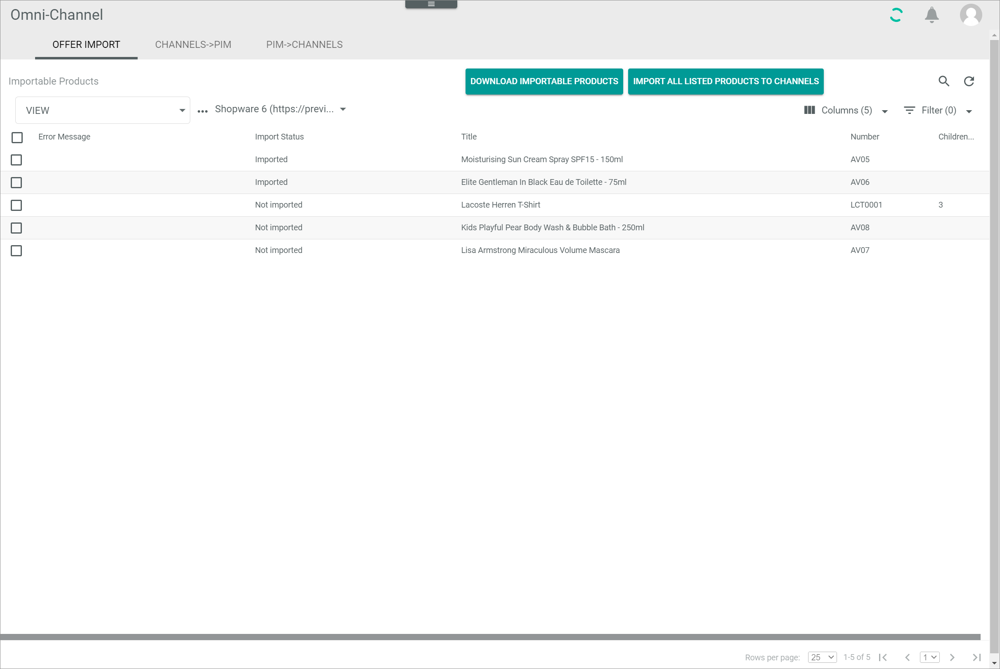
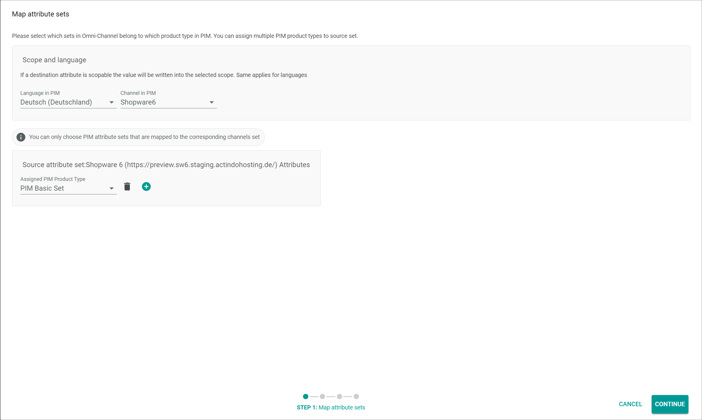
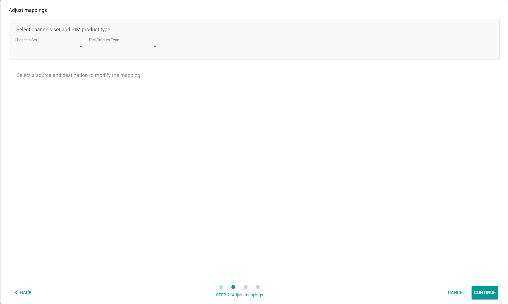
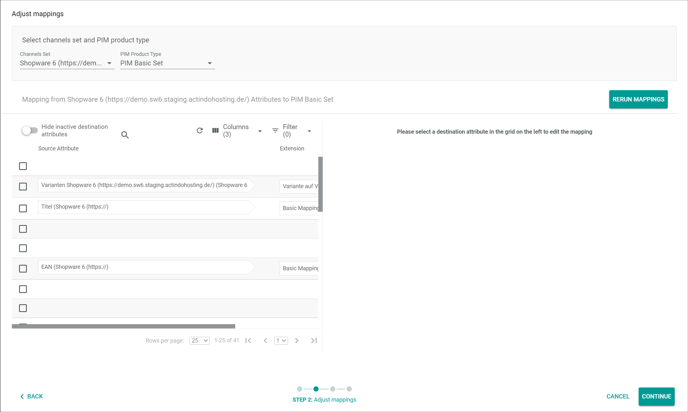
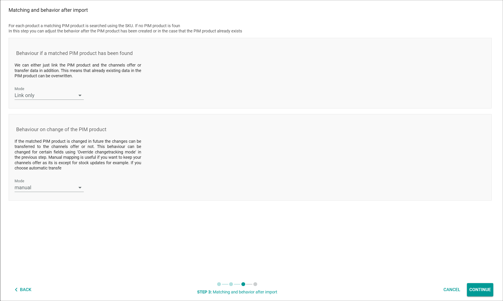
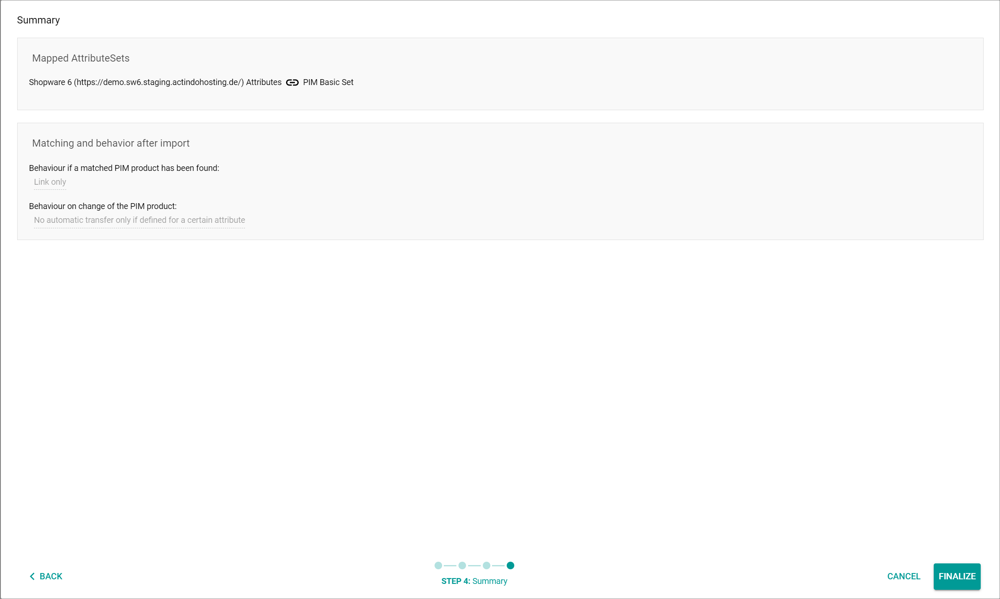

# Import an offer

You can import an offer from your marketplace to the *Omni-Channel* module, for instance if you already offer products on your marketplace that are not yet in your *PIM* module. After you have imported the offer, you can import the product of the corresponding offer to the *PIM* module.

## Import offers from a marketplace

[comment]: <> (add)

### Import a single offer

[comment]: <> (add)

#### Prerequisites

- A connection to a marketplace has been established, see [Create a connection](../../Integration/01_ManageConnections.md#create-a-connection).
- At least one offer that has not yet been imported to *Omni-Channel* is on the marketplace.

#### Procedure

*Omni-Channel > Offer Import > Tab OFFER IMPORT*

1. Click the *Select connection* drop-down list and select the connection for which you want to import offers. All supported drivers are displayed in the list.
  All offers on the selected marketplace are displayed in the list of importable products.

  

2. Select the checkbox of the product you want to import to *Omni-Channel*.      
  The editing toolbar is displayed above the list.

3. Click the [IMPORT PRODUCT TO CHANNELS] button in the editing toolbar.

[comment]: <> (what happens next? Wo darf ich das ausprobieren/screenshoten?)

### Import all importable offers

[comment]: <> (add)

#### Prerequisites

- A connection to a marketplace has been established, see [Create a connection](../../Integration/01_ManageConnections.md#create-a-connection).
- At least one offer that has not yet been imported to *Omni-Channel* is on the marketplace.

#### Procedure

*Omni-Channel > Offer Import > Tab OFFER IMPORT*

1. Click the *Select connection* drop-down list and select the connection for which you want to import offers. All supported drivers are displayed in the list.
  All offers on the selected marketplace are displayed in the list of importable products.

  

2. Click the [DOWNLOAD IMPORTABLE PRODUCTS] button above the list.

[comment]: <> (what happens next? Wo darf ich das ausprobieren/screenshoten?)

### Import all products

[comment]: <> (add)

#### Prerequisites

- A connection to a marketplace has been established, see [Create a connection](../../Integration/01_ManageConnections.md#create-a-connection).
- At least one offer that has not yet been imported to *Omni-Channel* is on the marketplace.

#### Procedure

*Omni-Channel > Offer Import > Tab OFFER IMPORT*

1. Click the *Select connection* drop-down list and select the connection for which you want to import offers. All connections whose drivers are supported are displayed in the list.
  All offers on the selected marketplace are displayed in the list of importable products.

  

2. Click the [IMPORT ALL LISTED PRODUCTS TO CHANNEL] button above the list.

[comment]: <> (what happens next? Wo darf ich das ausprobieren/screenshoten?)

## Map an offer to an existing PIM product

[comment]: <> (add)

#### Prerequisites

- A connection to a marketplace has been established, see [Create a connection](../../Integration/01_ManageConnections.md#create-a-connection).
- At least one offer has been imported from a marketplace to *Omni-Channel*, see [Import offers from a marketplace](Import-offers-from-a-marketplace).

#### Procedure

*Omni-Channel > Offer Import > Tab CHANNELS->PIM*

1. Click the *Select connection* drop-down list and select the connection for which you want to import offers. All available connections are displayed in the list.
  All offers on the selected marketplace are displayed in the list of importable products.

  

2. Click the [SELECT] button below the *Select connection* drop-down list.   
  The *Map attribute sets* wizard window is displayed.  

  

3. Configure the following settings:

  + Click the *Language in PIM* drop-down list and select the default language to be applied for the PIM product. All available languages in PIM are displayed in the list.     

  + Click the *Channel in PIM* drop-down list and select the default channel to be applied for the PIM product. All available channels in *PIM* are displayed in the list.

  + Click the *Assigned PIM attribute set* drop-down list and select the attribute set to be applied for the *Omni-Channel* source attribute set in the corresponding box. All available attribute sets in *PIM* that are mapped to the corresponding source attribute set in *Omni-Channel* are displayed in the list.   

  > [Info] A single box is displayed for each attribute set available in *Omni-Channel*.

4. Click the [CONTINUE] button in the bottom right corner.   
  The *Adjust mappings* wizard window is displayed.

  

5. Configure the following settings:

  + Click the *Channels set* drop-down list and select the *Omni-Channel* attribute set for mapping. All available *Omni-Channel* attribute sets are displayed in the list.       

  + Click the *PIM attribue set* drop-down list and select the *PIM* attribute set for mapping. All available *PIM* attribute sets are displayed in the list.     
  The *Mapping from "Omni-Channel attribute set name" to "PIM attribute set name"* section is displayed below the *Select channels set and PIM attribute set* box.

  

  + Adjust the attribute mapping from the selected *Omni-Channel* attribute set to the selected *PIM* attribute set as desired.   
    For detailed information about editing the mapping, see [Edit the ETL attribute mappings](../../../DataHub/Operation/01_ManageETLMappings#edit-the-etl-attribute-mappings).

6. Click the [CONTINUE] button in the bottom right corner.   
  The *Matching and behavior after import* wizard window is displayed.

  

7. Configure the following settings:

  + Click the *Mode* drop-down list in teh *Behaviour if a matched PIM product has been found* box and select the appropriate behaviour. The following options are available:
    - **Link only**   
    - **Link and transfer data**       

  + Click the *Mode* drop-down list in teh *Behaviour on change of the PIM product* box and select the appropriate behaviour. The following options are available:
    - **manual**
    - **semi-automatic**
    - **semi-automatic, changes must be confirmed by another user**
    - **automatic**   

8. Click the [CONTINUE] button in the bottom right corner.   
  The *Summary* wizard window is displayed.

  

  The *Wizard finalized* pop-up window is displayed.

  [comment]: <> (Warum wird das pop-up fenster schon angezeigt, bevor man finalize gedrückt hat?)

  

9. Click the [Finalize] button in the bottom right corner.   
  The *Summary* wizard window is closed. The wizard has been finalized and the import from *Omni-Channels* to *PIM* has been started.

[comment]: <> (stimmt das?what happens next? Wo darf ich das ausprobieren/screenshoten?)

## Import an offer to a new PIM product
