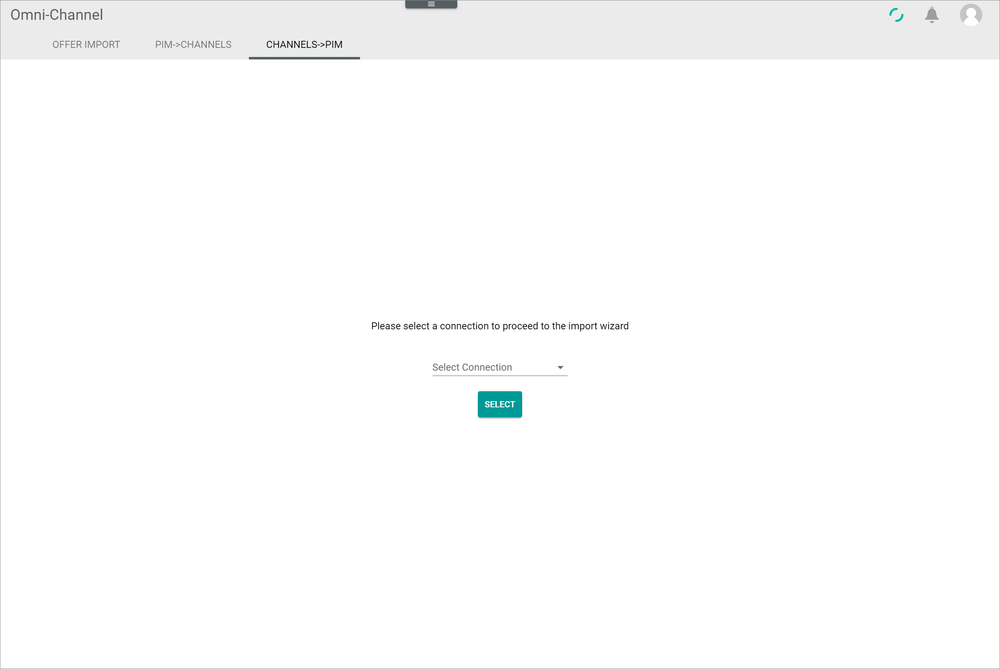
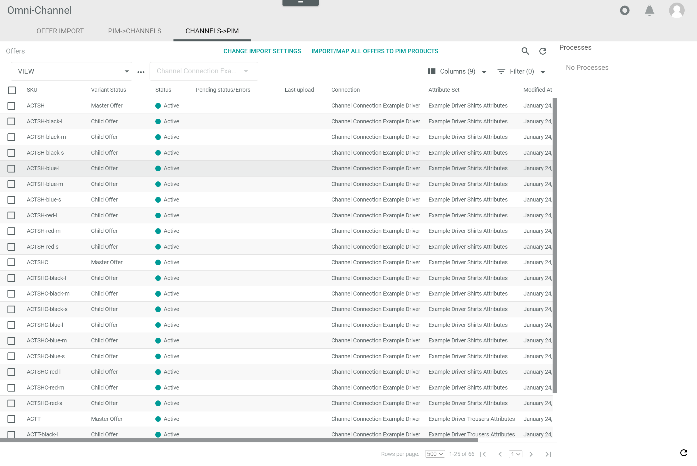

[!!Manage the ETL mappings in DataHub](../../../DataHub/Operation/01_ManageETLMappings)
[!!User interface Offer import](../UserInterface/04a_OfferImport.md)
[!!User interface Channels->PIM](../UserInterface/04c_ChannelsPIM.md)
[!!User interface PIM List](../../PIM/UserInterface/02a_List.md)

# Import an offer

You can import an offer from your marketplace to the *Omni-Channel* module, for instance if you already offer products on your marketplace that are not yet in your *PIM* module. After you have imported the offer, you can import the product of the corresponding offer to the *PIM* module.

## Import offers from a marketplace

You can import offers from an existing marketplace where you are already selling products and include these products to your *PIM* module.
You can either import a certain offer, import all importable offers or import all products to the offers from your marketplace.

### Download all importable offers

Before you can import an offer from our marketplace to the *Omni-Channel* module, you have to download the importable offers from the marketplace.

#### Prerequisites

- A connection to a marketplace has been established, see [Create a connection](../../Integration/01_ManageConnections.md#create-a-connection).
- At least one importable offer is in the marketplace.

#### Procedure

*Omni-Channel > Offer Import > Tab OFFER IMPORT*

1. Click the *Select connection* drop-down list and select the connection for which you want to import offers. All supported drivers are displayed in the list.
    All offers on the selected marketplace are displayed in the list of importable products.

    

2. Click the [DOWNLOAD IMPORTABLE PRODUCTS] button above the list.
    The download of all importable offers to the list has been triggered. The *Download triggered* pop-up window is displayed. 

    

    When the download has been completed, all importable offers are displayed in the list of importable products.

    

### Import a single offer

You can select a certain offer from your marketplace and import this single offer to the *Omni-Channel* module.

#### Prerequisites

- The importable offers have been downloaded, see [Download all importable offers](#download-all-importable-offers).
- At least one importable offer has not yet been imported to the *Omni-Channel* module.

#### Procedure

*Omni-Channel > Offer Import > Tab OFFER IMPORT*

1. Click the *Select connection* drop-down list and select the connection for which you want to import offers. All supported drivers are displayed in the list.
    All offers on the selected marketplace are displayed in the list of importable products.

    

2. Select the checkbox of the product you want to import to *Omni-Channel*. You can select one or several checkboxes.     
    The editing toolbar is displayed above the list.

3. Click the [IMPORT PRODUCT TO CHANNELS] button in the editing toolbar.
    The *Import products to Channels* window is displayed.

    

4. Click the [OK] button in the *Import products to Channels* window.
    The import of the selected product has been triggered. The *Import triggered* pop-up window is displayed. 
    
    

    When the import has been completed, the status of the corresponding product in the *Import status* column changes to **Imported**.
    
    

    > [Info] If an error occurs when importing the product to the *Omni-Channel* module, the **Error** status is displayed in the *Import status* column and the error message is displayed in the *Error message* column of the corresponding product.   
    You can select the checkbox of the faulty imported product and click the [DETAILS] button in the editing toolbar to display further details to the error, see [Detail of log message](../UserInterface/04a_OfferImport.md#detail-of-log-message-log-message-title).

### Import all listed offers

You can import all importable offers from your marketplace at once to the *Omni-Channel* module.

#### Prerequisites

- The importable offers have been downloaded, see [Download all importable offers](#download-all-importable-offers).
- At least one importable offer has not yet been imported to the *Omni-Channel* module.

#### Procedure

*Omni-Channel > Offer Import > Tab OFFER IMPORT*

1. Click the *Select connection* drop-down list and select the connection for which you want to import offers. All connections whose drivers are supported are displayed in the list.
    All offers on the selected marketplace are displayed in the list of importable products.

    

2. Click the [IMPORT ALL LISTED PRODUCTS TO CHANNEL] button above the list.
    The *Import products to Channels* window is displayed.

    

3. Click the [OK] button in the *Import products to Channels* window.
    The import of all products in the list has been triggered. The *Import triggered* pop-up window is displayed. 
    
    

    When the import has been completed, the status of the corresponding product in the *Import status* column changes to **Imported**.
    
    

    > [Info] If an error occurs when importing the product to the *Omni-Channel* module, the **Error** status is displayed in the *Import status* column and the error message is displayed in the *Error message* column of the corresponding product.   
    You can select the checkbox of the faulty imported product and click the [DETAILS] button in the editing toolbar to display further details to the error, see [Detail of log message](../UserInterface/04a_OfferImport.md#detail-of-log-message-log-message-title).

## Map an offer to a PIM product

Once an offer has been imported from a marketplace to the *Omni-Channel* module, you can map the product to the offer to an existing PIM product or even import new products to your *PIM* module.

#### Prerequisites

At least one offer has been imported from a marketplace to *Omni-Channel*, see [Import offers from a marketplace](Import-offers-from-a-marketplace).

#### Procedure

*Omni-Channel > Offer Import > Tab CHANNELS->PIM*

1. Click the *Select connection* drop-down list and select the connection for which you want to import offers. All available connections are displayed in the list.

2. Click the [SELECT] button below the *Select connection* drop-down list.   
    The *Map attribute sets* wizard window is displayed.  

    

3. Configure the following settings:

    + Click the *Language in PIM* drop-down list and select the default language to be applied for the PIM product. All available languages in PIM are displayed in the list.     

    + Click the *Channel in PIM* drop-down list and select the default channel to be applied for the PIM product. All available channels in *PIM* are displayed in the list.

    + Click the *Assigned PIM attribute set* drop-down list and select the attribute set to be applied for the *Omni-Channel* source attribute set in the corresponding box. All available attribute sets in *PIM* that are mapped to the corresponding source attribute set in *Omni-Channel* are displayed in the list.   

        > [Info] A single box is displayed for each attribute set available in *Omni-Channel*.

4. Click the [CONTINUE] button in the bottom right corner.   
    The *Adjust mappings* wizard window is displayed.

    

5. Configure the following settings:

    + Click the *Channels set* drop-down list and select the *Omni-Channel* attribute set for mapping. All available *Omni-Channel* attribute sets are displayed in the list.       

    + Click the *PIM attribute set* drop-down list and select the *PIM* attribute set for mapping. All available *PIM* attribute sets are displayed in the list.     
    The *Mapping from "Omni-Channel attribute set name" to "PIM attribute set name"* section is displayed below the *Select channels set and PIM attribute set* box.

        

    + Adjust the attribute mapping from the selected *Omni-Channel* attribute set to the selected *PIM* attribute set as desired.   

        > [Info] A default mapping is preconfigured by all drivers supporting the offer import.

6. Click the [CONTINUE] button in the bottom right corner.   
    The *Select matching attributes* wizard window is displayed.

    

7. Select the checkboxes of all PIM attributes that should be considered for matching with an existing PIM product. All mapped attributes are displayed in the box.

    > [Info] A single box with PIM attributes is displayed for each attribute set mapping.

8. Click the [CONTINUE] button in the bottom right corner.   
    The *Matching and behavior after import* wizard window is displayed.

    

    The selected match attributes have been saved and the *Match attributes saved* pop-up window is displayed.

     

9. Configure the following settings:

    + Click the *Mode* drop-down list in the *Behaviour if a matched PIM product has been found* box and select the appropriate behaviour. The following options are available:
        - **Link only**   
        - **Link and transfer data**       

    + Click the *Mode* drop-down list in the *Behaviour on change of the PIM product* box and select the appropriate behaviour. The following options are available:
        - **manual**
        - **semiautomatic**
        - **semiautomatic, changes must be confirmed by another user**
        - **automatic**   

10. Click the [CONTINUE] button in the bottom right corner.   
    The *Summary* wizard window is displayed.

    

    The selected modes have been saved and the *Wizard finalized* pop-up window is displayed.

    

11. Click the [Finalize] button in the bottom right corner.   
    The *Summary* wizard window is closed. The *Offers* view with all offers to be imported to PIM is displayed.

    

[comment]: <> (Button Finalize wird ggf. umbenannt. Bei Änderung hier anpassen)

12. Click the [IMPORT/MAP ALL OFFERS TO PIM PRODUCTS] button in the header to import all offers in the list or select the checkboxes of all offers in the list you want to import and click the [CREATE PIM PRODUCTS/MAP OFFERS TO EXISTING PIM PRODUCTS] button in the editing toolbar.   
    The *Summary* window is displayed.

    

13. Enter a name for the import process in the *Import name* field.   

14. If desired, enable the *Start import automatically without manual checking of assignments to PIM products* toggle. 

    > [Info] If you enable the toggle, the import will start automatically after having clicked the [PREPARE IMPORT] button. Otherwise, the import processes will be displayed in the *Processes* section in the *Offers* view after having clicked the [PREPARE IMPORT] button and you have to start the import manually. By default, the toggle is disabled. 

15. Click the *Set for "connection name"* drop-down list and select the applicable destination attribute set. All available destination attribute sets are displayed in the list. If only one attribute set is available, this attribute set is automatically selected and the drop-down list is locked.  
    
    > [Info] A single drop-down list is displayed for each source attribute set of the connection.

16. Click the [PREPARE IMPORT] button.    
    The offer import has been prepared. The *Summary* window is closed. All scheduled import processes are displayed in the *Processes* section in the *Offers* view. If the *Start import automatically without manual checking of assignments to PIM products* toggle has been enabled, the process is automatically started. Otherwise, the process is displayed with the **Queue filled, waiting for start** status in the *Processes* section and must be started manually.

    

    > [Info] You can click the scheduled process in the *Processes* section to display the *Import process* window and check the details of the import process, see [Import process](../UserInterface/04c_ChannelsPIM.md#import-process).

17. If the process needs to be started manually, click the [START] button in the *Processes* section.   
    The import of the product from the *Omni-Channel* to the *PIM* module has been triggered. The status below the process in the *Processes* section changes to **Importing into PIM** during the import process. When the import has been finished, the **Import finished** status is displayed.
    
    

    The product has been imported to the *PIM* module and is displayed in the products list, see [User interface PIM List](../../PIM/UserInterface/02a_List.md).

