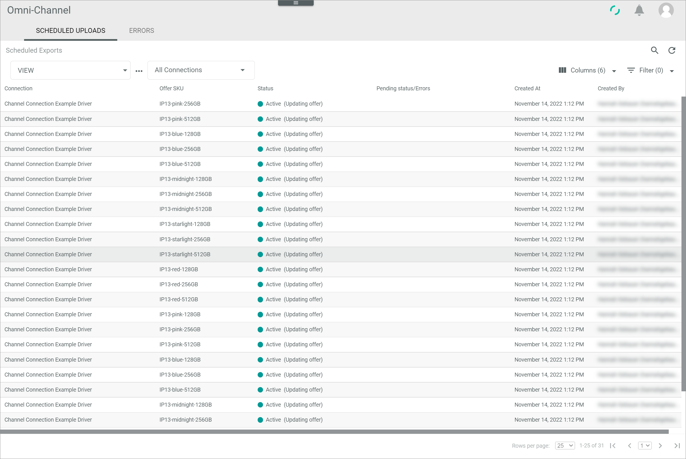
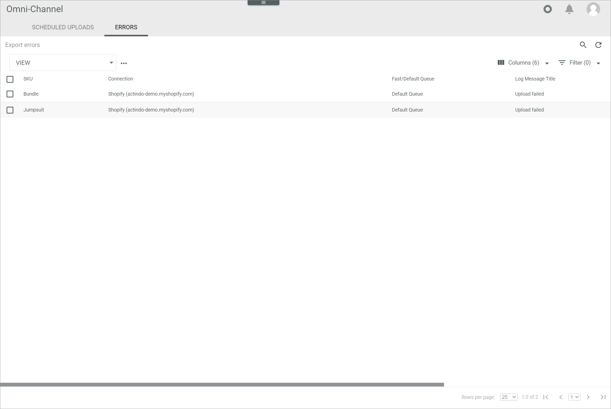

[!!Retry a faulty offer upload](../Troubleshooting/01_RetryFaultyUpload.md)
[!!User interface Offer upload](../UserInterface/03_OfferUpload.md)

# Check the offer upload

When an offer has been changed, for example by changing the corresponding product in *PIM*, the changed offer is automatically uploaded to the marketplace. If a larger number of offers are changed at once, it may take some time until all offers have been uploaded. You can then use the upload queue to check which offers are still pending for upload. Further, you can check the list of export errors to determine if an export has failed and for what reason.    

## Check the scheduled offer uploads

You can check if any offer uploads of a certain or all connections are still pending by checking the queue of scheduled uploads, for example after having made any changes to a product.

#### Prerequisites

At least one offer upload from *Omni-Channel* to the marketplace has been triggered, see [Create an offer from a PIM product](../Operation/01_ManageOffers.md#create-an-offer-from-a-pim-product).

#### Procedure

*Omni-Channel > Offer Upload > Tab SCHEDULED UPLOADS*

1. Click the  (Refresh) button in the upper right corner to update the list of offers to be uploaded to the marketplace.   
    All pending offers to be uploaded are displayed in the list.

2. If desired, click the *All Connections* drop-down list and select the connection for which you want to display the pending offer uploads.   
    The list of pending offers is limited to the pending offers for the selected connection.

3. Check the list for the respective offer uploads, for information about the current status, the pending status and the user who created the offer upload.   

    > [Info] The offer uploads are only displayed in the list as long as they have not yet been uploaded to the marketplace. Click the  (Refresh) button again to update the list.   

## Check the failed offer uploads

If an offer upload has failed, the corresponding offer is displayed in the list of export errors. You can check the reason for failure to fix it and retry the offer upload, see [Retry a faulty offer upload](../Troubleshooting/01_RetryFaultyUpload.md).

#### Prerequisites

At least one offer upload has failed.

#### Procedure

*Omni-Channel > Offer Upload > Tab ERRORS*

1. Check the list of export errors for the faulty offer upload.

2. Click the corresponding row of the faulty offer upload.   
    The *Detail of log message "Log message title"* view is displayed. By default, the *Attributes* tab is preselected.

    

3. Check the details of the log message in the *Attributes* tab.

    > [Info] If you have fixed the reason for the faulty upload, you can retry the offer upload, see [Retry a faulty offer upload](../Troubleshooting/01_RetryFaultyUpload.md).
