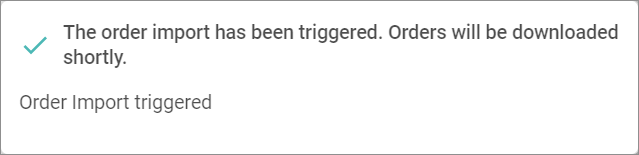

[!!User interface Orders and returns](../UserInterface/to_be_completed)   
[Configure the order import](../Integration/04_ConfigureOrdersReturns.md#configure-the-order-import)
[Configure the return import](../Integration/04_ConfigureOrdersReturns.md#configure-the-return-import)

# Manage the orders and returns

When an order is placed on the marketplace, this order must be imported into *Omni-Channel* to further process it in the *Order Management* module.   
You can configure an automatic import of orders for a certain time interval, see [Configure the order import](../Integration/04_ConfigureOrdersReturns.md#configure-the-order-import). You can also manually trigger the import of orders at any time.

For certain marketplaces, it is possible to announce a return. In this case, these returns can be imported to *Omni-Channel* to further process them in the *Return management* module.   
You can configure an automatic import of returns for a certain time interval, see [Configure the return import](../Integration/04_ConfigureOrdersReturns.md#configure-the-return-import). You can also manually trigger the import of returns at any time.

## Import orders manually

If you want to import the orders from a marketplace outside the specified time interval, you can manually trigger the import either for a certain connection or for all configured connections at once.

### Import orders for a single connection

If you only want to import the orders from a certain marketplace, trigger the import for this single connection.

#### Prerequisites

- A connection to a marketplace has been established, see [Create a connection](../../Integration/01_ManageConnections.md#create-a-connection).
- The marketplace supports the order import.

[comment]: <> (Unterstützen nicht alle Marktplätze den Bestellimport?)

#### Procedure

*Omni-Channel > Orders and Returns > Tab OFFERS*

1. Click the *All connections* drop-down list and select the connection for which you want to import the orders. All connections are displayed in the list.

  

  > [Info] The time of the last successful import of orders for the selected connection is displayed next to the [Import orders] button.

2. Click the [Import orders] button.   
  The order import has been triggered. The *Order import triggered* pop-up window is displayed. The orders will be downloaded.

  

### Import orders for all connections

If you want to import the orders from all connected marketplaces, trigger the import for all connections.

#### Prerequisites

- A connection to a marketplace has been established, see [Create a connection](../../Integration/01_ManageConnections.md#create-a-connection).
- The marketplace supports the order import.

[comment]: <> (Unterstützen nicht alle Marktplätze den Bestellimport?)

#### Procedure

*Omni-Channel > Orders and Returns > Tab OFFERS*

Click the [Import orders for all connections] button. This button is only displayed, if no connection has been selected in the *All connections* drop-down list.       
  The order import has been triggered. The *Order import triggered* pop-up window is displayed. The orders will be downloaded.

  

## Export orders manually

[comment]: <> (add content)

[comment]: <> (returns vorerst ignorieren?!)

## Import returns

If you want to import the returns from a marketplace outside the specified time interval, you can manually trigger the import either for a certain connection or for all configured connections at once.

### Import returns for a certain connection

If you only want to import the returns from a certain marketplace, trigger the import for this single connection.

#### Prerequisites

- A connection to a marketplace has been established, see [Create a connection](../../Integration/01_ManageConnections.md#create-a-connection).
- The marketplace supports the return import.

#### Procedure

*Omni-Channel > Orders and Returns > Tab RETURNS*

1. Click the *All connections* drop-down list and select the connection for which you want to import the returns. All connections are displayed in the list.

  

  > [Info] The time of the last successful import of returns for the selected connection is displayed next to the [Import returns] button.

2. Click the [Import returns] button.   
  The return import has been triggered. The *Return import triggered* pop-up window is displayed. The returns will be downloaded.

  

### Import returns for all connections

If you want to import the returns from all connected marketplaces, trigger the import for all connections.

#### Prerequisites

- A connection to a marketplace has been established, see [Create a connection](../../Integration/01_ManageConnections.md#create-a-connection).
- The marketplace supports the return import.

#### Procedure

*Omni-Channel > Orders and Returns > Tab RETURNS*

Click the [Import returns for all connections] button. This button is only displayed, if no connection has been selected in the *All connections* drop-down list.      
  The return import has been triggered. The *Returns import triggered* pop-up window is displayed. The returns will be downloaded.

  

## Export returns

## Check the scheduled exports

## Check the failed orders and returns
