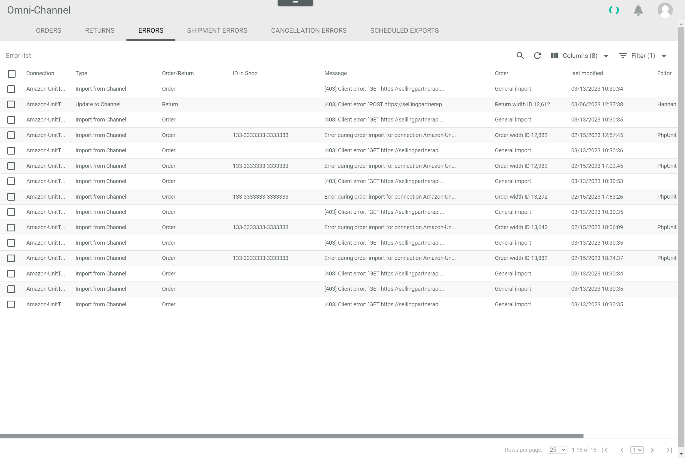

[!!User interface Orders and returns](../UserInterface/05_OrdersReturns.md)
[!!Configure the order import](../Integration/04_ConfigureOrdersReturns.md#configure-the-order-import)
[!!Configure the return import](../Integration/04_ConfigureOrdersReturns.md#configure-the-return-import)

# Manage the orders and returns

When an order is placed in the marketplace, this order must be imported into *Omni-Channel* to further process it in the *Order Management* module.   
You can configure an automatic import of orders for a certain time interval, see [Configure the order import](../Integration/04_ConfigureOrdersReturns.md#configure-the-order-import). You can also manually trigger the import of orders at any time.

For certain marketplaces, it is possible to announce a return. In this case, these returns can be imported to *Omni-Channel* to further process them in the *Return management* module.   
You can configure an automatic import of returns for a certain time interval, see [Configure the return import](../Integration/04_ConfigureOrdersReturns.md#configure-the-return-import). You can also manually trigger the import of returns at any time.

## Import orders manually

If you want to import the orders from a marketplace outside the specified time interval, you can manually trigger the import either for a certain connection or for all configured connections at once.

### Import orders for a single connection

If you only want to import the orders from a certain marketplace, trigger the import for this single connection.

#### Prerequisites

- A connection to a marketplace has been established, see [Create a connection](../../Integration/01_ManageConnections.md#create-a-connection).
- The marketplace supports the order import.

[comment]: <> (Unterstützen nicht alle Marktplätze den Bestellimport?)

#### Procedure

*Omni-Channel > Orders and Returns > Tab OFFERS*

1. Click the *All connections* drop-down list and select the connection for which you want to import the orders. All supported connections for import are displayed in the list.   
  Only the orders of the selected connection are displayed in the list of orders.

  

   > [Info] The time of the last successful import of orders for the selected connection is displayed next to the [Import orders] button.

2. Click the [Import orders] button.   
  The order import has been triggered. The *Order import triggered* pop-up window is displayed. The orders will be downloaded.

  

### Import orders for all connections

If you want to import the orders from all connected marketplaces, trigger the import for all connections.

#### Prerequisites

- A connection to a marketplace has been established, see [Create a connection](../../Integration/01_ManageConnections.md#create-a-connection).
- The marketplace supports the order import.

[comment]: <> (Unterstützen nicht alle Marktplätze den Bestellimport?)

#### Procedure

*Omni-Channel > Orders and Returns > Tab OFFERS*

Click the [Import orders for all connections] button. This button is only displayed, if no connection has been selected in the *All connections* drop-down list.       
  The order import has been triggered. The *Order import triggered* pop-up window is displayed. The orders will be downloaded.

  

## Export orders manually

[comment]: <> (add content - wann mache ich den export manuell? bzw. wann ist das nötig? Nur zum retry?)

#### Prerequisites

A connection to a marketplace has been established, see [Create a connection](../../Integration/01_ManageConnections.md#create-a-connection).

#### Procedure

*Omni-Channel > Orders and Returns > Tab RETURNS*

1. If desired, click the *All connections* drop-down list and select a connection.   
  Only the orders of the selected connection are displayed in the list of orders.

2. Select the checkboxes of the orders you want to export in the list of order.    
  The editing toolbar is displayed above the list.

3. Click the [EXPORT TO OMS] button in the editing toolbar.   
  The export to OMS has been triggered. The order status in the *Status of export to OMS* column of the selected order(s) changes to **Being exported**.

   > [Info] You can only export orders to OMS that are fully imported (*Status of import from channel* equals **Order complete**) and not yet exported to OMS (*Status of export to OMS* does not equal **Exported**). Otherwise, an error message is displayed.

[comment]: <> (returns vorerst ignorieren?!)

## Import returns manually

If you want to import the returns from a marketplace outside the specified time interval, you can manually trigger the import either for a certain connection or for all configured connections at once.

### Import returns for a single connection

If you only want to import the returns from a certain marketplace, trigger the import for this single connection.

#### Prerequisites

- A connection to a marketplace has been established, see [Create a connection](../../Integration/01_ManageConnections.md#create-a-connection).
- The marketplace supports the return import.

#### Procedure

*Omni-Channel > Orders and Returns > Tab RETURNS*

1. Click the *All connections* drop-down list and select the connection for which you want to import the returns. All supported connections for return are displayed in the list.   
  Only the returns of the selected connection are displayed in the list of returns.

  

    > [Info] The time of the last successful import of returns for the selected connection is displayed next to the [Import returns] button.

2. Click the [Import returns] button.   
  The return import has been triggered. The *Return import triggered* pop-up window is displayed. The returns will be downloaded.

  

### Import returns for all connections

If you want to import the returns from all connected marketplaces, trigger the import for all connections.

#### Prerequisites

- A connection to a marketplace has been established, see [Create a connection](../../Integration/01_ManageConnections.md#create-a-connection).
- The marketplace supports the return import.

#### Procedure

*Omni-Channel > Orders and Returns > Tab RETURNS*

Click the [Import returns for all connections] button. This button is only displayed, if no connection has been selected in the *All connections* drop-down list.      
  The return import has been triggered. The *Returns import triggered* pop-up window is displayed. The returns will be downloaded.

  

## Export returns manually

[comment]: <> (add content - wann mache ich den export manuell? bzw. wann ist das nötig? Nur zum retry?)

#### Prerequisites

A connection to a marketplace has been established, see [Create a connection](../../Integration/01_ManageConnections.md#create-a-connection).

#### Procedure

*Omni-Channel > Orders and Returns > Tab RETURNS*

1. If desired, click the *All connections* drop-down list and select a connection.   
  Only the orders of the selected connection are displayed in the list of orders.

2. Select the checkboxes of the returns you want to export in the list of order.    
  The editing toolbar is displayed above the list.

3. Click the [XXX] button in the editing toolbar.   
  The export has been triggered. The return status in the *xxx* column of the selected return(s) changes to **Being exported**.

[comment]: <> (wie heißt der button? keine Möglichkeit zu testen, da nirends returns sind)

    > [Info] You can only export returns that are fully imported (*Status of import from channel* equals **Order complete**) and not yet exported to OMS (*Status of export to OMS* does not equal **Exported**). Otherwise, an error message is displayed.

[comment]: <> (Info anpassen)

## Check the scheduled exports

You can check if any exports are still pending, for example after an order has been changed by the system, by checking the queue of scheduled exports.

#### Prerequisites

At least one export has been triggered, either automatically or manually, see [Export orders manually](#export-orders-manually).

#### Procedure

*Omni-Channel > Orders and Returns > Tab SCHEDULED EXPORTS*

1. Click the  (Refresh) button in the upper right corner to update the list of scheduled exports.   
  All pending exports are displayed in the list.

2. Check the list for the respective export(s).   

    > [Info] The exports are only displayed in the list as long as they have not yet been exported. Click the  (Refresh) button again to update the list.   

## Check the failed orders and returns

If an order or return import and/or export upload failed, the corresponding order or return is displayed in the list of errors. You can check the reason for failure to fix it.

#### Prerequisites

At least one order or return import or export has been failed.

#### Procedure

*Omni-Channel > Orders and Returns > Tab ERRORS*

1. Check the list of export and/or import errors for the searched faulty order/return export/import.

2. Click the corresponding faulty order/return export/import.   
  The *Detail of log message "Log message title"* view is displayed. By default, the *Attributes* tab is preselected.

  

3. Check the details of the log message in the *Attributes* tab.
