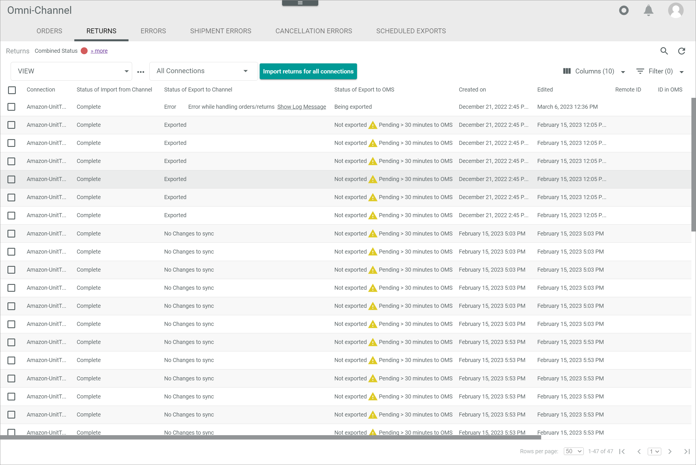

# Manage the orders and returns

[comment]: <> (add content)

## Import orders manually

[comment]: <> (add content)

### Import orders for a certain connection

[comment]: <> (add content)

#### Prerequisites

A connection to a marketplace has been established, see [Create a connection](../../Integration/01_ManageConnections.md#create-a-connection).

#### Procedure

*Omni-Channel > Orders and Returns > Tab OFFERS*

1. Click the *All connections* drop-down list and select the connection for which you want to import the orders. All connections are displayed in the list.

  > [Info] The time of the last successful import of orders for the selected connection is displayed next to the [Import orders] button.

2. Click the [Import orders] button.   
  The order import has been triggered. The *Order import triggered* pop-up window is displayed. The orders will be downloaded.

### Import orders for all connections

[comment]: <> (add content)

#### Prerequisites

A connection to a marketplace has been established, see [Create a connection](../../Integration/01_ManageConnections.md#create-a-connection).

#### Procedure

*Omni-Channel > Orders and Returns > Tab OFFERS*

Click the [Import orders for all connections] button.   
  The order import has been triggered. The *Order import triggered* pop-up window is displayed. The orders will be downloaded.

## Export orders manually

[comment]: <> (add content)

## Import returns

[comment]: <> (add content)

### Import returns for a certain connection

[comment]: <> (add content)

#### Prerequisites

A connection to a marketplace has been established, see [Create a connection](../../Integration/01_ManageConnections.md#create-a-connection).

#### Procedure

*Omni-Channel > Orders and Returns > Tab RETURNS*

1. Click the *All connections* drop-down list and select the connection for which you want to import the returns. All connections are displayed in the list.

  > [Info] The time of the last successful import of returns for the selected connection is displayed next to the [Import returns] button.

2. Click the [Import returns] button.   
  The return import has been triggered. The *Return import triggered* pop-up window is displayed. The returns will be downloaded.

### Import returns for all connections

[comment]: <> (add content)

#### Prerequisites

A connection to a marketplace has been established, see [Create a connection](../../Integration/01_ManageConnections.md#create-a-connection).

#### Procedure

*Omni-Channel > Orders and Returns > Tab RETURNS*

Click the [Import returns for all connections] button.   
  The return import has been triggered. The *Returns import triggered* pop-up window is displayed. The returns will be downloaded.

## Export returns

## Check the scheduled exports

## Check the failed orders and returns
