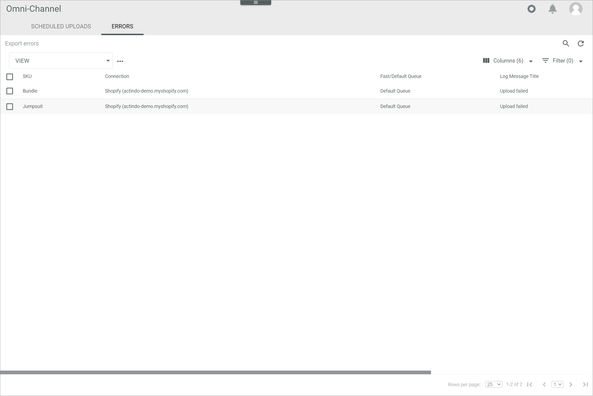

[!!Manage the offers](../Operation/01_ManageOffers.md)
[!!Check the offer upload](../Operation/03_CheckOfferUpload.md)
[!!User interface Errors (Offer Upload)](../UserInterface/03b_Errors.md)

# Retry a faulty offer upload

If an offer upload has been canceled because of an error, the corresponding upload is displayed in the *ERRORS* tab. When the error has been fixed, you can restart the upload to export the offer to the marketplace.

#### Error Description

An offer upload fails and the offer is moved to the list of export errors.

Follow the instructions below to restart the offer upload after you have fixed the cause of the error.

#### Prerequisites

The cause of the faulty offer upload has been fixed.

#### Procedure

*Omni-Channel > Offer Upload > Tab ERRORS*

1. Select the checkbox of the faulty offer upload you want to restart.   
    The editing toolbar is displayed above the list.

2. Click the [RETRY UPLOAD] button in the editing toolbar.   
    The selected offer upload has been triggered. The *Upload triggered* pop-up window is displayed.

    

    > [Info] If the retry is successful, the offer will be removed from the list of export errors.

#### Was this chapter helpful?

If you need further assistance, please contact your MPS consultant.