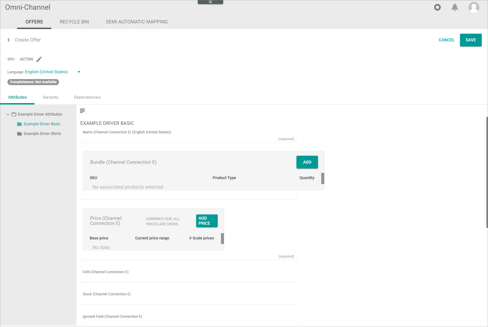
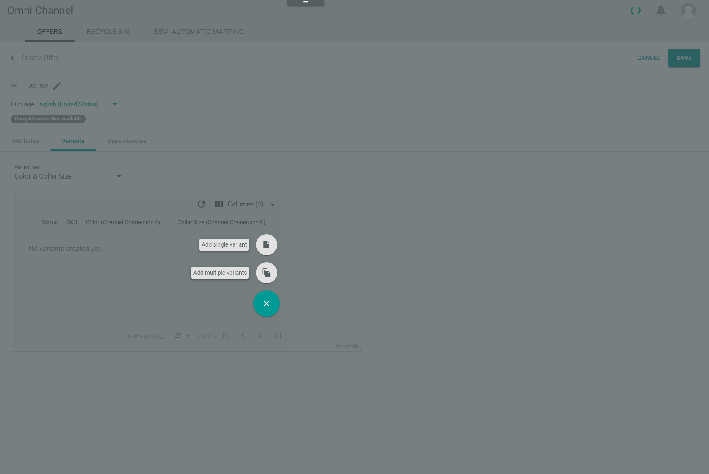

[!!Manage the view in PIM](../../PIM/Operation/04_ManageView.md)
[!!Manage the offers](../Operation/01_ManageOffers.md)

# Offers

*Omni-Channel > Offers > Tab OFFERS*

**Offers**

-  (Search)   
    Click this button to display the search bar and search for an offer.

-  (Refresh)   
    Click this button to update the list of offers.

- *VIEW*   
    Click the drop-down list to select the view. All created views are displayed in the drop-down list. Click the  (Points) button to the right of the *VIEW* drop-down list to display the context menu and create a view.   

    -  (Points)      
        Click this button to the right of the *VIEW* drop-down list to display the context menu. The following menu entries are available:

        -  create  
            Click this entry to create a view. The *Create view* window is displayed, see [Create view](#create-view).

        -  rename  
            Click this entry to rename the selected view. The *Rename view* window is displayed, see [Rename view](#rename-view). This menu entry is only displayed if a view has been selected.

        -  reset  
            Click this entry to reset all unsaved changes to the settings of the selected view. This menu entry is only displayed if a view has been selected and any changes have been made to the view settings.

        -  publish  
            Click this entry to publish the view. This menu entry is only displayed if a view has been selected and unpublished.

        -  unpublish  
            Click this entry to unpublish the view. This menu entry is only displayed if a view has been selected and published.

        -  save  
            Click this entry to save the current view settings in the selected view. This menu entry is only displayed if a view has been selected.

            > [Info] When the settings of a view have been changed, an asterisk is displayed next to the view name. The asterisk is hidden as soon as the changes have been saved.

        -  delete  
            Click this entry to delete the selected view. A confirmation window to confirm the deletion is displayed. This menu entry is only displayed if a view has been selected.

- *All Connections*    
    Click the drop-down list to select a connection. All available connections are displayed in the list. If you select a connection, the list of offers is limited to those offers of the selected connection. Otherwise, the offers of all connections are displayed in the list of offers.

-  Columns (x)   
    Click this button to display the columns bar and customize the displayed columns and the order of columns in the list. The *x* indicates the number of columns that are currently displayed in the list.

-  Filter (x)   
    Click this button to display the filter bar and customize the active filters. The *x* indicates the number of filters that are currently active.

- [x]     
    Select the checkbox to display the editing toolbar. If you click the checkbox in the header, all offers in the list are selected.

- *Change status to*  
    Click the drop-down list to change the offer status. The selected status is displayed in the *Pending status/Errors* column. This drop-down list is only displayed if the checkbox of at least one offer is selected. The following options are available:   
    - **Active**   
        The offer is active. It is displayed in the marketplace, where it can be sold.   
    - **Inactive**   
        The offer is inactive. It is not longer displayed in the marketplace and thus cannot be sold anymore.   
    - **Not available**   
        The offer is deleted from the marketplace.   	

    The *Change offer status* confirmation window is displayed. If the variant status of the selected offer equals **Master offer**, an additional toggle is displayed within the confirmation window.   

    

[comment]: <> (Fenster mit Zielstatus Inactive und Not available unterschieldlich. Toggle kommt nur vor, wenn man ein Master offer zu Inactive setzt. Sonst kommt einfach eine Warnung vor. Unterschied beschreiben oder so ok?)

-  (Edit)           
    Click this button to edit the selected offer from the list. This button is only displayed if a single checkbox in the list of offers is selected. Alternatively, you can click directly a row in the list to edit the corresponding offer.  
    The *Edit offer "Offer SKU"* view is displayed, see [Edit offer](#edit-offer).

The list displays all available offers. Depending on the settings, the displayed columns may vary. All fields are read-only. 

- *SKU*   
    Stock Keeping Unit. Identification number of the product to the offer. 
 
- *Variant status*  
    Variant type of the offer. The following options are available:  
    - **Master offer**   
        This offer refers to a master product.
    - **Variant offer**   
        This offer refers to a variant.
    - **Standalone Offer**  
        This offer refers to a single product.

- *Status*  
    Status of the offer. The following options are available:  
    - **Active**   
        The offer is active. It is displayed in the marketplace, where it can be sold.   
    - **Inactive**   
        The offer is inactive. It is not longer displayed in the marketplace and thus cannot be sold anymore.   
    - **Not available**   
        The offer is deleted from the marketplace.   

- *Pending status/Errors*  
    Indication of the pending status or an error for this offer. The selected status is displayed if you have changed the offer status via the editing toolbar. The following options are available:
    - **Active**	  
    - **Inactive**   	 
    - **Not available**  

    If an error occurs when uploading an offer, the start of an error message is displayed followed by a *more* button. By clicking the *more* button, additional information on the error is displayed in the *Logging* menu entry. 

[comment]: <> (Von Oli erklärt. S. OffeneFragen-20230123_Shopware6_Magento2, ca. Min. 26)

- *Last upload*  
    Date and time of the last offer upload.

- *Connection*  
    Selected connection for the offer.

- *Attribute set*  
    Attribute set assigned to the offer.  

- *Created on*  
    Date and time of the creation.

- *Created by*  
    Name and username of the user who created the offer.

- *Modified on*  
    Date and time of the last modification.

- *Modified by*  
    Name and username of the user who modified the offer.

- *ID*  
    Offer identification number. The ID number is automatically assigned by the system after creation.

- Attribute    
    You can add a column for each attribute that is assigned to the offer. The column displays the attribute name, the row displays the corresponding attribute value of the offer.
  
-  (Add)           
    Click this button to add an offer. The [Manual offer  ] button and the [Create from PIM product  ] button are displayed. For detailed information, see [Add offer](#add-offer).

## Add offer

*Omni-Channel > Offers > Tab OFFERS > Button Add*

- [Manual offer  ]    
    Click this button to create a manual offer. The *Create offer* window is displayed, see [Create manual offer](#create-manual-offer).

- [Create from PIM product  ]    
    Click this button to create an offer from a PIM product. The *Create from PIM product* wizard window is displayed, see [Create from PIM product](#create-from-PIM-product).

-  (Cancel)   
    Click this button to hide the buttons and return to the *OFFERS* tab.

### Create from PIM product

*Omni-Channel > Offers > Tab OFFERS > Button Add > Button Create from PIM product*

[comment]: <> (Screenshot hinzufügen, auch wenn wiederholt, i.e. Select marketplace? Vgl. Create manual offer. Oder Kurzer Einführungstext vor dem ersten Wizard-Fenster?)

#### Select marketplace

*Omni-Channel > Offers > Tab OFFERS > Button Add > Button Create from PIM product > Wizard window Select marketplace*

**Select marketplace**

- *Which products do you wish to create offers from?*	 
    Select the products for which you want to create offers. The following options are available:   
    -  *All products*    
        Create offers from all available products.
    -  *Select products*   
      Create offers from all products to be selected.

- *Connection*	   
    Click the drop-down list and select the connection for which you want to create offers. All available connections are displayed in the list.

-  *Do not create duplicates*	   
    Enable this toggle to only create offers for products that do not yet have an offer on the selected connection. Otherwise, disable the toggle. By default, this toggle is enabled.

- [CANCEL]   
    Click this button to cancel creating offers from PIM products. The *Select marketplace* wizard window is closed.

- [CONTINUE]   
    Click this button to proceed to the next step. If the *Select products* option in the *Which products do you wish to create offers from?* section is selected, the *Select products* wizard window is displayed. If the *All products* option in the *Which products do you wish to create offers from?* section is selected, the *Review and finalize* wizard window is displayed.

#### Select products

*Omni-Channel > Offers > Tab OFFERS > Button Add > Button Create from PIM product > Wizard window Select products*

**Select products**

- *VIEW*   
    Click the drop-down list to select the view. All created views are displayed in the drop-down list. Click the  (Points) button to the right of the *VIEW* drop-down list to display the context menu and create a view.   

    -  (Points)      
        Click this button to the right of the *VIEW* drop-down list to display the context menu. The following menu entries are available:

        -  create  
            Click this entry to create a view. The *Create view* window is displayed, see [Create view](#create-view).

        -  rename  
            Click this entry to rename the selected view. The *Rename view* window is displayed, see [Rename view](#rename-view). This menu entry is only displayed if a view has been selected.

        -  reset  
            Click this entry to reset all unsaved changes to the settings of the selected view. This menu entry is only displayed if a view has been selected and any changes have been made to the view settings.

        -  publish  
            Click this entry to publish the view. This menu entry is only displayed if a view has been selected and unpublished.

        -  unpublish  
            Click this entry to unpublish the view. This menu entry is only displayed if a view has been selected and published.

        -  save  
            Click this entry to save the current view settings in the selected view. This menu entry is only displayed if a view has been selected.

            > [Info] When the settings of a view have been changed, an asterisk is displayed next to the view name. The asterisk is hidden as soon as the changes have been saved.

        -  delete  
            Click this entry to delete the selected view. A confirmation window to confirm the deletion is displayed. This menu entry is only displayed if a view has been selected.

- *Language*   
    Click the drop-down list to select the language. All languages that are active in the *PIM* module are displayed in the drop-down list.    

- *Channel*   
    Click the drop-down list to select the channel. All channels that are active in the *PIM* module are displayed in the drop-down list. By default, the **Actindo Basic** channel is preselected.   

- *Catalog*   
    Click the drop-down list to select the catalog. All catalogs are displayed in the drop-down list. After having selected a catalog, all categories and sub-categories of the selected catalog are displayed. Click a category or sub-category to limit the product list to those products that are assigned to the selected category. By default, the **Product Categories** catalog is preselected.    

**Products**	

-  (Search)   
    Click this button to display the search bar and search for a product.

-  (Refresh)   
    Click this button to update the list of products.

- [SELECT ALL X PRODUCTS]   
    Click this button to select all displayed products. The *x* indicates the number of products that are currently displayed in the list. The *Review and finalize* wizard window is displayed.

-  Columns (x)   
    Click this button to display the columns bar and customize the displayed columns and the order of columns in the list. The *x* indicates the number of columns that are currently displayed in the list.

-  Filter (x)   
    Click this button to display the filter bar and customize the active filters. The *x* indicates the number of filters that are currently active.

- [x]     
    Select the checkbox to display the editing toolbar. If you click the checkbox in the header, all products in the list are selected.

- [ADD TO SELECTION >]  
    Click this button to add the selected products to the selection section in the right side bar. This button is only displayed if the checkbox of at least one product is selected.

**Add to selection x products**

-  (Delete)   
    Click this button to delete all products in the selection side bar.

The list in the selection side bar displays all selected products. The *x* indicates the number of products in the selection side bar. If no product is added to the selection side bar, the *No data* notice is displayed.

- *SKU*      
    Stock Keeping Unit. Identification number of the product.

- *Images*  
    Image of the product.

-  (Delete)   
    Click this button to delete the corresponding product in the selection side bar. 

- [< BACK]   
    Click this button to go back to the previous step. The *Select marketplace* wizard window is displayed.

- [CANCEL]   
    Click this button to cancel creating offers from PIM products. The *Select products* wizard window is closed.

- [CONTINUE]   
    Click this button to proceed to the next step. The *Review and finalize* wizard window is displayed.

#### Review and finalize

*Omni-Channel > Offers > Tab OFFERS > Button Add > Button Create from PIM product > Wizard window Review and finalize*

The window displays a summary of the offers from the selected products. The offers are divided as follows:
- **Matched**	   
    Number of offers whose source attribute set match a destination attribute set. These offers will be created after finalizing the wizard. The corresponding attribute sets are displayed in the *Map attribute sets* box.
- **Not matched (unclear)**	   
    Number of offers whose source attribute cannot be clearly assigned to a destination attribute set. These offers must be assigned to a destination attribute set to be created after finalizing the wizard.
- **Not matched (not possible)**   
    Number of offers whose source attribute cannot be assigned to a destination attribute set. These offers cannot be created. The corresponding attribute sets are displayed in the *Map attribute sets* box. 
- **Already have offers on this connection and would create duplicates.**   
    Number of offers that already exist on the selected connection. Depending on the corresponding option that has been selected in the previous step, these offers will either be ignored or created after finalizing the wizard.

- *Change tracking mode*  
    Select the change tracking mode (ETL mode) for the offers to be created. The following options are available:   
    -  *Manual*    
        Changes in a PIM product must be triggered manually to be applied to the offer. The initial offer is automatically applied.
    -  *Semi-automatic*   
        Changes in a PIM product are automatically applied to the offer after confirmation. The initial offer is automatically applied without confirmation.   
    -  *Semi-automatic, changes must be confirmed by another user*   
        Changes in a PIM product are automatically applied to the offer after confirmation by another user. The initial offer is only applied after confirmation by another user.       
    -  *Automatic*   
        Changes in a PIM product are automatically applied to the offer. The initial offer is also automatically applied.

- *Initial offer status*  
    Select the initial status for the offers to be created. The following options are available:    
    -  *Active*       
        The offer is active. It is displayed in the selected connection and can be sold there.   
    -  *Inactive*   
        The offer is inactive. It is not displayed in the selected connection and cannot be sold there.   
    -  *Offline*   
        The offer is unknown to the selected connection and cannot be sold there.

[comment]: <> (Not available statt unknown? Dann haben wir beide bekannten Begriffe drin...)

**Map attribute sets**

The box displays all source and destination attribute sets of the offers to be created.

- *Source attribute set*  
    Name of the source attribute set for the offer.

- *Destination attribute set*	  
    Name of the destination attribute set for the offer. If no matching destination attribute set for the source attribute set has been found, an error message is displayed instead of the destination attribute set name.

- [< BACK]   
    Click this button to go back to the previous step. The *Select marketplace* wizard window or the *Select products* wizard window is displayed.

[comment]: <> (Wenn ich auf BACK drucke, wird Step 2, also Select products, angezeigt. Oder ist es von etwas abhängig?)

- [CANCEL]   
    Click this button to cancel creating offers from PIM products. The *Review and finalize* wizard window is closed.

- [CREATE OFFERS]   
    Click this button to create all available offers. The *Review and finalize* wizard window is closed.

### Create manual offer

*Omni-Channel > Offers > Tab OFFERS > Button Add > Button Manual offer*

**Create offer**

- *SKU*  
    Enter an individual SKU for the offer. The SKU (Stock Keeping Unit) is an identification number and should be assigned only once.  

- *Selection connection*  
    Click the drop-down list to select a connection for the offer. All available connections are displayed in the list. Once a connection has been selected, the *Select attribute set* drop-down list is unlocked.

- *Select attribute set*  
    Click the drop-down list to select an attribute set for the offer. All active attribute sets are displayed in the drop-down list. The drop-down list is locked if no connection is selected.

- [CANCEL]   
    Click this button to cancel adding an offer. The *Create manual offer* window is closed.

- [SAVE]  
    Click this button to save the offer. The *Create manual offer* window is closed. The *Create offer* view is displayed, see [Create offer](#create-offer).

## Create offer

*Omni-Channel > Offers > Tab OFFERS > Button Add > Button Manual offer > Button SAVE*

-  (Back)   
    Click this button to close the *Create offer* view and return to the offer list. All changes are rejected.

- [CANCEL]   
    Click this button to cancel creating the offer. The *Create offer* view is closed.

- [SAVE]   
    Click this button to save the new offer. The *Create offer* view is closed. The new offer is added to the offer list.

- *SKU*   
    Stock Keeping Unit. Identification number for the product. The SKU (Stock Keeping Unit) is an identification number and should be assigned only once.     
    Click the button  (Edit) to the right of the SKU to edit it.

-  (Edit)   
    Click this button to edit the SKU.

-  (Apply)   
    Click this button to apply the changes to the SKU. This button is only displayed if you are editing the SKU.

- *Language*   
    Click the drop-down list to select a language for the offer. All active languages are displayed in the drop-down list. The default language is preselected.

- [Completeness: Not available]     
    Completeness of the offer. In the *Create offer* view, the completeness cannot be indicated. The completeness is indicated once the offer have been saved.

## Create offer &ndash; Attributes

*Omni-Channel > Offers > Tab OFFERS > Button Add > Button Manual offer > Button SAVE > Tab Attributes*

In the left margin column, all available attribute groups are displayed. Click an attribute group to display the attributes that are assigned to this group on the right side of the *Attributes* tab. If the offer contains attributes that are unassigned, the *Unassigned group* attribute group is automatically displayed in the left margin column.

The right side of the *Attributes* tab displays all attributes that are assigned to the selected group in the left margin column.

-  (Fade in/out)    
    Click this button to hide or display the left margin column with the attribute groups. When the left margin is displayed and you click this button, the column is hidden. When the column is hidden and you click this button, the column is displayed again.

## Create offer &ndash; Variants

*Omni-Channel > Offers > Tab OFFERS > Button Add > Button Manual offer > Button SAVE > Tab Variants*

- *Variant set*   
    Click the drop-down list to select a variant set for the product. All variant sets to the corresponding attribute set of the product are displayed in the drop-down list. The  (Add) button is displayed in the variants box below if a variant set is selected.

**Variants box**

-  (Refresh)   
    Click this button to update the list of variants.

-  Columns (x)   
    Click this button to display the columns bar and customize the displayed columns and the order of columns in the list. The *x* indicates the number of columns that are currently displayed in the list.

[comment]: <> (Checkbox - Beim Anklicken, "editing toolbar" angezeigt, aber keine Buttons/Icons. Variants nicht mehr editierbar? Bug?)

The list displays all variants of the selected product. Depending on the settings, the displayed columns may vary. All fields are read-only. 

- *Status*  
    Status of the variant. In the *Create product* view, the **Created after save** status is displayed if you have added a variant.

[comment]: <> (Create product -aus PIM?- oder Create offer?)

- *SKU*  
    Stock Keeping Unit. Identification number for the variant. The SKU for the variant is created depending on the selected settings.

- *ID*   
    Variant identification number. The ID is created after saving. In the *Create product* view, no ID is displayed.

[comment]: <> (Create product -aus PIM?- oder Create offer?)

- Defining/changeable attribute    
    You can add a column for each attribute that is assigned as a defining or changeable attribute to the selected variant set. The column displays the attribute name, the row displays the attribute value.

-  (Add)   
    Click this button to add a new variant to the product. The [Add single variant  ] button and the [Add multiple variants  ] button are displayed.

### Add variant

*Omni-Channel > Offers > Tab OFFERS > Button Add > Button Manual offer > Button SAVE > Tab Variants > Select variant set > Button Add*

- [Add single variant  ]    
    Click this button to add a single variant. The *Add single variant* window is displayed.

- [Add multiple variants  ]    
    Click this button to add multiple variants. The *Select values* wizard window is displayed.

-  (Cancel)   
    Click this button to hide the buttons and return to the *Variants* tab.

### Add single variant

*Omni-Channel > Offers > Tab OFFERS > Button Add > Button Manual offer > Button SAVE > Tab Variants > Select variant set > Button Add > Button Add single variant*

**Additional fields**

- *SKU*   
    Identification number for the variant. The SKU (Stock Keeping Unit) is an identification number and should be assigned only once. This field is read-only as long as the *Use formula* toggle is enabled. Disable the toggle to edit the SKU.

-  *Use formula*   
    Enable this toggle to apply the formula defined in the settings for the variant sets to the variant SKU. When the toggle is enabled, the *SKU* field is read-only. Disable the toggle to enter a different SKU. By default, this toggle is enabled.

**Defined values**

For each defining attribute a single field or box to define the attribute value is displayed.

> [Info] If more than one defining attribute is assigned to the variant, you have to select a value for each defining attribute to add a variant.

[comment]: <> (Es scheint möglich zu sein, nur ein Attribute zu definieren, also color Pink, Storage undefined. Stimmt das?)

- Defining attribute(s)   
    Enter or select the appropriate value for the defining attribute(s).

- [CANCEL]   
    Click this button to cancel adding a variant. The *Add single variant* window is closed.

- [SAVE]   
    Click this button to save the variant. The *Add single variant* window is closed.

### Add multiple variants

*Omni-Channel > Offers > Tab OFFERS > Button Add > Button Manual offer > Button SAVE > Tab Variants > Select variant set > Button Add > Button Add multiple variants*

[comment]: <> (Einführungstext oder Screenshot?)

#### Select values

*Omni-Channel > Offers > Tab OFFERS > Button Add > Button Manual offer > Button SAVE > Tab Variants > Select variant set > Button Add > Button Add multiple variants > Wizard window Select values*

For each defining attribute a single box to define the attribute value is displayed.

> [Info] If more than one defining attribute is assigned to the variant, you have to select a value for each defining attribute to add a variant.

- [ADD ALL VALUES]   
    Click this button to add all available values in the box for the corresponding defining attribute. This button is only displayed for attributes with the *TreeNode* data type.

- [ADD VALUE]   
    Click this button to add a further row to the corresponding attribute where you can enter or select the desired value.

[comment]: <> (Unsicher, ob es bei mir funktioniert/falsch verstanden. Beim Ankliken von ADD VALUE, wird keine weitere Zeile hinzugefügt. Sollte es?)

- [CANCEL]   
    Click this button to cancel adding variants. The *Select values* wizard window is closed.

- [CONTINUE]   
    Click this button to proceed to the next step. The *Summary* wizard window is displayed.

#### Summary

*Omni-Channel > Offers > Tab OFFERS > Button Add > Button Manual offer > Button SAVE > Tab Variants > Select variant set > Button Add > Button Add multiple variants > Wizard window Summary*

The box displays all variants that will be created from the selected attribute values. For each possible combination of the selected attributes, a new variant is created. Variants that already exist will not be created even if they are listed in the box.

**Variants that will be created (ignoring duplicated)**

-  Columns (x)   
    Click this button to display the columns bar and customize the displayed columns and the order of columns in the list. The *x* indicates the number of columns that are currently displayed in the list.

- [x]     
    Select the checkbox to display the editing toolbar. If you click the checkbox in the header, all variants in the list are selected.

-  (Delete)   
    Click this button to delete the selected variant from the list. This button is only displayed if the checkbox of a variant is selected.

The list displays all selected variants. Depending on the settings, the displayed columns may vary.

- *SKU*      
    Stock Keeping Unit. Identification number for the variant. Click this field to edit the SKU of the selected variant.

- Defining attribute     
    You can add a column for each defining attribute. The column displays the attribute name, the row displays the corresponding attribute value. These fields are read-only.

- [< BACK]   
    Click this button to go back to the previous step of adding variants. The *Select values* wizard window is displayed.

- [CANCEL]   
    Click this button to cancel adding variants. The *Summary* wizard window is closed.

- [FINALIZE]   
    Click this button to save the listed variants. The *Summary* wizard window is closed.

## Create offer &ndash; Dependencies

*Omni-Channel > Offers > Tab OFFERS > Button Add > Button Manual offer > Button SAVE > Tab Dependencies*

In the *Create offer* view, the notice *Information about dependencies is not available* is displayed in this tab. Dependencies are displayed only after saving.

## Edit offer

*Omni-Channel > Offers > Tab OFFERS > Select offer*

-  (Back)   
    Click this button to close the *Edit offer* view and return to the offer list. All changes are rejected.

- [CANCEL]   
    Click this button to cancel editing the offer. The *Edit offer* view is closed.

- [SAVE]   
    Click this button to save any changes to the offer. The *Edit offer* view is closed.

- *SKU*   
    Stock Keeping Unit. Identification number for the product. The SKU (Stock Keeping Unit) is an identification number and should be assigned only once.      
    Click the button  (Edit) to the right of the SKU to edit it.

-  (Edit)   
    Click this button to edit the SKU.

-  (Apply)   
    Click this button to apply the changes to the SKU. This button is only displayed if you are editing the SKU.

- *Language*   
    Click the drop-down list to select a language for the offer. All available languages for the selected connection are displayed in the drop-down list. The default language is preselected.

- [COMPLETE: (x %)]     
    Completeness of the offer for all available channels and languages. The *x* in the brackets indicates the percentage of completeness. Click the button to display the *Completeness* window. If the completeness is less than 100%, the number of missing required attributes is displayed to the right of the completeness button.
    If the completeness cannot be calculated, *Completeness: Not available* is displayed and the button is not clickable.

    > [Info] The completeness is calculated by considering the number of missing *(required)* fields. As the required fields are defined individually for each attribute set, the completeness may vary from one offer to another.

-  *show empty required attributes only*     
    Enable this toggle to display only the missing required fields in the *Attributes* tab for this offer. By default, the toggle is disabled. The toggle is only displayed if at least one required field is missing.

- *Status*   
    Status of the offer. The following options are available:    
    - **Active**      
        The offer is active. It is displayed in the selected connection and can be sold there.   
    - **Inactive**   
        The offer is inactive. It is not displayed in the selected connection and cannot be sold there.   
    - **Offline**   
        The offer is unknown to the selected connection and cannot be sold there.

[comment]: <> (Not available statt unknown? Dann haben wir beide bekannten Begriffe drin...)

## Edit offer &ndash; Attributes

*Omni-Channel > Offers > Tab OFFERS > Select offer > Tab Attributes*

In the left margin column, all available attribute groups are displayed. Click an attribute group to display the attributes that are assigned to this group on the right side of the *Attributes* tab. If the offer contains attributes that are unassigned, the *Unassigned group* attribute group is automatically displayed in the left margin column.

The right side of the *Attributes* tab displays all attributes that are assigned to the selected group in the left margin column.

-  (Fade in/out)    
    Click this button to hide or display the left margin column with the attribute groups. When the left margin is displayed and you click this button, the column is hidden. When the column is hidden and you click this button, the column is displayed again.

## Edit offer &ndash; Variants

*Omni-Channel > Offers > Tab OFFERS > Select offer > Tab Variants*

- *Variant set*   
    Click the drop-down list to select a variant set for the product. All available variant sets are displayed in the drop-down list. The  (Add) button is displayed in the variants box below if a variant set is selected.
    If the product is a master product, the corresponding variant set is preselected in the drop-down list. The drop-down list is locked. The corresponding variants and the  (Add) button are displayed in the variants box.
    If the product is a variant, the *Variant set* drop-down list is not displayed, but the *Variant* field.

[comment]: <> (Bei mir wird nur "Child Entity" angezeigt, wenn Child offer ausgewählt. Bei Master offer, keine Möglichkeit drop-down list auszuwählen, da schon ausgewählt und gesperrt/ausgegraut.)

- *Variant*   
    Indication that the selected product is a variant. This field is read-only. The value can be changed within the *Attributes* tab. This field is only displayed for variants.

[comment]: <> (Bei mir nicht angezeigt, nur Child Entity)

**Variants box**

> [Info] If the offer is a variant offer, the variants box is not displayed.

-  (Refresh)   
    Click this button to update the list of variants.

-  Columns (x)   
    Click this button to display the columns bar and customize the displayed columns and the order of columns in the list. The *x* indicates the number of columns that are currently displayed in the list.

The list displays all variants. Depending on the settings, the displayed columns may vary. All fields are read-only. 

- *Status*  
    Status of the variant. The following options are available:
    - **Created after save**: The added variant is created after saving the product.
    - **Created**: The variant is already created.

- *SKU*  
    Stock Keeping Unit. Identification number for the variant. The SKU for the variant is created depending on the selected settings.

- *ID*   
    Variant identification number. The ID number is automatically assigned by the system after saving.

- Defining/changeable attribute    
    You can add a column for each attribute that is assigned as a defining or changeable attribute to the selected variant set. The column displays the attribute name, the row displays the attribute value.

-  (Add)   
    Click this button to add a new variant to the product. The [Add single variant  ] button and the [Add multiple variants  ] button are displayed.

### Add variant

*Omni-Channel > Offers > Tab OFFERS > Select offer > Tab Variants > Select variant set > Button Add*

- [Add single variant  ]    
    Click this button to add a single variant. The *Add single variant* window is displayed.

- [Add multiple variants  ]    
    Click this button to add multiple variants. The *Select values* wizard window is displayed.

-  (Cancel)   
    Click this button to hide the buttons and return to the *Variants* tab.

### Add single variant

*Omni-Channel > Offers > Tab OFFERS > Select offer > Tab Variants > Select variant set > Button Add > Button Add single variant*

**Additional fields**

- *SKU*   
    Identification number for the variant. The SKU (Stock Keeping Unit) is an identification number and should be assigned only once. This field is read-only as long as the *Use formula* toggle is enabled. Disable the toggle to edit the SKU.

-  *Use formula*   
    Enable this toggle to apply the formula defined in the settings for the variant sets to the variant SKU. When the toggle is enabled, the *SKU* field is read-only. Disable the toggle to enter a different SKU. By default, this toggle is enabled.

**Defined values**

For each defining attribute a single field or box to define the attribute value is displayed.

> [Info] If more than one defining attribute is assigned to the variant, you have to select a value for each defining attribute to add a variant.

- Defining attribute(s)   
    Enter or select the appropriate value for the defining attribute(s).

- [CANCEL]   
    Click this button to cancel adding a variant. The *Add single variant* window is closed.

- [SAVE]   
    Click this button to save the variant. The *Add single variant* window is closed.

### Add multiple variants

*Omni-Channel > Offers > Tab OFFERS > Select offer > Tab Variants > Select variant set > Button Add > Button Add multiple variants*

#### Select values

*Omni-Channel > Offers > Tab OFFERS > Select offer > Tab Variants > Select variant set > Button Add > Button Add multiple variants > Wizard window Select values*

For each defining attribute a single box to define the attribute value is displayed.

> [Info] If more than one defining attribute is assigned to the variant, you have to select a value for each defining attribute to add a variant.

- [ADD ALL VALUES]   
    Click this button to add all available values in the box for the corresponding defining attribute. This button is only displayed for attributes with the *TreeNode* data type.

- [ADD VALUE]   
    Click this button to add a further row to the corresponding attribute where you can enter or select the desired value.

- [CANCEL]   
    Click this button to cancel adding variants. The *Select values* wizard window is closed.

- [CONTINUE]   
    Click this button to proceed to the next step. The *Summary* wizard window is displayed.

#### Summary

*Omni-Channel > Offers > Tab OFFERS > Select offer > Tab Variants > Select variant set > Button Add > Button Add multiple variants > Wizard window Summary*

The box displays all variants that will be created from the selected attribute values. For each possible combination of the selected attributes, a new variant is created. Variants that already exist will not be created even if they are listed in the box.

**Variants that will be created (ignoring duplicated)**

-  Columns (x)   
    Click this button to display the columns bar and customize the displayed columns and the order of columns in the list. The *x* indicates the number of columns that are currently displayed in the list.

- [x]     
    Select the checkbox to display the editing toolbar. If you click the checkbox in the header, all variants in the list are selected.

-  (Delete)   
    Click this button to delete the selected variant from the list. This button is only displayed if the checkbox of a variant is selected.

The list displays all selected variants. Depending on the settings, the displayed columns may vary.

- *SKU*      
    Stock Keeping Unit. Identification number for the variant. Click this field to edit the SKU of the selected variant.

- Defining attribute     
    You can add a column for each defining attribute. The column displays the attribute name, the row displays the corresponding attribute value. These fields are read-only.

- [< BACK]   
    Click this button to go back to the previous step of adding variants. The *Select values* wizard window is displayed.

- [CANCEL]   
    Click this button to cancel adding variants. The *Summary* wizard window is closed.

- [FINALIZE]   
    Click this button to save the listed variants. The *Summary* wizard window is closed.

## Edit offer &ndash; Dependencies

*Omni-Channel > Offers > Tab OFFERS > Button Add > Button Manual offer > Button SAVE > Tab Dependencies*

**Dependencies**

-  (Refresh)   
    Click this button to update the list of product dependencies.

-  Columns (x)   
    Click this button to display the columns bar and customize the displayed columns and the order of columns in the list. The *x* indicates the number of columns that are currently displayed in the list.

- [x]     
    Select the checkbox to display the editing toolbar. If you click the checkbox in the header, all dependent entities in the list are selected. If no dependency exists for the offer, the *No other entities depend on this entity* notice is displayed.

The list displays all dependencies of the selected product. Depending on the settings, the displayed columns may vary. All fields are read-only. 

- *Dependent entity ID*   
    Identification number of the dependent entity.

- *Dependent entity type*   
    Type of the dependent entity. The following options are available:
    - **Omni-Channel Offer**
    - **UCS Product**

[comment]: <> (what else?)

- *Change tracking mode*   
    Change tracking mode (ETL mode) of the dependent entity. The following options are available:
    - **Manual**
    - **Semi-automatic**
    - **Semi-automatic, changes must be confirmed by another user**   
    - **Automatic**

- *Dependent entity friendly identifier*   

[comment]: <> (what id number is that? How is it created?)

- [RERUN MAPPING]   
    Click this button to rerun the mapping of the selected entity. This button is only displayed if the checkbox of at least one dependency is selected.	

## Create view

*Omni-Channel > Offers > Tab OFFERS > Button Points > Menu entry create*

- *Name*   
    Enter a name for the view.

- [CANCEL]   
    Click this button to cancel creating a view. The *Create view* window is closed.

- [SAVE]   
    Click this button to save the new view and display it in the *VIEW* drop-down list. The *Create view* window is closed.

This window can also be accessed from the following tabs in the user interface:
- [ORDERS](./05a_Orders.md#create-view)
- [RETURNS](./05b_Returns.md#create-view)
- [LOG](./06a_Log.md#create-view)
- [CONNECTIONS](./07a_Connections.md#create-view)

## Rename view

*Omni-Channel > Offers > Tab OFFERS > Button Points > Menu entry rename*

- *Name*   
    Click this field to edit the view name.

- [CANCEL]   
    Click this button to cancel renaming the view. The *Rename view* window is closed.

- [SAVE]   
    Click this button to save the changes and display it in the *VIEW* drop-down list. The *Rename view* window is closed.

This window can also be accessed from the following tabs in the user interface:

- [ORDERS](./05a_Orders.md#rename-view)
- [RETURNS](./05b_Returns.md#rename-view)
- [LOG](./06a_Log.md#rename-view)
- [CONNECTIONS](./07a_Connections.md#rename-view)
