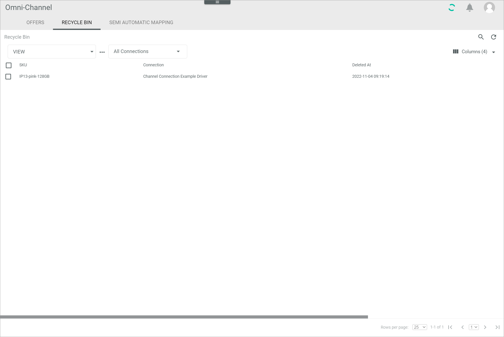

[!!Manage the offers](../Operation/01_ManageOffers.md)

# Recycle bin

*Omni-Channel > Offers > Tab RECYCLE BIN*

**Recycle Bin**

-  (Search)   
    Click this button to display the search bar and search for an offer.

-  (Refresh)   
    Click this button to update the list of recycled offers.

- *VIEW*   
    Click the drop-down list to select the view. All created views are displayed in the drop-down list. Click the  (Points) button to the right of the *VIEW* drop-down list to display the context menu and create a view.   

    -  (Points)      
        Click this button to the right of the *VIEW* drop-down list to display the context menu. The following menu entries are available:

        -  create  
            Click this entry to create a view. The *Create view* window is displayed, see [Create view](#create-view).

        -  rename  
            Click this entry to rename the selected view. The *Rename view* window is displayed, see [Rename view](#rename-view). This menu entry is only displayed if a view has been selected.

        -  reset  
            Click this entry to reset all unsaved changes to the settings of the selected view. This menu entry is only displayed if a view has been selected and any changes have been made to the view settings.

        -  publish  
            Click this entry to publish the view. This menu entry is only displayed if a view has been selected and unpublished.

        -  unpublish  
            Click this entry to unpublish the view. This menu entry is only displayed if a view has been selected and published.

        -  save  
            Click this entry to save the current view settings in the selected view. This menu entry is only displayed if a view has been selected.

            > [Info] When the settings of a view have been changed, an asterisk is displayed next to the view name. The asterisk is hidden as soon as the changes have been saved.

        -  delete  
            Click this entry to delete the selected view. A confirmation window to confirm the deletion is displayed. This menu entry is only displayed if a view has been selected.

- *All Connections*    
    Click the drop-down list to select a connection. All supported connections are displayed in the list. If you select a connection, the list of recycled offers is limited to those offers of the selected connection. Otherwise, the offers of all connections are displayed in the list of recycled offers.

-  Columns (x)   
    Click this button to display the columns bar and customize the displayed columns and the order of columns in the list. The *x* indicates the number of columns that are currently displayed in the list.

- [x]     
    Select the checkbox to display the editing toolbar. If you click the checkbox in the header, all offers in the list are selected.

-  (Recover)   
    Click this button to recover the selected offer(s). This button is only displayed if the checkbox of at least one offer is selected.   
  For detailed information, see [Recover an offer](../Operation/01_ManageOffers.md#recover-an-offer)

-  (Delete)     
    Click this button to delete the selected offer(s) permanently. This button is only displayed if the checkbox of at least one offer is selected.   
    For detailed information, see [Delete an offer](../Operation/01_ManageOffers.md#delete-an-offer).

The list displays all offers moved to the recycle bin. Depending on the settings, the displayed columns may vary. All fields are read-only. 

- *SKU*   
    Stock Keeping Unit. Identification number for the offer.  

- *Connection*   
    Assigned connection of the offer.

- *Deleted at*   
    Date and time of the deletion.

- *Deleted by*   
    Name and username of the user who deleted the offer.

- *ID*   
    Offer ID number. The ID number is automatically assigned to the offer by the system when it is created.
