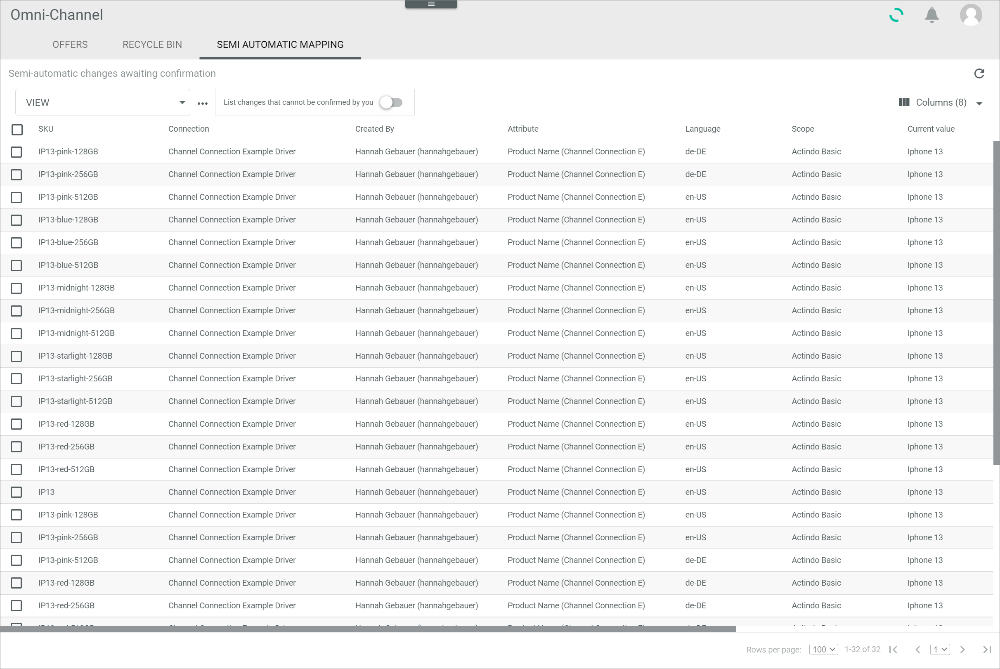

[!!Manage the offers](../Operation/01_ManageOffers.md)

# Semi automatic mapping

*Omni-Channel > Offers > Tab SEMI AUTOMATIC MAPPING*

[comment]: <> (screenshot anpassen/anonymisieren?)

**Semi-automatic changes awaiting confirmation**

-  (Refresh)   
    Click this button to update the list of offers awaiting confirmation.

- *VIEW*   
    Click the drop-down list to select the view. All created views are displayed in the drop-down list. Click the  (Points) button to the right of the *VIEW* drop-down list to display the context menu and create a view.   

    -  (Points)      
        Click this button to the right of the *VIEW* drop-down list to display the context menu. The following menu entries are available:

        -  create  
            Click this entry to create a view. The *Create view* window is displayed, see [Create view](#create-view).

        -  rename  
            Click this entry to rename the selected view. The *Rename view* window is displayed, see [Rename view](#rename-view). This menu entry is only displayed if a view has been selected.

        -  reset  
            Click this entry to reset all unsaved changes to the settings of the selected view. This menu entry is only displayed if a view has been selected and any changes have been made to the view settings.

        -  publish  
            Click this entry to publish the view. This menu entry is only displayed if a view has been selected and unpublished.

        -  unpublish  
            Click this entry to unpublish the view. This menu entry is only displayed if a view has been selected and published.

        -  save  
            Click this entry to save the current view settings in the selected view. This menu entry is only displayed if a view has been selected.

            > [Info] When the settings of a view have been changed, an asterisk is displayed next to the view name. The asterisk is hidden as soon as the changes have been saved.

        -  delete  
            Click this entry to delete the selected view. A confirmation window to confirm the deletion is displayed. This menu entry is only displayed if a view has been selected.

-  *List changes that cannot be confirmed by you*    
    Enable this toggle to list all offers including those that cannot be confirmed by you. Disable the toggle to list only offers that can be confirmed by you. By default, this toggle is disabled.

-  Columns (x)   
    Click this button to display the columns bar and customize the displayed columns and the order of columns in the list. The *x* indicates the number of columns that are currently displayed in the list.

- [x]     
    Select the checkbox to display the editing toolbar. If you click the checkbox in the header, all offers in the list are selected.

-  (Lock)   
    Locked offers cannot be confirmed by you. These offers are greyed out and cannot be selected.
    
- [CONFIRM]    
    Click this button to confirm the changes in the selected offer(s). The offer is uploaded with the confirmed changes and removed from the list. 

- [REJECT]   
    Click this button to reject the changes in the selected offer(s). The offer is removed from the list. 

Depending on whether the *List changes that cannot be confirmed by you* toggle is enabled or not, the list displays all offers, including those that cannot be confirmed by you, or only offers that can be confirmed by you. Depending on the settings, the displayed columns may vary. All fields are read-only. 

- *SKU*      
    Stock Keeping Unit. Identification number of the product.

- *Connection*  
    Selected connection for the offer.

- *Created by*  
    Name and username of the user who created the offer.

- *Attribute*   
    Name of the attribute that has been changed in the offer.

- *Language*   
    Language of the offer that has been changed.

- *Channel*   
    Channel of the offer that has been changed.    

- *Current value*   
    Current value of the attribute in the offer that has to be changed.

- *New value*   
    New value of the attribute in the offer that has to be changed.

- *ID*  
    Offer identification number. The ID number is automatically assigned by the system after creation.

- *Cannot be confirmed by user*   
    Indication whether the offer can be confirmed by the current user or not:
    -  (Checkmark): The offer can be confirmed by you.  
    -  (Cross): The offer cannot be confirmed by you.
