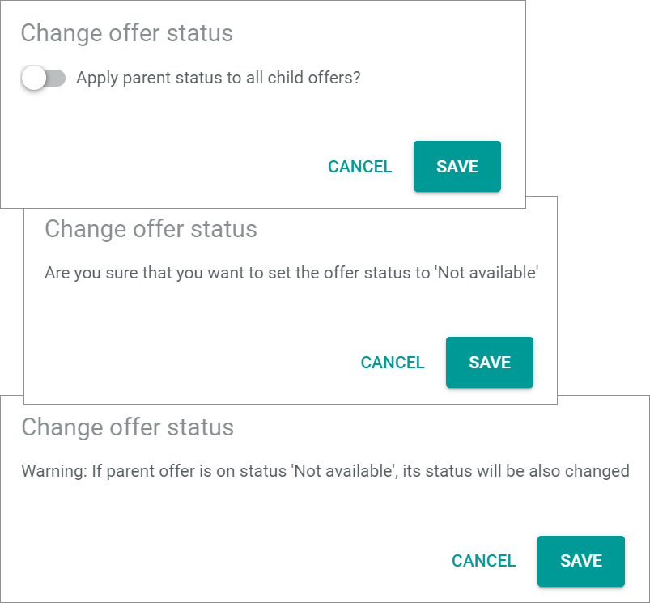

[!!Check the offer upload](../Operation/03_CheckOfferUpload.md#check-the-scheduled-offer-uploads)

# Scheduled uploads

*Omni-Channel > Offer upload > Tab SCHEDULED UPLOADS*

**Scheduled Exports**

-  (Search)   
  Click this button to display the search bar and search for a scheduled offer upload.

-  (Refresh)   
  Click this button to update the list of scheduled offer uploads.

- *VIEW*   
    Click the drop-down list to select the view. All created views are displayed in the drop-down list. Click the  (Points) button to the right of the *VIEW* drop-down list to display the context menu and create a view.   

    -  (Points)      
        Click this button to the right of the *VIEW* drop-down list to display the context menu. The following menu entries are available:

        -  create  
            Click this entry to create a view. The *Create view* window is displayed, see [Create view](#create-view).

        -  rename  
            Click this entry to rename the selected view. The *Rename view* window is displayed, see [Rename view](#rename-view). This menu entry is only displayed if a view has been selected.

        -  reset  
            Click this entry to reset all unsaved changes to the settings of the selected view. This menu entry is only displayed if a view has been selected and any changes have been made to the view settings.

        -  publish  
            Click this entry to publish the view. This menu entry is only displayed if a view has been selected and unpublished.

        -  unpublish  
            Click this entry to unpublish the view. This menu entry is only displayed if a view has been selected and published.

        -  save  
            Click this entry to save the current view settings in the selected view. This menu entry is only displayed if a view has been selected.

            > [Info] When the settings of a view have been changed, an asterisk is displayed next to the view name. The asterisk is hidden as soon as the changes have been saved.

        -  delete  
            Click this entry to delete the selected view. A confirmation window to confirm the deletion is displayed. This menu entry is only displayed if a view has been selected.

- *All Connections*    
  Click the drop-down list to select a connection. All available connections are displayed in the list. If you select a connection, the list of scheduled offer uploads is limited to those offer uploads of the selected connection. Otherwise, the offer uploads of all connections are displayed in the list of scheduled offer uploads.

-  Columns (x)   
  Click this button to display the columns bar and customize the displayed columns and the order of columns in the list. The *x* indicates the number of columns that are currently displayed in the list.

-  Filter (x)   
Click this button to display the filter bar and customize the active filters. The *x* indicates the number of filters that are currently active.

The list displays all scheduled offer uploads. Depending on the settings, the displayed columns may vary. All fields are read-only. If no uploads are currently scheduled, the *Currently no exports are scheduled* notice is displayed.

> [Info] The offer uploads are only displayed in the list as long as they have not yet been uploaded to the marketplace. Click the  (Refresh) button again to update the list. 

- *Connection*   
  Assigned connection of the offer.

- *Offer SKU*   
  Stock Keeping Unit. Identification number for the offer.

- *Status*  
  Status of the offer. The following options are available:  
  - **Active**   
    The offer is active. It is displayed in the marketplace, where it can be sold.   
  - **Inactive**   
    The offer is inactive. It is not longer displayed in the marketplace and thus cannot be sold anymore.   
  - **Not available**   
    The offer is deleted from the marketplace.   
    The *Change offer status* confirmation window is displayed. If the variant status of the selected offer equals **Master offer**, an additional toggle is displayed within the confirmation window.   

      

- *Pending status/Errors*  
  Indication of the pending status or an error for this offer. The selected status is displayed if you have changed the offer status via the editing toolbar. The following options are available:
  - **Active**	  
  - **Inactive**   	 
  - **Not available**  

[comment]: <> (when is an error displayed here? what is displayed? The Error code or message?)

- *Created on*  
  Date and time of the offer upload creation.

- *Created by*  
  Name and username of the user who changed the offer and triggered the upload.

- *Offer ID*   
  Offer identification number. The ID number is automatically assigned by the system after creation.

- *ID*  
  Offer upload identification number. The ID number is automatically assigned by the system after creation.

[comment]: <> (Unterschied ID und Offer ID?)
