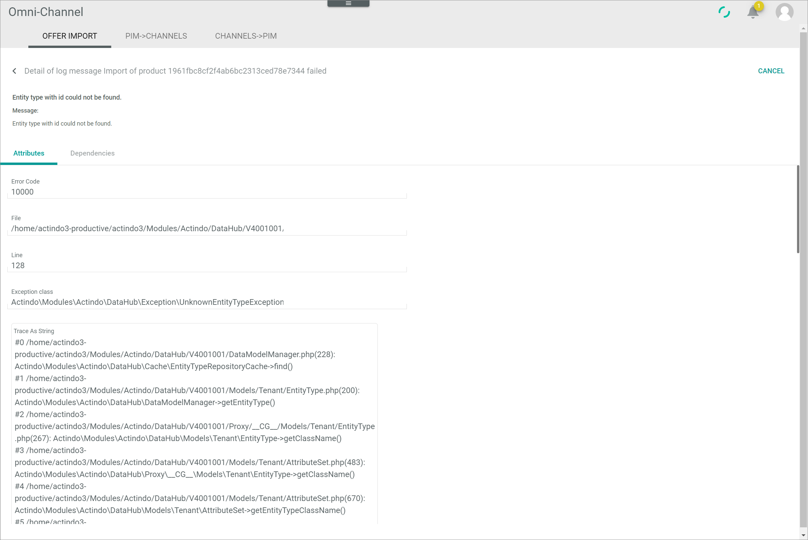

[!!Import offers](../Operation/02_ImportOffers.md)

# Offer import

*Omni-Channel > Offer import > Tab OFFER IMPORT*

**Importable products**

- [DOWNLOAD IMPORTABLE PRODUCTS]   
    Click this button to download all importable offers from the marketplace. This button is only displayed if a connection has been selected in the *Select connection* drop-down list.

- [IMPORT ALL LISTED PRODUCTS TO CHANNELS]   
    Click this button to import all listed offers from your marketplace at once to the *Omni-Channel* module. This button is only displayed if a connection has been selected in the *Select connection* drop-down list.

-  (Search)   
    Click this button to display the search bar and search for an offer import. This button is only displayed if a connection has been selected in the *Select connection* drop-down list.

-  (Refresh)   
    Click this button to update the list of importable offers. This button is only displayed if a connection has been selected in the *Select connection* drop-down list.

- *VIEW*   
    Click the drop-down list to select the view. All created views are displayed in the drop-down list. Click the  (Points) button to the right of the *VIEW* drop-down list to display the context menu and create a view.   

    -  (Points)      
        Click this button to the right of the *VIEW* drop-down list to display the context menu. The following menu entries are available:

        -  create  
            Click this entry to create a view. The *Create view* window is displayed, see [Create view](#create-view).

        -  rename  
            Click this entry to rename the selected view. The *Rename view* window is displayed, see [Rename view](#rename-view). This menu entry is only displayed if a view has been selected.

        -  reset  
            Click this entry to reset all unsaved changes to the settings of the selected view. This menu entry is only displayed if a view has been selected and any changes have been made to the view settings.

        -  publish  
            Click this entry to publish the view. This menu entry is only displayed if a view has been selected and unpublished.

        -  unpublish  
            Click this entry to unpublish the view. This menu entry is only displayed if a view has been selected and published.

        -  save  
            Click this entry to save the current view settings in the selected view. This menu entry is only displayed if a view has been selected.

            > [Info] When the settings of a view have been changed, an asterisk is displayed next to the view name. The asterisk is hidden as soon as the changes have been saved.

        -  delete  
            Click this entry to delete the selected view. A confirmation window to confirm the deletion is displayed. This menu entry is only displayed if a view has been selected.

- *Select connection*    
    Click the drop-down list to select a connection. All supported connections are displayed in the list. You must select a connection to display any offer imports in the list.

-  Columns (x)   
    Click this button to display the columns bar and customize the displayed columns and the order of columns in the list. The *x* indicates the number of columns that are currently displayed in the list.

-  Filter (x)   
    Click this button to display the filter bar and customize the active filters. The *x* indicates the number of filters that are currently active. This button is only displayed if a connection has been selected in the *Select connection* drop-down list.

- [x]     
    Select the checkbox to display the editing toolbar. If you click the checkbox in the header, all offer imports in the list are selected.

- [IMPORT PRODUCT(S) TO CHANNELS]   
    Click this button to import the selected offer(s) to the *Omni-Channel* module. This button is only displayed if a connection has been selected in the *Select connection* drop-down list and if the checkbox of at least one offer is selected.

- [DETAILS]   
    Click this button to display the *Detail of log message "Log message title"* view and check further details of the error. This button is only displayed if a connection has been selected in the *Select connection* drop-down list and if the checkbox of a single offer with an error is selected.

The list displays all offer imports. Depending on the settings, the displayed columns may vary. All fields are read-only. If no offer imports are available, the *Please select a connection to import products from* notice is displayed. The available columns differ depending on the selected connection in the *Select connection* drop-down list. Therefore, only those columns that are available for all connections are described in the following.

- *Error message*   
    Error log message if an error has occurred. Select the checkbox of the corresponding row and click the [DETAILS] button in the editing toolbar to display further details to the error. If no error has occurred, the field is empty.

- *Import status*   
    Import status of the offer to the *Omni-Channel* module. The following options are available:  
    - **Imported**   
        The offer is imported to the *Omni-Channel* module.  
    - **Not imported**   
        The offer is not (yet) imported to the *Omni-Channel* module.   
    - **Error**  
        An error has occurred during the import to the *Omni-Channel* module.

- *ID*   
    Offer identification number. The ID number is automatically assigned by the system after creation.

## Detail of log message "Log message title"

*Omni-Channel > Offer import > Tab OFFER IMPORT > Select checkbox of a faulty import > Button DETAILS*

For a detailed description of this view and the corresponding functions, see [LOG](./06a_Log.md#detail-of-log-message-log-message-title).
