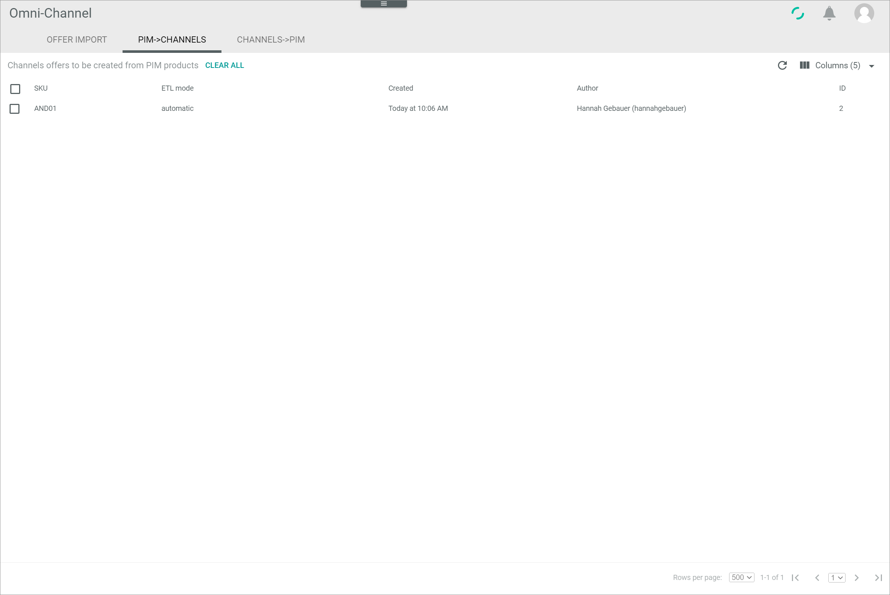

[!!Import an offer](../Operation/02_ImportOffers.md)
[!!Manage the offers](../Operation/01_ManageOffers.md)

# PIM->CHANNELS

*Omni-Channel > Offer import > Tab PIM->CHANNELS*

**Omni-Channel offers to be created from PIM products**	

- [CLEAR ALL]  
    Click this button to cancel all scheduled offer. All offers that have not been imported yet are canceled and removed from the list. 

[comment]: <> (FETA -> pop-up window mit bestätigung; FETA-13)

-  (Refresh)   
    Click this button to update the list of scheduled offer imports.

-  Columns (x)   
    Click this button to display the columns bar and customize the displayed columns and the order of columns in the list. The *x* indicates the number of columns that are currently displayed in the list.

The list displays all scheduled offer imports when creating offers from PIM products in the *Omni-Channel* module, see [Create an offer from a PIM product](../Operation/01_ManageOffers.md#create-an-offer-from-a-pim-product). Depending on the settings, the displayed columns may vary. All fields are read-only. If no offer imports are scheduled, the *No imports are currently scheduled* notice is displayed. 

- *SKU*  
   Stock Keeping Unit. Identification number for the offer.

- *Change tracking mode*  
    Change tracking mode (ETL mode) of the dependent entity. The following options are available:  
    - **manual**   
        Changes in a PIM product must be triggered manually to be applied to the offer. The initial offer is automatically applied.
    - **semiautomatic**   
        Changes in a PIM product are automatically applied to the offer after confirmation. The initial offer is automatically applied without confirmation.   
    - **semiautomatic, changes must be confirmed by another user**   
        Changes in a PIM product are automatically applied to the offer after confirmation by another user. The initial offer is only applied after confirmation by another user.       
    - **automatic**    
        Changes in a PIM product are automatically applied to the offer. The initial offer is also automatically applied.

- *Created*  
    Date and time of the offer import creation.

- *Author*  
    Name and username of the user who triggered the import.

- *ID*  
    Offer import identification number. The ID number is automatically assigned by the system after creation.

