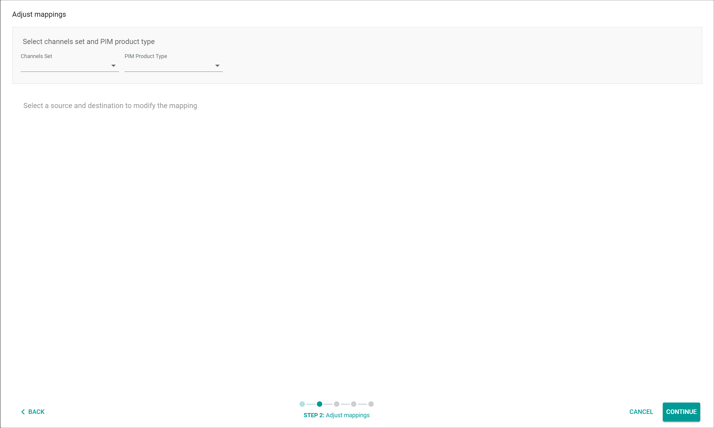
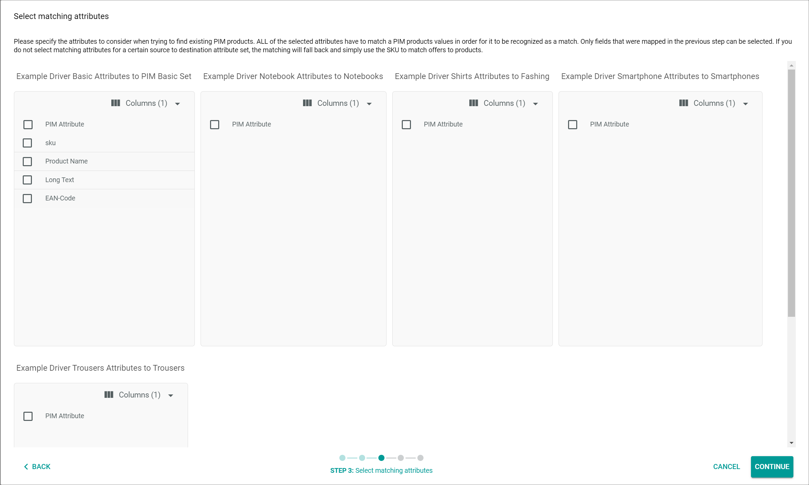
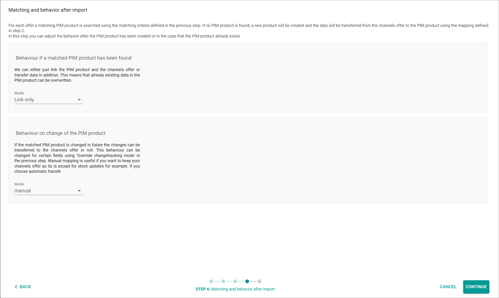
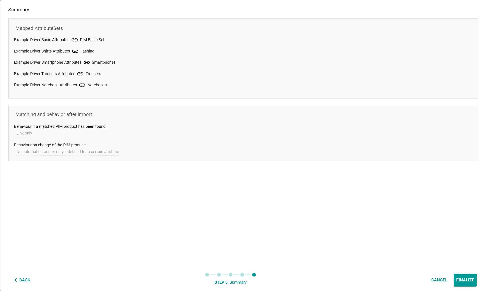
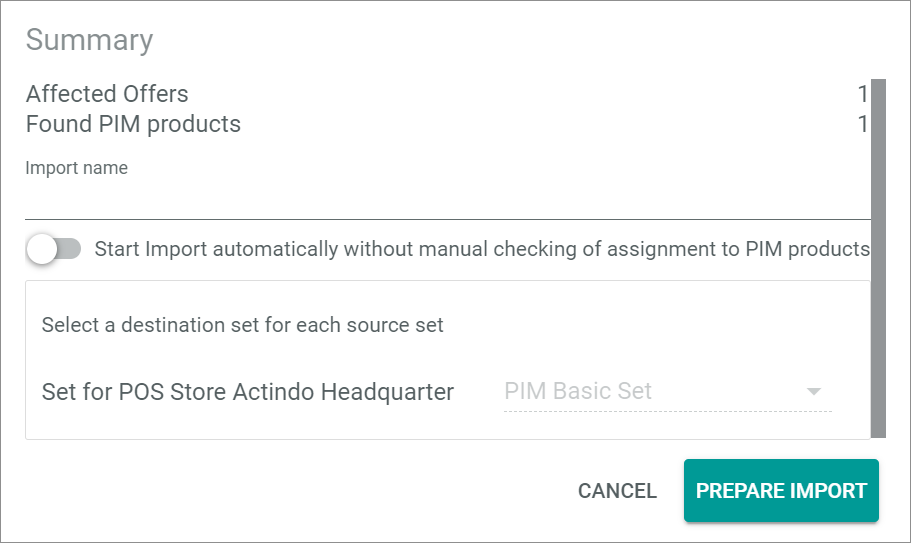

[!!Import an offer](../Operation/02_ImportOffers.md)
[!!User interface List](../../PIM/UserInterface/02a_List.md)
[!!User interface ETL](../../DataHub/UserInterface/02d_ETL.md)

# CHANNELS->PIM

*Omni-Channel > Offer import > Tab CHANNELS->PIM*

**Please select a connection to proceed to the import wizard**

- *Select connection*   
    Click the drop-down list to select the connection from which you want to import the Omni-Channel offers to PIM. All available

- [SELECT]   
    Click this button to confirm the selected connection in the *Select connection* drop-down list and proceed to the import wizard. The *Map attribute sets* wizard window is displayed.

## Map attribute sets

*Omni-Channel > Offer import > Tab CHANNELS->PIM > Select connection > Button SELECT > Wizard window Map attribute sets*

**Scope and language**

- *Language in PIM*   
    Click the drop-down list to select the language in PIM to which the value of a destination multi-language attribute will be written.

- *Channel in PIM*   
    Click the drop-down list to select the channel in PIM to which the value of a destination multi-channel attribute will be written.

**Source attribute set: "Source attribute set name"**

A single box is displayed for each attribute set in the selected connection. 

- *Assigned PIM attribute set*   
    Click the drop-down list to select the attribute set in PIM which will be assigned to the corresponding Omni-Channel attribute set. All PIM attribute sets that are mapped to the corresponding Omni-Channel attribute sets are displayed in the list. You can assign multiple PIM attribute sets to a single Omni-Channel attribute set.

-  (Delete)   
    Click this button to delete the corresponding mapping. You can only delete a mapping, if at least one more mapping is assigned to the attribute set.

-  (Add)   
    Click this button to add a further attribute set to the mapping. You can add an unlimited number of attribute sets to a mapping.

- [CANCEL]   
    Click this button to cancel the import wizard. The *Map attribute sets* wizard window is closed.

- [CONTINUE]   
    Click this button to proceed to the next step. The *Adjust mappings* wizard window is displayed.

## Adjust mappings

*Omni-Channel > Offer import > Tab CHANNELS->PIM > Select connection > Button SELECT > Wizard window Adjust mappings*

**Select channels set and PIM product type**

- *Channels attribute set*   
    Click the drop-down list to select the Omni-Channel attribute set for mapping. All Omni-Channel attribute sets are displayed in the list.

- *PIM attribute set*   
    Click the drop-down list to select the PIM attribute set for mapping. All PIM attribute sets are displayed in the list. The *Mapping from "Omni-Channel attribute set name" to "PIM attribute set name"* section with the corresponding mapping is displayed.

**Mapping from "Omni-Channel attribute set name" to "PIM attribute set name"**

This view equals the attribute mapping in the *DataHub* module: *DataHub > Settings > Tab ETL > Select attribute set mapping*   

For a detailed description of this window and the corresponding functions, see [ETL](../../DataHub/UserInterface/02d_ETL.md#mapping).

- [BACK]   
    Click this button to go back to the previous step of the import wizard. The *Map attribute sets* wizard window is displayed.

- [CANCEL]   
    Click this button to cancel the import wizard. The *Adjust mappings* wizard window is closed.

- [CONTINUE]   
    Click this button to proceed to the next step. The *Select matching attributes* wizard window is displayed.

## Select matching attributes

*Omni-Channel > Offer import > Tab CHANNELS->PIM > Select connection > Button SELECT > Select matching attributes*

**"Attribute set mapping name"**

A single box with PIM attributes is displayed for each available attribute set mapping from *PIM* to *Omni-Channel*.

-  Columns (x)   
    Click this button to display the columns bar and customize the displayed columns and the order of columns in the list. The *x* indicates the number of columns that are currently displayed in the list.

- [x] *PIM attribute*
    Select the checkbox to select all checkboxes in the list.

- [x] *"Attribute name"*
    Select the checkbox to consider the attribute when matching with an existing PIM product. 
    
    > [Info] A single checkbox is displayed for each mapped attribute.

- [BACK]   
    Click this button to go back to the previous step of the import wizard. The *Adjust mappings* wizard window is displayed.

- [CANCEL]   
    Click this button to cancel the import wizard. The *Select matching attributes* wizard window is closed.

- [CONTINUE]   
    Click this button to proceed to the next step. The *Matching and behavior after import* wizard window is displayed.

## Matching and behavior after import

*Omni-Channel > Offer import > Tab CHANNELS->PIM > Select connection > Button SELECT > Wizard window Matching and behavior after import*

**Behavior if a matched PIM product has been found**

- *Mode*   
    Click the drop-down list to select the behavior if a matched PIM product has been found. The following options are available:
    - **Link only**   
        Only a dependency between the PIM product and the offer is created.
    - **Link and transfer data**   
        A dependency between the PIM product and the offer is created. In addition, an ETL mapping is performed between the PIM product and the offer, whereby all data from the PIM product is written into the Omni-Channel offer. 

**Behavior on change of the PIM product**

- *Mode*   
    Click the drop-down list to select the behavior on change of the PIM product. The following options are available:   
    - **manual**   
        Changes in a PIM product must be triggered manually to be applied to the offer. The initial offer is automatically applied.
    - **semiautomatic**   
        Changes in a PIM product are automatically applied to the offer after confirmation. The initial offer is automatically applied without confirmation.   
    - **semiautomatic, changes must be confirmed by another user**   
        Changes in a PIM product are automatically applied to the offer after confirmation by another user. The initial offer is only applied after confirmation by another user.       
    - **automatic**    
        Changes in a PIM product are automatically applied to the offer. The initial offer is also automatically applied.

        > [Info] The selected change tracking mode is applied for the link that will be created between the PIM products and the offers.

- [BACK]   
    Click this button to go back to the previous step of the import wizard. The *Select matching attributes* wizard window is displayed.

- [CANCEL]   
    Click this button to cancel the import wizard. The *Matching and behavior after import* wizard window is closed.

- [CONTINUE]   
    Click this button to proceed to the next step. The *Summary* wizard window is displayed. The *Wizard finalized* pop-up window is displayed.

## Summary

*Omni-Channel > Offer import > Tab CHANNELS->PIM > Select connection > Button SELECT > Wizard window Summary*

The *Mapped attribute sets* box displays the selected mapping. The *Matching and behavior after import* box displays the selected behavior after import.

- [BACK]   
    Click this button to go back to the previous step of the import wizard. The *Matching and behavior after import* wizard window is displayed.

- [CANCEL]   
    Click this button to cancel the import wizard. The *Summary* wizard window is closed.

- [FINALIZE]   
    Click this button to save the import settings. The *Summary* wizard window is closed. The *Offers* view is displayed.

## Offers   

*Omni-Channel > Offer import > Tab CHANNELS->PIM > Select connection > Button SELECT > Finalize wizard*

**Offers**

- [CHANGE IMPORT SETTINGS]   
    Click this button to change the import settings and restart the import wizard. The *Map attribute sets* wizard window is displayed, see [Map attribute sets](#map-attribute-sets).

- [IMPORT/MAP ALL OFFERS TO PIM PRODUCTS]    
    Click this button to create an import process for all offers in the list. The *Summary* window is displayed, see [Summary](#summary-1).

-  (Search)   
    Click this button to display the search bar and search for an offer.

-  (Refresh)   
    Click this button to update the list of offers.

- *VIEW*   
    Click the drop-down list to select the view. All created views are displayed in the drop-down list. Click the  (Points) button to the right of the *VIEW* drop-down list to display the context menu and create a view.   

    -  (Points)      
        Click this button to the right of the *VIEW* drop-down list to display the context menu. The following menu entries are available:

        -  create  
            Click this entry to create a view. The *Create view* window is displayed, see [Create view](#create-view).

        -  rename  
            Click this entry to rename the selected view. The *Rename view* window is displayed, see [Rename view](#rename-view). This menu entry is only displayed if a view has been selected.

        -  reset  
            Click this entry to reset all unsaved changes to the settings of the selected view. This menu entry is only displayed if a view has been selected and any changes have been made to the view settings.

        -  publish  
            Click this entry to publish the view. This menu entry is only displayed if a view has been selected and unpublished.

        -  unpublish  
            Click this entry to unpublish the view. This menu entry is only displayed if a view has been selected and published.

        -  save  
            Click this entry to save the current view settings in the selected view. This menu entry is only displayed if a view has been selected.

            > [Info] When the settings of a view have been changed, an asterisk is displayed next to the view name. The asterisk is hidden as soon as the changes have been saved.

        -  delete  
            Click this entry to delete the selected view. A confirmation window to confirm the deletion is displayed. This menu entry is only displayed if a view has been selected.

- *"Selected connection name"*    
    The selected connection is displayed in the drop-down list. The drop-down list is locked.

-  Columns (x)   
    Click this button to display the columns bar and customize the displayed columns and the order of columns in the list. The *x* indicates the number of columns that are currently displayed in the list.

-  Filter (x)   
    Click this button to display the filter bar and customize the active filters. The *x* indicates the number of filters that are currently active.

- [x]     
    Select the checkbox to display the editing toolbar. If you click the checkbox in the header, all offers in the list are selected.

- [CREATE PIM PRODUCTS/MAP OFFERS TO EXISTING PIM PRODUCTS]            
    Click this button to create an import process for the selected offers in the list. The *Summary* window is displayed, see [Summary](#summary-1).

The list displays all offers to be imported. Depending on the settings, the displayed columns may vary. All fields are read-only. 

- *SKU*   
    Stock Keeping Unit. Identification number of the product to the offer. 
 
- *Variant status*  
    Variant type of the offer. The following options are available:  
    - **Master offer**   
        This offer refers to a master product.
    - **Variant offer**   
        This offer refers to a variant.
    - **Standalone Offer**  
        This offer refers to a single product.

- *Status*  
    Status of the offer. The following options are available:  
    - **Active**   
        The offer is active. It is displayed in the marketplace, where it can be sold.   
    - **Inactive**   
        The offer is inactive. It is no longer displayed in the marketplace and thus cannot be sold anymore.   
    - **Not available**   
        The offer is deleted from the marketplace.     

    The *Change offer status* confirmation window is displayed. If the variant status of the selected offer equals **Master offer**, an additional toggle is displayed within the confirmation window. If the variant status of the selected offer equals **Variant offer**, an additional warning is displayed within the confirmation window.

    

- *Pending status/Errors*  
    Indication of the pending status or an error for this offer. The selected status is displayed if you have changed the offer status via the editing toolbar. The following options are available:
    - **Active**	  
    - **Inactive**   	 
    - **Not available**  

    If an error occurs when uploading the offer, the error message is displayed in the column. Click the [Show log message] button in the column to display the corresponding log message in the *LOG* tab, see [User interface LOG](./06a_Log.md).

- *Last upload*  
    Date and time of the last offer upload.

- *Connection*  
    Selected connection for the offer.

- *Attribute set*  
    Attribute set assigned to the offer.  

- *Created on*  
    Date and time of the creation.

- *Created by*  
    Name and username of the user who created the offer.

- *Modified on*  
    Date and time of the last modification.

- *Modified by*  
    Name and username of the user who modified the offer.

- *ID*  
    Offer identification number. The ID number is automatically assigned by the system after creation.

- *"Attribute name"*    
    You can add a column for each attribute that is assigned to the offer. The column displays the attribute name, the row displays the corresponding attribute value of the offer.

**Processes**
 
- *"Import process name"*  
    Process for the import to the *PIM* module. The status of the process is displayed below the name of the import process. The following statuses are available:
    - **Queue filled, waiting for start**    
        The product is ready to be imported to the *PIM* module.
    - **Importing into PIM**   
        The product is being imported from the *Omni-Channel* to the *PIM* module.
    - **Import finished**   
        The product has been imported to the *PIM* module.
    - **Import failed**
        The product import to the *PIM* module has been failed.

    - [START]   
        Click this button to the right of the corresponding import process to start the import in the *Processes* section with the **Queue filled, waiting for start** status.
        This button is only displayed if the status of the corresponding process equals **Queue filled, waiting for start**.

    -  (Points)   
        Click this button to the right of the corresponding import process to display the context menu. The following menu entries are available:
        -  Delete  
            Click this entry to remove the corresponding import process from the *Processes* section.
        - Rerun    
            Click this entry to restart the faulty process. This entry is only displayed if the import process has failed.

[comment]: <> (Import failed? Prüfen, wie der Status heißt; bislang noch keinen fehlerhaften import dabei gehabt...; Icon von rerun button hinzufügen)

-  (Refresh)   
    Click this button to update the list of import processes.

### Summary

*Omni-Channel > Offer import > Tab CHANNELS->PIM > Select connection > Button SELECT > Finalize wizard > Tab Offers > Button IMPORT/MAP ALL OFFERS TO PIM PRODUCTS*   

*Omni-Channel > Offer import > Tab CHANNELS->PIM > Select connection > Button SELECT > Finalize wizard > Tab Offers > Select offer(s) > Button CREATE PIM PRODUCTS/MAP OFFERS TO EXISTING PIM PRODUCTS*

- *Affected offers*   
    Number of offers that can be imported to the *PIM* module.

- *Found PIM products*   
    Number of existing PIM products that match the offer.

- *Import name*   
    Enter a name for the import process.

-  *Start Import automatically without manual checking of assignment to PIM products*   
    Enable this toggle to automatically start the import after having clicked the [PREPARE IMPORT] button. Disable the toggle to manually trigger the import. By default, this toggle is disabled.

**Select a destination set for each source set**  

- *Set for "connection name"*   
    Click the drop-down list to select the destination attribute set for the import. All available destination attribute sets for the source attribute set are displayed in the list. If only one attribute set is available, this attribute set is automatically selected and the drop-down list is locked.  

- [CANCEL]   
    Click this button to cancel the import to PIM. The *Summary* window is closed.

- [PREPARE IMPORT]    
    Click this button to create the import process(es) to the *PIM* module. The *Summary* window is closed. All scheduled import processes are displayed in the *Processes* section.

### Import process

*Omni-Channel > Offer import > Tab CHANNELS->PIM > Select connection > Button SELECT > Finalize wizard > Tab Offers > Select import process   

The import process window is composed of the following tabs:
- [Import processes &ndash; Messages](#import-process--messages)
- [Import processes &ndash; Queue](#import-process--queue)

### Import process &ndash; Messages

*Omni-Channel > Offer import > Tab CHANNELS->PIM > Select connection > Button SELECT > Finalize wizard > Tab Offers > Select import process > Tab Messages*

**Messages**

-  (Refresh)   
    Click this button to update the list of error messages.

-  Columns (x)   
    Click this button to display the columns bar and customize the displayed columns and the order of columns in the list. The *x* indicates the number of columns that are currently displayed in the list.

The list displays all error messages. Depending on the settings, the displayed columns may vary. All fields are read-only. If no error has been occurred, the *No error messages* notice is displayed.

- *Log Message Title*    
    Title of the error message.

- *Message*   
    Complete error message if an error has occurred.

- *ID*  
    Error identification number. The ID number is automatically assigned by the system.

### Import process &ndash; Queue

*Omni-Channel > Offer import > Tab CHANNELS->PIM > Select connection > Button SELECT > Finalize wizard > Tab Offers > Select import process > Tab Queue*
 

**Export Omni-Channel offers to PIM products**

-  (Search)   
    Click this button to display the search bar and search for a line item.

-  (Refresh)   
    Click this button to update the list of line items.

-  Columns (x)   
    Click this button to display the columns bar and customize the displayed columns and the order of columns in the list. The *x* indicates the number of columns that are currently displayed in the list.

-  Filter (x)   
    Click this button to display the filter bar and customize the active filters. The *x* indicates the number of filters that are currently active.

- [x]     
    Select the checkbox to display the editing toolbar. If you click the checkbox in the header, all line items in the list are selected. Alternatively you can click directly a row in the list to select the corresponding checkbox and display the editing toolbar.

-  (Edit)   
    Click this button to edit the selected line item from the list. The button is only displayed if the import process has not yet been started and the checkbox of a single line item is selected. The *Edit line item* view is displayed, see [Edit line item](#edit-line-item).

[comment]: <> (Name der View neu!/nicht in UI -> FETA-17)

-  (Delete)   
    Click this button to delete the selected line item(s) from the import process. The button is only displayed if the checkbox of at least one line item is selected. The line item is removed from the list. The *Items deleted* pop-up window is displayed.

The list displays all line items of the selected import process. Depending on the settings, the displayed columns may vary. All fields are read-only. 

- *SKU Channels offer*   
    Stock Keeping Unit. Identification number of the line item. 

- *SKU PIM product*    
    Stock Keeping Unit. Identification number of the assigned PIM product. If no PIM product exists to the line item, the *No matching PIM product found* notice is displayed. 

- *Destination attribute set*   
    Name of the destination attribute set. 

- *Data transfer from PIM product to channels offer*   
    Data transfer mode from the PIM product to the Omni-Channel offer. The following options are available:   
    - **manual**   
        Changes in a PIM product must be triggered manually to be applied to the offer. The initial offer is automatically applied.
    - **semiautomatic**   
        Changes in a PIM product are automatically applied to the offer after confirmation. The initial offer is automatically applied without confirmation.   
    - **semiautomatic, changes must be confirmed by another user**   
        Changes in a PIM product are automatically applied to the offer after confirmation by another user. The initial offer is only applied after confirmation by another user.       
    - **automatic**    
        Changes in a PIM product are automatically applied to the offer. The initial offer is also automatically applied.

        > [Info] The selected change tracking mode is applied for the link that will be created between the PIM products and the offers.

- *Initial data transfer offer to existing product*    
    Initial data transfer mode if a PIM product to the offer already exists. The following options are available:
    - **Link only**   
        Only a dependency between the PIM product and the offer is created.
    - **Link and transfer data**   
        A dependency between the PIM product and the offer is created. In addition, an ETL mapping is performed between the PIM product and the offer, whereby all data from the PIM product is written into the Omni-Channel offer.   

- *State*   
    State of the line item. The following options are available:
    - **Queued**
    - **Done**

- *Author*   
    Name and username of the user who triggered the import process.

- *Error message*   
    Error log message if an error has occurred. If no error has occurred, this field is blank.

- *ID*   
    Line item identification number. The ID number is automatically assigned by the system after creation.

#### Edit line item

*Omni-Channel > Offer import > Tab CHANNELS->PIM > Select connection > Button SELECT > Finalize wizard > Tab Offers > Select import process > Tab Queue > Select line item > Button Edit*
 

- *Data transfer from PIM product to Channels offer*   
    Click the drop-down list to select the data transfer mode from the PIM product to the Omni-Channel offer. The following options are available:   
    - **manual**   
        Changes in a PIM product must be triggered manually to be applied to the offer. The initial offer is automatically applied.
    - **semiautomatic**   
        Changes in a PIM product are automatically applied to the offer after confirmation. The initial offer is automatically applied without confirmation.   
    - **semiautomatic, changes must be confirmed by another user**   
        Changes in a PIM product are automatically applied to the offer after confirmation by another user. The initial offer is only applied after confirmation by another user.       
    - **automatic**    
        Changes in a PIM product are automatically applied to the offer. The initial offer is also automatically applied.

        > [Info] The selected change tracking mode is applied for the link that will be created between the PIM products and the offers.

- *Initial data transfer offer to existing product*   
    Click the drop-down list to select the initial data transfer mode if a PIM product to the offer already exists. The following options are available:
    - **Link only**   
        Only a dependency between the PIM product and the offer is created.
    - **Link and transfer data**   
        A dependency between the PIM product and the offer is created. In addition, an ETL mapping is performed between the PIM product and the offer, whereby all data from the PIM product is written into the Omni-Channel offer.     

[comment]: <> (die Felder entsprechen den Mode Feldern im wizard fenster Matching and behavior after import >> Beschreibungen anpassen -> FETA-18)

- *PIM product SKU*   
    SKU of the PIM product that is assigned to the selected line item. By default, the field is blank. 
    -  (Edit)
        Click this button to assign a PIM product to the item or to change the selected PIM product. The *Products* window is displayed, see [Products](#products).
    -  (Delete)   
        Click this button to delete the assigned PIM product. The button is only displayed if a PIM product is assigned to the item. 

- [CANCEL]   
    Click this button to cancel editing the selected line item. The *Edit line item* view is closed.

- [SAVE]  
    Click this button to save all changes to the line item. The *Edit line item* view is closed.

#### Products

*Omni-Channel > Offer import > Tab CHANNELS->PIM > Select connection > Button SELECT > Finalize wizard > Tab Offers > Select import process > Tab Queue > Select item > Button Edit > Field PIM product SKU > Button Edit*

**Products**

This window displays the products list from the *PIM* module. 

For a detailed description of this window and the corresponding functions, see [User Interface List](../../PIM/UserInterface/02a_List.md).
