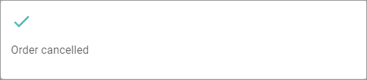
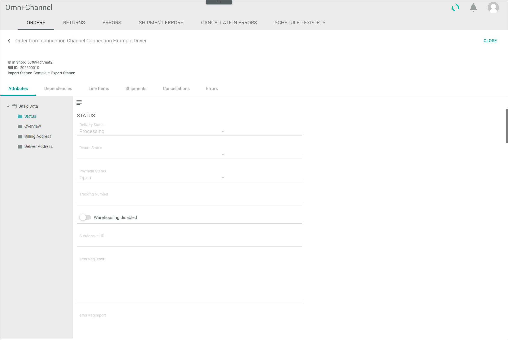
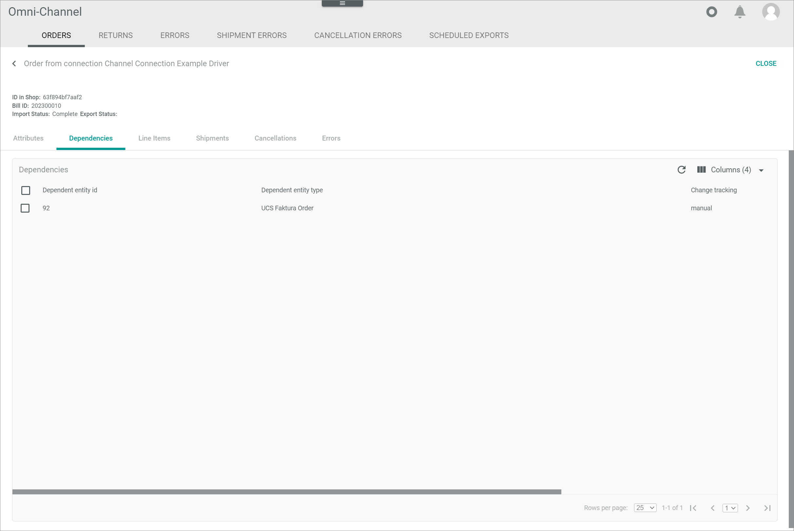
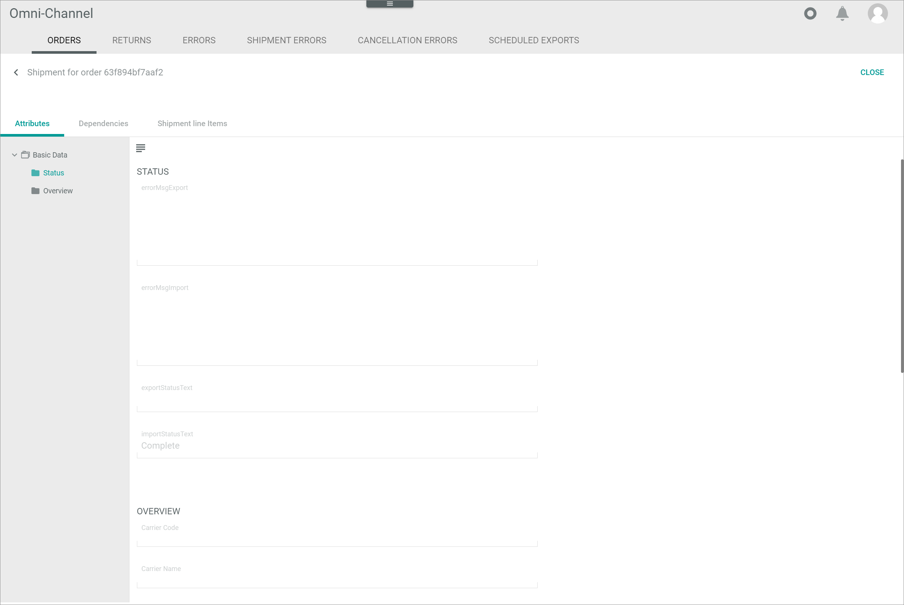
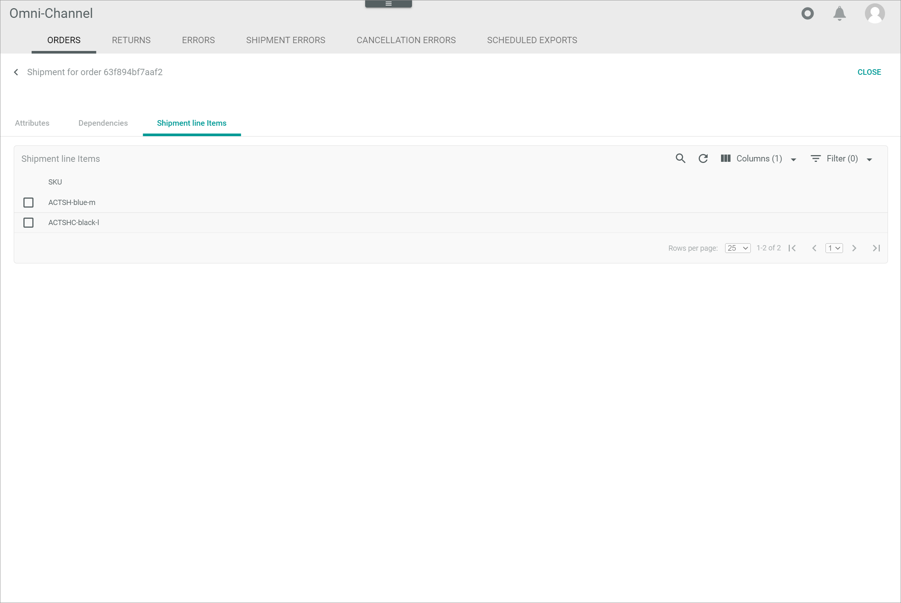
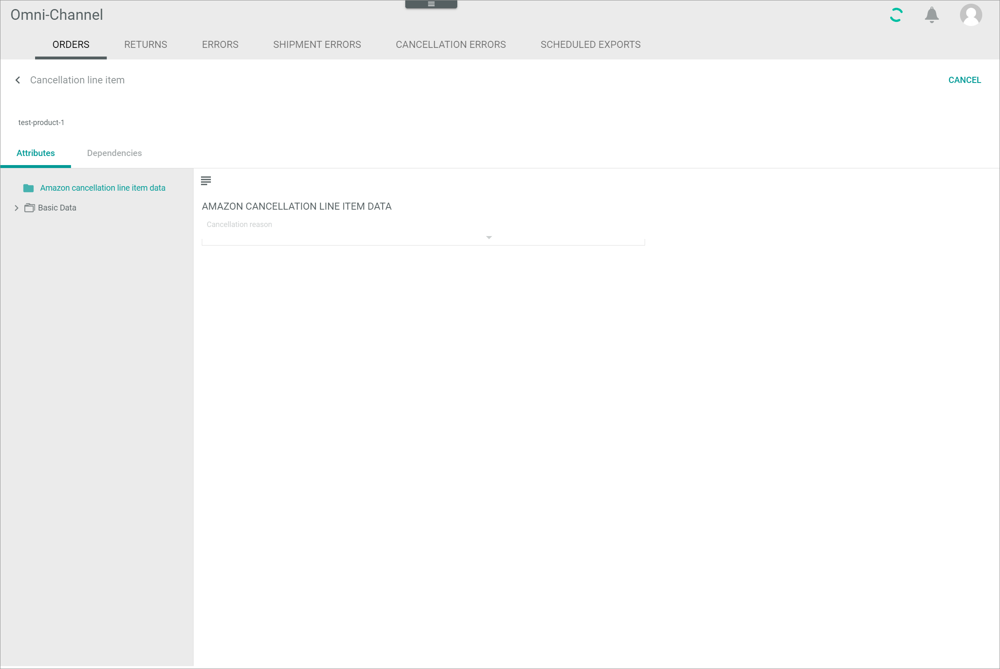
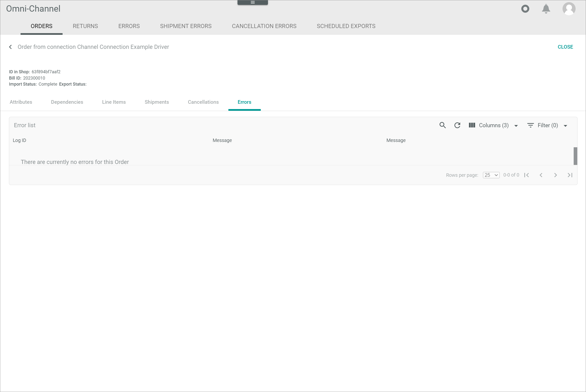

[!!Configure the orders and returns](../Integration/04_ConfigureOrdersReturns.md)
[!!Manage the orders and returns](../Operation/04_ManageOrdersReturns.md)
[!!User interface LOG](./06a_Log.md)

[comment]: <> (Add link to Order management if available)

# Orders

*Omni-Channel > Orders and returns > Tab ORDERS*

**Orders**

- *Combined status*  
    Combined status of all orders. The following statuses are available:
    -  (red)  
        At least one order is faulty. Click the [>> more] button right to the status to switch to the *ERRORS* tab, see [User interface Errors (Orders and returns)](./05c_Errors.md).   
    -  (yellow)  
        At least one order is still pending.
    -  (green)  
        All orders are completed.

-  (Search)   
    Click this button to display the search bar and search for an order.

-  (Refresh)   
    Click this button to update the list of orders.

- *VIEW*   
    Click the drop-down list to select the view. All created views are displayed in the drop-down list. Click the  (Points) button to the right of the *VIEW* drop-down list to display the context menu and create a view.   

    -  (Points)      
        Click this button to the right of the *VIEW* drop-down list to display the context menu. The following menu entries are available:

        -  create  
            Click this entry to create a view. The *Create view* window is displayed, see [Create view](#create-view).

        -  rename  
            Click this entry to rename the selected view. The *Rename view* window is displayed, see [Rename view](#rename-view). This menu entry is only displayed if a view has been selected.

        -  reset  
            Click this entry to reset all unsaved changes to the settings of the selected view. This menu entry is only displayed if a view has been selected and any changes have been made to the view settings.

        -  publish  
            Click this entry to publish the view. This menu entry is only displayed if a view has been selected and unpublished.

        -  unpublish  
            Click this entry to unpublish the view. This menu entry is only displayed if a view has been selected and published.

        -  save  
            Click this entry to save the current view settings in the selected view. This menu entry is only displayed if a view has been selected.

            > [Info] When the settings of a view have been changed, an asterisk is displayed next to the view name. The asterisk is hidden as soon as the changes have been saved.

        -  delete  
            Click this entry to delete the selected view. A confirmation window to confirm the deletion is displayed. This menu entry is only displayed if a view has been selected.

- *All Connections*    
    Click the drop-down list to select a connection. All available connections are displayed in the list. When a connection has been selected, the [Import orders] button, the *Download orders automatically* drop-down list and the [SAVE] button are displayed.

- [Import orders for all connections]  
    Click this button to import the orders for all connections. This button is only displayed if no connection has been selected in the *All connections* drop-down list.

- [Import orders]  
    Click this button to import all orders for the selected connection. This button is only displayed if a connection has been selected in the *All connections* drop-down list.

- [Download orders automatically]  
    Click the drop-down list and select the desired time interval for the automatic download of orders. This drop-down list is only displayed if a connection has been selected in the *All connections* drop-down list. By default, the **never** option is preselected. The following options are available:
    - **never**
    - **every 2 minutes**
    - **every 5 minutes**
    - **every 10 minutes**
    - **every 15 minutes**
    - **every 20 minutes**
    - **every 30 minutes**
    - **every 60 minutes**

- [SAVE]  
    Click this button to save the settings for the automatic download of orders. This button is only displayed if a connection has been selected in the *All connections* drop-down list.

-  Columns (x)   
    Click this button to display the columns bar and customize the displayed columns and the order of columns in the list. The *x* indicates the number of columns that are currently displayed in the list.

-  Filter (x)   
    Click this button to display the filter bar and customize the active filters. The *x* indicates the number of filters that are currently active.

- [x]     
    Select the checkbox to display the editing toolbar. If you click the checkbox in the header, all orders in the list are selected.

- [VIEW]  
    Click this button to display the *Order from connection "Connection name"* view of the selected order. Alternatively, you can click directly a row in the list to display the corresponding order. This button is only displayed if a single checkbox in the list of connections is selected.

- [EXPORT TO OMS]  
    Click this button to export the selected order(s) to the *Order management* module. This button is only displayed if the checkbox of at least one order is selected. The status in the *Status of export to OMS* column changes to **Being exported**.

- [RETRY IMPORT]  
    Click this button to retry the import of the selected order(s). This button is only displayed if the checkbox of at least one faulty order is selected. The *Import will be retried* pop-up window is displayed.

    

[comment]: <> (aktuell noch BUG -> wird nur bei Auswahl von mindestens zwei orders angezeigt -> Bug reported: BUG-144)

- [CANCEL ORDER]/[CANCEL ORDERS]  
    Click this button to cancel the import of the selected order(s). This button is only displayed if the checkbox of at least one order with the **Error** status in the *Status of import from channel* column is selected. The import status changes to **Cancelled**. The *Order cancelled* pop-up window is displayed.

    

The list displays all orders, either for all connections or for the selected connection. Depending on the settings, the displayed columns may vary. All fields are read-only. 

- *Connection*  
    Connection name. 

- *Status of import from channel*   
    Status of the order import from the marketplace to the *Omni-Channel* module. The following options are available:  
    - **Not imported**  
        The order has not been imported.
    - **Imported**  
        The order has been imported.
    - **Complete**  
        The order import has been successfully completed.   	
    - **Error**  
        The order import has been failed. Click the [Show log message] button in the column to display the corresponding log message in the *LOG* tab, see [User interface LOG](./06a_Log.md).
    - **Canceled**  
        The order import has been canceled.  

- *Status of export to channel*  
    Status of the order export from the *Omni-Channel* module to the marketplace. The following options are available:  
    - **Exported**  
        The order has been exported.  
    - **No changes to sync**  
        The order has no changes to synchronize.
    - **Error**   
        The order export has been failed. Click the [Show log message] button in the column to display the corresponding log message in the *LOG* tab, see [User interface LOG](./06a_Log.md).

- *Status of export to OMS*  
    Status of the order export from the *Omni-Channel* module to the *Order management* module for further processing. The following options are available:  
    - **Exported**  
        The order has been exported.
    - **Not exported**  
        The order has not been exported.  
    - **Not exported: Pending > 30 minutes to OMS**  
        The order export is pending.
    - **Being exported**  
        The order is currently being exported.

- *Created on*  
    Date and time of the creation. 

- *Modified on*  
    Date and time of the last modification. 

- *Remote ID*  
    Identification number of the order in the marketplace.

- *ID in OMS*  
    Identification number of the document in the *Order management* module.    

- *\# Line items*  
    Number of the line items in the order.

- *Line items*  
    SKU of the line item(s) in the order. 

- *ID*  
    Order identification number. The ID number is automatically assigned by the system.

- *"Attribute name"*    
    You can add a column for each attribute that is assigned to the order. The column displays the attribute name, the row displays the corresponding attribute value of the order.

## Order from connection "Connection name"

*Omni-Channel > Orders and returns > Tab ORDERS > Select order*

-  (Back)   
    Click this button to close the *Order from connection "Connection name"* view and return to the order list. All changes are rejected.

- [CLOSE]  
    Click this button to close the *Order from connection "Connection name"* view.

- *ID in shop:*  
    Identification number of the order in the marketplace. 

- *Bill ID:*  
    Identification number of the document in the *Order management* module.   
  
- *Import status:*  
    Order import status from the marketplace to the *Omni-Channel* module. The following statuses are available:  
    - **Not imported**
    - **Imported**
    - **Complete**  
    - **Canceled**
    - **Error**

- *Export status:*  
    Order export status from the *Omni-Channel* module to the *Order management* module. The following statuses are available:  
    - **Exported**
    - **Being Exported**
    - **Not exported**  
    
[comment]: <> (Export status Anzeige funktioniert nicht, nicht klar definiert welcher export status -> FETA-15, BUG-147)

- [EXPORT TO OMS]  
    Click this button to export the order to the *Order management* module. This button is only displayed if the status in the *Status of export to OMS* column equals **Not exported: Pending > 30 minutes to OMS**. The export status changes to **Being exported**.

- [RE-TRIGGER IMPORT]    
    Click this button to trigger the order import again. This button is only displayed if the status in the *Status of import from channel* column equals **Not imported**. The *Order import triggered* pop-up window is displayed.

    

[comment]: <> (Button umbenennen in RETRY IMPORT -> Konsistenz! -> FETA-16)

The *Order from connection "Connection name"* view is composed of the following tabs:
- [Order from connection "Connection name" &ndash; Attributes](#order-from-connection-connection-name--attributes)
- [Order from connection "Connection name" &ndash; Dependencies](#order-from-connection-connection-name--dependencies)
- [Order from connection "Connection name" &ndash; Line items](#order-from-connection-connection-name--line-items)
- [Order from connection "Connection name" &ndash; Shipments](#order-from-connection-connection-name--shipments)
- [Order from connection "Connection name" &ndash; Cancellations](#order-from-connection-connection-name--cancellations)
- [Order from connection "Connection name" &ndash; Errors](#order-from-connection-connection-name--errors)

## Order from connection "Connection name" &ndash; Attributes

*Omni-Channel > Orders and returns > Tab ORDERS > Select order > Tab Attributes*

In the left margin column, all available attribute groups are displayed. Click an attribute group to display the attributes that are assigned to this group on the right side of the *Attributes* tab. If the order contains attributes that are unassigned, the *Unassigned group* attribute group is automatically displayed in the left margin column.

-  (Folders)  
    Attribute group that contains attribute sub-groups. Click the attribute group or the arrow left to the attribute group to unfold the group and display the attribute sub-groups.

-  (Folder)  
    Attribute group. Click the attribute group to display all attributes that are assigned to the selected attribute group on the right side of the *Attributes* tab.

The right side of the *Attributes* tab displays all attributes that are assigned to the selected group in the left margin column. All fields are read-only.

-  (Collapse/Expand)    
    Click this button to collapse or expand the left margin column with the attribute groups. When the left margin is expanded and you click this button, the column is collapsed. When the column is collapsed and you click this button, the column is expanded.

## Order from connection "Connection name" &ndash; Dependencies

*Omni-Channel > Orders and returns > Tab ORDERS > Select order > Tab Dependencies*

**Dependencies**

-  (Refresh)   
    Click this button to update the list of dependencies.

-  Columns (x)   
    Click this button to display the columns bar and customize the displayed columns and the order of columns in the list. The *x* indicates the number of columns that are currently displayed in the list.

- [x]     
    Select the checkbox to display the editing toolbar. If you click the checkbox in the header, all dependencies in the list are selected.

- [RERUN MAPPING]  
    Click this button to rerun the mapping of the selected entity. This button is only displayed if the checkbox of at least one dependency is selected.

The list displays all dependencies of the selected order. Depending on the settings, the displayed columns may vary. All fields are read-only. 

- *Dependent entity ID*   
    Identification number of the dependent entity.

- *Dependent entity type*   
    Type of the dependent entity. The available types depend on the installed plugins.

- *Change tracking mode*   
    Change tracking mode (ETL mode) of the dependent entity. The following options are available:
    - **Manual**
    - **Semiautomatic**
    - **Semiautomatic, changes must be confirmed by another user**   
    - **Automatic**

- *Dependent entity friendly identifier*   
    Further, more descriptive identifier of the dependent entity, for instance the SKU number or a bill number.

## Order from connection "Connection name" &ndash; Line items

*Omni-Channel > Orders and returns > Tab ORDERS > Select order > Tab Line items*

**Line items**

- *VIEW*   
    Click the drop-down list to select the view. All created views are displayed in the drop-down list. Click the  (Points) button to the right of the *VIEW* drop-down list to display the context menu and create a view.   

    -  (Points)      
        Click this button to the right of the *VIEW* drop-down list to display the context menu. The following menu entries are available:

        -  create  
            Click this entry to create a view. The *Create view* window is displayed, see [Create view](#create-view).

        -  rename  
            Click this entry to rename the selected view. The *Rename view* window is displayed, see [Rename view](#rename-view). This menu entry is only displayed if a view has been selected.

        -  reset  
            Click this entry to reset all unsaved changes to the settings of the selected view. This menu entry is only displayed if a view has been selected and any changes have been made to the view settings.

        -  publish  
            Click this entry to publish the view. This menu entry is only displayed if a view has been selected and unpublished.

        -  unpublish  
            Click this entry to unpublish the view. This menu entry is only displayed if a view has been selected and published.

        -  save  
            Click this entry to save the current view settings in the selected view. This menu entry is only displayed if a view has been selected.

            > [Info] When the settings of a view have been changed, an asterisk is displayed next to the view name. The asterisk is hidden as soon as the changes have been saved.

        -  delete  
            Click this entry to delete the selected view. A confirmation window to confirm the deletion is displayed. This menu entry is only displayed if a view has been selected.

-  (Search)   
    Click this button to display the search bar and search for a line item.

-  (Refresh)   
    Click this button to update the list of line items.

-  Columns (x)   
    Click this button to display the columns bar and customize the displayed columns and the order of columns in the list. The *x* indicates the number of columns that are currently displayed in the list.

-  Filter (x)   
    Click this button to display the filter bar and customize the active filters. The *x* indicates the number of filters that are currently active.

- [x]     
    Select the checkbox to display the editing toolbar. You can only select one checkbox at a time. 

- [VIEW]  
    Click this button to display the *Line item* view of the selected line item. Alternatively, you can click directly a row in the list to view the corresponding line item. This button is only displayed if a single checkbox in the list of line items is selected.

The list displays all line items of the selected order. Depending on the settings, the displayed columns may vary. All fields are read-only. 

- *SKU*  
    Stock Keeping Unit. Identification number of the order line item.

- *Type*  
    Line item type. The following options are available:
    - **Line item**
    - **Shipping**
    - **Discount**
    - **Payment**
    - **Redeem voucher**
    - **Service**
    - **Return line item**
    - **Ancillary return line item**
    - **Shipment line item**
    - **Cancellation line item**

[comment]: <> (Prüfen, ob die Typen im UI tatsächlich so heißen)

- *ID*  
    Order line item identification number. The ID number is automatically assigned by the system after creation.

- *"Attribute name"*    
    You can add a column for each attribute that is assigned to the order line item. The column displays the attribute name, the row displays the corresponding attribute value of the item.

### Line item 

*Omni-Channel > Orders and returns > Tab ORDERS > Select order > Tab Line items > Select line item*

-  (Back)   
    Click this button to close the *Line item* view and return to the list of line items. All changes are rejected.

- [CANCEL]  
    Click this button to close the *Line item* view.

The *Line item* view is composed of the following tabs:
- [Line item &ndash; Attributes](#line-item--attributes)
- [Line item &ndash; Dependencies](#line-item--dependencies)

### Line item &ndash; Attributes

*Omni-Channel > Orders and returns > Tab ORDERS > Select order > Tab Line items > Select line item > Tab Attributes*

In the left margin column, all available attribute groups are displayed. Click an attribute group to display the attributes that are assigned to this group on the right side of the *Attributes* tab. If the line item contains attributes that are unassigned, the *Unassigned group* attribute group is automatically displayed in the left margin column.

-  (Folders)  
    Attribute group that contains attribute sub-groups. Click the attribute group or the arrow left to the attribute group to unfold the group and display the attribute sub-groups.

-  (Folder)  
    Attribute group. Click the attribute group to display all attributes that are assigned to the selected attribute group on the right side of the *Attributes* tab.

The right side of the *Attributes* tab displays all attributes that are assigned to the selected group in the left margin column. All fields are read-only.

-  (Collapse/Expand)    
    Click this button to collapse or expand the left margin column with the attribute groups. When the left margin is expanded and you click this button, the column is collapsed. When the column is collapsed and you click this button, the column is expanded.

### Line item &ndash; Dependencies

*Omni-Channel > Orders and returns > Tab ORDERS > Select order > Tab Line items > Select line item > Tab Dependencies*

**Dependencies**

-  (Refresh)   
    Click this button to update the list of dependencies.

-  Columns (x)   
    Click this button to display the columns bar and customize the displayed columns and the order of columns in the list. The *x* indicates the number of columns that are currently displayed in the list.

- [x]     
    Select the checkbox to display the editing toolbar. If you click the checkbox in the header, all dependencies in the list are selected.

- [RERUN MAPPING]  
    Click this button to rerun the mapping of the selected entity. This button is only displayed if the checkbox of at least one dependency is selected.

The list displays all dependencies of the selected line item. Depending on the settings, the displayed columns may vary. All fields are read-only. 

- *Dependent entity ID*   
    Identification number of the dependent entity.

- *Dependent entity type*   
    Type of the dependent entity. The available types depend on the installed plugins.

- *Change tracking mode*   
    Change tracking mode (ETL mode) of the dependent entity. The following options are available:
    - **Manual**
    - **Semiautomatic**
    - **Semiautomatic, changes must be confirmed by another user**   
    - **Automatic**

- *Dependent entity friendly identifier*   
    Further, more descriptive identifier of the dependent entity, for instance the SKU number or a bill number.

## Order from connection "Connection name" &ndash; Shipments

*Omni-Channel > Orders and returns > Tab ORDERS > Select order > Tab Shipments*

**Shipments**

-  (Search)   
    Click this button to display the search bar and search for a shipment.

-  (Refresh)   
    Click this button to update the list of shipments.

-  Columns (x)   
    Click this button to display the columns bar and customize the displayed columns and the order of columns in the list. The *x* indicates the number of columns that are currently displayed in the list.

-  Filter (x)   
    Click this button to display the filter bar and customize the active filters. The *x* indicates the number of filters that are currently active.

- [x]     
    Select the checkbox to display the editing toolbar. If you click the checkbox in the header, all shipments in the list are selected.

- [VIEW]  
    Click this button to display the *Shipment for order "Order ID"* view of the selected shipment. Alternatively, you can click directly a row in the list to view the corresponding shipment. This button is only displayed if a single checkbox in the list of shipments is selected.

The list displays all shipments for the selected order. Depending on the settings, the displayed columns may vary. All fields are read-only. 

- *Status of import from channel*  
    Status of the order import from the marketplace to the *Omni-Channel* module. The following options are available:  
    - **Not imported**  
        The order has not been imported.
    - **Imported**  
        The order has been imported.
    - **Complete**  
        The order import has been successfully completed.   	
    - **Error**  
        The order import has been failed. Click the [Show log message] button in the column to display the corresponding log message in the *LOG* tab, see [User interface LOG](./06a_Log.md).
    - **Canceled**  
        The order import has been canceled.  
   
- *Status of export to channel*  
    Status of the order export from the *Omni-Channel* module to the marketplace. The following options are available:  
    - **Exported**  
        The order has been exported.  
    - **No changes to sync**  
        The order has no changes to synchronize.
    - **Error**   
        The order export has been failed. Click the [Show log message] button in the column to display the corresponding log message in the *LOG* tab, see [User interface LOG](./06a_Log.md).

- *ID*  
    Shipment identification number. The ID number is automatically assigned by the system.

- *"Attribute name"*  
    You can add a column for each attribute that is assigned to the shipment. The column displays the attribute name, the row displays the corresponding attribute value of the shipment.

### Shipment for order "Order ID"

*Omni-Channel > Orders and returns > Tab ORDERS > Select order > Tab Shipments > Select shipment*

-  (Back)   
    Click this button to close the *Shipment for order "Order ID"* view and return to the shipment list. All changes are rejected.

- [CLOSE]  
    Click this button to close the *Shipment for order "Order ID"* view.

The *Shipment for order "Order ID"* view is composed of the following tabs:
- [Shipment for order "Order ID" &ndash; Attributes](#shipment-for-order-order-id--attributes)
- [Shipment for order "Order ID" &ndash; Dependencies](#shipment-for-order-order-id--dependencies)
- [Shipment for order "Order ID" &ndash; Shipment line items](#shipment-for-order-order-id--shipment-line-items)

### Shipment for order "Order ID" &ndash; Attributes

*Omni-Channel > Orders and returns > Tab ORDERS > Select order > Tab Shipments > Select shipment > Tab Attributes*

In the left margin column, all available attribute groups are displayed. Click an attribute group to display the attributes that are assigned to this group on the right side of the *Attributes* tab. If the line item contains attributes that are unassigned, the *Unassigned group* attribute group is automatically displayed in the left margin column.

-  (Folders)  
    Attribute group that contains attribute sub-groups. Click the attribute group or the arrow left to the attribute group to unfold the group and display the attribute sub-groups.

-  (Folder)  
    Attribute group. Click the attribute group to display all attributes that are assigned to the selected attribute group on the right side of the *Attributes* tab.

The right side of the *Attributes* tab displays all attributes that are assigned to the selected group in the left margin column. All fields are read-only.

-  (Collapse/Expand)    
    Click this button to collapse or expand the left margin column with the attribute groups. When the left margin is expanded and you click this button, the column is collapsed. When the column is collapsed and you click this button, the column is expanded.

### Shipment for order "Order ID" &ndash; Dependencies

*Omni-Channel > Orders and returns > Tab ORDERS > Select order > Tab Shipments > Select shipment > Tab Dependencies*

**Dependencies**

-  (Refresh)   
    Click this button to update the list of dependencies to the shipment.

-  Columns (x)   
    Click this button to display the columns bar and customize the displayed columns and the order of columns in the list. The *x* indicates the number of columns that are currently displayed in the list.

- [x]     
    Select the checkbox to display the editing toolbar. If you click the checkbox in the header, all dependencies to the shipment in the list are selected.

- [RERUN MAPPING]  
    Click this button to rerun the mapping of the selected entity. This button is only displayed if the checkbox of at least one dependency is selected.

The list displays all dependencies of the selected shipment. Depending on the settings, the displayed columns may vary. All fields are read-only. 

- *Dependent entity ID*   
    Identification number of the dependent entity.

- *Dependent entity type*   
    Type of the dependent entity. The available types depend on the installed plugins.

- *Change tracking mode*   
    Change tracking mode (ETL mode) of the dependent entity. The following options are available:
    - **Manual**
    - **Semiautomatic**
    - **Semiautomatic, changes must be confirmed by another user**   
    - **Automatic**

- *Dependent entity friendly identifier*   
    Further, more descriptive identifier of the dependent entity, for instance the SKU number or a bill number.

### Shipment for order "Order ID" &ndash; Shipment line items

*Omni-Channel > Orders and returns > Tab ORDERS > Select order > Tab Shipments > Select shipment > Tab Shipment line items*

**Shipment line items**

-  (Search)   
    Click this button to display the search bar and search for a shipment line item.

-  (Refresh)   
    Click this button to update the list of shipment line items.

-  Columns (x)   
    Click this button to display the columns bar and customize the displayed columns and the order of columns in the list. The *x* indicates the number of columns that are currently displayed in the list.

-  Filter (x)   
    Click this button to display the filter bar and customize the active filters. The *x* indicates the number of filters that are currently active.

- [x]     
    Select the checkbox to display the editing toolbar. You can only select one checkbox at a time. 

- [VIEW]  
    Click this button to display the *Shipment line item* view of the selected shipment line item. Alternatively, you can click directly a row in the list to view the corresponding shipment line item. This button is only displayed if a single checkbox in the list of shipment line items is selected.

The list displays all shipment line items of the selected order. Depending on the settings, the displayed columns may vary. All fields are read-only. 

- *SKU*  
    Stock Keeping Unit. Identification number of the shipment line item.

- *ID*  
    Shipment line item identification number. The ID number is automatically assigned by the system after creation.

- *"Attribute name"*    
    You can add a column for each attribute that is assigned to the shipment line item. The column displays the attribute name, the row displays the corresponding attribute value of the order.

#### Shipment line item

*Omni-Channel > Orders and returns > Tab ORDERS > Select order > Tab Shipments > Select shipment > Tab Shipment line items > Select shipment line item*

-  (Back)   
    Click this button to close the *Shipment line item* view and return to the shipment line item list. All changes are rejected.

- [CANCEL]  
    Click this button to close the *Shipment line item* view.

The *Shipment line item* view is composed of the following tabs:
- [Shipment line item &ndash; Attributes](#shipment-line-item--attributes)
- [Shipment line item &ndash; Dependencies](#shipment-line-item--dependencies)

#### Shipment line item &ndash; Attributes

*Omni-Channel > Orders and returns > Tab ORDERS > Select order > Tab Shipments > Select shipment > Tab Shipment line items > Select shipment line item > Tab Attributes*

In the left margin column, all available attribute groups are displayed. Click an attribute group to display the attributes that are assigned to this group on the right side of the *Attributes* tab. If the line item contains attributes that are unassigned, the *Unassigned group* attribute group is automatically displayed in the left margin column.

-  (Folders)  
    Attribute group that contains attribute sub-groups. Click the attribute group or the arrow left to the attribute group to unfold the group and display the attribute sub-groups.

-  (Folder)  
    Attribute group. Click the attribute group to display all attributes that are assigned to the selected attribute group on the right side of the *Attributes* tab.

The right side of the *Attributes* tab displays all attributes that are assigned to the selected group in the left margin column. All fields are read-only.

-  (Collapse/Expand)    
    Click this button to collapse or expand the left margin column with the attribute groups. When the left margin is expanded and you click this button, the column is collapsed. When the column is collapsed and you click this button, the column is expanded.

#### Shipment line item &ndash; Dependencies

*Omni-Channel > Orders and returns > Tab ORDERS > Select order > Tab Shipments > Select shipment > Tab Shipment line items > Select shipment line item > Tab Dependencies*

-  (Refresh)   
    Click this button to update the list of dependencies.

-  Columns (x)   
    Click this button to display the columns bar and customize the displayed columns and the order of columns in the list. The *x* indicates the number of columns that are currently displayed in the list.

- [x]     
    Select the checkbox to display the editing toolbar. If you click the checkbox in the header, all dependencies in the list are selected.

- [RERUN MAPPING]  
    Click this button to rerun the mapping of the selected entity. This button is only displayed if the checkbox of at least one dependency is selected.

The list displays all dependencies of the selected shipment line item. Depending on the settings, the displayed columns may vary. All fields are read-only. 

- *Dependent entity ID*   
    Identification number of the dependent entity.

- *Dependent entity type*   
    Type of the dependent entity. The available types depend on the installed plugins.

- *Change tracking mode*   
    Change tracking mode (ETL mode) of the dependent entity. The following options are available:
    - **Manual**
    - **Semiautomatic**
    - **Semiautomatic, changes must be confirmed by another user**   
    - **Automatic**

- *Dependent entity friendly identifier*   
    Further, more descriptive identifier of the dependent entity, for instance the SKU number or a bill number.

## Order from connection "Connection name" &ndash; Cancellations

*Omni-Channel > Orders and returns > Tab ORDERS > Select order > Tab Cancellations*

**Cancellations**

-  (Search)   
    Click this button to display the search bar and search for a cancellation.

-  (Refresh)   
    Click this button to update the list of cancellations.

-  Columns (x)   
    Click this button to display the columns bar and customize the displayed columns and the order of columns in the list. The *x* indicates the number of columns that are currently displayed in the list.

-  Filter (x)   
    Click this button to display the filter bar and customize the active filters. The *x* indicates the number of filters that are currently active.

- [x]     
    Select the checkbox to display the editing toolbar. If you click the checkbox in the header, all cancellations in the list are selected.

- [VIEW]  
    Click this button to display the *Cancellation line item* view of the selected cancellation. Alternatively, you can click directly a row in the list to view the corresponding cancellation. This button is only displayed if a single checkbox in the list of cancellations is selected.

The list displays all cancellations for the selected order. Depending on the settings, the displayed columns may vary. All fields are read-only. 

- *Status of import from channel*  
    Status of the order import from the marketplace to the *Omni-Channel* module. The following options are available:  
    - **Not imported**  
        The order has not been imported.
    - **Imported**  
        The order has been imported.
    - **Complete**  
        The order import has been successfully completed.   	
    - **Error**  
        The order import has been failed. Click the [Show log message] button in the column to display the corresponding log message in the *LOG* tab, see [User interface LOG](./06a_Log.md).
    - **Canceled**  
        The order import has been canceled.  

- *Status of export to channel*  
    Status of the order export from the *Omni-Channel* module to the marketplace. The following options are available:  
    - **Exported**  
        The order has been exported.  
    - **No changes to sync**  
        The order has no changes to synchronize.
    - **Error**   
        The order export has been failed. Click the [Show log message] button in the column to display the corresponding log message in the *LOG* tab, see [User interface LOG](./06a_Log.md).

- *ID*  
    Cancellation identification number. The ID number is automatically assigned by the system.

#### Cancellation line item

*Omni-Channel > Orders and returns > Tab ORDERS > Select order > Tab Cancellations > Select cancellation > Tab Cancellation line items > Select line item*

[comment]: <> (add screenshot)

-  (Back)   
    Click this button to close the *Cancellation line item* view and return to the cancellation line item list. All changes are rejected.

- [CANCEL]  
    Click this button to close the *Cancellation line item* view.

The *Cancellation line item* view is composed of the following tabs:
- [Cancellation line item &ndash; Attributes](#cancellation-line-item--attributes)
- [Cancellation line item &ndash; Dependencies](#cancellation-line-item--dependencies)

#### Cancellation line item &ndash; Attributes

*Omni-Channel > Orders and returns > Tab ORDERS > Select order > Tab Cancellations > Select cancellation > Tab Cancellation line items > Select line item > Tab Attributes*

[comment]: <> (add screenshot)

In the left margin column, all available attribute groups are displayed. Click an attribute group to display the attributes that are assigned to this group on the right side of the *Attributes* tab. If the line item contains attributes that are unassigned, the *Unassigned group* attribute group is automatically displayed in the left margin column.

-  (Folders)  
    Attribute group that contains attribute sub-groups. Click the attribute group or the arrow left to the attribute group to unfold the group and display the attribute sub-groups.

-  (Folder)  
    Attribute group. Click the attribute group to display all attributes that are assigned to the selected attribute group on the right side of the *Attributes* tab.

The right side of the *Attributes* tab displays all attributes that are assigned to the selected group in the left margin column. All fields are read-only.

-  (Collapse/Expand)    
    Click this button to collapse or expand the left margin column with the attribute groups. When the left margin is expanded and you click this button, the column is collapsed. When the column is collapsed and you click this button, the column is expanded.

#### Cancellation line item &ndash; Dependencies

*Omni-Channel > Orders and returns > Tab ORDERS > Select order > Tab Cancellations > Select cancellation > Tab Cancellation line items > Select line item > Tab Dependencies*

[comment]: <> (add screenshot)

-  (Refresh)   
    Click this button to update the list of dependencies to the cancellation.

-  Columns (x)   
    Click this button to display the columns bar and customize the displayed columns and the order of columns in the list. The *x* indicates the number of columns that are currently displayed in the list.

- [x]     
    Select the checkbox to display the editing toolbar. If you click the checkbox in the header, all dependencies to the cancellation in the list are selected.

- [RERUN MAPPING]  
    Click this button to rerun the mapping of the selected entity. This button is only displayed if the checkbox of at least one dependency is selected.

The list displays all dependencies of the selected cancellation. Depending on the settings, the displayed columns may vary. All fields are read-only. 

- *Dependent entity ID*   
    Identification number of the dependent entity.

- *Dependent entity type*   
    Type of the dependent entity. The available types depend on the installed plugins.

- *Change tracking mode*   
    Change tracking mode (ETL mode) of the dependent entity. The following options are available:
    - **Manual**
    - **Semiautomatic**
    - **Semiautomatic, changes must be confirmed by another user**   
    - **Automatic**

- *Dependent entity friendly identifier*   
    Further, more descriptive identifier of the dependent entity, for instance the SKU number or a bill number.

## Order from connection "Connection name" &ndash; Errors

*Omni-Channel > Orders and returns > Tab ORDERS > Select order > Tab Errors*

**Error list**

-  (Search)   
    Click this button to display the search bar and search for an error.

-  (Refresh)   
    Click this button to update the list of errors.

-  Columns (x)   
    Click this button to display the columns bar and customize the displayed columns and the order of columns in the list. The *x* indicates the number of columns that are currently displayed in the list.

-  Filter (x)   
    Click this button to display the filter bar and customize the active filters. The *x* indicates the number of filters that are currently active.

The list displays all errors of the selected order. Depending on the settings, the displayed columns may vary. All fields are read-only.

- *Log ID*  
    Log identification number. The ID number is automatically assigned by the system.   

- *Message*  
    Description of the error. Click the [Show log message] button in the column to display the corresponding log message in the *LOG* tab, see [User interface LOG](./06a_Log.md).

- *Short Message*  
    Short description of the error.

- *Created*  
    Date and time of the creation.

- *Creator*  
    Name and username of the user who created the action that caused the error. By default, the field is blank as the job is created by the system.

- *Last modified*  
    Date and time of the last modification.

- *Editor*  
    Name and username of the user who modified the action that caused the error. By default, the field is blank as the job is modified by the system.

## Create view

*Omni-Channel > Orders and returns > Tab ORDERS > Button Points > Menu entry create*

For a detailed description of this window and the corresponding functions, see [Create view](./02a_Offers.md#create-view).

## Rename view

*Omni-Channel > Orders and returns > Tab ORDERS > Button Points > Menu entry rename*

For a detailed description of this window and the corresponding functions, see [Rename view](./02a_Offers.md#rename-view).
