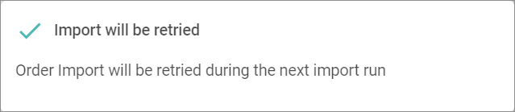
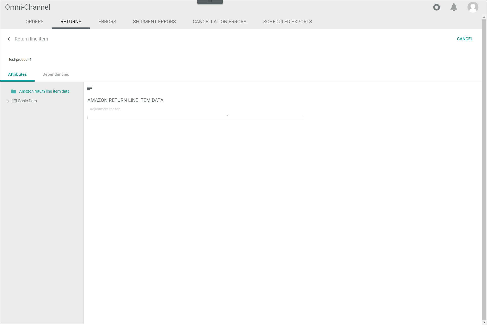

[!!Configure the orders and returns](../Integration/04_ConfigureOrdersReturns.md)
[!!Manage the orders and returns](../Operation/04_ManageOrdersReturns.md)

[comment]: <> (Add link to Order management if available)

# Returns

*Omni-Channel > Orders and returns > Tab RETURNS*

> [Info] Returns are only displayed in this tab, if at least one of the configured connections supports the return import and export to its marketplace. Otherwise, no returns will be displayed. 

**Returns**

- *Combined status*  
    Combined status of all returns. The following statuses are available:
    -  (red)  
        At least one return is faulty. Click the [>> more] button right to the status to switch to the *ERRORS* tab, see [User interface Errors (Orders and returns)](./05c_Errors.md).   
    -  (yellow)  
        At least one return is still pending.
    -  (green)  
        All returns are completed.

-  (Search)   
    Click this button to display the search bar and search for a return.

-  (Refresh)   
    Click this button to update the list of returns.

- *VIEW*   
    Click the drop-down list to select the view. All created views are displayed in the drop-down list. Click the  (Points) button to the right of the *VIEW* drop-down list to display the context menu and create a view.   

    -  (Points)      
        Click this button to the right of the *VIEW* drop-down list to display the context menu. The following menu entries are available:

        -  create  
            Click this entry to create a view. The *Create view* window is displayed, see [Create view](#create-view).

        -  rename  
            Click this entry to rename the selected view. The *Rename view* window is displayed, see [Rename view](#rename-view). This menu entry is only displayed if a view has been selected.

        -  reset  
            Click this entry to reset all unsaved changes to the settings of the selected view. This menu entry is only displayed if a view has been selected and any changes have been made to the view settings.

        -  publish  
            Click this entry to publish the view. This menu entry is only displayed if a view has been selected and unpublished.

        -  unpublish  
            Click this entry to unpublish the view. This menu entry is only displayed if a view has been selected and published.

        -  save  
            Click this entry to save the current view settings in the selected view. This menu entry is only displayed if a view has been selected.

            > [Info] When the settings of a view have been changed, an asterisk is displayed next to the view name. The asterisk is hidden as soon as the changes have been saved.

        -  delete  
            Click this entry to delete the selected view. A confirmation window to confirm the deletion is displayed. This menu entry is only displayed if a view has been selected.

- *All Connections*    
    Click the drop-down list to select a connection. All available connections are displayed in the list. When a connection has been selected, the [Import returns] button, the *Download returns automatically* drop-down list and the [SAVE] button are displayed.

- [Import returns for all connections]  
    Click this button to import the returns for all connections. This button is only displayed if no connection has been selected in the *All connections* drop-down list.

- [Import returns]  
    Click this button to import all returns for the selected connection. This button is only displayed if a connection has been selected in the *All connections* drop-down list.

- [Download returns automatically]  
    Click the drop-down list and select the desired time interval for the automatic download of returns. This drop-down list is only displayed if a connection has been selected in the *All connections* drop-down list. By default, the **never** option is preselected. The following options are available:
    - **never**
    - **every 2 minutes**
    - **every 5 minutes**
    - **every 10 minutes**
    - **every 15 minutes**
    - **every 20 minutes**
    - **every 30 minutes**
    - **every 60 minutes**

- [SAVE]  
    Click this button to save the settings for the automatic download of returns. This button is only displayed if a connection has been selected in the *All connections* drop-down list.

-  Columns (x)   
    Click this button to display the columns bar and customize the displayed columns and the order of columns in the list. The *x* indicates the number of columns that are currently displayed in the list.

-  Filter (x)   
    Click this button to display the filter bar and customize the active filters. The *x* indicates the number of filters that are currently active.

- [x]     
    Select the checkbox to display the editing toolbar. If you click the checkbox in the header, all returns in the list are selected.

- [VIEW]  
    Click this button to display the *Return from connection "Connection name"* view of the selected return. Alternatively, you can click directly a row in the list to display the corresponding return. This button is only displayed if a single checkbox in the list of connections is selected.

- [EXPORT TO OMS]  
    Click this button to export the selected return(s) to the *Order management* module. This button is only displayed if the checkbox of at least one return is selected.

- [RETRY IMPORT]  
    Click this button to retry the import of the selected return(s). This button is only displayed if the checkboxes of at least two returns is selected. The *Import will be retried* pop-up window is displayed.

    

[comment]: <> (pop-up window spricht von "order" obwohl es return ist. Wenn richtig, neuer screenshot.)
[comment]: <> (warum kann man nicht ein return nochmals importieren - BUG?)

- [CANCEL RETURN]/[CANCEL RETURNS]  
    Click this button to cancel the import of the selected return(s). This button is only displayed if the checkbox of at least one return with the **Error** status in the *Status of import from channel* column is selected. 

[comment]: <> (wird nach Ausführung irgendein pop-up fenster angezeigt?)

The list displays all returns, either for all connections or for the selected connection. Depending on the settings, the displayed columns may vary. All fields are read-only. 

- *Connection*  
    Connection name. 

- *Status of import from channel*   
    Status of the return import from the marketplace to the *Omni-Channel* module. The following options are available:  
    - **Not imported**  
        The return import has not been performed.
    - **Complete**  
        The return import has been successfully completed.   	
    - **Canceled**  
        The return import has been canceled.  
    - **Error**  
        The return import has given an error. Click the [Show log message] button in the column to display the corresponding log message in the *LOG* tab, see [User interface LOG](./06a_Log.md).

- *Status of export to channel*  
    Status of the return export from the *Omni-Channel* module to the marketplace. The following options are available:  
    - **Exported**  
        The return has been successfully exported.  
    - **No changes to sync**  
        There are no changes to synchronize.
    - **Error**   
        Click the [Show log message] button in the column to display the corresponding log message in the *LOG* tab, see [User interface LOG](./06a_Log.md).

- *Status of export to OMS*  
    Status of the return export from the *Omni-Channel* module to the *Order management* module for further processing. The following options are available:  
    - **Exported**  
        The return has been successfully exported.
    - **Not exported**  
        The return has not been exported.  
    - **Not exported: Pending > 30 minutes to OMS**  
        The return export is pending.
    - **Being exported**  
        The return is currently being exported.

[comment]: <> (Weitere status?)

- *Created on*  
    Date and time of the creation. 

- *Modified on*  
    Date and time of the last modification. 

- *Remote ID*  
    Identification number of the return in the marketplace.

- *ID in OMS*  
    Identification number of the document in the *Order management* module.    

- *\# Line items*  
    Number of line items in the return.

- *Line items*  
    SKU of line item(s) in the return. 

- *ID*  
    Return identification number. The ID number is automatically assigned by the system.

- Attribute    
    You can add a column for each attribute that is assigned to the return. The column displays the attribute name, the row displays the corresponding attribute value of the return.

## Return from connection "Connection name"

*Omni-Channel > Orders and returns > Tab RETURNS > Select return*

-  (Back)   
    Click this button to close the *Return from connection "Connection name"* view and return to the list of returns. All changes are rejected.

- [CLOSE]  
    Click this button to close the *Return from connection "Connection name"* view.

- *ID in shop:*  
    Identification number of the return in the marketplace. 

- *Bill ID:*  
    Identification number of the document in the *Order management* module.   
  
- *Import status:*  
    Return import status from the marketplace to the *Omni-Channel* module. The following statuses are available:  
    - **Not imported**
    - **Complete**  
    - **Canceled**
    - **Error**

- *Export status:*  
    Return export status from the *Omni-Channel* module to the marketplace. The following statuses are available:  
    - **Exported**
    - **No changes to sync**  
    
[comment]: <> (Stimmt das? Feld immer/meistens leer hier, auch wenn in Return Liste Status angezeigt. Bezieht sich auf Status of Export to Channel oder Status of Export to OMS? Andere Möglichkeiten?)

- [EXPORT TO OMS]  
    Click this button to export the return to the *Order management* module. This button is only displayed if the status in the *Status of export to OMS* column equals **Not exported: Pending > 30 minutes to OMS**.

- [RE-TRIGGER IMPORT]    
    Click this button to trigger the return import again. This button is only displayed if the status in the *Status of import from channel* column equals **Not imported**. The *Return import triggered* pop-up window is displayed.

    

[comment]: <> (Andere Buttons möglich?)

## Return from connection "Connection name" &ndash; Attributes

*Omni-Channel > Orders and returns > Tab RETURNS > Select return > Tab Attributes*

In the left margin column, all available attribute groups are displayed. Click an attribute group to display the attributes that are assigned to this group on the right side of the *Attributes* tab. If the return contains attributes that are unassigned, the *Unassigned group* attribute group is automatically displayed in the left margin column.

-  (Folders)  
    Attribute group that contains attribute sub-groups. Click the attribute group or the arrow left to the attribute group to unfold the group and display the attribute sub-groups.

-  (Folder)  
    Attribute group. Click the attribute group to display all attributes that are assigned to the selected attribute group on the right side of the *Attributes* tab.

The right side of the *Attributes* tab displays all attributes that are assigned to the selected group in the left margin column. All fields are read-only.

-  (Fade in/out)    
    Click this button to hide or display the left margin column with the attribute groups. When the left margin is displayed and you click this button, the column is hidden. When the column is hidden and you click this button, the column is displayed again.

## Return from connection "Connection name" &ndash; Dependencies

*Omni-Channel > Orders and returns > Tab RETURNS > Select return > Tab Dependencies*

**Dependencies**

-  (Refresh)   
    Click this button to update the list of dependencies.

-  Columns (x)   
    Click this button to display the columns bar and customize the displayed columns and the order of columns in the list. The *x* indicates the number of columns that are currently displayed in the list.

- [x]     
    Select the checkbox to display the editing toolbar. If you click the checkbox in the header, all dependencies in the list are selected.

- [RERUN MAPPING]  
    Click this button to rerun the mapping of the selected entity. This button is only displayed if the checkbox of at least one dependency is selected.

The list displays all dependencies of the selected return. Depending on the settings, the displayed columns may vary. All fields are read-only. 

- *Dependent entity ID*   
    Identification number of the dependent entity.

- *Dependent entity type*   
    Type of the dependent entity. The available types depend on the installed plugins.

- *Change tracking mode*   
    Change tracking mode (ETL mode) of the dependent entity. The following options are available:
    - **Manual**
    - **Semiautomatic**
    - **Semiautomatic, changes must be confirmed by another user**   
    - **Automatic**

- *Dependent entity friendly identifier*   
    Further, more descriptive identifier of the dependent entity, for instance the SKU number or a bill number.

## Return from connection "Connection name" &ndash; Line items

*Omni-Channel > Orders and returns > Tab RETURNS > Select return > Tab Line items*

**Line items**

- *VIEW*   
    Click the drop-down list to select the view. All created views are displayed in the drop-down list. Click the  (Points) button to the right of the *VIEW* drop-down list to display the context menu and create a view.   

    -  (Points)      
        Click this button to the right of the *VIEW* drop-down list to display the context menu. The following menu entries are available:

        -  create  
            Click this entry to create a view. The *Create view* window is displayed, see [Create view](#create-view).

        -  rename  
            Click this entry to rename the selected view. The *Rename view* window is displayed, see [Rename view](#rename-view). This menu entry is only displayed if a view has been selected.

        -  reset  
            Click this entry to reset all unsaved changes to the settings of the selected view. This menu entry is only displayed if a view has been selected and any changes have been made to the view settings.

        -  publish  
            Click this entry to publish the view. This menu entry is only displayed if a view has been selected and unpublished.

        -  unpublish  
            Click this entry to unpublish the view. This menu entry is only displayed if a view has been selected and published.

        -  save  
            Click this entry to save the current view settings in the selected view. This menu entry is only displayed if a view has been selected.

            > [Info] When the settings of a view have been changed, an asterisk is displayed next to the view name. The asterisk is hidden as soon as the changes have been saved.

        -  delete  
            Click this entry to delete the selected view. A confirmation window to confirm the deletion is displayed. This menu entry is only displayed if a view has been selected.

-  (Search)   
    Click this button to display the search bar and search for a line item.

-  (Refresh)   
    Click this button to update the list of line items.

-  Columns (x)   
    Click this button to display the columns bar and customize the displayed columns and the order of columns in the list. The *x* indicates the number of columns that are currently displayed in the list.

-  Filter (x)   
    Click this button to display the filter bar and customize the active filters. The *x* indicates the number of filters that are currently active.

- [x]     
    Select the checkbox to display the editing toolbar. You can only select one checkbox at a time. 

- [VIEW]  
    Click this button to display the *Line item* view of the selected line item. Alternatively, you can click directly a row in the list to view the corresponding line item. This button is only displayed if a single checkbox in the list of line items is selected.

The list displays all line items of the selected return. Depending on the settings, the displayed columns may vary. All fields are read-only. 

- *SKU*  
    Stock Keeping Unit. Identification number of the product to the return.

- *Type*  
    Line item type. The following options are available:
    - **Line item**
    - **Shipping**

[comment]: <> (Andere Typen?)

- *ID*  
    Return identification number. The ID number is automatically assigned by the system after creation.

- Attribute    
    You can add a column for each attribute that is assigned to the line item. The column displays the attribute name, the row displays the corresponding attribute value of the item.

### Line item 

*Omni-Channel > Orders and returns > Tab RETURNS > Select return > Tab Line items > Select line item*

-  (Back)   
    Click this button to close the *Line item* view and return to the list of line items. All changes are rejected.

- [CANCEL]  
    Click this button to close the *Line item* view.

  
### Line item &ndash; Attributes

*Omni-Channel > Orders and returns > Tab RETURNS > Select return > Tab Line items > Select line item > Tab Attributes*

In the left margin column, all available attribute groups are displayed. Click an attribute group to display the attributes that are assigned to this group on the right side of the *Attributes* tab. If the line item contains attributes that are unassigned, the *Unassigned group* attribute group is automatically displayed in the left margin column.

-  (Folders)  
    Attribute group that contains attribute sub-groups. Click the attribute group or the arrow left to the attribute group to unfold the group and display the attribute sub-groups.

-  (Folder)  
    Attribute group. Click the attribute group to display all attributes that are assigned to the selected attribute group on the right side of the *Attributes* tab.

The right side of the *Attributes* tab displays all attributes that are assigned to the selected group in the left margin column. All fields are read-only.

-  (Fade in/out)    
    Click this button to hide or display the left margin column with the attribute groups. When the left margin is displayed and you click this button, the column is hidden. When the column is hidden and you click this button, the column is displayed again.

### Line item &ndash; Dependencies

*Omni-Channel > Orders and returns > Tab RETURNS > Select return > Tab Line items > Select line item > Tab Dependencies*

**Dependencies**

-  (Refresh)   
    Click this button to update the list of dependencies.

-  Columns (x)   
    Click this button to display the columns bar and customize the displayed columns and the order of columns in the list. The *x* indicates the number of columns that are currently displayed in the list.

- [x]     
    Select the checkbox to display the editing toolbar. If you click the checkbox in the header, all dependencies in the list are selected.

- [RERUN MAPPING]  
    Click this button to rerun the mapping of the selected entity. This button is only displayed if the checkbox of at least one dependency is selected.

The list displays all dependencies of the selected line item. Depending on the settings, the displayed columns may vary. All fields are read-only. 

- *Dependent entity ID*   
    Identification number of the dependent entity.

- *Dependent entity type*   
    Type of the dependent entity. The available types depend on the installed plugins.

- *Change tracking mode*   
    Change tracking mode (ETL mode) of the dependent entity. The following options are available:
    - **Manual**
    - **Semiautomatic**
    - **Semiautomatic, changes must be confirmed by another user**   
    - **Automatic**

- *Dependent entity friendly identifier*   
    Further, more descriptive identifier of the dependent entity, for instance the SKU number or a bill number.

## Return from connection "Connection name" &ndash; Shipments

*Omni-Channel > Orders and returns > Tab RETURNS > Select return > Tab Shipments*

**Shipments**

-  (Search)   
    Click this button to display the search bar and search for an error.

-  (Refresh)   
    Click this button to update the list of errors.

-  Columns (x)   
    Click this button to display the columns bar and customize the displayed columns and the order of columns in the list. The *x* indicates the number of columns that are currently displayed in the list.

-  Filter (x)   
    Click this button to display the filter bar and customize the active filters. The *x* indicates the number of filters that are currently active.

- [x]     
    Select the checkbox to display the editing toolbar. If you click the checkbox in the header, all errors in the list are selected.

- [VIEW]  
    Click this button to display the *Shipment for return* view of the selected shipment. Alternatively, you can click directly a row in the list to view the corresponding shipment. This button is only displayed if a single checkbox in the list of shipments is selected.

The list displays all shipments for the selected return. Depending on the settings, the displayed columns may vary. All fields are read-only. 

- *Status of import from channel*  
    Status of the return import from the marketplace to the *Omni-Channel* module. The following options are available:  
    - **Not imported**  
        The return import has not been performed.
    - **Complete**  
        The return import has been successfully completed.   	
    - **Canceled**  
        The return import has been canceled.  
    - **Error**  
        The return import has given an error.

- *Status of export to channel*  
    Status of the return export from the *Omni-Channel* module to the marketplace. The following options are available:  
    - **Exported**  
        The return has been successfully exported.  
    - **No changes to sync**  
        There are no changes to synchronize.

[comment]: <> (Check, ob es stimmt. Status bezieht sich auf return oder Shipment? Andere Möglichkeiten?)

- *ID*  
    Shipment identification number. The ID number is automatically assigned by the system.

- Attribute  
    You can add a column for each attribute that is assigned to the shipment. The column displays the attribute name, the row displays the corresponding attribute value of the shipment.

### Shipment for return "Return ID"

*Omni-Channel > Orders and returns > Tab RETURNS > Select return > Tab Shipments > Select shipment*

-  (Back)   
    Click this button to close the *Shipment for return "Return ID"* view and return to the shipment list. All changes are rejected.

- [CLOSE]  
    Click this button to close the *Shipment for return "Return ID"* view.

### Shipment for return "Return ID" &ndash; Attributes

*Omni-Channel > Orders and returns > Tab RETURNS > Select return > Tab Shipments > Select shipment > Tab Attributes*

In the left margin column, all available attribute groups are displayed. Click an attribute group to display the attributes that are assigned to this group on the right side of the *Attributes* tab. If the line item contains attributes that are unassigned, the *Unassigned group* attribute group is automatically displayed in the left margin column.

-  (Folders)  
    Attribute group that contains attribute sub-groups. Click the attribute group or the arrow left to the attribute group to unfold the group and display the attribute sub-groups.

-  (Folder)  
    Attribute group. Click the attribute group to display all attributes that are assigned to the selected attribute group on the right side of the *Attributes* tab.

The right side of the *Attributes* tab displays all attributes that are assigned to the selected group in the left margin column. All fields are read-only.

-  (Fade in/out)    
    Click this button to hide or display the left margin column with the attribute groups. When the left margin is displayed and you click this button, the column is hidden. When the column is hidden and you click this button, the column is displayed again.

### Shipment for return "Return ID" &ndash; Dependencies

*Omni-Channel > Orders and returns > Tab RETURNS > Select return > Tab Shipments > Select shipment > Tab Dependencies*

**Dependencies**

-  (Refresh)   
    Click this button to update the list of dependencies.

-  Columns (x)   
    Click this button to display the columns bar and customize the displayed columns and the order of columns in the list. The *x* indicates the number of columns that are currently displayed in the list.

- [x]     
    Select the checkbox to display the editing toolbar. If you click the checkbox in the header, all dependencies in the list are selected.

- [RERUN MAPPING]  
    Click this button to rerun the mapping of the selected entity. This button is only displayed if the checkbox of at least one dependency is selected.

The list displays all dependencies of the selected return. Depending on the settings, the displayed columns may vary. All fields are read-only. 

- *Dependent entity ID*   
    Identification number of the dependent entity.

- *Dependent entity type*   
    Type of the dependent entity. The available types depend on the installed plugins.

- *Change tracking mode*   
    Change tracking mode (ETL mode) of the dependent entity. The following options are available:
    - **Manual**
    - **Semiautomatic**
    - **Semiautomatic, changes must be confirmed by another user**   
    - **Automatic**

- *Dependent entity friendly identifier*   
    Further, more descriptive identifier of the dependent entity, for instance the SKU number or a bill number.

### Shipment for return "Return ID" &ndash; Shipment line items

*Omni-Channel > Orders and returns > Tab RETURNS > Select return > Tab Shipments > Select shipment > Tab Shipment line items*

**Shipment line items**

-  (Search)   
    Click this button to display the search bar and search for a line item.

-  (Refresh)   
    Click this button to update the list of line items.

-  Columns (x)   
    Click this button to display the columns bar and customize the displayed columns and the order of columns in the list. The *x* indicates the number of columns that are currently displayed in the list.

-  Filter (x)   
    Click this button to display the filter bar and customize the active filters. The *x* indicates the number of filters that are currently active.

- [x]     
    Select the checkbox to display the editing toolbar. You can only select one checkbox at a time. 

- [VIEW]  
    Click this button to display the *Line item* view of the selected line item. Alternatively, you can click directly a row in the list to view the corresponding line item.  This button is only displayed if a single checkbox in the list of line items is selected.

The list displays all items of the selected return. Depending on the settings, the displayed columns may vary. All fields are read-only. 

- *SKU*  
    Stock Keeping Unit. Identification number of the product to the return.

- *Type*  
    Item type. The following options are available:
    - **Line item**
    - **Shipping**

[comment]: <> (what else?)

- *ID*  
    Return identification number. The ID number is automatically assigned by the system after creation.

- Attribute    
    You can add a column for each attribute that is assigned to the return. The column displays the attribute name, the row displays the corresponding attribute value of the return.

#### Shipment line item

*Omni-Channel > Orders and returns > Tab RETURNS > Select return > Tab Shipments > Select shipment > Tab Shipment line items > Select line item*

-  (Back)   
    Click this button to close the *Shipment line item* view and return to the shipment line item list. All changes are rejected.

- [CANCEL]  
    Click this button to close the *Shipment line item* view.

#### Shipment line item &ndash; Attributes

*Omni-Channel > Orders and returns > Tab RETURNS > Select return > Tab Shipments > Select shipment > Tab Shipment line items > Select line item > Tab Attributes*

In the left margin column, all available attribute groups are displayed. Click an attribute group to display the attributes that are assigned to this group on the right side of the *Attributes* tab. If the line item contains attributes that are unassigned, the *Unassigned group* attribute group is automatically displayed in the left margin column.

-  (Folders)  
    Attribute group that contains attribute sub-groups. Click the attribute group or the arrow left to the attribute group to unfold the group and display the attribute sub-groups.

-  (Folder)  
    Attribute group. Click the attribute group to display all attributes that are assigned to the selected attribute group on the right side of the *Attributes* tab.

The right side of the *Attributes* tab displays all attributes that are assigned to the selected group in the left margin column. All fields are read-only.

-  (Fade in/out)    
    Click this button to hide or display the left margin column with the attribute groups. When the left margin is displayed and you click this button, the column is hidden. When the column is hidden and you click this button, the column is displayed again.

#### Shipment line item &ndash; Dependencies

*Omni-Channel > Orders and returns > Tab RETURNS > Select return > Tab Shipments > Select shipment > Tab Shipment line items > Select line item > Tab Dependencies*

-  (Refresh)   
    Click this button to update the list of dependencies.

-  Columns (x)   
    Click this button to display the columns bar and customize the displayed columns and the order of columns in the list. The *x* indicates the number of columns that are currently displayed in the list.

- [x]     
    Select the checkbox to display the editing toolbar. If you click the checkbox in the header, all dependencies in the list are selected.

- [RERUN MAPPING]  
    Click this button to rerun the mapping of the selected entity. This button is only displayed if the checkbox of at least one dependency is selected.

The list displays all dependencies of the selected return. Depending on the settings, the displayed columns may vary. All fields are read-only. 

- *Dependent entity ID*   
    Identification number of the dependent entity.

- *Dependent entity type*   
    Type of the dependent entity. The available types depend on the installed plugins.

- *Change tracking mode*   
    Change tracking mode (ETL mode) of the dependent entity. The following options are available:
    - **Manual**
    - **Semiautomatic**
    - **Semiautomatic, changes must be confirmed by another user**   
    - **Automatic**

- *Dependent entity friendly identifier*   
    Further, more descriptive identifier of the dependent entity, for instance the SKU number or a bill number.

## Return from connection "Connection name" &ndash; Cancellations

*Omni-Channel > Orders and returns > Tab RETURNS > Select return > Tab Cancellations*

**Cancellations**

-  (Search)   
    Click this button to display the search bar and search for an error.

-  (Refresh)   
    Click this button to update the list of errors.

-  Columns (x)   
    Click this button to display the columns bar and customize the displayed columns and the order of columns in the list. The *x* indicates the number of columns that are currently displayed in the list.

-  Filter (x)   
    Click this button to display the filter bar and customize the active filters. The *x* indicates the number of filters that are currently active.

- [x]     
    Select the checkbox to display the editing toolbar. If you click the checkbox in the header, all errors in the list are selected.

- [VIEW]  
    Click this button to display the *Shipment for return* view of the selected shipment. Alternatively, you can click directly a row in the list to view the corresponding shipment. This button is only displayed if a single checkbox in the list of shipments is selected.

The list displays all shipments for the selected return. Depending on the settings, the displayed columns may vary. All fields are read-only. 

- *Status of import from channel*  
    Status of the return import from the marketplace to the *Omni-Channel* module. The following options are available:  
    - **Not imported**  
        The return import has not been performed.
    - **Complete**  
        The return import has been successfully completed.   	
    - **Canceled**  
        The return import has been canceled.  
    - **Error**  
        The return import has given an error.

- *Status of export to channel*  
    Status of the return export from the *Omni-Channel* module to the marketplace. The following options are available:  
    - **Exported**  
        The return has been successfully exported.  
    - **No changes to sync**  
        There are no changes to synchronize.

[comment]: <> (Check, ob es stimmt. Status bezieht sich auf return oder Shipment? Andere optionen?)

- *ID*  
    Shipment identification number. The ID number is automatically assigned by the system.

[comment]: <> (Unterfenster wie bei Shipments?)

## Return from connection "Connection name" &ndash; Errors

*Omni-Channel > Orders and returns > Tab RETURNS > Select return > Tab Errors*

**Error list**

-  (Search)   
    Click this button to display the search bar and search for an error.

-  (Refresh)   
    Click this button to update the list of errors.

-  Columns (x)   
    Click this button to display the columns bar and customize the displayed columns and the order of columns in the list. The *x* indicates the number of columns that are currently displayed in the list.

-  Filter (x)   
    Click this button to display the filter bar and customize the active filters. The *x* indicates the number of filters that are currently active.

The list displays all errors of the selected return. Depending on the settings, the displayed columns may vary. All fields are read-only.

- *Log ID*  
    Log identification number. The ID number is automatically assigned by the system.   

- *Message*  
    Description of the error. Click the [Show log message] button in the column to display the corresponding log message in the *LOG* tab, see [User interface LOG](./06a_Log.md).

- *Short Message*  
    Short description of the error.

- *Created*  
    Date and time of the creation.

- *Creator*  
    Name and username of the user who created the error. By default, the field is blank as the job is created by the system.

[comment]: <> (kann man das so schreiben oder ist das Quatsch?)

- *Last modified*  
    Date and time of the last modification.

- *Editor*  
    Name and username of the user who modified the error. By default, the field is blank as the job is modified by the system.

[comment]: <> (kann man das so schreiben oder ist das Quatsch?)

## Create view

*Omni-Channel > Orders and returns > Tab RETURNS > Button Points > Menu entry create*

For a detailed description of this window and the corresponding functions, see [Create view](./02a_Offers.md#create-view).

## Rename view

*Omni-Channel > Orders and returns > Tab RETURNS > Button Points > Menu entry rename*

For a detailed description of this window and the corresponding functions, see [Rename view](./02a_Offers.md#rename-view).
