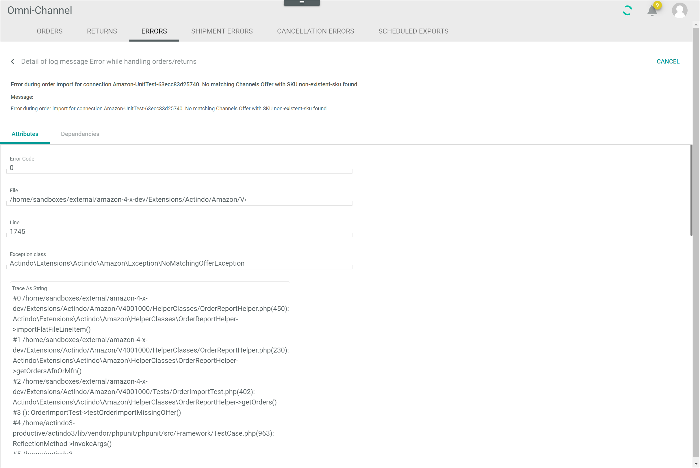

[!!Manage the orders and returns](../Operation/04_ManageOrdersReturns.md)
[!!User interface Log](./06a_Log.md)

# Errors

*Omni-Channel > Orders and returns > Tab ERRORS*

**Error list**	

-  (Search)   
    Click this button to display the search bar and search for an error.

-  (Refresh)   
    Click this button to update the list of errors.

-  Columns (x)   
    Click this button to display the columns bar and customize the displayed columns and the order of columns in the list. The *x* indicates the number of columns that are currently displayed in the list.

-  Filter (x)   
    Click this button to display the filter bar and customize the active filters. The *x* indicates the number of filters that are currently active.

- [x]     
    Select the checkbox to display the editing toolbar. If you click the checkbox in the header, all errors in the list are selected.

- [SHOW LOG]  
    Click this button to display the details of the error log message. This button is only displayed if a single checkbox in the list of errors is selected. Alternatively, you can click directly a row in the list to display the details of the error log message. The *Detail of log message "Log message title"* view is displayed, see [Detail of log message "Log message title"](#detail-of-log-message-log-message-title).

- [VIEW ORDER]  
    Click this button to display the corresponding order to the error. This button is only displayed if a single checkbox in the list of errors is selected. The *Order from connection "Connection name"* view is displayed in the *ORDERS* tab, see [Order from connection "Connection name"](./05a_Orders.md#order-from-connection-connection-name).

- [RETRY IMPORT]  
    Click this button to retry the import of the selected order(s). This button is only displayed if the checkbox of at least one error is selected. The *Import will be retried* pop-up window is displayed.

    

The list displays all errors to the orders and returns. Depending on the settings, the displayed columns may vary. All fields are read-only. If no error has been occurred, the *There are currently no errors* notice is displayed.

- *Connection*  
    Name of the connection where the error has occurred.

- *Type*  
    Error type. The following options are available:   
    - **Import from channel**  
        The error has occurred while importing the order from the marketplace.   
    - **Export to channel**  
        The error has occurred while exporting the order to the marketplace.  
    - **Export to OMS**  
        The error has occurred while exporting the order to the *Order management* module.

- *Order/Return*  
    Indication where the error has occurred. The following options are available:
    - **Order**   
        The error has occurred in an order.
    - **Return**  
        The error has occurred in a return.

- *ID in shop*  
    Identification number of the order in the marketplace. 

- *Message*  
    Log message to the error.  

- *Order*  
    Order identification number. The ID number is automatically assigned by the system.

- *Last modified*  
    Date and time of the last modification.

- *Editor*  
    Name and username of the user who modified the error.  

- *ID*  
    Error identification number. The ID number is automatically assigned by the system.

- *Created*  
    Date and time of the creation.

- *Creator*  
    Name and username of the user who created the error.

## Detail of log message "Log message title"

*Omni-Channel > Orders and returns > Tab ERRORS > Select error*

For a detailed description of this view and the corresponding functions, see [LOG](./06a_Log.md#detail-of-log-message-log-message-title).