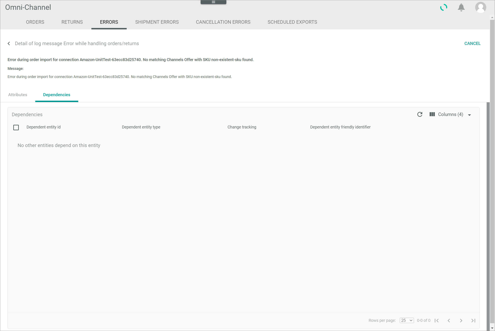

[!!Tag](../Integration/0X_Tobecompleted.md)
[!!Tag](../Operation/0X_Tobecompleted.md)

# Errors

*Omni-Channel > Orders and returns > Tab ERRORS*

[comment]: <> (Shopware6 in Screenshot. Geht so in Ordnung?)

**Error list**	

-  (Search)   
  Click this button to display the search bar and search for an error.

-  (Refresh)   
  Click this button to update the list of errors.

-  Columns (x)   
  Click this button to display the columns bar and customize the displayed columns and the order of columns in the list. The *x* indicates the number of columns that are currently displayed in the list.

-  Filter (x)   
  Click this button to display the filter bar and customize the active filters. The *x* indicates the number of filters that are currently active.

- [x]     
  Select the checkbox to display the editing toolbar. If you click the checkbox in the header, all orders in the list are selected.

- [SHOW LOG]  
  Click this button to display the details of the log message. This button is only displayed if a single checkbox in the list of errors is selected. The [Detail of log message "Log message title"](#detail-of-log-message-log-message-name) is displayed.

- [VIEW ORDER]  
  Click this button to display the order details in the *ORDERS* tab. This button is only displayed if a single checkbox in the list of errors is selected. The [Order from connection "Connection name"](./05a_Orders.md#order-from-connection-connection-name) is displayed.

- [RETRY IMPORT]  
  Click this button to retry the import of one or several orders. This button is only displayed if at least one checkbox in the list of errors is selected. 

The list displays all errors available. All fields are read-only. Depending on the settings, the displayed columns may vary.

- *Connection*  
    Name of the connection where the error has occurred.

- *Type*  
    Type of error. The following options are available:   
    - **Import from channel**  
        The error has occurred while importing the order from the marketplace.   
    - **Export to channel**  
        The error has occurred while exporting the order to the marketplace.  
    - **Export to OMS**  
        The error has occurred while exporting the order to the *Order management* module.

- *Order/Return*  
    Indication whether the error has occurred in an order or in a return.

- *ID in shop*  
    Order identification number in the marketplace.

[comment]: <> (Stimmt das so? Es gibt Nummer im Format 000000128 o.ä. aber auch MSN_011_00001234, also übliche NoE order number, geprüft bei NoE test account)

- *Message*  
    Description of the error.  

- *Order*  
    Order identification number. The ID number is automatically assigned by the system.

[comment]: <> (Vgl. ID, Unterschied? Hier steht Order with ID 252... aber ID stimmt nicht überein. Ist vielleicht Order ID in shop?)

- *Last modified*  
    Date and time of the last modification.

- *Editor*  
    Name and username of the user who modified the error.  

- *ID*  
    Order identification number. The ID number is automatically assigned by the system.

[comment]: <> (Vgl. Inhalt in Order Spalte: Order with ID...)

- *Created*  
    Date and time of the creation.

- *Creator*  
    Name and username of the user who created the error.

## Detail of log message "Log message title"

*Omni-Channel > Orders and returns > Tab ERRORS > Select an error*

-  (Back)   
  Click this button to close the *Detail of log message "Log message title"* view and return to the list of errors.

- [CANCEL]  
  Click this button to close the *Detail of log message "Log message title"* view and return to the list of errors.

[comment]: <> (Beide tun praktisch das gleiche)

- Message  
  Short description of the log message.

- *Message:*  
  Short description of the log message.

[comment]: <> (Hier Info wiederholt sich. Report als Bug?)

### Detail of log message "Log message title" &ndash; Attributes

*Omni-Channel > Orders and returns > Tab ERRORS > Select an error > Tab Attributes*

The *Attributes* tab displays further details of the selected log message. Depending on the message title, the assigned attributes, and therefore the fields displayed, may vary. All fields are read-only.

By default, the following fields are displayed:

[comment]: <> (Felder ändern sich abhängig von Title - vgl. NotFoundException und updateDeliveryStatus? Vermutlich abhängig von Attributes, also Standardsatz dazu und keine Felder? Oder gibt es Standardfelder?)

- *Error code*  
  Error code number.

- *File*  
  File where the error has occurred.

- *Line*  
  Line where the error has occurred.

- *Exception class*  

- *Trace as string*  

- *Exception*

[comment]: <> (Further info needed)

### Detail of log message "Log message title" &ndash; Dependencies

*Omni-Channel > Orders and returns > Tab ERRORS > Select an error > Tab Dependencies*

This tab has no function in the *Omni-Channel* module, since log messages have no dependent entities. The notice *No other entities depend on this entity* is displayed.

[comment]: <> (Könnte es Dependencies geben?)