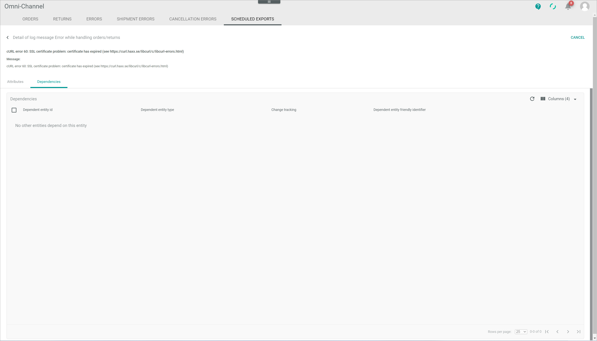

[!!Tag](../Integration/0X_Tobecompleted.md)
[!!Tag](../Operation/0X_Tobecompleted.md)

# Scheduled exports

*Omni-Channel > Orders and returns > Tab SCHEDULED EXPORTS*

[comment]: <> (Screenshot aus NoE test account)

**Scheduled exports**

-  (Refresh)   
  Click this button to update the list of exports.

-  Columns (x)   
  Click this button to display the columns bar and customize the displayed columns and the order of columns in the list. The *x* indicates the number of columns that are currently displayed in the list.

-  Filter (x)   
  Click this button to display the filter bar and customize the active filters. The *x* indicates the number of filters that are currently active.

- [x]     
  Select the checkbox to display the editing toolbar. If you click the checkbox in the header, all orders in the list are selected.

- [SHOW LOG]  
    Click this button to display the details of the log message. This button is only displayed if a single checkbox in the list of schedule exports is selected. The [Detail of log message "Log message name"](#detail-of-log-message-log-message-name) is displayed.

- [RETRY EXPORT]  
    Click this button to retry one or several exports at a time.  

    
The list displays all orders available. All fields are read-only. Depending on the settings, the displayed columns may vary.

- *ID*  
    Export identification number. The ID number is automatically assigned by the system.

[comment]: <> (Export ID? Stimmt das so? Welche ID sonst?)

- *Error message*  
    Description of the error, if one has occurred.

- *Status*  
    Export status. The following options are available:
    - *Pending*  
        The export is pending.
    - *Finally failed*  
        The export has failed permanently.

- *Connection*  
    Connection via which the export is to be performed.

- *Order/Return ID*  
    Order or return identification number. The ID number is automatically assigned by the system.
    
- *Order/Return*  
    Indication whether the export affects an order or a return.

## Detail of log message "Log message name"

*Omni-Channel > Orders and returns > Tab SCHEDULED EXPORTS > Select a checkbox > Button SHOW LOG*

-  (Back)   
  Click this button to close the *Detail of log message "Log message name"* view and return to the list of errors.

- [CANCEL]  
  Click this button to close the *Detail of log message "Log message name"* view and return to the list of errors.

[comment]: <> (Beide tun praktisch das gleiche)

- Message  
  Short description of the log message.

- *Message:*  
  Short description of the log message.

[comment]: <> (Hier Info wiederholt sich. Report als Bug?)

### Detail of log message "Log message name" &ndash; Attributes

*Omni-Channel > Orders and returns > Tab SCHEDULED EXPORTS > Select a checkbox > Button SHOW LOG > Tab Attributes*

The *Attributes* tab displays further details of the selected log message. Depending on the message title, the assigned attributes, and therefore the fields displayed, may vary. All fields are read-only.

By default, the following fields are displayed:

[comment]: <> (Stimmt das hier auch? Gibt es Standardfelder?)

- *Error code*  
  Error code number.

- *File*  
  File where the error has occurred.

- *Line*  
  Line where the error has occurred.

- *Exception class*  

- *Trace as string*  

- *Exception*

[comment]: <> (Further info needed)

### Detail of log message "Log message name" &ndash; Dependencies

*Omni-Channel > Orders and returns > Tab SCHEDULED EXPORTS > Select a checkbox > Button SHOW LOG > Tab Attributes*

This tab has no function in the *Omni-Channel* module, since log messages have no dependent entities. The notice *No other entities depend on this entity* is displayed.

[comment]: <> (Könnte es Dependencies geben?)

	
