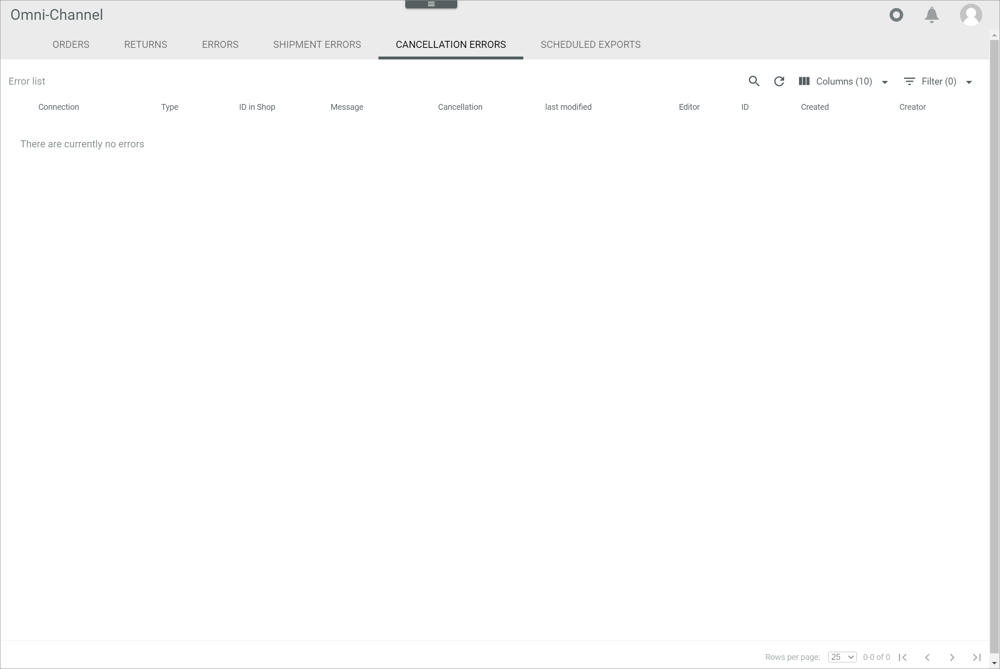
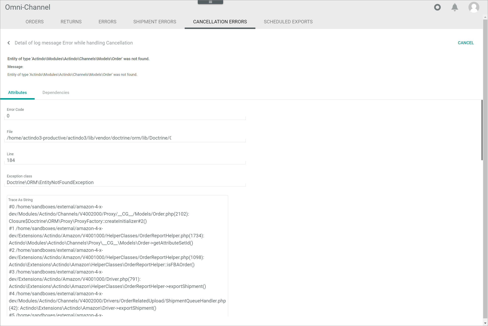

[!!Manage the orders and returns](../Operation/04_ManageOrdersReturns.md)
[!!User interface Log](./06a_Log.md)

# Cancellation errors

*Omni-Channel > Orders and returns > Tab CANCELLATION ERRORS*

**Error list**	

-  (Search)   
    Click this button to display the search bar and search for a cancellation error.

-  (Refresh)   
    Click this button to update the list of cancellation errors.

-  Columns (x)   
    Click this button to display the columns bar and customize the displayed columns and the order of columns in the list. The *x* indicates the number of columns that are currently displayed in the list.

-  Filter (x)   
    Click this button to display the filter bar and customize the active filters. The *x* indicates the number of filters that are currently active.

- [x]     
    Select the checkbox to display the editing toolbar. If you click the checkbox in the header, all cancellation errors in the list are selected.

- [SHOW LOG]  
    Click this button to display the details of the cancellation error log message. This button is only displayed if a single checkbox in the list of cancellation errors is selected. Alternatively, you can click directly a row in the list to display the details of the cancellation error log message. The *Detail of log message "Log message title"* view is displayed, see [Detail of log message "Log message title"](#detail-of-log-message-log-message-title).

The list displays all errors to the cancellations. Depending on the settings, the displayed columns may vary. All fields are read-only. If no cancellation error has occurred, the *There are currently no errors* notice is displayed.

- *Connection*  
    Name of the connection where the cancellation error has occurred.

- *Type*  
    Cancellation error type. The following options are available:   
    - **Import from channel**  
        The cancellation error has occurred while importing the order from the marketplace.   
    - **Export to channel**  
        The cancellation error has occurred while exporting the order to the marketplace.  
    - **Export to OMS**  
        The cancellation error has occurred while exporting the order to the *Order management* module.

- *ID in shop*  
    Identification number of the order in the marketplace. 

- *Message*  
    Log message to the cancellation error.  

- *Cancellation*  
    Cancellation identification number. The ID number is automatically assigned by the system.

- *Last modified*  
    Date and time of the last modification.

- *Editor*  
    Name and username of the user who modified the cancellation error.  

- *ID*  
    Cancellation error identification number. The ID number is automatically assigned by the system.

- *Created*  
    Date and time of the creation.

- *Creator*  
    Name and username of the user who created the cancellation error.

## Detail of log message "Log message title"

*Omni-Channel > Orders and returns > Tab CANCELLATION ERRORS > Select cancellation error*

[comment]: <> (keine Testdaten -> Screenshot gebastelt, sobald verfübgbar, gegen richtigen Screenshot austauschen)

For a detailed description of this view and the corresponding functions, see [LOG](./06a_Log.md#detail-of-log-message-log-message-title).

