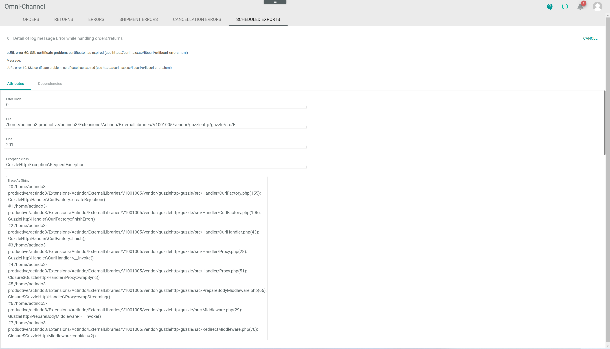

[!!Check the scheduled exports](../Operation/04_ManageOrdersReturns.md#check-the-scheduled-exports)

# Scheduled exports

*Omni-Channel > Orders and returns > Tab SCHEDULED EXPORTS*

[comment]: <> (Screenshot neu! Tabs fehlen)

**Scheduled exports**

-  (Refresh)   
  Click this button to update the list of scheduled exports.

-  Columns (x)   
  Click this button to display the columns bar and customize the displayed columns and the order of columns in the list. The *x* indicates the number of columns that are currently displayed in the list.

-  Filter (x)   
  Click this button to display the filter bar and customize the active filters. The *x* indicates the number of filters that are currently active.

- [x]     
  Select the checkbox to display the editing toolbar. If you click the checkbox in the header, all orders in the list are selected.

- [SHOW LOG]  
  Click this button to display the details of the log message. This button is only displayed if a single checkbox in the list of scheduled exports is selected. The *Detail of log message "Log message title"* view is displayed, see [Detail of log message "Log message title"](#detail-of-log-message-log-message-name).

- [RETRY EXPORT]  
  Click this button to retry the selected scheduled export(s). This button is only displayed if the checkbox of at least one failed export is selected.

[comment]: <> (prüfen, ob irgendein pop-up window angezeigt wird.)

The list displays all scheduled exports. Depending on the settings, the displayed columns may vary. All fields are read-only. 

- *ID*  
  Export identification number. The ID number is automatically assigned by the system.

[comment]: <> (Stimmt das?)

- *Error message*  
  Error log message if an error has occurred. Select the checkbox of the corresponding row and click the [SHOW LOG] button in the editing toolbar to display further details to the error. If no error has occurred, the field is empty.

- *Status*   
  Status of the scheduled export. The following options are available:
  - **Pending**  
    The export is pending.
  - **Finally failed**  
    The export has failed permanently.

[comment]: <> (welche status gibt es noch?)

- *Connection*  
  Name of the connection via which the export will be performed.

- *Order/Return ID*  
  Order or return identification number. The ID number is automatically assigned by the system.
    
- *Order/Return*  
  Indication where the error has occurred. The following options are available:
  - **Order**   
    The error has occurred in an order.
  - **Return**
    The error has occurred in a return.

## Detail of log message "Log message title"

*Omni-Channel > Orders and returns > Tab SCHEDULED EXPORTS > Select export > Button SHOW LOG*

For a detailed description of this view and the corresponding functions, see [LOG](./06a_Log.md#detail-of-log-message-log-message-title).

