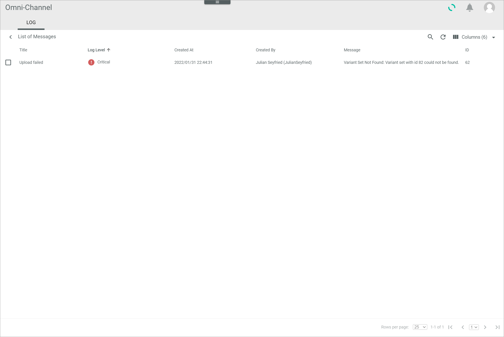
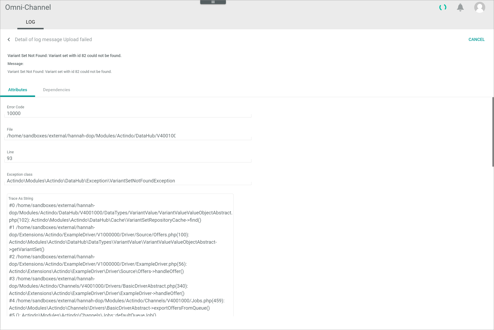
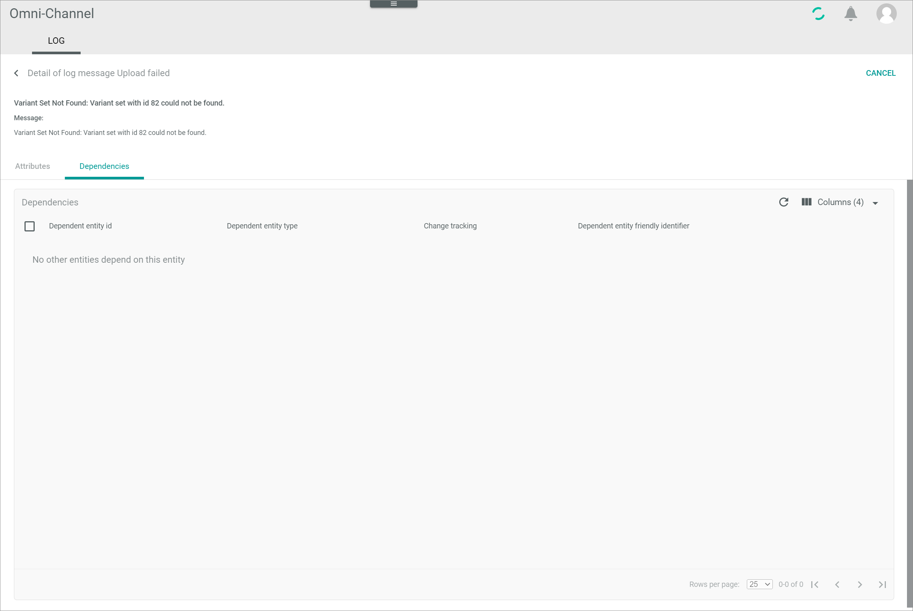

# Log

*Omni-Channel > Logging > Tab LOG*

[comment]: <> (Datei Fulfillment/UserInterface/02a_Connections.md als Referenz. Ggf. Änderungen konsistent in beiden Dateien übernehmen. Event log hier zu intent geändert. Unsicher zu Terminologe: Unterschied zwischen Log und Intent? Oder eher intent log verwenden?)

[comment]: <> (Keine Logs im Sandbox. Info und Screenshots aus NoE test account -> Vorsicht: in Detail log message Kundenname -> anonymisieren!)

**List of intents**

-  (Search)   
  Click this button to display the search bar and search for an intent.

-  (Refresh)   
  Click this button to update the list of intents.

- *VIEW*   
    Click the drop-down list to select the view. All created views are displayed in the drop-down list. Click the  (Points) button to the right of the *VIEW* drop-down list to display the context menu and create a view.   

    -  (Points)      
        Click this button to the right of the *VIEW* drop-down list to display the context menu. The following menu entries are available:

        -  create  
            Click this entry to create a view. The *Create view* window is displayed, see [Create view](#create-view).

        -  rename  
            Click this entry to rename the selected view. The *Rename view* window is displayed, see [Rename view](#rename-view). This menu entry is only displayed if a view has been selected.

        -  reset  
            Click this entry to reset all unsaved changes to the settings of the selected view. This menu entry is only displayed if a view has been selected and any changes have been made to the view settings.

        -  publish  
            Click this entry to publish the view. This menu entry is only displayed if a view has been selected and unpublished.

        -  unpublish  
            Click this entry to unpublish the view. This menu entry is only displayed if a view has been selected and published.

        -  save  
            Click this entry to save the current view settings in the selected view. This menu entry is only displayed if a view has been selected.

            > [Info] When the settings of a view have been changed, an asterisk is displayed next to the view name. The asterisk is hidden as soon as the changes have been saved.

        -  delete  
            Click this entry to delete the selected view. A confirmation window to confirm the deletion is displayed. This menu entry is only displayed if a view has been selected.

-  Columns (x)   
  Click this button to display the columns bar and customize the displayed columns and the order of columns in the list. The *x* indicates the number of columns that are currently displayed in the list.

-  Filter (x)   
  Click this button to display the filter bar and customize the active filters. The *x* indicates the number of filters that are currently active.

- [x]     
  Select the checkbox to display the editing toolbar. You can only select one checkbox at a time.

- [SHOW MESSAGE]  
  Click this button to display the selected intent. This button is only displayed if the checkbox of an intent is selected. Alternatively, you can click directly a row in the list to display the corresponding intent. The *List of messages* view is displayed, see [List of messages](#list-of-messages).

The list displays all intents. Depending on the settings, the displayed columns may vary. All fields are read-only.

- *Name*  
  Name of the intent.

- *Number of messages*  
  Number of messages contained in the intent.

- *Created on*  
  Date and time of the creation.

- *Created by*  
  Name and username of the user who created the intent. If the intent was created automatically by the system, this field is empty. 

- *Max log level of message*  
  Maximum log level of the message(s) contained in the intent. The following levels are available:
  - **Debug**
  - **Info**
  - **Notice**
  - **Warning**
  - **Error**
  - **Critical**
  - **Alert**
  - **Emergency**

[comment]: <> (Icons hinzufügen?)  

- *ID*  
  Log identification number. The ID number is automatically assigned by the system.

- *Short preview*  
  First 30 characters of the log message.

- *Preview*  
  Complete log message.

## List of messages

*Omni-Channel > Logging > Tab LOG > Select intent*

**List of messages**

-  (Back)   
  Click this button to close the *List of messages* view and return to the list of intents. All changes are rejected.

- [x]     
  Select the checkbox to display the editing toolbar. You can only select one checkbox at a time.

-  (Unpublish)  
  Click this button to unpublish the log message.

[comment]: <> (Unpublish oder private view? Bedeutung?)

-  (View)    
  Click this button to display the details of the log message. Alternatively, you can click directly a row in the list to display the details of the log message. The *Detail of log message "Log message title"* view is displayed, see [Detail of log message "Log message title"](#detail-of-log-message-log-message-title). 

The list displays all messages contained in the selected intent. Depending on the settings, the displayed columns may vary. All fields are read-only.

- *Title*  
  Title of the log message.

- *Log level*  
  Log level type. The following options are available:
  - **Debug**
  - **Info**
  - **Notice**
  - **Warning**
  - **Error**
  - **Critical**
  - **Alert**
  - **Emergency**

- *Created on*  
  Date and time of the creation.

- *Created by*  
  Name and username of the user who created the intent. If the intent was created automatically by the system, this field is empty. 

- *Message*  
  Log message to the intent.

- *ID*  
  Log identification number. The ID number is automatically assigned by the system.

### Detail of log message "Log message title"

*Omni-Channel > Logging > Tab LOG > Select an intent > Select log message*

-  (Back)   
  Click this button to close the *Detail of log message "Log message title"* view and return to the list of messages. All changes are rejected.

- [CANCEL]  
  Click this button to close the *Detail of log message "Log message title"* view.

- *Message*  
  Description of the log message.

This view can also be accessed from the following tabs in the user interface:
- [ERRORS (Offer upload)](./03b_Errors.md#detail-of-log-message-log-message-title)
- [OFFER IMPORT](./04a_OfferImport.md#detail-of-log-message-log-message-title)
- [ERRORS (Orders and returns)](./05c_Errors.md#detail-of-log-message-log-message-title)
- [SHIPMENT ERRORS](./05d_ShipmentErrors.md#detail-of-log-message-log-message-title)
- [CANCELLATION ERRORS](./05e_CancellationErrors.md#detail-of-log-message-log-message-title)
- [SCHEDULED EXPORTS](./05f_ScheduledExports.md#detail-of-log-message-log-message-title)

### Detail of log message "Log message title" &ndash; Attributes

*Omni-Channel > Logging > Tab LOG > Select an intent > Select log message > Tab Attributes*

[comment]: <> (ACTHUNG! Screenshot aus NoE -> anonymysieren oder ein anderes Screenshot ziehen)

**Attributes**

The *Attributes* tab displays further details of the selected log message. Depending on the error message the fields vary. All fields are read-only.

[comment]: <> (wovon sind die Felder abhängig? Attributes that are assigned somewhere?)

- *Error code*  
  Error code number.

- *File*  
  File where the error has occurred.

- *Line*  
  Line where the error has occurred.

- *Exception class*   

- *Trace as string*   

- *Exception*   

- *Code*   

- *Endpoint and method*   

- *Request*   

- *Response*   

- *Exception*   

- *URL*   

- *HTTP method*  

- *HTTP code*   

- *Request start*   

- *Duration in s*   

**Request body**     

- [SELECT FILES]

- *Name*   

- *Description*   

- *Date*  

- *Size*   

**Response body**     

- [SELECT FILES]

- *Name*   

- *Description*   

- *Date*  

- *Size* 

- *Request headers*   

- *Response headers*   
 
- *Keywords*      

[comment]: <> (Further info needed)

### Detail of log message "Log message title" &ndash; Dependencies

*Omni-Channel > Logging > Tab LOG > Select an intent > Select log message > Tab Dependencies*

**Dependencies**

-  (Refresh)   
  Click this button to update the list of product dependencies.

-  Columns (x)   
  Click this button to display the columns bar and customize the displayed columns and the order of columns in the list. The *x* indicates the number of columns that are currently displayed in the list.

- [x]     
  Select the checkbox to display the editing toolbar. If you click the checkbox in the header, all dependent entities in the list are selected. If no dependency exists for the offer, the *No other entities depend on this entity* notice is displayed.

The list displays all dependencies of the selected product. Depending on the settings, the displayed columns may vary. All fields are read-only. 

- *Dependent entity ID*   
  Identification number of the dependent entity.

- *Dependent entity type*   
  Type of the dependent entity. The following options are available:
  - **Omni-Channel Offer**
  - **UCS Product**

[comment]: <> (what else? Vermutlich Standarsatz "All available/relevant dependent entity types are displayed".)

- *Change tracking mode*   
  Change tracking mode (ETL mode) of the dependent entity. The following options are available:
  - **Manual**
  - **Semi-automatic**
  - **Semi-automatic, changes must be confirmed by another user**   
  - **Automatic**

- *Dependent entity friendly identifier*   

[comment]: <> (what id number is that? How is it created?)

- [RERUN MAPPING]   
  Click this button to rerun the mapping of the selected entity. This button is only displayed if the checkbox of at least one dependency is selected.

[comment]: <> (Gibt es in Channels dependencies?)

## Create view

*Omni-Channel > Logging > Tab LOG > Button Points > Menu entry create*

For a detailed description of this window and the corresponding functions, see [Create view](./02a_Offers.md#create-view).

## Rename view

*Omni-Channel > Logging > Tab log > Button Points > Menu entry rename*

For a detailed description of this window and the corresponding functions, see [Rename view](./02a_Offers.md#rename-view).
