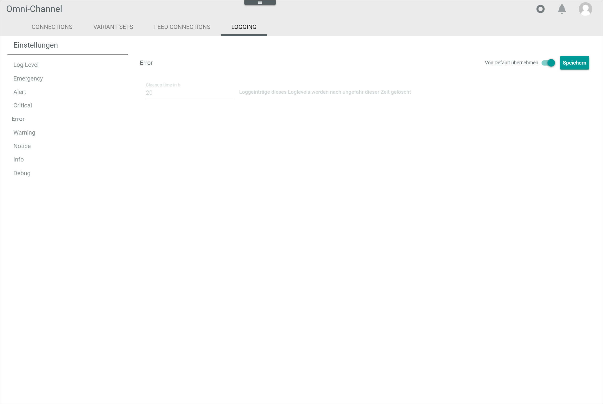

# Logging

*Omni-Channel > Settings > Tab LOGGING*

**Settings**

The side menu displays the different log levels and the log level settings. The corresponding view is displayed on the right side when an entry in the side menu is selected.

- *Log level*   
    Click this menu entry to display the *Log level* view on the right side.

- *Emergency*   
    Click this menu entry to display the *Emergency* view on the right side.

- *Alert*   
    Click this menu entry to display the *Alert* view on the right side.

- *Critical*   
    Click this menu entry to display the *Critical* view on the right side.

- *Error*   
    Click this menu entry to display the *Error* view on the right side.

- *Warning*   
    Click this menu entry to display the *Warning* view on the right side.

- *Notice*   
    Click this menu entry to display the *Notice* view on the right side.

- *Info*   
    Click this menu entry to display the *Info* view on the right side.

- *Debug*   
    Click this menu entry to display the *Debug* view on the right side.

## Log level

*Omni-Channel > Settings > Tab LOGGING > Side menu entry Log level*

- *Apply from default*    
    Enable this toggle to apply the default minimum log level **Notice**. The *Min log level* field is locked. Disable the toggle to unlock the *Min log level* field and select a different minimum log level. By default, this toggle is enabled.

- [Save]   
    Click this button to save the selected minimum log level.

- *Min log level*   
    Click this drop-down list to select the minimum log level. The following options are available:  
    - **Warning**
    - **Notice**
    - **Info**
    - **Debug**

## Emergency

*Omni-Channel > Settings > Tab LOGGING > Side menu entry Emergency*

- *Apply from default*    
    Enable this toggle to apply the default cleanup time of 20 hours to logs with the *Emergency* level. The *Cleanup time in h* field is locked. Disable the toggle to unlock the *Clean up time in h* field and enter a different log cleanup time. By default, this toggle is enabled.

- [Save]   
    Click this button to save the defined cleanup time for the selected log level.

- *Cleanup time in h*   
    Enter the number of hours after which the selected log will be deleted. This field is locked when the *Apply from default* toggle is enabled.

## Alert

*Omni-Channel > Settings > Tab LOGGING > Side menu entry Alert*

- *Apply from default*    
    Enable this toggle to apply the default cleanup time of 20 hours to logs with the *Alert* level. The *Cleanup time in h* field is locked. Disable the toggle to unlock the *Clean up time in h* field and enter a different log cleanup time. By default, this toggle is enabled.

- [Save]   
    Click this button to save the defined cleanup time for the selected log level.

- *Cleanup time in h*   
    Enter the number of hours after which the selected log will be deleted. This field is locked when the *Apply from default* toggle is enabled.

## Critical

*Omni-Channel > Settings > Tab LOGGING > Side menu entry Critical*

- *Apply from default*    
    Enable this toggle to apply the default cleanup time of 20 hours to logs with the *Critical* level. The *Cleanup time in h* field is locked. Disable the toggle to unlock the *Clean up time in h* field and enter a different log cleanup time. By default, this toggle is enabled.

- [Save]   
    Click this button to save the defined cleanup time for the selected log level.

- *Cleanup time in h*   
    Enter the number of hours after which the selected log will be deleted. This field is locked when the *Apply from default* toggle is enabled.

## Error

*Omni-Channel > Settings > Tab LOGGING > Side menu entry Error*

- *Apply from default*    
    Enable this toggle to apply the default cleanup time of 20 hours to logs with the *Error* level. The *Cleanup time in h* field is locked. Disable the toggle to unlock the *Clean up time in h* field and enter a different log cleanup time. By default, this toggle is enabled.

- [Save]   
    Click this button to save the defined cleanup time for the selected log level.

- *Cleanup time in h*   
    Enter the number of hours after which the selected log will be deleted. This field is locked when the *Apply from default* toggle is enabled.

## Warning

*Omni-Channel > Settings > Tab LOGGING > Side menu entry Warning*

- *Apply from default*    
    Enable this toggle to apply the default cleanup time of 5 hours to logs with the *Warning* level. The *Cleanup time in h* field is locked. Disable the toggle to unlock the *Clean up time in h* field and enter a different log cleanup time. By default, this toggle is enabled.

- [Save]   
    Click this button to save the defined cleanup time for the selected log level.

- *Cleanup time in h*   
    Enter the number of hours after which the selected log will be deleted. This field is locked when the *Apply from default* toggle is enabled.

## Notice

*Omni-Channel > Settings > Tab LOGGING > Side menu entry Notice*

- *Apply from default*    
    Enable this toggle to apply the default cleanup time of 5 hours to logs with the *Notice* level. The *Cleanup time in h* field is locked. Disable the toggle to unlock the *Clean up time in h* field and enter a different log cleanup time. By default, this toggle is enabled.

- [Save]   
    Click this button to save the defined cleanup time for the selected log level.

- *Cleanup time in h*   
    Enter the number of hours after which the selected log will be deleted. This field is locked when the *Apply from default* toggle is enabled.

## Info

*Omni-Channel > Settings > Tab LOGGING > Side menu entry Info*

- *Apply from default*    
    Enable this toggle to apply the default cleanup time of 3 hours to logs with the *Info* level. The *Cleanup time in h* field is locked. Disable the toggle to unlock the *Clean up time in h* field and enter a different log cleanup time. By default, this toggle is enabled.

- [Save]   
    Click this button to save the defined cleanup time for the selected log level.

- *Cleanup time in h*   
    Enter the number of hours after which the selected log will be deleted. This field is locked when the *Apply from default* toggle is enabled.

## Debug

*Omni-Channel > Settings > Tab LOGGING > Side menu entry Debug*

- *Apply from default*    
    Enable this toggle to apply the default cleanup time of 3 hours to logs with the *Debug* level. The *Cleanup time in h* field is locked. Disable the toggle to unlock the *Clean up time in h* field and enter a different log cleanup time. By default, this toggle is enabled.

- [Save]   
    Click this button to save the defined cleanup time for the selected log level.

- *Cleanup time in h*   
    Enter the number of hours after which the selected log will be deleted. This field is locked when the *Apply from default* toggle is enabled.