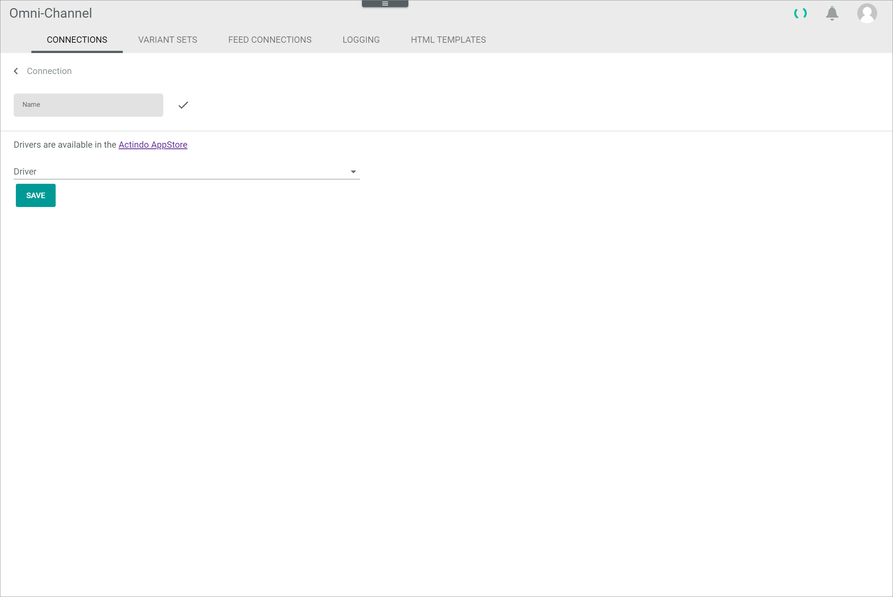
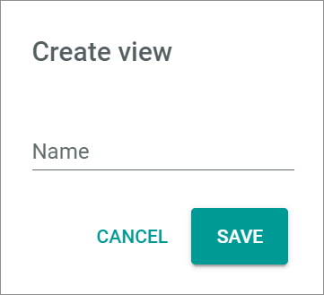

[!!Integration](../Integration/00_Integration.md)
[!!Manage the connections](../Integration/01_ManageConnections.md)
[!!Create a connection](../Integration/01_ManageConnections.md#create-a-connection)
[!!Synchronize a connection](../Integration/01_ManageConnections.md#synchronize-a-connection)
[!!Disable a connection](../Integration/01_ManageConnections.md#disable-a-connection)

# Connections

*Omni-Channel > Settings > Tab CONNECTIONS*

[comment]: <> (Datei Fulfillment/UserInterface/03a_Connections.md als Referenz. Ggf. Änderungen hier auch übernehmen)

**Connections**

- *VIEW*  
  Click the drop-down list to select the view. All created views are displayed in the drop-down list. Click the  (Points) button to the right of the *VIEW* drop-down list to display the context menu and create a view. For detailed information, see [Create view](#create-view).

  -  (Points)      
    Click this button to the right of the *View* drop-down list to display the context menu. The following menu entries are available:

    -  create  
      Click this entry to create a view. The *Create view* window is displayed.

    -  rename  
      Click this entry to rename the selected view. The *Rename view* window is displayed. This menu entry is only displayed if a view has been selected.

    -  reset  
      Click this entry to reset all unsaved changes to the settings of the selected view. This menu entry is only displayed if a view has been selected and any changes have been made to the view settings.

    -  publish  
      Click this entry to publish the view. This menu entry is only displayed if a view has been selected and unpublished.

    -  private view  
      Click this entry to unpublish the view. This menu entry is only displayed if a view has been selected and published.

    -  save  
        Click this entry to save the current view settings in the selected view. This menu entry is only displayed if a view has been selected.

        > [Info] When the settings of a view have been changed, an asterisk is displayed next to the view name. The asterisk is hidden as soon as the changes have been saved.

    -  delete  
        Click this entry to delete the selected view. A confirmation window to confirm the deletion is displayed. This menu entry is only displayed if a view has been selected.

[comment]: <> (Private view oder unpublish? Cf. default sentences)

-  (Refresh)   
  Click this button to update the list of connections.

-  Columns (x)   
  Click this button to display the columns bar and customize the displayed columns and the order of columns in the list. The *x* indicates the number of columns that are currently displayed in the list.

- [x]     
  Select the checkbox to display the editing toolbar. If you click the checkbox in the header, all connections in the list are selected.

- [DELETE]  
  This button has no function here. Once a connection has been established, it cannot be deleted. Nevertheless, the connection can be disabled. 

[comment]: <> (Vermutlich fliegt der Button komplett raus?)

- [SYNCHRONIZE]  
  Click this button to synchronize a selected connection. This button is only displayed if a single checkbox in the list of connections is selected.

- [DISABLE]  
  Click this button to disable one or several selected connections. This button is displayed if the checkbox of at least one active connection is selected.

- [ENABLE]  
  Click this button to enable one or several selected connections. This button is displayed if the checkbox of at least one inactive connection is selected. 

 [comment]: <> (Evtl. Procedure Enable a connection in Manage connections hinzufügen, oder Enable/disable a connection? Wenn ja, Verweis/Tag oben hinzufügen.)

-  (Edit)  
  Click this button to edit the selected connection. This button is only displayed if a single checkbox in the list of connections is selected. Alternatively, you can click directly a row in the list to edit a connection. The *Edit connection* view is displayed, see [Edit connection](#edit-connection). The *Credentials* tab is preselected.

[comment]: <> (Vgl. Fulfillment und vereinheitlichen -> Create connection/Edit connection)

The list displays all available connections. Depending on the settings, the displayed columns may vary. All fields are read-only.

- *Name*  
  Connection name.

- *Status*  
  Connection status. The following statuses are available:
  -  **Active**
  -  **Inactive**  

- *Order/Return have errors*  
    Indication whether there are errors in orders or  returns or not:  
  - **Yes**: there are errors.   
  - **No**: there are no errors.

- *Driver*  
  Driver name.

- *ID*  
  Connection identification number. The ID number is automatically assigned by the system.

## Create connection

*Omni-Channel > Settings > Tab CONNECTIONS > Button Add*

-  (Back)   
Click this button to close the *Create connection* view and return to the connection list. All changes are rejected.

- *Name*   
  Enter a connection name.

-  (Check)  
  Click this button to confirm the connection name.

-  (Edit)  
  Click this button to edit the connection name. This button is displayed after the connection name has been confirmed with the previously displayed check button.

- *Driver*  
  Click the drop-down list and select the desired driver. All installed drivers are displayed. Alternatively, select the option **more** to install further drivers. Depending on the connection driver, a *Credentials* section is displayed below the drop-down list, see [Create connection &ndash; Credentials](#create-connection--credentials). Depending on the selected driver, the fields in the *Credentials* section differ.

  > [Info] When selecting the **more** option, the notice *Get more drivers from the app store* is displayed. Drivers are licensed and must be acquired via the app store. The applicable driver credentials to establish the connection are obtained when acquiring the corresponding license.

[comment]: <> (oder: Drivers are licensed and must be acquired via the app store or the corresponding e-commerce partner platform.)

### Create connection &ndash; Credentials

*Omni-Channel > Settings > Tab CONNECTIONS > Button Add > Select driver*

The fields displayed in the *Credentials* section vary depending on the selected driver. By default, the following fields are displayed:

- *Username*  
  Enter the applicable username for the connection.

- *Password*  
  Enter the applicable password for the connection.

- [SAVE]  
  Click this button to save the connection.

[comment]: <> (Stimmt das so? Das sind die Felder angezeigt, wenn man Fulfillment Dummy Driver ausgewählt wird. Bei anderen kann das anders heißen, aber trotzdem eine Art Username/Password.)

## Edit connection

*Omni-Channel > Settings > Tab CONNECTIONS > Select a connection*

-  (Back)   
Click this button to close the *Edit connection* view and return to the connection list. All changes are rejected.

- *Name*   
  Connection name. This field is locked.

-  (Edit)  
  Click this button to edit the connection name. The *Name* field is unlocked and can be edited.

-  (Check)  
  Click this button to confirm the edited connection name. The *Name* field is locked again.

- *Created*  
  Creation date of the connection. Date format is DD/MM/YYYY. This field is locked.  

### Edit connection &ndash; Credentials

*Omni-Channel > Settings > Tab CONNECTIONS > Select a connection > Tab Credentials*

- *Driver*  
  Driver name selected. This drop-down list is locked and cannot be edited.

The fields displayed in the *Credentials* section vary depending on the selected driver. By default, the following fields are displayed:

- *Username*  
  Click this field to edit the username for the connection.

- *Password*  
  Click this field to edit the password for the connection.

- [SAVE]  
  Click this button to save any changes made.

### Edit connection &ndash; Settings

*Omni-Channel > Settings > Tab CONNECTIONS > Select a connection > Tab Settings*

The settings can only be configured after the connection has been established. The fields displayed vary depending on the driver installed. Some drivers have no settings and, therefore, this tab is not displayed.

  > [Info] For driver-specific settings, see the corresponding file in the [Integration](../Integration/00_Integration.md) chapter.

- [SAVE]  
  Click this button to save any changes made.

  > [Info] If no settings are available for the selected connection, the notice *There are no settings available* is displayed.

## Create view

*Omni-Channel > Settings > Tab CONNECTIONS > Button Points > Menu entry create*

For a detailed description of this window and the corresponding functions, see [Create view](./02a_Offers.md#create-view).

## Rename view

*Omni-Channel > Settings > Tab CONNECTIONS > Button Points > Menu entry rename*

For a detailed description of this window and the corresponding functions, see [Rename view](./02a_Offers.md#rename-view).
