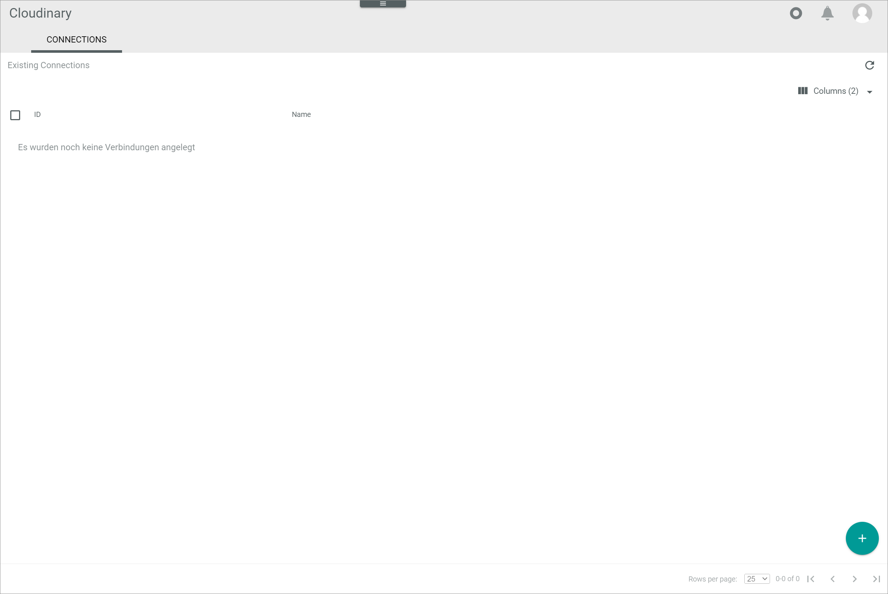
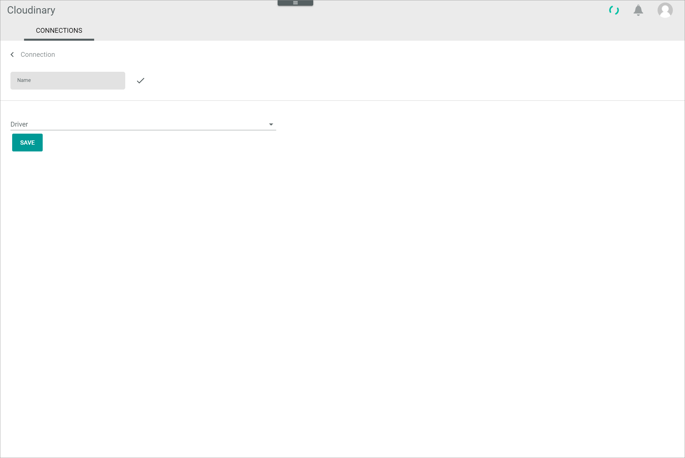
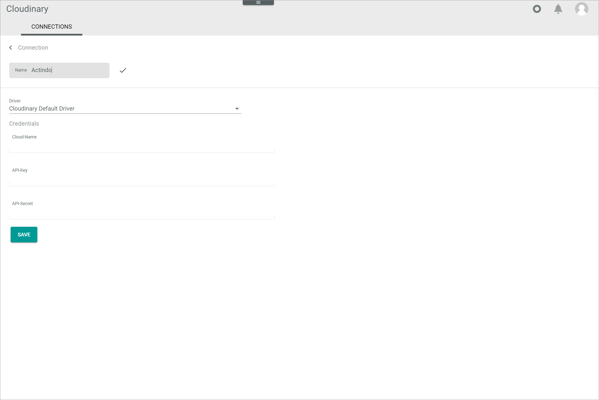
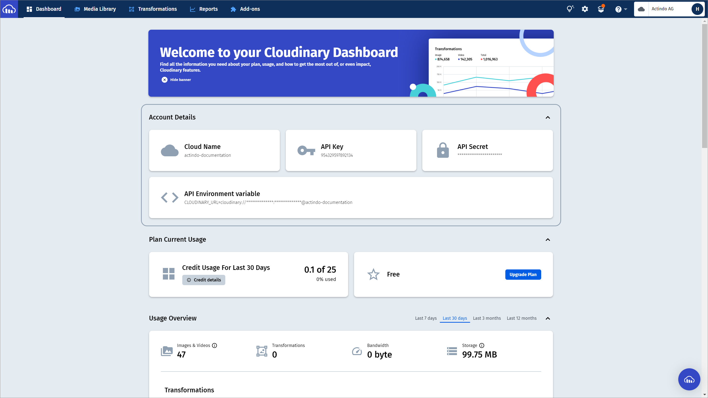

[!!User Interface Cloudinary](../UserInterface/01a_Connections.md)
[!!Manage the Cloudinary files](../Operation/01_ManageCloudinaryFiles.md)   

[comment]: <> (Edit a connection?)

# Establish a connection to Cloudinary

The first step to integrate the Cloudinary functionality to Actindo is to establish a connection to Cloudinary. You can establish multiple Cloudinary connections to different accounts in the Cloudinary module.

#### Prerequisites

- A Cloudinary account has been created.
- You are logged in to your Cloudinary account.

#### Procedure

*Cloudinary > Settings > Tab CONNECTIONS*

1. Click the  (Add) button in the bottom right corner.   
  The *Connection* view is displayed.

  

2. Enter the desired connection name in the *Name* field.

3. Click the *Driver* drop-down list and select the **Cloudinary default driver** option.   
  The *Credentials* section is displayed.

  

  > [Info] The *Cloudinary Default Driver* is configured as a standard driver for Cloudinary. Further drivers that differ in their behavior may be created for specific customer needs.

4. Enter the required details of the Cloudinary account to which you want to establish the connection in the *Cloud-Name*, the *API-Key* and the *API-Secret* fields.

  > [Info] The needed account details are displayed in the *Account Details* section of your Cloudinary Dashboard.

  

5.	Click the [SAVE] button in the bottom of the *Credentials* section.
  The connection to the selected Cloudinary account has been established. The *Connection* view is closed. The new connection is displayed in the list of connections.

> [Info] To establish a further Cloudinary connection to a different Cloudinary account, repeat the procedure with the corresponding Cloudinary account details.
