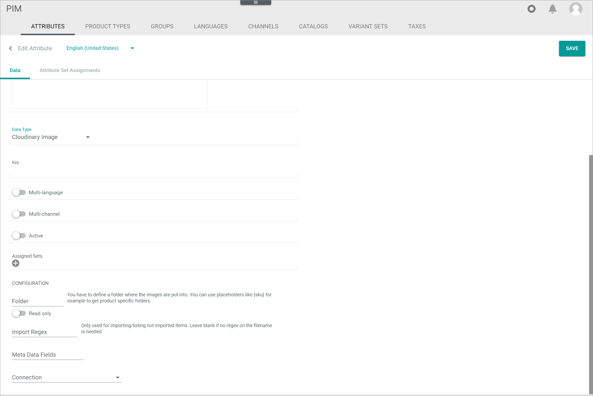
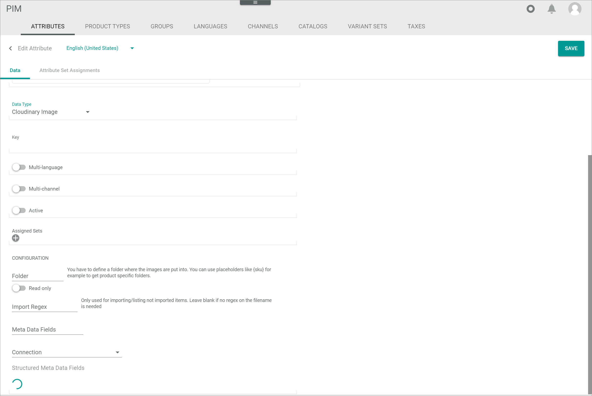
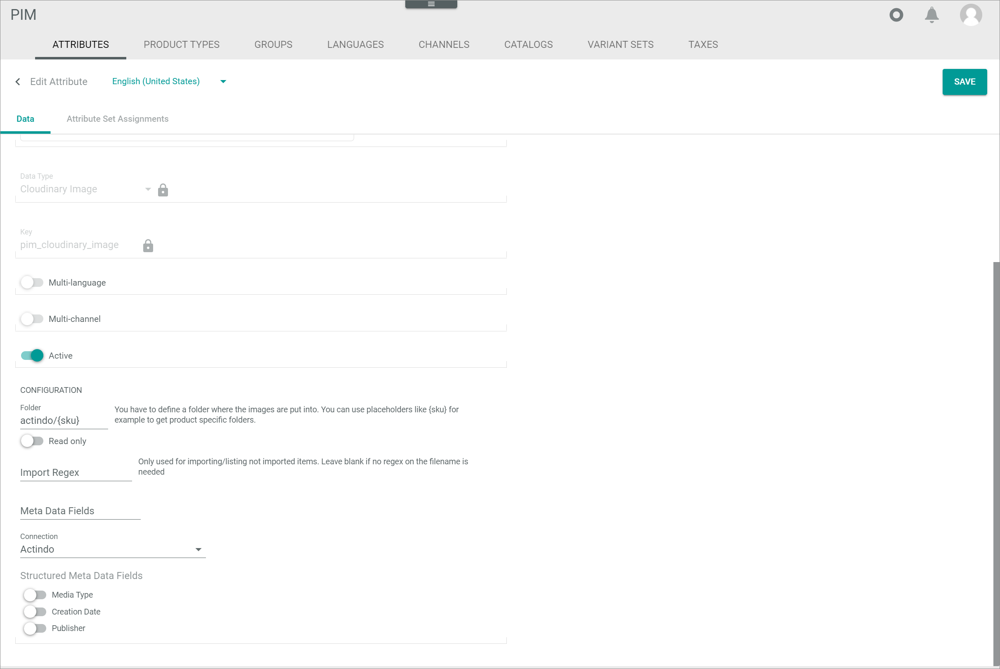

[!!PIM](../../PIM/Overview/01_General.md)
[!!User interface PIM](../../PIM/UserInterface/00_UserInterfmustace.md)
[!!Manage the attributes](../../PIM/Integration/01_ManageAttributes.md)
[!!Data type list](../../DataHub/UserInterface/04_DataTypeList.md)
[!!Manage the Cloudinary files](../Operation/01_ManageCloudinaryFiles.md)
[!!Create a variant set](../../PIM/Operation/07_ManageVariantSets.md#create-a-variant-set)

# Manage the Cloudinary attributes

To upload a file from Actindo to Cloudinary, this file must be assigned a corresponding Cloudinary attribute. The management of a Cloudinary attribute is identical to the management of a PIM attribute which is also described in the *PIM* documentation, see [Manage the attributes](../../PIM/Integration/01_ManageAttributes.md).
Nevertheless, the initial creation and configuration of a Cloudinary attribute is described in this chapter below.

[comment]: <> (Verweis auf DataHub oder PIM oder beides?)

## Create a Cloudinary attribute

Create a Cloudinary attribute to enable the upload of files from Actindo to Cloudinary.

#### Prerequisites

- A Cloudinary connection has been established, see [Establish a connection to Cloudinary](./01_EstablishConnection.md).
- An attribute set has been created, see [Create an attribute set](../../PIM/Integration/02_ManageAttributeSets.md#create-an-attribute-set).

#### Procedure
*PIM > Settings > Tab ATTRIBUTES*

1. Click the  (Add) button in the bottom right corner.   
  The *Create attribute* view is displayed.

  

2. Enter the desired attribute name for the Cloudinary attribute in the *Name* field and, if desired, add an attribute description in the *Description* field.

3. Click the drop-down list *Data type* and select the appropriate Cloudinary data type in the list. For a Cloudinary image attribute, select the **Cloudinary image** data type, for a Cloudinary video attribute the **Cloudinary video** data type.   
  The *CONFIGURATION* section with the corresponding settings for the selected Cloudinary data type are displayed.

  

4. Enter a key for the Cloudinary attribute in the *Key* field, for instance **pim_cloudinary_image**. The key is required for API access and must be system wide unique.

  > [Info] In order to facilitate the assignment of attributes in the further process (for instance in the ETL mapping), it is recommended to add the prefix **pim_** to all attributes created in the *PIM* module.     

5. If desired, activate the *Multi-language* toggle to assign values in multiple languages to the attribute or activate the *Multi-channel* toggle to assign different attribute values in different channels.

  > [Info] Be aware that only attributes which are neither multi-language nor multi-channel can be used as defining attributes for variants. For detailed information, see [Create a variant set](../../PIM/Operation/07_ManageVariantSets.md#create-a-variant-set).

6. Enable the *Active* toggle to activate the attribute after creation.

7. Click the  (Add) button in the *Assigned sets* field. The button is locked if you have not yet selected a data type.   
  A drop-down list with all active attribute sets is displayed.

8. Select an attribute set in the *Assigned sets* drop-down list.

  > [Info] You can assign the attribute to multiple sets. Repeat the steps **7** to **8** to assign the attribute to a further attribute set. To delete the assignment to a selected set, click the  (Delete) button right to the set.

9. Configure the appropriate settings in the *CONFIGURATION* section. The configuration can also be edited subsequently.       
For detailed information about the Cloudinary configuration settings, see [Configure a Cloudinary attribute](#configure-a-cloudinary-attribute).

10. Click the [SAVE] button in the upper right corner.   
  The new Cloudinary attribute has been saved. The *Create attribute* view is closed.  

11. Press the **F5** key to initialize the *Core1 Platform* and to apply the changes.   

## Configure a Cloudinary attribute

The configuration of the Cloudinary attribute is important to define the metadata fields and other exchange settings between Actindo and Cloudinary.

#### Prerequisites

A Cloudinary attribute has been created, see [Create a Cloudinary attribute](#create-a-cloudinary-attribute), or at least the steps **1** to **8** of the [Create a Cloudinary attribute](#create-a-cloudinary-attribute) procedure have been executed.

#### Procedure

*PIM > Settings > Tab ATTRIBUTES > Button Add*   
*PIM > Settings > Tab ATTRIBUTES > Select Cloudinary attribute*

> [Info] The following configuration settings are identical for the *Cloudinary Image* and the *Cloudinary Video* data type.

1. Navigate to the *CONFIGURATION* section of the Cloudinary attribute.

2. Enter a folder name in the *Folder* field where the Cloudinary files will be stored. If the folder is not yet created in Cloudinary, it is automatically created when uploading the first file. Use placeholders to define a product specific folder, for instance **{sku}**.

3. Enable the *Read-only* toggle to prevent manual modifications, for instance if an automatic import from Cloudinary is configured and the imported files should not be editable.

4. Enter a regular expression in the *Import regex* field to define which files in the configured folder in the *Folder* field will be listed for the import from Cloudinary. If the field is left blank, no restriction is applied.

  > [Info] Currently, the restriction is only applicable to the filename.

5. Enter names for additional contextual metadata fields in the *metadata fields* field. Use commas to separate the field names. A separate metadata field is created for each field name. By default, the *Title (caption)* and the *Description (alt)* contextual metadata fields are automatically created for each file and do not need to be added at this point.

  > [Info] The metadata fields in Cloudinary are separated in the structured metadata and the contextual metadata fields. The contextual metadata fields can be managed in both, Actindo and Cloudinary.   
  Note, however, that all changes in Actindo will overwrite the data in Cloudinary.

6. Click the *Connection* drop-down list and select the appropriate connection. All Cloudinary connections are displayed in the list.	 
All available structured metadata fields from the selected Cloudinary connection are displayed in the *Structured metadata fields* section.

7. Enable the toggles of those metadata fields that should be displayed in the *PIM* module. All disabled fields are not displayed in the *PIM* module and consequently cannot be edited in Actindo.

  > [Info] The structured metadata fields are managed in Cloudinary. In Actindo, the structured metadata fields that should be maintained in the *PIM* module can be enabled in the *Structured metadata Fields* section.   
  Note that you may also need to edit the Cloudinary attribute to apply changes in the structured metadata fields from Cloudinary to Actindo.

8. Click the [SAVE] button in the upper right corner.   
  The Cloudinary attribute has been saved with the corresponding configuration. The *Create attribute* view is closed.  

9. Press the **F5** key to initialize the *Core1 Platform* and to apply the changes.   
