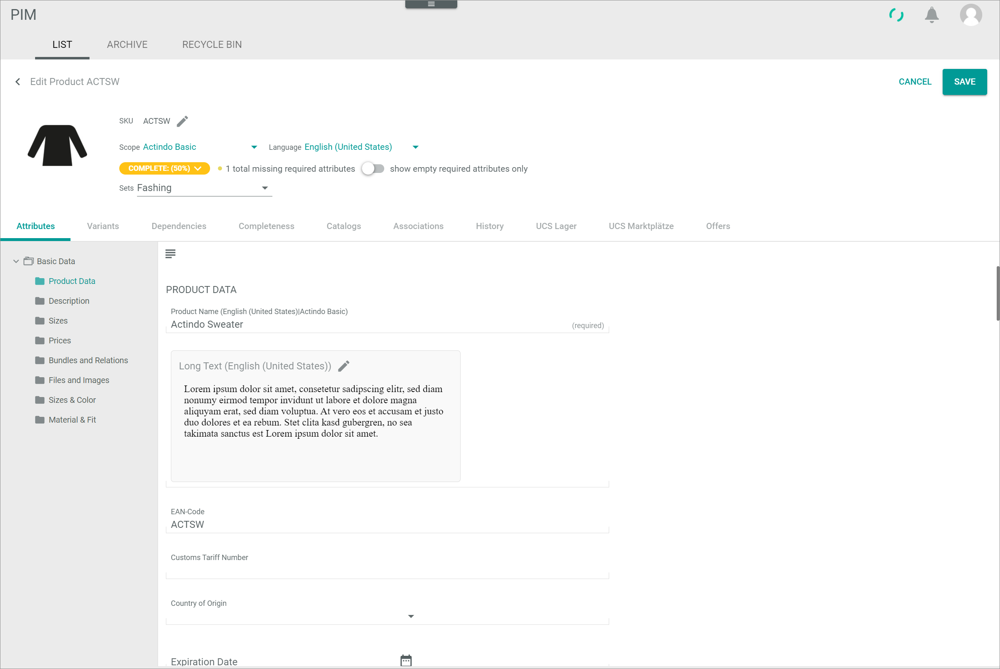
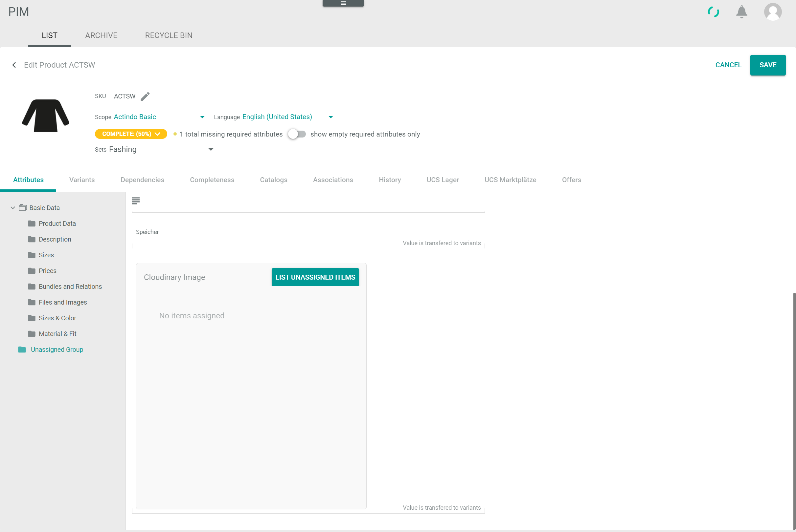
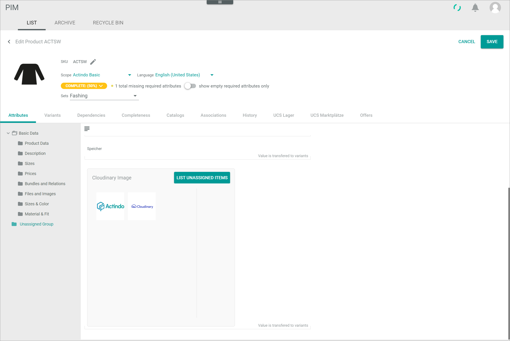
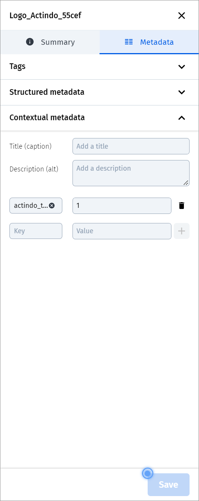
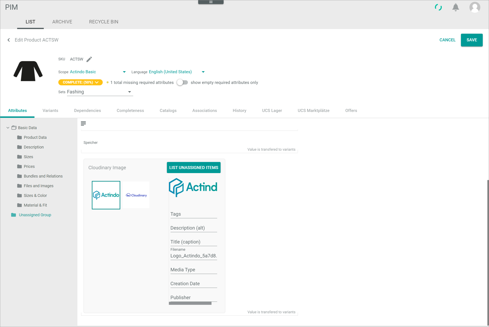
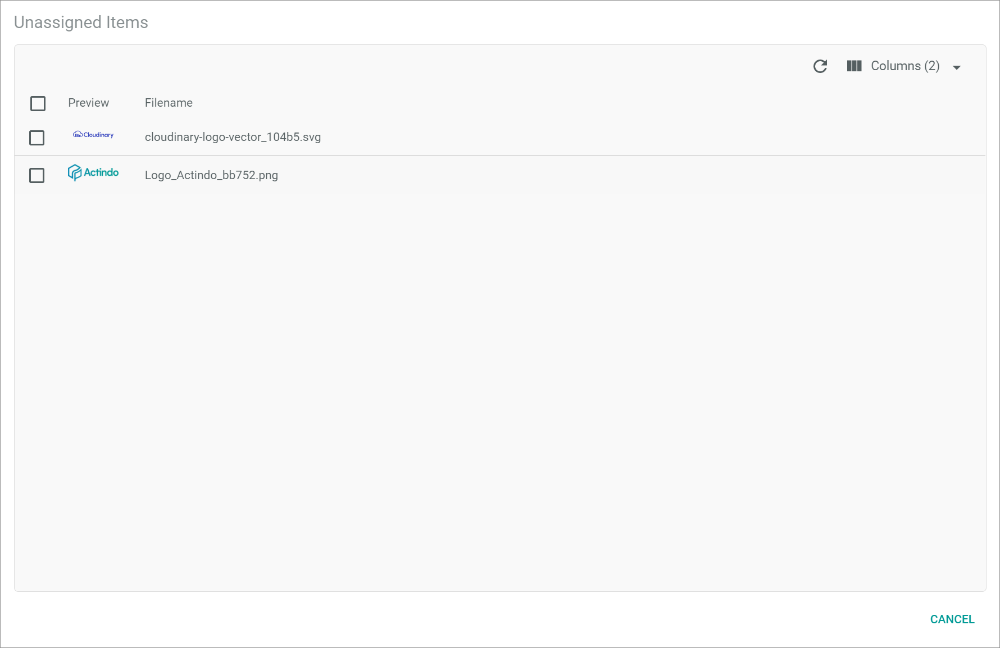

[!!PIM](../../PIM/Overview/01_General.md)
[!!User Interface PIM](../../PIM/UserInterface/00_UserInterface.md)
[!!Manage the Cloudinary attributes](../Integration/02_ManageCloudinaryAttributes.md)

# Manage the Cloudinary files

You can either upload files to Cloudinary via the *PIM* module or import files from CLoudinary to the *PIM* module. Further you can remove the file assignment to Cloudinary in the *PIM* module and either keep the file in Cloudinary or delete it.

## Upload a Cloudinary file via PIM

Upload images and videos to Cloudinary at the same time when adding these files to a product in the *PIM* module.

#### Prerequisites

- A Cloudinary connection has been established, see [Establish a connection to Cloudinary](../Integration/01_EstablishConnection.md)
- The required Cloudinary attribute has been created, see [Manage the Cloudinary attributes](../Integration/02_ManageCloudinaryAttributes.md)

#### Procedure

*PIM > Products > Tab LIST*

> [Info] The following procedure describes exemplary how to upload an image to Cloudinary. The procedure is largely identical to upload a video to Cloudinary. The differences are explicitly specified at the appropriate place.

1. Click the product in the product list to which you want to add an image and upload it to Cloudinary at the same time.   
  The *Edit product* view is displayed.

  

2. Navigate to the Cloudinary image attribute in the *Attributes* tab.

  

3. Select the desired images in the explorer and move it to the Cloudinary image attribute box using drag and drop. When uploading a video to Cloudinary, use the corresponding Cloudinary video attribute box instead of the Cloudinary image attribute box.      
  The images have been uploaded to the specified folder in Cloudinary. A preview tile of each image is displayed in the Cloudinary image attribute box.

  

  > [Info] By default, the *actindo_temp* contextual meta data field is assigned to each image uploaded via the *PIM* module to Cloudinary. As long as a product to which the image was uploaded is not saved, the value of the *actindo_temp* field equals **1**, which means that this image is temporary. Temporary images older than 24 hours are automatically deleted from Cloudinary during the daily cronjob. When a product is saved, the value of the *actindo_temp* field of all images assigned to this Cloudinary attribute changes to **0**, which means that these images will persist in Cloudinary.

  

4. Click the preview tile in the attribute image box to edit the image data. The image data fields below
are displayed in the box side bar:
  - *Tags*   
    Enter tag names for the image. Use commas to separate the tag names. A single tag is created for each tag name.
  - *Description (alt)*   
    Enter a description for the image which is indicated when the image cannot be displayed. This field is automatically created for each image.
  - *Title (caption)*   
    Enter a title for the image. This field is automatically created for each image.
  - *Filename*   
    The filename is automatically adopted from the uploaded or imported image. This field is read-only. To edit a filename after uploading, open the corresponding image in Cloudinary.
  - *Contextual meta data fields*   
    Enter an appropriate value in the contextual meta data fields specified in the Cloudinary attribute configuration.
  - *Structured meta data fields*   
    Enter an appropriate value in the structured meta data fields enabled in the Cloudinary attribute configuration.

    > [Info] Currently only structured meta data fields of the text and the date field type are supported by Actindo. Note to enter a date value in the appropriate date format (yyyy-MM-dd).

    

5. Click the [SAVE] button in the upper right corner of the *Edit product* view.    
  The images have been saved and uploaded to Cloudinary. The *Edit product* view is closed.

## Import a Cloudinary file to PIM

Import images and videos from Cloudinary to products in your *PIM* module.

#### Prerequisites

- A Cloudinary connection has been established, see [Establish a connection to Cloudinary](../Integration/01_EstablishConnection.md)
- The required Cloudinary attribute has been created, see [Manage the Cloudinary attributes](../Integration/02_ManageCloudinaryAttributes.md)
- At least one file is available for import in Cloudinary.

#### Procedure

*PIM > Products > Tab LIST*

> [Info] The following procedure describes exemplary how to import an image from Cloudinary. The procedure is largely identical to import a video from CLoudinary. The differences are explicitly specified at the appropriate place.

1. Click the product in the product list to which you want to add an image from Cloudinary.   
  The *Edit product* view is displayed.

  

2. Navigate to the Cloudinary image attribute in the *Attributes* tab.

  

3. Click the [LIST UNASSIGNED ITEMS] button in the Cloudinary image attribute box to select the image(s) to be imported. When importing a video from Cloudinary, use the button in the corresponding Cloudinary video attribute box instead of the Cloudinary image attribute box.        
  The *Unassigned items* window is displayed, listing all unassigned images in the specified Cloudinary folder.

  

  > [Info] Note that only those images located in the folder specified in the Cloudinary attribute configuration are available. If an image is missing, check if the image is included in the specified folder and matches the regular expression if one has been defined. You can use the  (Refresh) button to update the list of unassigned items.   

4. Select the checkboxes of all images to be imported from Cloudinary in the list of unassigned items.   
  The editing toolbar is displayed above the list.

5. Click the [ADD ITEM(S)] button in the toolbar.   
  The selected images have been imported from Cloudinary and removed from the list of unassigned items.

6. Click the [CANCEL] button in the bottom right corner.   
  The *Unassigned items* window is closed. The *Edit product* view is displayed again. A preview tile of each selected image is displayed in the Cloudinary image attribute box.   

  

7. Click the preview tile in the attribute image box to edit the image data. The image data fields below
are displayed in the box side bar:
  - *Tags*   
    Enter tag names for the image. Use commas to separate the tag names. A single tag is created for each tag name.
  - *Description (alt)*   
    Enter a description for the image which is indicated when the image cannot be displayed. This field is automatically created for each image.
  - *Title (caption)*   
    Enter a title for the image. This field is automatically created for each image.
  - *Filename*   
    The filename is automatically adopted from the uploaded or imported image. This field is read-only. To edit a filename after uploading, open the corresponding image in Cloudinary.
  - *Contextual meta data fields*   
    Enter an appropriate value in the contextual meta data fields specified in the Cloudinary attribute configuration.
  - *Structured meta data fields*   
    Enter an appropriate value in the structured meta data fields enabled in the Cloudinary attribute configuration.

    > [Info] Currently only structured meta data fields of the text and the date field type are supported by Actindo. Note to enter a date value in the appropriate date format (yyyy-MM-dd).

    

8. Click the [SAVE] button in the upper right corner of the *Edit product* view.    
  The imported images have been saved. The *Edit product* view is closed.

## Remove a Cloudinary file assignment in PIM

When removing an image assignment from Cloudinary in the *PIM* module, you can either keep the corresponding image in Cloudinary or delete the image in Cloudinary at the same time.

#### Prerequisites

At least one Cloudinary file has been assigned to the PIM product.

#### Procedure

*PIM > Products > Tab LIST*

> [Info] The following procedure describes exemplary how to remove an image assignment from Cloudinary. The procedure is largely identical to import a video from CLoudinary. The differences are explicitly specified at the appropriate place.

1. Click the product in the product list from which you want to remove the Cloudinary image assignment.   
  The *Edit product* view is displayed.

  

2. Navigate to the Cloudinary image attribute in the *Attributes* tab.   
  All assigned images are displayed in the Cloudinary image attribute box.

  

3. Hover over the preview tile of the image to be removed.    
  The  (Delete) button is displayed in a small circle in the upper right corner of the preview tile.    

4. Click the  (Delete) button in the upper right corner of the preview tile.   
  The *Delete image* window is displayed.   

  

5. Depending on your objective, click on one of the following buttons displayed in the *Delete image* window:

  - [REMOVE ASSIGNMENT (KEEP IN CLOUDINARY)]   
  Only the assignment to the image will be removed. When displaying the list of unassigned items, the image may be listed again. The *Delete image* window is closed.
  - [REMOVE ASSIGNMENT (DELETE IN CLOUDINARY)]   
  The assignment to the image will be removed and the image itself will be deleted in Cloudinary when saving the product. The *Delete image* window is closed.

    > [Info] Note that problems may occur when deleting an image to which other dependencies exist, for instance if the image is already available in a web shop.

6.  Click the [SAVE] button in the upper right corner of the *Edit product* view.    
  The image assignment removal has been saved. The *Edit product* view is closed.
