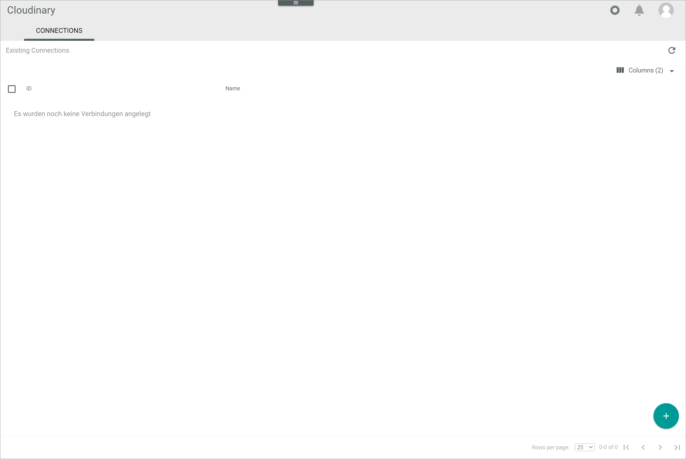
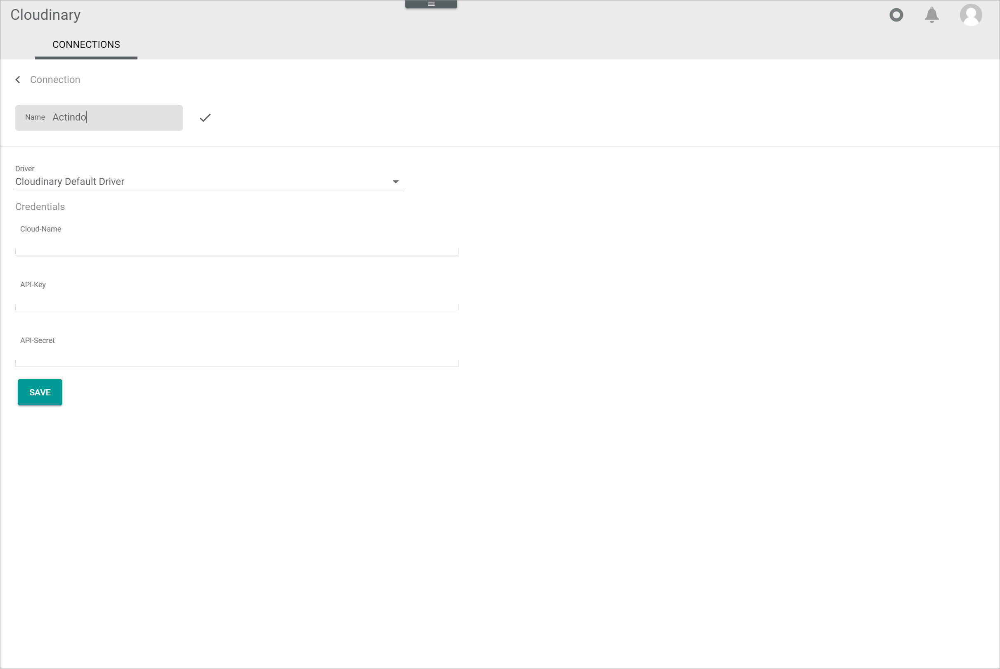

# Connections

*Cloudinary > Settings > Tab CONNECTIONS*

**Connection list**

-  (Refresh)   
  Click this button to update the list of Cloudinary connections.

-  Columns (x)   
  Click this button to display the columns bar and customize the displayed columns and the order of columns in the list. The *x* indicates the number of columns that are currently displayed in the list.

- [x]     
  Select the checkbox to display the editing toolbar.

-  (Edit)         
  Click this button to edit the selected connection. This button is only displayed when the checkbox of a single connection is selected. Alternatively, you can click directly a row in the list to edit a connection.

The list displays all Cloudinary connections. All fields are read-only. Depending on the settings, the displayed columns may vary.

- *ID*   
  Connection identification number. The ID number is automatically assigned by the system.

- *Name*   
  Connection name.

-  (Add)   
  Click this button to add a Cloudinary connection. The *Connection* view is displayed.   

## Create connection

*Cloudinary > Settings > Tab CONNECTIONS > Button Add*

**Connection**

-  (Back)   
  Click this button to close the *Connection* view and return to the connection list. All changes are rejected.

- *Name*   
  Enter a name for the Cloudinary connection.

- *Driver*   
  Click the drop-down list and select the approriate driver for the Cloudinary connection. All available drivers are displayed. The *Credentials* section is displayed.

  > [Info] Currently, the *Cloudinary Default Driver* is configured as a standard driver for Cloudinary. Further drivers that differ in their behavior may be created for specific customer needs.

**Credentials**

This section is only displayed when a driver has been selected in the *Driver* drop-down list.

- *Cloud name*   
  Enter the cloud name from the Cloudinary account to which you want to establish a connection. The cloud name is displayed on the dashboard of your Cloudinary account.

- *API key*   
  Enter the API key from the Cloudinary account to which you want to establish a connection. The API key is displayed on the dashboard of your Cloudinary account.

- *API secret*   
  Enter the API secret from the Cloudinary account to which you want to establish a connection. The API secret is displayed on the dashboard of your Cloudinary account.

- [SAVE]   
  Click this button to establish the connection to the indicated Cloudinary account. The *Connection* view is closed. The new connection is displayed in the list of connections.

## Edit connection

*Cloudinary > Settings > Tab CONNECTIONS > Select connection*

**"Connection name" Connection**

-  (Back)   
  Click this button to close the *"Connection name" Connection* view and return to the connection list. All changes are rejected.

- *Name*   
  Click the field to edit the name for the Cloudinary connection. By default, this field is locked. Click the  (Edit) button to the right of the connection name to edit it.  

-  (Edit)   
  Click this button to unlock the *Name* field and edit the connection name. This button is only displayed when the *Name* field is locked.

-  (Apply)   
  Click this button to apply the changes to the connection name. This button is only displayed when the *Name* field is unlocked.

- *Driver*   
  Selected driver for the Cloudinary connection. This field is read-only.

**Credentials**

- *Cloud name*   
  Click this field to edit the cloud name from the Cloudinary account to which you want to establish a connection. The cloud name is displayed on the dashboard of your Cloudinary account.

- *API key*   
  Click this field to edit the API key from the Cloudinary account to which you want to establish a connection. The API key is displayed on the dashboard of your Cloudinary account.

- *API secret*   
  Click this field to edit the API secret from the Cloudinary account to which you want to establish a connection. The API secret is displayed on the dashboard of your Cloudinary account.

- [SAVE]   
  Click this button to save all changes. The *"Connection name" Connection* view is closed.
